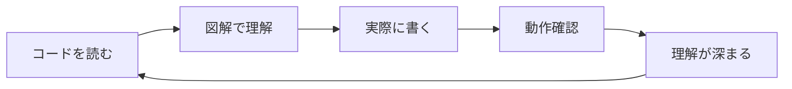
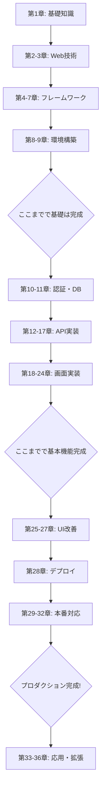
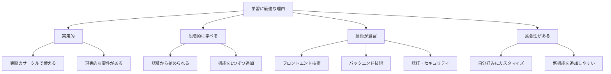
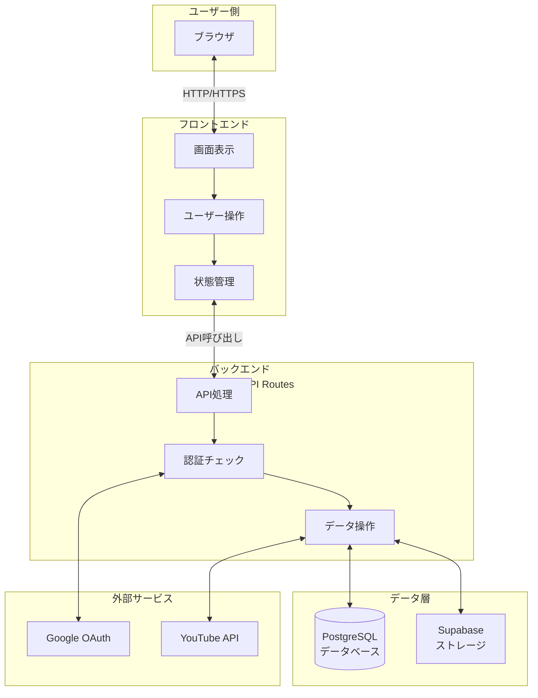
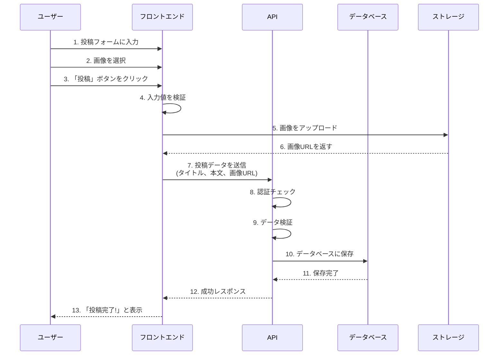

# 第1章：はじめに

## 1.1 本書の使い方

### 本書の目的

この教科書は、**プログラミング初心者が実際に動くWebアプリケーションのコードを完全に理解できるようになること**を目的としています。

「BOLD軽音メンバーサイト」という実際に動くプロジェクトを題材に、以下のスキルを身につけます：

- ✅ HTML、CSS、JavaScriptの基礎
- ✅ React、Next.js、TypeScriptを使ったモダンなWeb開発
- ✅ データベース設計と実装
- ✅ ユーザー認証システムの構築
- ✅ RESTful APIの設計と実装
- ✅ 本番環境へのデプロイ

### 学習方法

#### 1. **段階的に読み進める**
この教科書は基礎から応用まで順序立てて構成されています。特に初心者の方は、第1章から順番に読み進めることをおすすめします。

```
第Ⅰ部：基礎編（第1-3章）
    ↓ Web開発の基本を理解
第Ⅱ部：フレームワーク編（第4-7章）
    ↓ React、Next.jsなどの使い方を学ぶ
第Ⅲ部：環境構築編（第8-9章）
    ↓ 実際にプロジェクトを動かす
第Ⅳ部以降：実装編
    ↓ 各機能の詳細を理解
```

#### 2. **手を動かす**
読むだけでなく、必ず自分でコードを書いて動かしてください。エラーが出ても大丈夫です。エラーメッセージを読み、解決する過程が最も学びになります。

#### 3. **コードを写す**
最初は理解できなくても、まずコードを写してみましょう。写すことで、コードの構造が体に染み込んでいきます。

#### 4. **小さく変更してみる**
動くコードができたら、少しずつ変更してみましょう。例えば：
- テキストを変えてみる
- 色を変えてみる
- 新しいボタンを追加してみる

変更することで、各部分の役割が理解できるようになります。

#### 5. **わからないことはメモする**
すべてを一度に理解する必要はありません。わからないことはメモしておき、後から見返しましょう。学習が進むと、自然と理解できるようになります。

#### 6. **図解を活用する**
この教科書には多くの図解があります。コードだけでなく、図解を見ることで全体像を把握しやすくなります。



#### 7. **動作確認を忘れずに**
各章の最後には「動作確認」のセクションがあります。必ず自分の環境で動かしてみましょう。動作確認することで：
- コードが正しく動いているか確認できる
- エラーの原因を特定しやすくなる
- 達成感が得られ、モチベーションが上がる

### 📊 学習の進め方のイメージ



### ⏱️ 学習時間の目安

個人差はありますが、以下を目安にしてください：

| レベル | 1日の学習時間 | 完了までの期間 |
|--------|--------------|--------------|
| 初心者 | 2-3時間 | 3-4ヶ月 |
| 中級者 | 3-4時間 | 2-3ヶ月 |
| 経験者 | 4-5時間 | 1-2ヶ月 |

**重要：** 焦らず、自分のペースで進めましょう。理解することが最も大切です。

### 本書の記号・表記

#### コードブロック

```javascript
// これはJavaScriptのコードです
const message = "Hello, World!";
console.log(message);
```

```typescript
// これはTypeScriptのコードです
const count: number = 10;
```

```html
<!-- これはHTMLのコードです -->
<div class="container">
  <h1>タイトル</h1>
</div>
```

```css
/* これはCSSのコードです */
.container {
  background-color: blue;
  padding: 20px;
}
```

#### 重要な用語

**太字**で示された用語は重要です。初めて出てきたときに説明します。

#### 補足情報

> 💡 **補足**: このマークは補足情報を示します。理解を深めるための追加情報です。

> ⚠️ **注意**: このマークは注意事項を示します。よくあるミスや間違いやすいポイントです。

> 🎯 **実践**: このマークは実際に試してほしいことを示します。

#### ファイルパス

ファイルのパスは以下のように示します：

```
src/app/page.tsx          ← プロジェクトルートからの相対パス
/home/user/project/       ← 絶対パス
```

### 質問があるとき

学習中に疑問が出てきたら：

1. **公式ドキュメントを見る**
   - [React公式ドキュメント](https://react.dev/)
   - [Next.js公式ドキュメント](https://nextjs.org/)
   - [TypeScript公式ドキュメント](https://www.typescriptlang.org/)

2. **エラーメッセージをよく読む**
   - エラーメッセージには問題のヒントが書かれています
   - Google検索でエラーメッセージを調べると、同じ問題に遭遇した人の解決策が見つかります

3. **コミュニティで質問する**
   - [Stack Overflow](https://stackoverflow.com/)
   - GitHub Issues
   - Discordコミュニティ

---

## 1.2 プロジェクト概要

### BOLD軽音メンバーサイトとは

このプロジェクトは、**軽音サークル「BOLD軽音」のメンバー専用Webサイト**です。

サークル活動に必要な以下の機能を提供します：

#### 主な機能

1. **ユーザー認証**
   - Googleアカウントでログイン
   - メールアドレス+パスワードでログイン
   - 管理者と一般メンバーの役割管理

2. **活動報告（投稿機能）**
   - 練習や演奏会の報告を投稿
   - 複数のYouTube動画を埋め込み
   - 画像アップロード
   - いいね・コメント機能
   - 参加登録機能

3. **イベント管理**
   - ライブやイベントの管理
   - 課題曲の設定
   - パート割り当て
   - 参加者管理

4. **スケジュール調整**
   - 練習日の候補日設定
   - メンバーの出欠管理
   - 投票機能
   - コメント機能

5. **ユーザー管理**
   - プロフィール編集
   - アバター画像設定
   - 担当楽器の登録
   - メンバー一覧表示

### なぜこのプロジェクトを題材にしたのか？



**理由1: 実用的である**
- 実際のサークル活動で使える
- 友人や仲間に見せられる
- ポートフォリオにできる

**理由2: 学習に必要な要素が揃っている**
- CRUD操作（作成・読取・更新・削除）
- ユーザー認証・認可
- ファイルアップロード
- リレーショナルデータベース
- 外部API連携（YouTube）

**理由3: 段階的に学べる**
- 最初はシンプルな機能から
- 少しずつ複雑な機能を追加
- 無理なく技術を習得できる

### システム全体像



**各層の役割：**

1. **ユーザー側（ブラウザ）**
   - ユーザーが実際に操作する画面
   - Chrome、Safari、Firefoxなど

2. **フロントエンド（Next.js + React）**
   - 画面の表示と更新
   - ユーザーの操作を受け付ける
   - 美しいUIを提供

3. **バックエンド（Next.js API Routes）**
   - データの処理
   - 認証チェック
   - ビジネスロジックの実装

4. **データ層（PostgreSQL + Supabase）**
   - データの永続化
   - 画像ファイルの保存

5. **外部サービス**
   - Google認証
   - YouTube動画の情報取得

### データフロー例：投稿を作成する場合



**ステップごとの説明：**

1-3. **ユーザー操作**
   - タイトルと本文を入力
   - 画像ファイルを選択
   - 投稿ボタンをクリック

4. **フロントエンドでの検証**
   - タイトルが空でないか？
   - 画像サイズは適切か？
   - 入力形式は正しいか？

5-6. **画像アップロード**
   - 画像をSupabase Storageにアップロード
   - アップロードしたファイルのURLを取得

7-9. **APIへの送信と検証**
   - 投稿データをAPIに送信
   - ログインしているか確認
   - データが正しい形式か確認

10-11. **データベースへの保存**
   - PostgreSQLに投稿データを保存
   - IDを自動生成
   - 作成日時を記録

12-13. **完了通知**
   - APIから成功レスポンス
   - ユーザーに「投稿完了」メッセージ表示

4. **スケジュール調整**
   - 活動スケジュールの作成
   - 複数候補日での投票（調整さん風）
   - 最有力候補の自動表示
   - コメント機能

5. **ユーザー管理**
   - プロフィール編集
   - アバター画像のアップロード
   - 担当楽器の登録
   - 活動履歴の表示

### 技術スタック

このプロジェクトで使用している技術：

#### フロントエンド（ユーザーが見る部分）

```
Next.js 16         ← Webアプリケーションフレームワーク
  ├─ React 19      ← UIライブラリ
  ├─ TypeScript 5  ← プログラミング言語
  └─ Tailwind CSS 4 ← スタイリング（デザイン）
```

#### バックエンド（サーバー側の処理）

```
Next.js API Routes  ← API（データのやり取り）
  ├─ Prisma 5.22    ← データベース操作
  ├─ PostgreSQL     ← データベース（本番環境）
  └─ SQLite         ← データベース（開発環境）
```

#### 認証（ログイン機能）

```
NextAuth.js v5      ← 認証フレームワーク
  ├─ Google OAuth   ← Googleでログイン
  └─ Credentials    ← メール+パスワードでログイン
```

#### その他

```
Supabase   ← 画像保存
Vercel     ← デプロイ（公開）
GitHub     ← コード管理
```

> 💡 **用語の説明**: これらの用語がわからなくても大丈夫です。第2章以降で1つずつ詳しく説明します。

### プロジェクトの規模

- **総コード行数**: 約5,000行
- **ページ数**: 15ページ以上
- **APIエンドポイント**: 30以上
- **データベーステーブル**: 15テーブル
- **コンポーネント数**: 20以上

### 学習できること

このプロジェクトを通して、以下のスキルが身につきます：

#### 1. **Web開発の基礎**
- HTMLでページ構造を作る
- CSSでデザインする
- JavaScriptで動きをつける

#### 2. **モダンなフレームワークの使い方**
- Reactでコンポーネントを作る
- Next.jsでページをルーティングする
- TypeScriptで型安全なコードを書く

#### 3. **データベースの設計と操作**
- データベーススキーマを設計する
- Prismaでデータを操作する
- リレーションシップを理解する

#### 4. **認証システムの構築**
- ユーザー登録・ログイン機能
- セッション管理
- 権限管理

#### 5. **APIの設計と実装**
- RESTful APIの設計
- CRUDextra作（作成・読取・更新・削除）
- エラーハンドリング

#### 6. **UI/UXの設計**
- レスポンシブデザイン
- ユーザーフレンドリーなインターフェース
- 楽観的UI

#### 7. **デプロイと運用**
- Vercelへのデプロイ
- 環境変数の管理
- パフォーマンス最適化

---

## 1.3 完成形のデモ

### 実際に動くサイトを見てみよう

本番環境のサイトはこちら：
**https://keion-circle-site.vercel.app/**

実際にアクセスして、以下の機能を試してみてください：

#### 1. **ホームページ**
- トップページには最新の活動報告が表示されます
- ログインしなくても閲覧できます

#### 2. **活動報告ページ**
- YouTube動画が埋め込まれた投稿
- いいねボタン
- コメント機能
- 参加登録

#### 3. **ログイン**
- Googleアカウントでログイン
- メールアドレスとパスワードでログイン

#### 4. **管理者機能**（管理者権限が必要）
- 投稿の作成・編集・削除
- イベントの管理
- スケジュールの作成

### スクリーンショット

（実際の画面を見ながら、各機能の配置を確認してください）

#### ホーム画面

```
┌─────────────────────────────────┐
│ BOLD軽音            [ログイン] │
├─────────────────────────────────┤
│                                 │
│  最新の活動報告                   │
│  ┌──────────────────────┐       │
│  │ 12月の練習会          │       │
│  │ [YouTube動画]        │       │
│  │ 今日は...            │       │
│  │ ❤️ 5  💬 3  👥 10    │       │
│  └──────────────────────┘       │
│                                 │
└─────────────────────────────────┘
```

#### ダッシュボード（ログイン後）

```
┌──────┬──────────────────────────┐
│ メニュー │ 活動一覧                  │
├──────┼──────────────────────────┤
│ ホーム  │ ┌────────────────────┐  │
│ 活動   │ │ 投稿1              │  │
│ イベント│ │ [編集] [削除]      │  │
│ スケジュール│ └────────────────────┘  │
│ ユーザー│ ┌────────────────────┐  │
│ プロフィール│ │ 投稿2              │  │
│ ログアウト │ └────────────────────┘  │
└──────┴──────────────────────────┘
```

> 🎯 **実践**: 実際にサイトを開いて、各機能を試してみましょう。どのような動きをするか確認することで、これから作るものがイメージできます。

---

## 1.4 必要な開発環境

### ハードウェア要件

**最低限必要なスペック：**
- CPU: Intel Core i3 以上（またはApple M1以上）
- メモリ: 4GB以上（8GB推奨）
- ストレージ: 10GB以上の空き容量
- OS: Windows 10/11、macOS 10.15以上、またはLinux

### ソフトウェア要件

開発を始める前に、以下のソフトウェアをインストールします：

#### 1. **Node.js**（必須）

Node.jsは、JavaScriptをブラウザの外で実行するための環境です。

**インストール方法：**
1. https://nodejs.org/ にアクセス
2. 「LTS」版（推奨版）をダウンロード
3. インストーラーを実行

**確認方法：**
```bash
# ターミナル（コマンドプロンプト）で実行
node --version
# v20.x.x のように表示されればOK

npm --version
# 10.x.x のように表示されればOK
```

> 💡 **補足**: Node.jsをインストールすると、npm（Node Package Manager）も一緒にインストールされます。npmは、JavaScriptのライブラリ（パッケージ）を管理するツールです。

#### 2. **Git**（必須）

Gitは、コードのバージョン管理ツールです。

**インストール方法：**

**Windows:**
1. https://git-scm.com/ にアクセス
2. 「Download for Windows」をクリック
3. インストーラーを実行（基本的にすべてデフォルト設定でOK）

**Mac:**
```bash
# Homebrewを使う場合
brew install git

# またはXcode Command Line Toolsをインストール
xcode-select --install
```

**確認方法：**
```bash
git --version
# git version 2.x.x のように表示されればOK
```

#### 3. **Visual Studio Code**（推奨）

Visual Studio Code（VSCode）は、コードを書くためのエディタです。

**インストール方法：**
1. https://code.visualstudio.com/ にアクセス
2. お使いのOSに合わせてダウンロード
3. インストーラーを実行

**推奨拡張機能：**

VSCodeをインストールしたら、以下の拡張機能をインストールすることをおすすめします：

1. **ESLint** - コードの品質チェック
2. **Prettier** - コードの自動整形
3. **Tailwind CSS IntelliSense** - Tailwind CSSの入力補完
4. **TypeScript Vue Plugin (Volar)** - TypeScriptのサポート強化
5. **GitLens** - Gitの履歴表示
6. **Japanese Language Pack** - 日本語化

**拡張機能のインストール方法：**
1. VSCodeを開く
2. 左側のアイコンから「拡張機能」を選択（または `Ctrl+Shift+X`）
3. 検索バーに拡張機能名を入力
4. 「インストール」をクリック

#### 4. **ターミナル（コマンドライン）**

ターミナル（Windowsではコマンドプロンプトまたはでは PowerShell）は、コマンドでコンピューターを操作するツールです。

**Windows:**
- **PowerShell**（推奨）: スタートメニューから「PowerShell」で検索
- **コマンドプロンプト**: スタートメニューから「cmd」で検索
- **Git Bash**: Gitをインストールすると一緒にインストールされます

**Mac/Linux:**
- **ターミナル**: アプリケーションフォルダから起動

> 💡 **補足**: VSCodeには統合ターミナルが内蔵されているので、VSCodeの中でターミナルを開くこともできます（`` Ctrl+` ``）。

### オプショナルなツール

必須ではありませんが、あると便利なツール：

#### 1. **GitHubアカウント**
- コードをオンラインで管理
- https://github.com/ で無料登録

#### 2. **Vercelアカウント**
- アプリケーションをデプロイ（公開）
- https://vercel.com/ で無料登録

#### 3. **Supabaseアカウント**
- データベースとストレージ
- https://supabase.com/ で無料登録

#### 4. **Prisma Studio**
- データベースの内容を視覚的に確認
- Prismaをインストールすると使えます

---

## 1.5 学習の進め方

### 推奨学習スケジュール

このプロジェクトを完全に理解するまでの目安：

#### **初心者の方**（1日2-3時間の学習）

```
第1週: 第Ⅰ部・第Ⅱ部（基礎とフレームワーク）
  ├─ 1-2日目: 第1-3章（Web開発の基礎）
  ├─ 3-4日目: 第4章（React）
  ├─ 5日目: 第5章（Next.js）
  ├─ 6日目: 第6章（TypeScript）
  └─ 7日目: 第7章（Tailwind CSS）

第2週: 第Ⅲ部（環境構築）と第Ⅳ部開始
  ├─ 1-2日目: 第8-9章（開発環境のセットアップ）
  ├─ 3-5日目: 第10章（認証システム）
  └─ 6-7日目: 第11章（データベース）

第3週: 第Ⅴ-Ⅵ部（API実装）
  ├─ 各章を1-2日かけて読む
  └─ 実際にAPIを叩いてみる

第4週: 第Ⅶ部（フロントエンド実装）
  ├─ 各ページの実装を理解
  └─ 自分で小さな変更を加えてみる

第5週以降: 残りの章と応用
  ├─ コンポーネントの詳細
  ├─ スタイリング
  ├─ デプロイ
  └─ 独自機能の追加
```

**合計学習時間目安: 80-120時間**

#### **中級者の方**（HTML/CSS/JavaScriptがわかる）

```
第1週: フレームワークの理解
  ├─ 1-2日目: 第4-5章（React、Next.js）
  ├─ 3日目: 第6章（TypeScript）
  └─ 4-7日目: 環境構築とプロジェクトのセットアップ

第2週: 実装の理解
  ├─ 認証システム
  ├─ データベース
  └─ API実装

第3週以降: 詳細の理解とカスタマイズ
  ├─ 各機能の詳細を読み込む
  └─ 独自の機能を追加
```

**合計学習時間目安: 40-60時間**

### 効果的な学習方法

#### 1. **インプットとアウトプットのバランス**

```
読む（インプット）
    ↓
書く（アウトプット）← 重要！
    ↓
動かす
    ↓
理解を確認
    ↓
変更してみる
```

#### 2. **エラーを恐れない**

エラーは学習の機会です。エラーが出たら：

1. **エラーメッセージを読む**
   ```
   Error: Cannot find module 'react'
   → reactモジュールが見つかりません
   → npm installを実行しましたか？
   ```

2. **エラーの場所を確認**
   ```
   at HomePage (/src/app/page.tsx:10:15)
   → page.tsxファイルの10行目15文字目でエラー
   ```

3. **Google検索**
   ```
   「エラーメッセージ」+ 「使用している技術」
   例: "Cannot find module react" next.js
   ```

4. **解決策を試す**
   - 1つずつ試してみる
   - 何を変えたかメモする
   - 解決できたら、なぜそれで解決したか理解する

#### 3. **小さく始める**

一度にすべてを理解しようとしない：

```
× 悪い例:
  「この関数は何をしているんだろう？」
  → 関数全体を理解しようとする
  → 複雑で挫折

○ 良い例:
  「この関数は何をしているんだろう？」
  → まず関数名から推測
  → 引数を確認
  → 戻り値を確認
  → 1行ずつ読む
  → 全体の流れを理解
```

#### 4. **コードを写経する**

理解できなくても、まずコードを写してみる：

```javascript
// まずはそのまま写す
const [count, setCount] = useState(0);

// 動かしてみる
// → ボタンをクリックするとcountが増える

// 少し変更してみる
const [count, setCount] = useState(10);
// → 初期値が10になった！

// 理解する
// → useStateは状態を管理するフックで、
//   初期値と更新関数を返すんだな
```

#### 5. **休憩を取る**

プログラミングは集中力が必要です：

```
50分学習
    ↓
10分休憩  ← 重要！
    ↓
繰り返し
```

休憩中にできること：
- 散歩する
- コーヒーを飲む
- 別のことを考える

> 💡 **補足**: 行き詰まったときは、一度離れると解決策が思いつくことがよくあります。

### つまずきやすいポイント

#### 1. **非同期処理**

JavaScriptの非同期処理は初心者がつまずきやすいポイントです。

```javascript
// データの取得には時間がかかる
const data = await fetch('/api/posts');
// ↑ awaitで結果を待つ必要がある
```

→ 第3章と第12章で詳しく解説します

#### 2. **TypeScriptの型エラー**

```typescript
// エラー: string型にnumberは代入できない
const name: string = 123;

// 正しい
const name: string = "田中";
```

→ 第6章で詳しく解説します

#### 3. **コンポーネントの状態管理**

```javascript
// ❌ 直接変更してはいけない
count = count + 1;

// ✅ setStateを使う
setCount(count + 1);
```

→ 第4章と第19章で詳しく解説します

### 学習の記録

学習の進捗を記録することをおすすめします：

```markdown
## 学習記録

### 2025/12/22
- 第1章を読んだ
- Node.jsとVSCodeをインストールした
- 開発環境のセットアップ完了

### 2025/12/23
- 第2章（HTML/CSS/JavaScript）を学習
- 簡単なHTMLページを作ってみた
- わからなかったこと: 非同期処理

### 2025/12/24
- 第3章（モダンJavaScript）を学習
- async/awaitの使い方がわかった！
- Promise.allの使い方を復習する必要あり
```

---

## 次の章へ

環境の準備ができたら、次の第2章でWeb開発の基礎を学びます。

HTML、CSS、JavaScriptの基本を1つずつ丁寧に解説していきます。

**準備はできましたか？それでは、Web開発の世界に飛び込みましょう！** 🚀

---

[目次に戻る](00-目次.md) | [次の章へ：第2章 Web開発の基礎知識 →](02-Web開発の基礎知識.md)
