# 第1章：はじめに

## 1.1 本書の使い方

### 本書の目的

この教科書は、**プログラミング初心者が実際に動くWebアプリケーションのコードを完全に理解できるようになること**を目的としています。

「BOLD軽音メンバーサイト」という実際に動くプロジェクトを題材に、以下のスキルを身につけます：

> ⚠️ **重要な注意**: この教科書で解説しているコードは、実際のプロジェクトで動いているコードをベースにしていますが、機能追加やバグ修正により、現在のプロジェクトコードとは差異がある可能性があります。学習の際は、教科書のコードを基本としながらも、実際のプロジェクトファイルも参照することをおすすめします。

- ✅ HTML、CSS、JavaScriptの基礎
- ✅ React、Next.js、TypeScriptを使ったモダンなWeb開発
- ✅ データベース設計と実装
- ✅ ユーザー認証システムの構築
- ✅ RESTful APIの設計と実装
- ✅ 本番環境へのデプロイ

### 学習方法

#### 1. **段階的に読み進める**
この教科書は基礎から応用まで順序立てて構成されています。特に初心者の方は、第1章から順番に読み進めることをおすすめします。

```
第Ⅰ部：基礎編（第1-3章）
    ↓ Web開発の基本を理解
第Ⅱ部：フレームワーク編（第4-7章）
    ↓ React、Next.jsなどの使い方を学ぶ
第Ⅲ部：環境構築編（第8-9章）
    ↓ 実際にプロジェクトを動かす
第Ⅳ部以降：実装編
    ↓ 各機能の詳細を理解
```

#### 2. **手を動かす**
読むだけでなく、必ず自分でコードを書いて動かしてください。エラーが出ても大丈夫です。エラーメッセージを読み、解決する過程が最も学びになります。

#### 3. **コードを写す**
最初は理解できなくても、まずコードを写してみましょう。写すことで、コードの構造が体に染み込んでいきます。

#### 4. **小さく変更してみる**
動くコードができたら、少しずつ変更してみましょう。例えば：
- テキストを変えてみる
- 色を変えてみる
- 新しいボタンを追加してみる

変更することで、各部分の役割が理解できるようになります。

#### 5. **わからないことはメモする**
すべてを一度に理解する必要はありません。わからないことはメモしておき、後から見返しましょう。学習が進むと、自然と理解できるようになります。

#### 6. **図解を活用する**
この教科書には多くの図解があります。コードだけでなく、図解を見ることで全体像を把握しやすくなります。

```mermaid
graph LR
    A[コードを読む] --> B[図解で理解]
    B --> C[実際に書く]
    C --> D[動作確認]
    D --> E[理解が深まる]
    E --> A
```

#### 7. **動作確認を忘れずに**
各章の最後には「動作確認」のセクションがあります。必ず自分の環境で動かしてみましょう。動作確認することで：
- コードが正しく動いているか確認できる
- エラーの原因を特定しやすくなる
- 達成感が得られ、モチベーションが上がる

### 📊 学習の進め方のイメージ

```mermaid
graph TB
    A[第Ⅰ部: 基礎知識編<br/>1-7章] --> B{Web技術とフレームワークを理解}
    B --> C[第Ⅱ部: セットアップ編<br/>8-13章]
    C --> D{プロジェクト環境構築と基本機能実装}
    
    D --> E[第Ⅲ部: 機能実装編<br/>14-20章]
    E --> F{すべての機能を実装}
    
    F --> G[第Ⅳ部: デプロイと運用編<br/>21-23章]
    G --> H{本番環境で動作}
    
    H --> I[第Ⅴ部: 応用編<br/>24-25章]
    I --> J{カスタマイズと問題解決}
    
    J --> K[第Ⅵ部: テストと品質保証編<br/>26-29章]
    K --> L{品質の高いコード}
    
    L --> M[第Ⅶ部: コード詳細解説編<br/>30-32章]
    M --> N{完全理解!}
    
    style B fill:#e1f5e1
    style D fill:#e1f5e1
    style F fill:#e1f5e1
    style H fill:#e1f5e1
    style J fill:#e1f5e1
    style L fill:#e1f5e1
    style N fill:#90EE90
```

### ⏱️ 学習時間の目安

個人差はありますが、以下を目安にしてください：

| レベル | 1日の学習時間 | 完了までの期間 |
|--------|--------------|--------------|
| 初心者 | 2-3時間 | 3-4ヶ月 |
| 中級者 | 3-4時間 | 2-3ヶ月 |
| 経験者 | 4-5時間 | 1-2ヶ月 |

**重要：** 焦らず、自分のペースで進めましょう。理解することが最も大切です。

### 本書の記号・表記

#### コードブロック

```javascript
// これはJavaScriptのコードです
const message = "Hello, World!";
console.log(message);
```

```typescript
// これはTypeScriptのコードです
const count: number = 10;
```

```html
<!-- これはHTMLのコードです -->
<div class="container">
  <h1>タイトル</h1>
</div>
```

```css
/* これはCSSのコードです */
.container {
  background-color: blue;
  padding: 20px;
}
```

#### 重要な用語

**太字**で示された用語は重要です。初めて出てきたときに説明します。

#### 補足情報

> 💡 **補足**: このマークは補足情報を示します。理解を深めるための追加情報です。

> ⚠️ **注意**: このマークは注意事項を示します。よくあるミスや間違いやすいポイントです。

> 🎯 **実践**: このマークは実際に試してほしいことを示します。

#### ファイルパス

ファイルのパスは以下のように示します：

```
src/app/page.tsx          ← プロジェクトルートからの相対パス
/home/user/project/       ← 絶対パス
```

### 質問があるとき

学習中に疑問が出てきたら：

1. **公式ドキュメントを見る**
   - [React公式ドキュメント](https://react.dev/)
   - [Next.js公式ドキュメント](https://nextjs.org/)
   - [TypeScript公式ドキュメント](https://www.typescriptlang.org/)

2. **エラーメッセージをよく読む**
   - エラーメッセージには問題のヒントが書かれています
   - Google検索でエラーメッセージを調べると、同じ問題に遭遇した人の解決策が見つかります

3. **コミュニティで質問する**
   - [Stack Overflow](https://stackoverflow.com/)
   - GitHub Issues
   - Discordコミュニティ

---

## 1.2 プロジェクト概要

### BOLD軽音メンバーサイトとは

このプロジェクトは、**軽音サークル「BOLD軽音」のメンバー専用Webサイト**です。

サークル活動に必要な以下の機能を提供します：

#### 主な機能

1. **ユーザー認証**
   - Googleアカウントでログイン
   - メールアドレス+パスワードでログイン
   - 管理者と一般メンバーの役割管理

2. **活動報告（投稿機能）**
   - 練習や演奏会の報告を投稿
   - 複数のYouTube動画を埋め込み
   - 画像アップロード
   - いいね・コメント機能
   - 参加登録機能

3. **イベント管理**
   - ライブやイベントの管理
   - 課題曲の設定
   - パート割り当て
   - 参加者管理

4. **活動スケジュール機能**
   - 活動スケジュールの作成
   - 参加登録機能
   - コメント機能

5. **ユーザー管理**
   - プロフィール編集
   - アバター画像設定
   - 担当楽器の登録
   - メンバー一覧表示

### なぜこのプロジェクトを題材にしたのか？

```mermaid
graph TD
    A[学習に最適な理由] --> B[実用的]
    A --> C[段階的に学べる]
    A --> D[技術が豊富]
    A --> E[拡張性がある]
    
    B --> B1[実際のサークルで使える]
    B --> B2[現実的な要件がある]
    
    C --> C1[認証から始められる]
    C --> C2[機能を1つずつ追加]
    
    D --> D1[フロントエンド技術]
    D --> D2[バックエンド技術]
    D --> D3[認証・セキュリティ]
    
    E --> E1[自分好みにカスタマイズ]
    E --> E2[新機能を追加しやすい]
```

**理由1: 実用的である**
- 実際のサークル活動で使える
- 友人や仲間に見せられる
- ポートフォリオにできる

**理由2: 学習に必要な要素が揃っている**
- CRUD操作（作成・読取・更新・削除）
- ユーザー認証・認可
- ファイルアップロード
- リレーショナルデータベース
- 外部API連携（YouTube）

**理由3: 段階的に学べる**
- 最初はシンプルな機能から
- 少しずつ複雑な機能を追加
- 無理なく技術を習得できる

### システム全体像

```mermaid
graph TB
    subgraph "ユーザー側"
        U[ブラウザ]
    end
    
    subgraph "フロントエンド<br/>Next.js + React"
        F1[画面表示]
        F2[ユーザー操作]
        F3[状態管理]
    end
    
    subgraph "バックエンド<br/>Next.js API Routes"
        B1[API処理]
        B2[認証チェック]
        B3[データ操作]
    end
    
    subgraph "データ層"
        D1[(PostgreSQL<br/>データベース)]
        D2[Supabase<br/>ストレージ]
    end
    
    subgraph "外部サービス"
        E1[Google OAuth]
        E2[YouTube API]
    end
    
    U <-->|HTTP/HTTPS| F1
    F1 --> F2
    F2 --> F3
    F3 <-->|API呼び出し| B1
    B1 --> B2
    B2 --> B3
    B3 <--> D1
    B3 <--> D2
    B2 <--> E1
    B3 <--> E2
```

**各層の役割：**

1. **ユーザー側（ブラウザ）**
   - ユーザーが実際に操作する画面
   - Chrome、Safari、Firefoxなど

2. **フロントエンド（Next.js + React）**
   - 画面の表示と更新
   - ユーザーの操作を受け付ける
   - 美しいUIを提供

3. **バックエンド（Next.js API Routes）**
   - データの処理
   - 認証チェック
   - ビジネスロジックの実装

4. **データ層（PostgreSQL + Supabase）**
   - データの永続化
   - 画像ファイルの保存

5. **外部サービス**
   - Google認証
   - YouTube動画の情報取得

### データフロー例：投稿を作成する場合

```mermaid
sequenceDiagram
    participant U as ユーザー
    participant F as フロントエンド
    participant A as API
    participant D as データベース
    participant S as ストレージ
    
    U->>F: 1. 投稿フォームに入力
    U->>F: 2. 画像を選択
    U->>F: 3. 「投稿」ボタンをクリック
    
    F->>F: 4. 入力値を検証
    
    F->>S: 5. 画像をアップロード
    S-->>F: 6. 画像URLを返す
    
    F->>A: 7. 投稿データを送信<br/>(タイトル、本文、画像URL)
    A->>A: 8. 認証チェック
    A->>A: 9. データ検証
    A->>D: 10. データベースに保存
    D-->>A: 11. 保存完了
    A-->>F: 12. 成功レスポンス
    F-->>U: 13. 「投稿完了!」と表示
```

**ステップごとの説明：**

1-3. **ユーザー操作**
   - タイトルと本文を入力
   - 画像ファイルを選択
   - 投稿ボタンをクリック

4. **フロントエンドでの検証**
   - タイトルが空でないか？
   - 画像サイズは適切か？
   - 入力形式は正しいか？

5-6. **画像アップロード**
   - 画像をSupabase Storageにアップロード
   - アップロードしたファイルのURLを取得

7-9. **APIへの送信と検証**
   - 投稿データをAPIに送信
   - ログインしているか確認
   - データが正しい形式か確認

10-11. **データベースへの保存**
   - PostgreSQLに投稿データを保存
   - IDを自動生成
   - 作成日時を記録

12-13. **完了通知**
   - APIから成功レスポンス
   - ユーザーに「投稿完了」メッセージ表示

4. **活動スケジュール機能**
   - 活動スケジュールの作成
   - 参加登録機能
   - コメント機能

5. **ユーザー管理**
   - プロフィール編集
   - アバター画像のアップロード
   - 担当楽器の登録
   - 活動履歴の表示

---

## 1.3 技術スタック - なぜこれらの技術を選んだのか？

このプロジェクトで使用する技術について、**なぜその技術を選んだのか**と**何ができるのか**を初心者向けに詳しく解説します。

### 技術の全体像

```mermaid
graph TB
    subgraph "フロントエンド<br/>ユーザーが見る画面"
        A[Next.js 16]
        B[React 19]
        C[TypeScript 5]
        D[Tailwind CSS v4]
    end
    
    subgraph "バックエンド<br/>データ処理"
        E[Next.js API Routes]
        F[NextAuth.js v5]
        G[Server Actions]
    end
    
    subgraph "データベース<br/>データ保存"
        H[Prisma ORM]
        I[PostgreSQL]
        J[Supabase Storage]
    end
    
    subgraph "開発ツール"
        K[ESLint]
        L[Prettier]
        M[Git/GitHub]
    end
    
    A --> B
    A --> C
    A --> D
    A --> E
    E --> F
    E --> G
    E --> H
    H --> I
    E --> J
```

### 🎨 フロントエンド技術（ユーザーが見る部分）

#### 1. Next.js 16 - Webアプリケーションの土台

**Next.jsとは？**
- Reactを使いやすくしたフレームワーク
- Metaが作成し、Vercel社が開発
- 世界中の企業で採用されている

**なぜNext.jsを選んだのか？**

```mermaid
graph LR
    A[Next.js の利点] --> B[高速]
    A --> C[SEOに強い]
    A --> D[開発が楽]
    A --> E[デプロイが簡単]
    
    B --> B1[自動で最適化]
    C --> C1[検索エンジンに見つかりやすい]
    D --> D1[必要な機能が最初から揃っている]
    E --> E1[Vercelに簡単デプロイ]
```

**できること：**
- ✅ ページを高速に表示
- ✅ 検索エンジン最適化（SEO）
- ✅ 画像の自動最適化
- ✅ APIルートの作成
- ✅ ファイルベースルーティング

**具体例：**
```typescript
// app/about/page.tsx というファイルを作るだけで
// https://your-site.com/about というURLが自動で作られる！

export default function AboutPage() {
  return <div>このページについて</div>
}
```

**初心者への補足：**
> 💡 通常のReactだけだと、ルーティング（URLの管理）やSEOなど、自分で設定が必要です。Next.jsはそれらを自動でやってくれるので、開発に集中できます。

---

#### 2. React 19 - UIを作るライブラリ

**Reactとは？**
- Meta（旧Facebook）が開発
- UIを部品（コンポーネント）として作る
- 世界で最も人気のあるUIライブラリ

**なぜReactを選んだのか？**

```mermaid
mindmap
  root((React))
    コンポーネント思考
      再利用できる
      管理しやすい
      テストしやすい
    宣言的UI
      データが変わると自動更新
      DOM操作を書かなくていい
    巨大なエコシステム
      豊富なライブラリ
      大きなコミュニティ
      学習資料が多い
    需要が高い
      求人が多い
      転職に有利
```

**コンポーネントの考え方：**

```typescript
// ボタンコンポーネント（部品）
function Button({ text }) {
  return <button>{text}</button>
}

// ページで使う
function Page() {
  return (
    <div>
      <Button text="保存" />
      <Button text="キャンセル" />
      <Button text="削除" />
    </div>
  )
}
```

**初心者への補足：**
> 💡 Reactは「部品」を組み合わせてWebサイトを作ります。レゴブロックのように、小さな部品を組み合わせて大きなものを作るイメージです。

**React 19の新機能：**
- **Server Components**: サーバー側で実行されるコンポーネント（高速化）
- **Server Actions**: フォーム送信が簡単に
- **useOptimistic**: 即座にUIを更新（体感速度向上）
- **use**: データ取得の新しい方法

---

#### 3. TypeScript 5 - JavaScriptに型を追加

**TypeScriptとは？**
- Microsoftが開発
- JavaScriptに「型」の概念を追加
- 大規模開発に適している

**なぜTypeScriptを選んだのか？**

```mermaid
graph TB
    A[TypeScript の利点] --> B[エラーを早期発見]
    A --> C[コードの意図が明確]
    A --> D[リファクタリングが安全]
    A --> E[エディタの補完が強力]
    
    B --> B1[実行前にバグを発見]
    C --> C1[何の値が入るか一目瞭然]
    D --> D1[影響範囲がわかる]
    E --> E1[入力候補が出る]
```

**JavaScriptとの違い：**

```javascript
// JavaScript（型なし）
function add(a, b) {
  return a + b;
}
add(1, 2);      // 3 ✅
add("1", "2");  // "12" ⚠️ 文字列になる！
add(1, "2");    // "12" ⚠️ 予期しない動作
```

```typescript
// TypeScript（型あり）
function add(a: number, b: number): number {
  return a + b;
}
add(1, 2);      // 3 ✅
add("1", "2");  // ❌ エラー！numberじゃない
add(1, "2");    // ❌ エラー！numberじゃない
```

**実際のプロジェクトでの使用例：**

```typescript
// ユーザーの型を定義
interface User {
  id: string;
  name: string;
  email: string;
  age: number;
}

// この関数はUser型を返すと宣言
async function getUser(id: string): Promise<User> {
  const user = await fetch(`/api/users/${id}`);
  return user.json();
}

// 使う側
const user = await getUser("123");
console.log(user.name);  // ✅ nameがあるとわかる
console.log(user.age);   // ✅ ageがあるとわかる
console.log(user.foo);   // ❌ エラー！fooは存在しない
```

**初心者への補足：**
> 💡 TypeScriptは「契約書」みたいなもの。「この変数には数字しか入れません」と宣言することで、間違いを防げます。最初は面倒に感じるかもしれませんが、慣れるとエラーが激減します。

---

#### 4. Tailwind CSS v4 - スタイリングを楽にする

**Tailwind CSSとは？**
- ユーティリティファーストなCSSフレームワーク
- クラス名をHTMLに書くだけでスタイル適用
- カスタマイズ性が高い

**なぜTailwind CSSを選んだのか？**

```mermaid
graph LR
    A[Tailwind CSS] --> B[開発が速い]
    A --> C[一貫性のあるデザイン]
    A --> D[レスポンシブ対応が簡単]
    A --> E[ファイルサイズが小さい]
    
    B --> B1[CSSファイルを書かなくていい]
    C --> C1[デザインシステムが内蔵]
    D --> D1[プレフィックスを付けるだけ]
    E --> E1[使ったクラスだけが出力される]
```

**従来のCSSとの比較：**

```html
<!-- 従来のCSS -->
<style>
  .button {
    background-color: blue;
    color: white;
    padding: 0.5rem 1rem;
    border-radius: 0.25rem;
  }
</style>
<button class="button">クリック</button>
```

```html
<!-- Tailwind CSS -->
<button class="bg-blue-500 text-white px-4 py-2 rounded">
  クリック
</button>
```

**レスポンシブデザインも簡単：**

```html
<!-- スマホでは縦並び、PCでは横並び -->
<div class="flex flex-col md:flex-row gap-4">
  <div>カード1</div>
  <div>カード2</div>
  <div>カード3</div>
</div>
```

**クラス名の読み方：**

```
bg-blue-500    → background: blue (濃さ500)
text-white     → color: white
px-4           → padding-left, padding-right: 1rem
py-2           → padding-top, padding-bottom: 0.5rem
rounded        → border-radius: 0.25rem
hover:bg-blue-700  → ホバー時に背景色変更
md:flex-row    → 画面幅768px以上で横並び
```

**初心者への補足：**
> 💡 Tailwind CSSは「英語のような」クラス名でスタイルを指定します。最初は覚えるのが大変ですが、使っているうちに自然と覚えられます。CSSファイルを行ったり来たりしなくていいので、開発が速くなります。

---

### 🔧 バックエンド技術（サーバー側の処理）

#### 5. Next.js API Routes - APIを簡単に作成

**API Routesとは？**
- Next.jsでサーバー側の処理を書ける機能
- ファイルを作るだけでAPIエンドポイントができる
- フロントエンドと同じプロジェクトで管理できる

**なぜAPI Routesを使うのか？**

```mermaid
graph TB
    A[API Routesの利点] --> B[別サーバー不要]
    A --> C[TypeScript対応]
    A --> D[デプロイが簡単]
    A --> E[フルスタック開発]
    
    B --> B1[Next.jsだけで完結]
    C --> C1[型安全なAPI]
    D --> D1[Vercelが自動で最適化]
    E --> E1[フロントとバックを一緒に管理]
```

**具体例：投稿を取得するAPI**

```typescript
// app/api/posts/route.ts というファイルを作ると
// /api/posts というAPIエンドポイントができる

import { NextResponse } from 'next/server';
import { prisma } from '@/lib/prisma';

// GET /api/posts - 投稿一覧を取得
export async function GET() {
  // データベースから投稿を取得
  const posts = await prisma.post.findMany({
    orderBy: { createdAt: 'desc' }, // 新しい順
    take: 20, // 20件だけ取得
  });
  
  // JSON形式で返す
  return NextResponse.json({ posts });
}

// POST /api/posts - 新しい投稿を作成
export async function POST(request: Request) {
  // リクエストボディを取得
  const body = await request.json();
  
  // データベースに保存
  const post = await prisma.post.create({
    data: {
      title: body.title,
      content: body.content,
      authorId: body.authorId,
    },
  });
  
  return NextResponse.json({ post });
}
```

**データの流れ：**

```mermaid
sequenceDiagram
    participant C as クライアント<br/>(ブラウザ)
    participant A as API Route
    participant D as データベース
    
    C->>A: GET /api/posts<br/>投稿ください
    A->>D: SELECT * FROM posts
    D-->>A: 投稿データ
    A-->>C: JSON形式で返す
    
    Note over C,D: 新規投稿の場合
    
    C->>A: POST /api/posts<br/>この投稿を保存して
    A->>A: データ検証
    A->>D: INSERT INTO posts
    D-->>A: 保存完了
    A-->>C: 成功レスポンス
```

**初心者への補足：**
> 💡 APIは「データの受け渡し口」です。フロントエンド（画面）とバックエンド（データベース）の間で、データをやり取りするための窓口を作ります。

---

#### 6. Prisma - データベース操作を楽にする

**Prismaとは？**
- ORM（Object-Relational Mapping）ツール
- TypeScriptでデータベース操作ができる
- SQLを書かなくても使える

**なぜPrismaを選んだのか？**

```mermaid
graph LR
    A[Prismaの利点] --> B[型安全]
    A --> C[直感的]
    A --> D[マイグレーション]
    A --> E[複数DB対応]
    
    B --> B1[自動補完が効く]
    C --> C1[JavaScriptっぽく書ける]
    D --> D1[テーブル変更が簡単]
    E --> E1[PostgreSQL/MySQL/SQLite]
```

**従来のSQL vs Prisma：**

```sql
-- 従来のSQL
SELECT p.*, u.name as author_name 
FROM posts p 
LEFT JOIN users u ON p.author_id = u.id 
WHERE p.published = true 
ORDER BY p.created_at DESC 
LIMIT 10;
```

```typescript
// Prisma
const posts = await prisma.post.findMany({
  where: { published: true },
  include: { 
    author: { 
      select: { name: true } 
    } 
  },
  orderBy: { createdAt: 'desc' },
  take: 10,
});
```

**スキーマの定義：**

```prisma
// prisma/schema.prisma
model Post {
  id        String   @id @default(cuid())
  title     String
  content   String
  published Boolean  @default(false)
  authorId  String
  author    User     @relation(fields: [authorId], references: [id])
  createdAt DateTime @default(now())
  
  @@index([authorId])
  @@index([published])
}

model User {
  id    String @id @default(cuid())
  name  String
  email String @unique
  posts Post[]
}
```

**このスキーマから自動生成されるもの：**

```mermaid
graph TB
    A[Prisma Schema] --> B[TypeScript型定義]
    A --> C[データベーステーブル]
    A --> D[クライアントコード]
    
    B --> B1[Post型]
    B --> B2[User型]
    
    C --> C1[postsテーブル]
    C --> C2[usersテーブル]
    
    D --> D1[prisma.post.create]
    D --> D2[prisma.post.findMany]
    D --> D3[prisma.user.update]
```

**実際の使用例：**

```typescript
// 投稿を作成
const newPost = await prisma.post.create({
  data: {
    title: "初投稿",
    content: "こんにちは！",
    author: {
      connect: { id: userId } // 既存のユーザーと紐付け
    }
  }
});

// 投稿を検索（著者情報も一緒に取得）
const posts = await prisma.post.findMany({
  where: {
    title: {
      contains: "Next.js" // タイトルに"Next.js"を含む
    }
  },
  include: {
    author: true, // 著者情報も取得
    _count: {
      select: { likes: true } // いいね数も取得
    }
  }
});

// 投稿を更新
const updated = await prisma.post.update({
  where: { id: postId },
  data: { published: true }
});

// 投稿を削除
await prisma.post.delete({
  where: { id: postId }
});
```

**初心者への補足：**
> 💡 Prismaは「データベースの翻訳者」です。私たちがJavaScriptで書いたコードを、データベースが理解できるSQLに自動変換してくれます。SQLを覚えなくても、データベースを使えるようになります。

---

#### 7. PostgreSQL - データを保存する

**データベースとは？**
- データを整理して保存する場所
- 表（テーブル）形式でデータを管理
- 高速な検索・更新が可能

**PostgreSQLの特徴：**
- 高性能・高機能
- 大量のデータを扱える
- 複数ユーザーの同時アクセスに強い
- オープンソースで無料
- Supabaseで簡単に使える

**データの保存イメージ：**

```
postsテーブル（投稿）
+------+--------+-----------+-----------+
| id   | title  | content   | authorId  |
+------+--------+-----------+-----------+
| p1   | 練習報告| 今日は...  | u1        |
| p2   | ライブ | 無事終了  | u2        |
+------+--------+-----------+-----------+

usersテーブル（ユーザー）
+------+--------+------------------+
| id   | name   | email            |
+------+--------+------------------+
| u1   | 太郎   | taro@example.com |
| u2   | 花子   | hana@example.com |
+------+--------+------------------+
```

**リレーション（関連性）：**


**初心者への補足：**
> 💡 データベースは「エクセルの超強化版」です。たくさんの表を作って、それらを関連付けて管理できます。PostgreSQLは高機能なデータベースシステムで、本番環境でも安心して使えます。

---

### 🔐 認証技術（ログイン機能）

#### 8. NextAuth.js v5 - 認証を簡単に実装

**NextAuth.jsとは？**
- Next.js専用の認証ライブラリ
- Google/GitHub/メールなど様々な方法でログイン可能
- セキュリティも考慮されている

**なぜNextAuth.jsを選んだのか？**

```mermaid
graph TB
    A[NextAuth.js] --> B[簡単]
    A --> C[安全]
    A --> D[柔軟]
    A --> E[Next.js最適化]
    
    B --> B1[数行で実装]
    C --> C1[セキュリティベストプラクティス]
    D --> D1[様々な認証方法]
    E --> E1[Server Components対応]
```

**認証フロー：Googleログインの場合**

```mermaid
sequenceDiagram
    participant U as ユーザー
    participant A as アプリ
    participant N as NextAuth.js
    participant G as Google
    participant D as DB
    
    U->>A: 「Googleでログイン」クリック
    A->>N: 認証リクエスト
    N->>G: Googleログインページへ
    U->>G: Googleアカウントでログイン
    G-->>N: ユーザー情報を返す
    N->>D: ユーザー情報を保存/更新
    N->>N: セッション作成
    N-->>A: ログイン完了
    A-->>U: トップページへ
```

**設定例：**

```typescript
// auth.config.ts
import NextAuth from 'next-auth';
import Google from 'next-auth/providers/google';
import Credentials from 'next-auth/providers/credentials';

export const { handlers, auth, signIn, signOut } = NextAuth({
  providers: [
    // Googleでログイン
    Google({
      clientId: process.env.GOOGLE_CLIENT_ID,
      clientSecret: process.env.GOOGLE_CLIENT_SECRET,
    }),
    
    // メール+パスワードでログイン
    Credentials({
      async authorize(credentials) {
        // パスワードを検証
        const user = await verifyUser(credentials);
        return user;
      },
    }),
  ],
  
  callbacks: {
    // ログイン時の処理
    async signIn({ user, account }) {
      // データベースにユーザー情報を保存
      await saveUser(user);
      return true;
    },
    
    // セッション情報をカスタマイズ
    async session({ session, token }) {
      session.user.id = token.sub;
      session.user.role = token.role;
      return session;
    },
  },
});
```

**実際の使い方：**

```typescript
// サーバーコンポーネントで使う
import { auth } from '@/auth';

export default async function Page() {
  const session = await auth();
  
  if (!session) {
    return <div>ログインしてください</div>;
  }
  
  return <div>こんにちは、{session.user.name}さん！</div>;
}
```

```typescript
// クライアントコンポーネントで使う
'use client';
import { useSession, signIn, signOut } from 'next-auth/react';

export function LoginButton() {
  const { data: session } = useSession();
  
  if (session) {
    return (
      <button onClick={() => signOut()}>
        ログアウト
      </button>
    );
  }
  
  return (
    <button onClick={() => signIn('google')}>
      Googleでログイン
    </button>
  );
}
```

**セッション管理：**

```mermaid
graph LR
    A[ログイン] --> B[セッション作成]
    B --> C[Cookie保存]
    C --> D[次回アクセス]
    D --> E{Cookieある?}
    E -->|Yes| F[自動ログイン]
    E -->|No| G[ログイン画面]
```

**初心者への補足：**
> 💡 NextAuth.jsは「会員証発行システム」です。ユーザーがログインすると「会員証（セッション）」を発行し、次回からその会員証で本人確認します。Googleログインは「学生証で入場」みたいなイメージです。

---

### 📦 ストレージ・デプロイ・開発ツール

#### 9. Supabase Storage - 画像を保存する

**Supabase Storageとは？**
- クラウドストレージサービス（オンライン上のファイル置き場）
- 画像や動画などのファイルを保存できる
- CDN（高速配信ネットワーク）付き

**なぜSupabaseを選んだのか？**

```mermaid
graph LR
    A[Supabase Storage] --> B[無料枠が大きい]
    A --> C[高速配信]
    A --> D[簡単な設定]
    A --> E[PostgreSQLと相性◎]
    
    B --> B1[1GB無料]
    C --> C1[CDN自動配信]
    D --> D1[数クリックで設定]
    E --> E1[同じプラットフォーム]
```

**画像アップロードの流れ：**

```mermaid
sequenceDiagram
    participant U as ユーザー
    participant F as フロント
    participant A as API
    participant S as Supabase
    participant D as DB
    
    U->>F: 画像を選択
    F->>F: プレビュー表示
    U->>F: アップロードボタン
    F->>A: 画像データ送信
    A->>S: Storageに保存
    S-->>A: 画像URL返す
    A->>D: URLをDBに保存
    D-->>A: 保存完了
    A-->>F: 成功レスポンス
    F-->>U: アップロード完了
```

**実装例：**

```typescript
// lib/supabase.ts
import { createClient } from '@supabase/supabase-js';

export const supabase = createClient(
  process.env.NEXT_PUBLIC_SUPABASE_URL!,
  process.env.NEXT_PUBLIC_SUPABASE_ANON_KEY!
);

// 画像をアップロードする関数
export async function uploadImage(file: File, userId: string) {
  // ファイル名を生成（重複しないようにタイムスタンプ付き）
  const fileName = `${userId}/${Date.now()}-${file.name}`;
  
  // Supabaseに画像をアップロード
  const { data, error } = await supabase.storage
    .from('avatars') // バケット名
    .upload(fileName, file, {
      cacheControl: '3600', // 1時間キャッシュ
      upsert: false // 既存ファイルは上書きしない
    });
  
  if (error) throw error;
  
  // 公開URLを取得
  const { data: { publicUrl } } = supabase.storage
    .from('avatars')
    .getPublicUrl(fileName);
  
  return publicUrl;
}
```

```typescript
// クライアント側で使う
'use client';
import { useState } from 'react';
import { uploadImage } from '@/lib/supabase';

export function ImageUpload({ userId }: { userId: string }) {
  const [uploading, setUploading] = useState(false);
  
  const handleUpload = async (e: React.ChangeEvent<HTMLInputElement>) => {
    const file = e.target.files?.[0];
    if (!file) return;
    
    setUploading(true);
    try {
      const url = await uploadImage(file, userId);
      console.log('アップロード成功:', url);
    } catch (error) {
      console.error('アップロード失敗:', error);
    } finally {
      setUploading(false);
    }
  };
  
  return (
    <input 
      type="file" 
      accept="image/*" 
      onChange={handleUpload}
      disabled={uploading}
    />
  );
}
```

**バケットの構成：**

```
Supabase Storage
├─ avatars (public)        ← ユーザーのアバター画像
│  ├─ user1/
│  │  ├─ 1234567890-avatar.jpg
│  │  └─ 1234567891-avatar.png
│  └─ user2/
│     └─ 1234567892-avatar.jpg
│
└─ post-images (public)    ← 投稿の画像
   ├─ post1/
   │  ├─ image1.jpg
   │  └─ image2.jpg
   └─ post2/
      └─ image1.jpg
```

**初心者への補足：**
> 💡 Supabase Storageは「オンライン上の写真アルバム」です。自分のパソコンに保存するのではなく、インターネット上に保存するので、どこからでもアクセスできます。

---

#### 10. Vercel - サイトを世界に公開する

**Vercelとは？**
- Next.js専用のホスティングサービス
- GitHubと連携して自動デプロイ
- 世界中に高速配信

**なぜVercelを選んだのか？**

```mermaid
graph TB
    A[Vercelの利点] --> B[Next.js最適化]
    A --> C[自動デプロイ]
    A --> D[無料枠が充実]
    A --> E[CDN配信]
    
    B --> B1[最高のパフォーマンス]
    C --> C1[GitHubにpushするだけ]
    D --> D1[個人プロジェクトなら無料]
    E --> E1[世界中から高速アクセス]
```

**デプロイの流れ：**

```mermaid
sequenceDiagram
    participant D as 開発者
    participant G as GitHub
    participant V as Vercel
    participant W as 世界中のユーザー
    
    D->>D: コードを書く
    D->>G: git push
    G->>V: 自動でWebhook
    V->>V: ビルド開始
    V->>V: テスト実行
    V->>V: デプロイ
    V-->>G: デプロイ完了通知
    W->>V: サイトにアクセス
    V-->>W: 高速配信
```

**プロジェクト設定：**

```javascript
// vercel.json
{
  "buildCommand": "npm run build",
  "devCommand": "npm run dev",
  "installCommand": "npm install",
  "framework": "nextjs",
  "regions": ["hnd1"], // 東京リージョン
  "env": {
    "DATABASE_URL": "@database-url",
    "AUTH_SECRET": "@auth-secret"
  }
}
```

**環境変数の設定：**

```
Vercelダッシュボード
├─ Settings
   └─ Environment Variables
      ├─ AUTH_URL=https://your-site.vercel.app
      ├─ AUTH_SECRET=xxxxx（ランダムな文字列）
      ├─ DATABASE_URL=postgresql://...
      ├─ GOOGLE_CLIENT_ID=xxxxx
      └─ GOOGLE_CLIENT_SECRET=xxxxx
```

**デプロイ後の確認項目：**

```mermaid
graph TB
    A[デプロイ完了] --> B{動作確認}
    
    B --> C[ページが表示される?]
    B --> D[ログインできる?]
    B --> E[画像が表示される?]
    B --> F[APIが動く?]
    B --> G[データベース接続OK?]
    
    C -->|No| H[ビルドログ確認]
    D -->|No| I[認証設定確認]
    E -->|No| J[Supabase設定確認]
    F -->|No| K[API Routes確認]
    G -->|No| L[DATABASE_URL確認]
```

**初心者への補足：**
> 💡 Vercelは「自動販売機」のようなものです。GitHubに材料（コード）を入れると、自動で商品（Webサイト）を作って、世界中に配達してくれます。

---

#### 11. GitHub - コードを管理する

**GitHubとは？**
- コードのバージョン管理サービス
- 変更履歴を記録
- チームでの共同開発が可能

**Gitの基本概念：**

```mermaid
graph LR
    A[ローカル<br/>作業ディレクトリ] -->|git add| B[ステージング<br/>エリア]
    B -->|git commit| C[ローカル<br/>リポジトリ]
    C -->|git push| D[GitHub<br/>リモートリポジトリ]
    D -->|git pull| A
```

**よく使うGitコマンド：**

```bash
# 初期設定
git config --global user.name "あなたの名前"
git config --global user.email "your@email.com"

# リポジトリを作成
git init

# ファイルを追加
git add .                    # すべてのファイル
git add src/app/page.tsx     # 特定のファイル

# 変更を記録（コミット）
git commit -m "機能を追加"

# GitHubにアップロード（プッシュ）
git push origin main

# GitHubから最新版を取得（プル）
git pull origin main

# 状態を確認
git status

# 変更履歴を見る
git log
```

**ブランチ戦略：**

```mermaid
gitGraph
    commit id: "初期コミット"
    commit id: "ホームページ作成"
    branch feature/login
    checkout feature/login
    commit id: "ログイン画面作成"
    commit id: "認証機能実装"
    checkout main
    branch feature/posts
    checkout feature/posts
    commit id: "投稿一覧作成"
    checkout main
    merge feature/login
    commit id: "ログイン機能マージ"
    checkout feature/posts
    commit id: "投稿詳細作成"
    checkout main
    merge feature/posts
    commit id: "投稿機能マージ"
```

**コミットメッセージの書き方：**

```bash
# 良い例
git commit -m "✨ 投稿作成機能を追加"
git commit -m "🐛 画像アップロードのバグを修正"
git commit -m "♻️ コンポーネントをリファクタリング"
git commit -m "📝 READMEを更新"

# 悪い例
git commit -m "修正"          # 何を修正したか不明
git commit -m "a"             # 意味不明
git commit -m "いろいろ変更"   # 曖昧すぎる
```

**絵文字プレフィックス：**
- ✨ `:sparkles:` - 新機能
- 🐛 `:bug:` - バグ修正
- ♻️ `:recycle:` - リファクタリング
- 📝 `:memo:` - ドキュメント
- 🎨 `:art:` - デザイン改善
- ⚡️ `:zap:` - パフォーマンス改善

**初心者への補足：**
> 💡 Gitは「タイムマシン」です。過去のコードにいつでも戻れます。GitHubは「クラウドの金庫」で、コードを安全に保管してくれます。

---

### 🛠️ 開発ツール

#### 12. VS Code（推奨エディタ）

**拡張機能（必須）：**

```
必須の拡張機能
├─ ES7+ React/Redux/React-Native snippets
│  └─ Reactのコードを素早く書ける
├─ Tailwind CSS IntelliSense
│  └─ Tailwindのクラス名を自動補完
├─ Prisma
│  └─ Prismaスキーマのシンタックスハイライト
├─ ESLint
│  └─ コードの問題を自動検出
└─ Prettier
   └─ コードを自動整形
```

**VS Code設定（推奨）：**

```json
// .vscode/settings.json
{
  "editor.formatOnSave": true,
  "editor.codeActionsOnSave": {
    "source.fixAll.eslint": true
  },
  "typescript.preferences.importModuleSpecifier": "non-relative",
  "tailwindCSS.experimental.classRegex": [
    ["cva\\(([^)]*)\\)", "[\"'`]([^\"'`]*).*?[\"'`]"]
  ]
}
```

#### 13. npm Scripts（よく使うコマンド）

```json
// package.json
{
  "scripts": {
    "dev": "next dev",              // 開発サーバー起動
    "build": "next build",          // 本番ビルド
    "start": "next start",          // 本番サーバー起動
    "lint": "next lint",            // コード検査
    "db:generate": "prisma generate", // Prismaクライアント生成
    "db:push": "prisma db push",     // DBスキーマ適用
    "db:studio": "prisma studio"     // DB管理画面起動
  }
}
```

**実行方法：**

```bash
# 開発を始める
npm run dev

# データベースを確認
npm run db:studio

# 本番ビルドを試す
npm run build
npm run start
```

---

### 📊 技術スタック全体図

すべての技術がどのように関連しているかを図で示します：

```mermaid
graph TB
    subgraph "開発環境"
        A[VS Code]
        B[Git/GitHub]
        C[npm]
    end
    
    subgraph "フロントエンド"
        D[Next.js 16]
        E[React 19]
        F[TypeScript 5]
        G[Tailwind CSS v4]
    end
    
    subgraph "バックエンド"
        H[API Routes]
        I[Prisma 5.22]
        J[PostgreSQL/SQLite]
    end
    
    subgraph "認証"
        K[NextAuth.js v5]
        L[Google OAuth]
    end
    
    subgraph "インフラ"
        M[Vercel]
        N[Supabase Storage]
    end
    
    A --> D
    B --> M
    D --> E
    D --> F
    D --> G
    D --> H
    H --> I
    I --> J
    D --> K
    K --> L
    D --> N
    M --> D
    
    style D fill:#0070f3,color:#fff
    style E fill:#61dafb,color:#000
    style F fill:#3178c6,color:#fff
    style M fill:#000,color:#fff
```

**データフロー全体：**

```mermaid
graph LR
    A[ユーザー] -->|アクセス| B[Vercel CDN]
    B --> C[Next.js]
    C --> D{ページの種類}
    
    D -->|静的| E[HTMLを返す]
    D -->|動的| F[API Route]
    
    F --> G[Prisma]
    G --> H[PostgreSQL]
    H --> G
    G --> F
    F --> C
    
    C --> I[NextAuth.js]
    I --> J{認証方法}
    J -->|Google| K[Google OAuth]
    J -->|Email| L[Credentials]
    
    C --> M[Supabase Storage]
    M -->|画像URL| C
    
    E --> B
    C --> B
    B -->|レスポンス| A
```

---

## 1.4 効果的な学習方法

### 1. 写経（コードを写す）

**写経とは？**
- コードを見ながら、そのまま手で打ち込むこと
- 最初は理解できなくてもOK
- タイピングすることで体に染み込む

```mermaid
graph LR
    A[コードを読む] --> B[理解しようとする]
    B --> C[写経する]
    C --> D[動かす]
    D --> E{動いた?}
    E -->|Yes| F[少し改造]
    E -->|No| G[違いを探す]
    G --> C
    F --> H[理解が深まる]
```

**写経のやり方：**

```typescript
// 教科書のコード
export default function Home() {
  return <div>こんにちは</div>
}
```

↓ **手で打つ（コピペしない）**

```typescript
// あなたが書くコード
export default function Home() {
  return <div>こんにちは</div>
}
```

**なぜ写経が効果的？**
- タイプミスで学べる（エラーの解決方法）
- コードの構造を体で覚える
- 細かいルール（セミコロン、括弧など）に気づく

**写経のポイント：**
1. **コピペしない** - 必ず手で打つ
2. **エラーを恐れない** - エラーは学習の一部
3. **意味を考える** - 「なぜこう書くのか？」を考える
4. **動作確認する** - 写し終わったら必ず実行

---

### 2. デバッグを楽しむ

**デバッグとは？**
- プログラムの間違いを見つけて直すこと
- 「バグ（虫）」を「デバッグ（虫取り）」する

```mermaid
mindmap
  root((デバッグ))
    エラーメッセージを読む
      何が起きたか
      どこで起きたか
      なぜ起きたか
    console.logで確認
      変数の中身
      関数が呼ばれたか
      処理の順序
    1つずつ試す
      原因を切り分ける
      仮説を立てる
      検証する
    解決したら記録
      何が原因だったか
      どう直したか
      次に活かす
```

**デバッグの基本テクニック：**

1. **console.logを使う**
   ```typescript
   function getUserName(userId: string) {
     console.log('getUserName called with:', userId); // ①呼ばれた？
     
     const user = getUser(userId);
     console.log('user:', user); // ②データは取れた？
     
     const name = user.name;
     console.log('name:', name); // ③nameは？
     
     return name;
   }
   ```

2. **エラーメッセージを読む**
   ```
   TypeError: Cannot read property 'name' of undefined
   ↓
   「undefinedのnameプロパティは読めない」
   ↓
   userがundefined（存在しない）ということ
   ↓
   getUser()が失敗している
   ```

3. **ブラウザの開発者ツールを使う**
   - Chrome: `F12` または右クリック → 検証
   - Consoleタブでエラー確認
   - Networkタブで通信確認
   - Elementsタブで HTML確認

**デバッグの流れ：**

```mermaid
graph TB
    A[エラー発生] --> B[落ち着く]
    B --> C[エラーメッセージを読む]
    C --> D{理解できた?}
    D -->|Yes| E[原因を推測]
    D -->|No| F[Google/ChatGPTで検索]
    F --> E
    E --> G[console.log追加]
    G --> H[仮説検証]
    H --> I{原因判明?}
    I -->|Yes| J[修正]
    I -->|No| G
    J --> K[動作確認]
    K --> L{直った?}
    L -->|Yes| M[学びを記録]
    L -->|No| E
    
    style B fill:#e8f5e9
    style M fill:#e1f5ff
```

---

#### 3. 小さく始める

**大きな機能を一度に作らない**

```mermaid
graph LR
    A[❌ 投稿機能を<br/>一気に作る] --> B[圧倒される]
    
    C[✅ 小さく分割] --> D[1. 投稿一覧表示]
    D --> E[2. 投稿詳細表示]
    E --> F[3. 投稿作成]
    F --> G[4. 画像アップロード]
    G --> H[完成！]
    
    style A fill:#ffe1e1
    style H fill:#e8f5e9
```

**分割の例：投稿機能**

```
大きな目標: 投稿機能を作る
↓
小さなステップに分割:

Step 1: 静的なHTMLで表示
  □ ダミーデータで投稿一覧を表示

Step 2: データを取得して表示
  □ APIから投稿を取得
  □ 取得したデータを画面に表示

Step 3: 新規投稿フォーム
  □ フォームのUIを作る
  □ 入力値を取得

Step 4: 投稿を保存
  □ APIに送信
  □ データベースに保存
  □ 一覧に反映

Step 5: 画像アップロード
  □ 画像選択UI
  □ Supabaseにアップロード
  □ URLをDBに保存
```

**各ステップで確認：**
- [ ] 動くか？
- [ ] エラーは出ないか？
- [ ] 期待通りの動作か？

---

#### 4. コードを読む

**読むことも大切な学習**

```typescript
// このコードは何をしている？
export default async function PostPage({ params }: Props) {
  const post = await prisma.post.findUnique({
    where: { id: params.id },
    include: { author: true, likes: true }
  });
  
  return <PostDetail post={post} />;
}
```

**読み方のコツ：**

1. **全体の流れを掴む**
   ```
   この関数は...
   ① paramsからIDを取得
   ② データベースから投稿を検索
   ③ 著者情報といいねも一緒に取得
   ④ PostDetailコンポーネントに渡す
   ```

2. **わからない部分をメモ**
   ```
   - findUniqueって何？ → Prismaのメソッド
   - includeの意味は？ → 関連データも取得
   - asyncとawaitは？ → 非同期処理
   ```

3. **ドキュメントを見る**
   ```
   Prisma公式ドキュメント
   → findUniqueの使い方
   → includeオプションの説明
   ```

4. **実験する**
   ```typescript
   // includeを外すとどうなる？
   const post = await prisma.post.findUnique({
     where: { id: params.id },
     // include: { author: true, likes: true } // コメントアウト
   });
   // → authorとlikesが取れない
   ```

---

#### 5. 質問する力をつける

**良い質問の仕方**

❌ **悪い質問例：**
```
「動きません。助けてください。」
```

✅ **良い質問例：**
```
【環境】
- Next.js 16, React 19
- Node.js v20.10.0
- Windows 11

【やりたいこと】
ログイン機能を実装したい

【試したこと】
NextAuth.jsの設定を書きましたが、
「Invalid provider」というエラーが出ます。

【エラーメッセージ】
Error: Invalid provider type for "google"
at line 42 in auth.config.ts

【コード】
// auth.config.ts
export default {
  providers: [
    Google({
      clientId: process.env.GOOGLE_CLIENT_ID,
      clientSecret: process.env.GOOGLE_CLIENT_SECRET,
    }),
  ],
};

【質問】
このエラーの原因は何でしょうか？
```

**質問に含めるべき情報：**

```mermaid
mindmap
  root((良い質問))
    環境情報
      OSとバージョン
      Node.jsバージョン
      使用しているライブラリ
    やりたいこと
      最終目標
      期待する動作
    試したこと
      実行したコード
      調べたこと
      変更した箇所
    エラー
      エラーメッセージ全文
      発生箇所
      発生タイミング
    コード
      関連するコード
      設定ファイル
```

**質問する場所：**
- Stack Overflow
- GitHub Issues
- Discord/Slackコミュニティ
- ChatGPT
- 技術ブログのコメント

---

#### 6. アウトプットする

**学んだことを発信する**

```mermaid
graph LR
    A[学習] --> B[理解]
    B --> C[アウトプット]
    C --> D[さらに理解が深まる]
    D --> E[フィードバック]
    E --> A
    
    C --> F[ブログ]
    C --> G[Qiita]
    C --> H[Twitter/X]
    C --> I[GitHub]
```

**アウトプットの例：**

1. **学習記録ブログ**
   ```markdown
   # Next.jsのApp Routerを学んだ
   
   ## 学んだこと
   - App Routerはファイル構造でルーティング
   - layout.tsxでレイアウト共通化
   - loading.tsxでローディング表示
   
   ## つまずいたポイント
   - クライアントコンポーネントとの違い
   - useStateを使うには'use client'が必要
   
   ## 次に学ぶこと
   - Server Actionsの使い方
   ```

2. **Qiitaに記事**
   ```
   タイトル: Next.js 16のApp Routerで初心者がつまずくポイント3選
   
   内容:
   1. 'use client'を忘れてuseStateでエラー
   2. Server Componentsでasyncを使える
   3. metadata exportでSEO対策
   ```

3. **GitHubにコード**
   ```bash
   # 学習用リポジトリを作る
   git init nextjs-learning
   cd nextjs-learning
   
   # 学んだことを実装
   # READMEに学習メモを書く
   
   # GitHubにプッシュ
   git push origin main
   ```

**アウトプットのメリット：**
- 自分の理解を確認できる
- 他の人の役に立つ
- ポートフォリオになる
- フィードバックがもらえる
- モチベーション維持

---

### つまずきやすいポイント

#### 1. 非同期処理（async/await）

**何が難しい？**
- 処理の順序が直感的でない
- データがいつ取れるかわからない

```typescript
// ❌ これは動かない
function getData() {
  const data = fetch('/api/posts'); // Promiseが返る
  console.log(data); // Promise { <pending> }
  return data; // データではなくPromise
}

// ✅ 正しい書き方
async function getData() {
  const response = await fetch('/api/posts'); // 待つ
  const data = await response.json(); // 待つ
  console.log(data); // データが取れる
  return data;
}
```

**理解するための図：**

```mermaid
sequenceDiagram
    participant Code as コード
    participant API as API
    
    Note over Code: fetch開始
    Code->>API: リクエスト送信
    Note over Code: await で待つ
    Note over API: 処理中...
    API-->>Code: レスポンス返却
    Note over Code: データ取得完了
    Note over Code: 次の処理へ
```

→ 第3章と第12章で詳しく解説

---

#### 2. TypeScriptの型エラー

**何が難しい？**
- エラーメッセージが長くて読めない
- なぜエラーなのかわからない

```typescript
// ❌ 型エラー
const user: { name: string; age: number } = {
  name: "太郎",
  age: "25", // ← string型だがnumber型を期待
};

// ✅ 修正
const user: { name: string; age: number } = {
  name: "太郎",
  age: 25, // number型
};
```

**エラーメッセージの読み方：**

```
Type 'string' is not assignable to type 'number'.
↓ 日本語に訳すと
「string型はnumber型に代入できません」
↓ つまり
文字列を数値の場所に入れようとしている
```

**よくある型エラーと解決方法：**

```typescript
// 1. undefinedかもしれない
const name = user?.name; // Optional Chaining
if (name) {
  console.log(name.toUpperCase()); // nameが存在するときだけ
}

// 2. 配列の要素
const posts: Post[] = [];
const firstPost = posts[0]; // Post | undefined
if (firstPost) {
  console.log(firstPost.title); // 存在チェック
}

// 3. 関数の引数
function greet(name: string | undefined) {
  console.log(`Hello, ${name ?? '名無し'}!`); // デフォルト値
}
```

→ 第6章で詳しく解説

---

#### 3. Reactの状態管理

**何が難しい？**
- 直接変更してはいけない
- 状態の更新が非同期

```typescript
// ❌ 直接変更
const [count, setCount] = useState(0);
count = count + 1; // これはダメ

// ✅ setStateを使う
setCount(count + 1); // これが正しい

// ❌ 即座に反映されない
setCount(count + 1);
console.log(count); // まだ古い値

// ✅ useEffectで監視
useEffect(() => {
  console.log('countが更新された:', count);
}, [count]);
```

**状態更新の仕組み：**

```mermaid
graph TB
    A[setCount呼び出し] --> B[状態を更新予約]
    B --> C[再レンダリング予約]
    C --> D[コンポーネント再実行]
    D --> E[新しいcountで描画]
    
    style A fill:#fff4e1
    style E fill:#e8f5e9
```

→ 第4章と第19章で詳しく解説

---

#### 4. コンポーネントの分割

**何が難しい？**
- どこまで分割すればいいかわからない
- propsが多くなりすぎる

```typescript
// ❌ 1つのコンポーネントにすべて
function PostPage() {
  return (
    <div>
      <header>...</header>
      <div>投稿内容...</div>
      <div>コメント...</div>
      <div>いいねボタン...</div>
      <footer>...</footer>
    </div>
  );
}

// ✅ 適切に分割
function PostPage() {
  return (
    <div>
      <Header />
      <PostContent />
      <CommentSection />
      <LikeButton />
      <Footer />
    </div>
  );
}
```

**分割の目安：**

```mermaid
mindmap
  root((分割の判断))
    再利用する
      他のページでも使う
      似た機能がある
    役割が明確
      1つのことだけする
      名前をつけやすい
    大きすぎる
      100行以上
      スクロールが必要
    テストしやすい
      独立して動く
      入力と出力が明確
```

→ 第17章で詳しく解説

---

### 学習の記録をつけよう

**なぜ記録が大切？**
- 成長が見える → モチベーション維持
- 復習しやすい → 効率的な学習
- つまずきポイントが見える → 対策できる

**記録の例：**

```markdown
# Web開発学習記録

## 2024/01/08（月）
### 学習時間: 2.5時間

### 今日学んだこと
- Next.jsのApp Routerの基本
- Server ComponentsとClient Componentsの違い
- layout.tsxの使い方

### 実装したもの
- ホームページのレイアウト
- ナビゲーションバー

### つまずいたこと
- 'use client'をつけ忘れてuseStateでエラー
  → Client Componentで使う必要がある

### 明日やること
- 投稿一覧ページの実装
- Prismaでデータ取得

### メモ
- Server Componentsは async/await が使える！
- データ取得はServer Componentsでやるのが推奨
```

**記録ツール：**
- Notion
- Obsidian
- Google Docs
- Markdownファイル（GitHub）
- ブログ

---

### 休憩の取り方

**ポモドーロ・テクニック**

```mermaid
graph LR
    A[25分集中] --> B[5分休憩]
    B --> C[25分集中]
    C --> D[5分休憩]
    D --> E[25分集中]
    E --> F[5分休憩]
    F --> G[25分集中]
    G --> H[15-30分休憩]
    H --> A
    
    style A fill:#fff4e1
    style C fill:#fff4e1
    style E fill:#fff4e1
    style G fill:#fff4e1
    style H fill:#e8f5e9
```

**休憩中にできること：**
- ☕ コーヒーを淹れる
- 🚶 軽く散歩する
- 🧘 ストレッチする
- 👀 遠くを見る（目を休める）
- 💭 ぼーっとする

**休憩の効果：**
- 集中力が回復する
- アイデアが浮かぶ
- 目の疲れを軽減
- モチベーション維持

> 💡 **補足**: 行き詰まったときは、一度離れることで解決策が見つかることが多いです！

---

## 1.5 まとめ

### この章で学んだこと

✅ **本書の目的**
- 初心者が実際に動くWebアプリを作れるようになること
- コードのすべてを理解できるようになること

✅ **プロジェクトの概要**
- BOLD軽音メンバーサイト
- Next.js 16 + React 19 + TypeScript 5 + Tailwind CSS v4
- 認証・投稿・コメント・スケジュール機能

✅ **技術スタック**
- フロントエンド: Next.js, React, TypeScript, Tailwind CSS
- バックエンド: API Routes, Prisma, PostgreSQL
- 認証: NextAuth.js v5
- インフラ: Vercel, Supabase Storage

✅ **学習の進め方**
- Phase 1: 基礎学習（2-4週間）
- Phase 2: 環境構築（1-2週間）
- Phase 3: 機能実装（6-8週間）

✅ **学習のコツ**
- 写経してコードを体に染み込ませる
- デバッグを楽しむ
- 小さく始める
- コードを読む力をつける
- 質問する力をつける
- アウトプットする

### 次のステップ

第2章では、**Web開発の基礎知識**を学びます：
- HTMLの基本
- CSSでのスタイリング
- JavaScriptの基礎
- ブラウザの仕組み

これらの基礎知識は、モダンなフレームワーク（React, Next.js）を学ぶ上で必須です。

**準備はできましたか？それでは、Web開発の世界に飛び込みましょう！** 🚀

---

[目次に戻る](./00-目次.md) | [次の章へ：第2章 Web開発の基礎知識 →](./02-Web開発の基礎知識.md)
