# 第2章：Web開発の基礎知識

## この章で学ぶこと

この章では、Web開発の基本となる **HTML**、**CSS**、**JavaScript** について学びます。

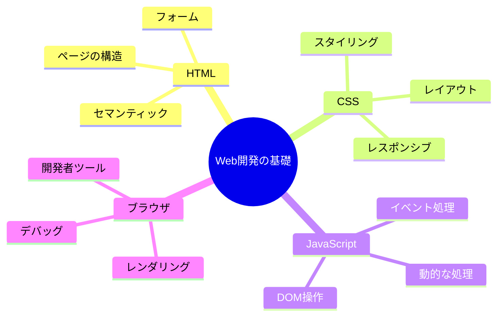

**学習の流れ：**

1. **Webページの仕組み**（20分）
   - クライアント・サーバーモデル
   - HTTP通信
   - URLの構造

2. **HTML**（1-2時間）
   - タグと要素の基本
   - セマンティックHTML
   - フォーム要素

3. **CSS**（2-3時間）
   - セレクタとプロパティ
   - ボックスモデル
   - FlexboxとGrid

4. **JavaScript**（3-4時間）
   - 変数と型
   - 関数
   - DOM操作

5. **実践演習**（1時間）
   - 簡単なWebページを作成

**到達目標：**
- ✅ Webページがどのように表示されるか理解できる
- ✅ HTMLで文書構造を作れる
- ✅ CSSでスタイリングができる
- ✅ JavaScriptで動的な処理を追加できる

---

## 2.1 Webページの仕組み

### Web技術の全体像

まず、Web技術全体がどのように関連しているかを理解しましょう：

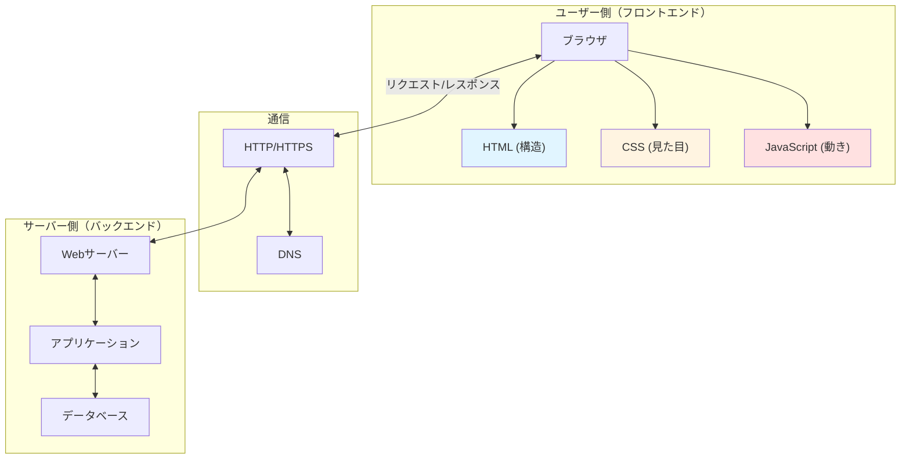

**初心者への補足：**
> 💡 Webページは「3つの言語」で作られています：
> - **HTML** = 家の骨組み（構造）
> - **CSS** = 家の内装（デザイン）
> - **JavaScript** = 家の設備（動く部分）

---

### クライアントとサーバー

Webページを見るとき、実は裏側でこんなやり取りが行われています：

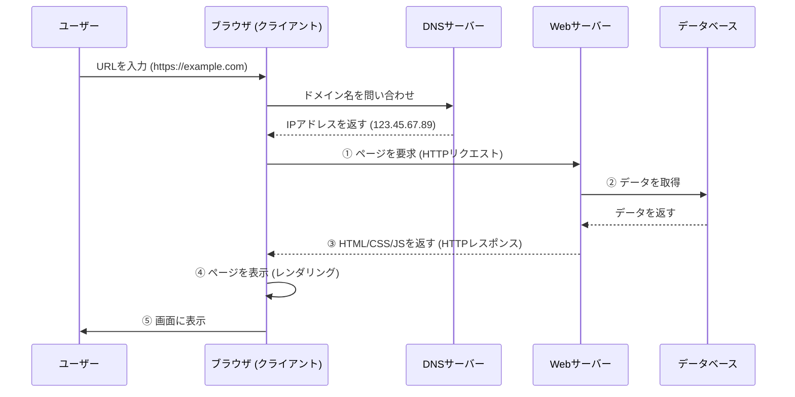

**各ステップの詳細：**

1. **DNS解決**
   ```
   example.com
   ↓
   DNS（電話帳みたいなもの）で検索
   ↓
   123.45.67.89（実際のサーバーの住所）
   ```

2. **HTTPリクエスト送信**
   ```http
   GET /index.html HTTP/1.1
   Host: example.com
   User-Agent: Mozilla/5.0...
   Accept: text/html
   ```

3. **サーバー処理**
   - リクエストを受け取る
   - 必要なデータをデータベースから取得
   - HTMLを生成

4. **HTTPレスポンス返却**
   ```http
   HTTP/1.1 200 OK
   Content-Type: text/html
   Content-Length: 1234
   
   <!DOCTYPE html>
   <html>...</html>
   ```

5. **ブラウザでレンダリング**
   - HTMLを解析（パース）
   - CSSを読み込んでスタイル適用
   - JavaScriptを実行
   - 画面に表示

**用語の説明：**

- **クライアント**: ユーザーが使うブラウザ（Chrome、Safari、Firefoxなど）
- **サーバー**: Webページのデータを保存して送ってくれるコンピューター
- **リクエスト**: クライアントがサーバーに「データください」と頼むこと
- **レスポンス**: サーバーがクライアントにデータを返すこと
- **DNS**: ドメイン名（example.com）をIPアドレス（123.45.67.89）に変換する仕組み
- **レンダリング**: HTMLやCSSを解析して、画面に表示すること

**初心者への補足：**
> 💡 Webページを見るのは、レストランで料理を注文するようなものです：
> 1. あなた（ブラウザ）がメニュー（URL）を見て注文
> 2. 店員（サーバー）が厨房（データベース）に伝える
> 3. 料理（HTML/CSS/JS）ができて運ばれてくる
> 4. あなたが料理を食べる（ブラウザで表示）

---

### HTTPプロトコル

**HTTP**（HyperText Transfer Protocol）は、クライアントとサーバーが会話するときのルールです。

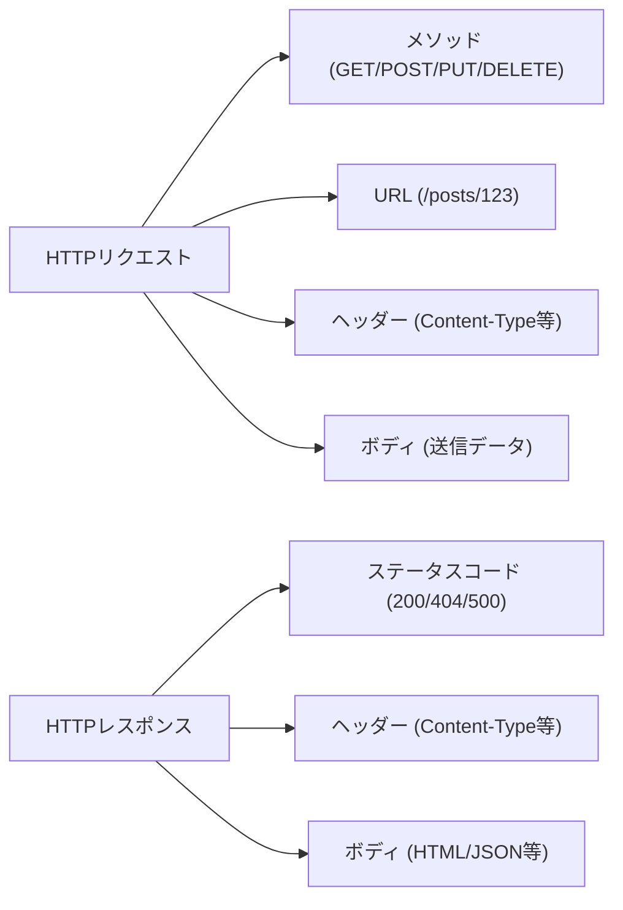

**リクエストの例：**

```http
GET /api/posts/123 HTTP/1.1
Host: example.com
User-Agent: Mozilla/5.0 (Windows NT 10.0; Win64; x64)
Accept: application/json
Authorization: Bearer abc123xyz
```

**各行の意味：**
1. `GET /api/posts/123 HTTP/1.1` - GETメソッドで `/api/posts/123` を取得
2. `Host: example.com` - アクセス先のドメイン
3. `User-Agent: ...` - ブラウザの種類とバージョン
4. `Accept: application/json` - JSON形式のレスポンスが欲しい
5. `Authorization: ...` - 認証トークン（ログイン済み証明）

**レスポンスの例：**

```http
HTTP/1.1 200 OK
Content-Type: application/json
Content-Length: 234
Cache-Control: max-age=3600

{
  "id": 123,
  "title": "練習報告",
  "content": "今日は..."
}
```

**各行の意味：**
1. `HTTP/1.1 200 OK` - リクエスト成功
2. `Content-Type: application/json` - JSONデータを返す
3. `Content-Length: 234` - データサイズは234バイト
4. `Cache-Control: max-age=3600` - 1時間キャッシュしてOK

**主なHTTPメソッド：**

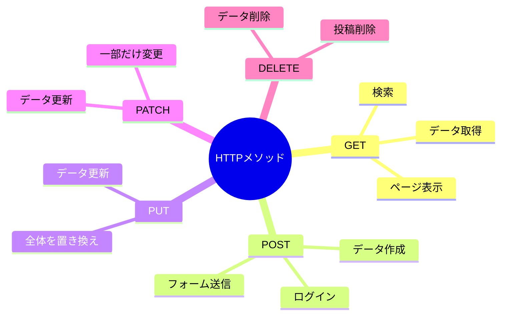

| メソッド | 意味 | 例 | 特徴 |
|---------|------|-----|------|
| GET | データを取得 | ページを表示、投稿一覧取得 | ・URLにパラメータ<br/>・安全（データ変更なし）<br/>・キャッシュ可能 |
| POST | データを送信 | フォームの送信、新規投稿作成 | ・ボディにデータ<br/>・データ作成<br/>・キャッシュ不可 |
| PUT | データを更新 | プロフィール編集、投稿全体を更新 | ・全体を置き換え<br/>・べき等性あり |
| PATCH | データを一部更新 | いいね追加、閲覧数更新 | ・一部だけ変更<br/>・効率的 |
| DELETE | データを削除 | 投稿の削除、コメント削除 | ・データ削除<br/>・べき等性あり |

**実際の使用例：**

```typescript
// GET - 投稿一覧を取得
fetch('/api/posts')
  .then(res => res.json())
  .then(data => console.log(data));
```

**このコードの詳しい説明：**

1. `fetch('/api/posts')` - `/api/posts`にGETリクエストを送信
   - デフォルトでGETメソッドが使われる
   - サーバーに「投稿一覧をください」とお願い

2. `.then(res => res.json())` - レスポンスを受け取る
   - `res`はHTTPレスポンス（サーバーからの返事）
   - `res.json()`でJSON形式のデータに変換
   - Promiseを返すので次の`.then()`に渡される

3. `.then(data => console.log(data))` - データを使う
   - `data`には投稿一覧のデータが入っている
   - `console.log(data)`でコンソールに表示
   - 実際のアプリでは画面に表示する処理を書く

**実行結果のイメージ：**
```javascript
// dataの中身
[
  { id: 1, title: "練習報告", content: "今日は..." },
  { id: 2, title: "ライブ報告", content: "無事終了" }
]
```

---

```typescript
// POST - 新規投稿を作成
fetch('/api/posts', {
  method: 'POST',
  headers: { 'Content-Type': 'application/json' },
  body: JSON.stringify({
    title: '練習報告',
    content: '今日は...'
  })
});
```

**このコードの詳しい説明：**

1. `fetch('/api/posts', { ... })` - 第2引数にオプションを指定
   - `/api/posts`にリクエストを送る
   - `{ ... }`の中に詳細設定を書く

2. `method: 'POST'` - HTTPメソッドをPOSTに指定
   - データを作成したいのでPOSTを使う
   - GETと違い、データをサーバーに送信できる

3. `headers: { 'Content-Type': 'application/json' }` - ヘッダーを設定
   - `Content-Type`は「どんな形式のデータか」を示す
   - `application/json`は「JSON形式です」という意味
   - サーバーがデータを正しく解釈できるようになる

4. `body: JSON.stringify({ ... })` - 送信するデータ
   - `body`にはリクエストの本文（送りたいデータ）を書く
   - JavaScriptのオブジェクト `{ title: ..., content: ... }` を作成
   - `JSON.stringify()`でJSON文字列に変換（必須！）
   - サーバーに送れる形式にする

**なぜJSON.stringify()が必要？**
```javascript
// ❌ これはダメ（オブジェクトのまま）
body: { title: '練習報告' }

// ✅ これが正しい（JSON文字列に変換）
body: JSON.stringify({ title: '練習報告' })
// → '{"title":"練習報告"}' という文字列になる
```

**実行後にサーバーで起こること：**
1. POSTリクエストを受信
2. JSON文字列をパース（解析）
3. データベースに新しい投稿を保存
4. 成功レスポンス（201 Created）を返す

---

```typescript
// PUT - 投稿を更新
fetch('/api/posts/123', {
  method: 'PUT',
  body: JSON.stringify({
    title: '練習報告（更新）',
    content: '今日は...（追記）'
  })
});
```

**このコードの詳しい説明：**

1. `'/api/posts/123'` - 更新したい投稿を指定
   - `123`は投稿のID
   - この投稿を丸ごと置き換える

2. `method: 'PUT'` - 更新のためPUTメソッド
   - リソース全体を置き換える
   - POSTは「作成」、PUTは「更新」

3. `body: JSON.stringify({ ... })` - 新しい内容
   - titleとcontentを両方指定
   - 指定しなかったフィールドは削除される可能性あり

**PUTとPATCHの違い：**
```typescript
// PUT - 全体を置き換え
fetch('/api/posts/123', {
  method: 'PUT',
  body: JSON.stringify({
    title: '新しいタイトル',
    content: '新しい内容',
    // すべてのフィールドを指定する必要がある
  })
});

// PATCH - 一部だけ更新
fetch('/api/posts/123', {
  method: 'PATCH',
  body: JSON.stringify({
    title: '新しいタイトル'
    // titleだけ更新、contentはそのまま
  })
});
```

---

```typescript
// DELETE - 投稿を削除
fetch('/api/posts/123', {
  method: 'DELETE'
});
```

**このコードの詳しい説明：**

1. `'/api/posts/123'` - 削除したい投稿を指定
   - URLのパスで対象を特定
   - `123`は削除する投稿のID

2. `method: 'DELETE'` - DELETEメソッドを指定
   - 削除したいのでDELETEを使う
   - データを送る必要がないので`body`は不要

3. `body`なし - 削除するだけなので送信データ不要
   - URLで削除対象を指定済み
   - 追加情報は必要ない

**実行後にサーバーで起こること：**
1. DELETEリクエストを受信
2. ID=123の投稿をデータベースから削除
3. 成功レスポンス（200 OK または 204 No Content）を返す

**安全な削除の実装例：**
```typescript
// 確認してから削除
if (confirm('本当に削除しますか？')) {
  fetch('/api/posts/123', {
    method: 'DELETE'
  })
  .then(res => {
    if (res.ok) {
      alert('削除しました');
      // 画面から削除した投稿を消す処理
    } else {
      alert('削除に失敗しました');
    }
  });
}
```

**初心者への補足：**
> 💡 HTTPメソッドは「動詞」です：
> - **GET** = 「見せて」（取得）
> - **POST** = 「作って」（作成）
> - **PUT/PATCH** = 「直して」（更新）
> - **DELETE** = 「消して」（削除）

---

**HTTPステータスコード：**

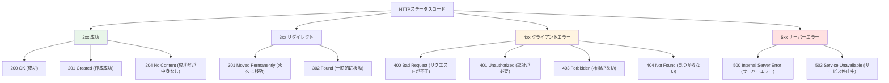

**よくあるステータスコード：**

| コード | 名前 | 意味 | よくある原因 |
|-------|------|------|------------|
| 200 | OK | 成功 | 正常にデータを取得 |
| 201 | Created | 作成成功 | 投稿を作成した |
| 400 | Bad Request | リクエストが不正 | 必須項目が未入力 |
| 401 | Unauthorized | 認証エラー | ログインしていない |
| 403 | Forbidden | 権限エラー | 他人の投稿を削除しようとした |
| 404 | Not Found | 見つからない | 存在しないページ |
| 500 | Internal Server Error | サーバーエラー | プログラムのバグ |

**初心者への補足：**
> 💡 HTTPステータスコードは「店員さんの返事」です：
> - 200 OK = 「かしこまりました！」
> - 404 Not Found = 「その商品はございません」
> - 500 Internal Server Error = 「申し訳ございません、エラーが発生しました」

---

### URLの構造

URLは住所のようなものです：

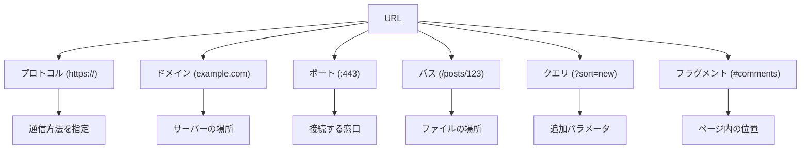

**完全なURLの例：**

```
https://keion-circle-site.vercel.app:443/posts/123?sort=new&filter=practice#comments
  │        │                │         │    │      │                       │
  │        │                │         │    │      │                       └─ フラグメント
  │        │                │         │    │      └───────────────────────── クエリパラメータ
  │        │                │         │    └──────────────────────────────── パス
  │        │                │         └───────────────────────────────────── ポート番号
  │        │                └─────────────────────────────────────────────── ドメイン
  │        └──────────────────────────────────────────────────────────────── サブドメイン
  └───────────────────────────────────────────────────────────────────────── プロトコル
```

**各部分の詳細：**

1. **プロトコル**（https://）
   ```
   http://  - 暗号化なし（平文通信）
   https:// - 暗号化あり（SSL/TLS）← 推奨！
   ```
   
   **httpとhttpsの違い：**
   ```mermaid
   graph LR
       A[HTTP] -->|暗号化なし| B[第三者が盗聴可能]
       C[HTTPS] -->|暗号化あり| D[安全な通信]
       
       style A fill:#ffe1e1
       style C fill:#e8f5e9
   ```

2. **ドメイン**（keion-circle-site.vercel.app）
   ```
   keion-circle-site - サブドメイン（サービス名）
   vercel.app        - ドメイン（会社名）
   ```

3. **ポート番号**（:443）
   ```
   :80  - HTTP のデフォルト
   :443 - HTTPS のデフォルト
   :3000 - 開発環境でよく使う
   ```
   通常は省略可能（デフォルトポートの場合）

4. **パス**（/posts/123）
   ```
   /           - トップページ
   /posts      - 投稿一覧
   /posts/123  - 123番の投稿
   /posts/123/edit - 123番の投稿の編集ページ
   ```

5. **クエリパラメータ**（?sort=new&filter=practice）
   ```
   ?sort=new             - 1つのパラメータ
   ?sort=new&filter=practice - 複数のパラメータ
   
   形式: ?key=value&key=value
   ```
   
   **使用例：**
   ```
   /posts?sort=new          - 新しい順に並べる
   /posts?sort=old          - 古い順に並べる
   /posts?page=2&limit=10   - 2ページ目、10件ずつ
   /search?q=React          - 「React」で検索
   ```

6. **フラグメント**（#comments）
   ```
   #top      - ページの一番上
   #comments - commentsというIDの要素
   #section2 - section2というIDの要素
   ```
   ページ内の特定の位置にスクロール

**URLエンコーディング：**

特殊文字はエンコードする必要があります：

```javascript
// スペースや日本語をエンコード
encodeURIComponent('こんにちは')
// → '%E3%81%93%E3%82%93%E3%81%AB%E3%81%A1%E3%81%AF'

encodeURIComponent('hello world')
// → 'hello%20world'

// 実際の使用例
const query = 'React 入門';
const url = `/search?q=${encodeURIComponent(query)}`;
// → '/search?q=React%20%E5%85%A5%E9%96%80'
```

**初心者への補足：**
> 💡 URLは「住所」です：
> - **プロトコル** = 交通手段（車か電車か）
> - **ドメイン** = 都道府県と市区町村
> - **パス** = 番地と建物名
> - **クエリ** = 部屋番号や追加情報
> - **フラグメント** = 建物内のフロア

---

## 2.2 HTML入門

### HTMLとは

**HTML**（HyperText Markup Language）は、Webページの**構造**を作る言語です。

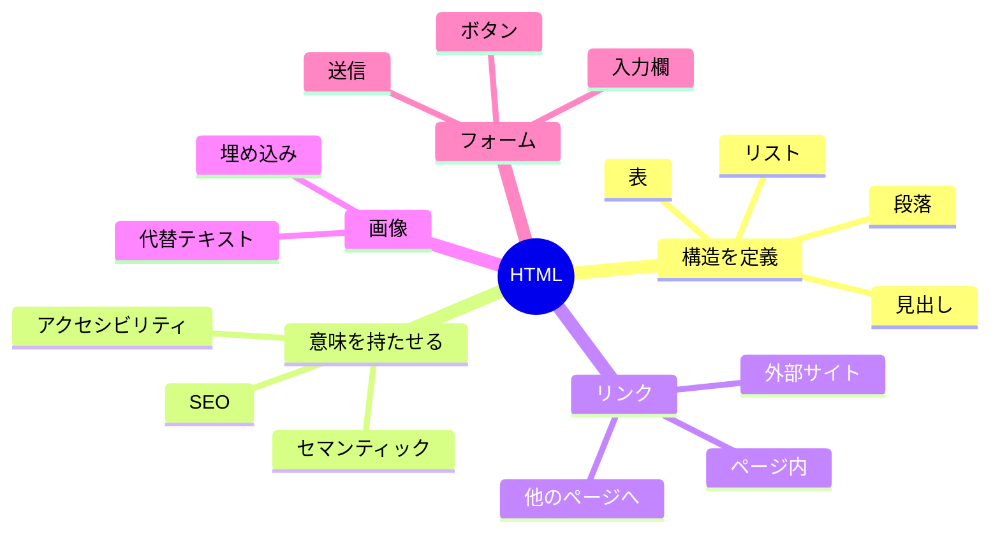

**HTMLの役割：**

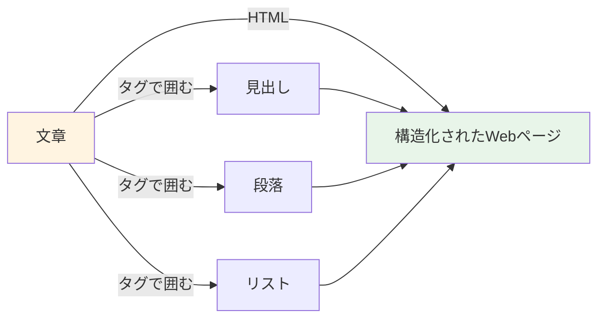

**初心者への補足：**
> 💡 HTMLは「文章の設計図」です。
> - 普通の文章：「軽音サークルの紹介です。メンバー募集中！」
> - HTML：「これは見出し、これは段落、これは強調」と指定する

---

### タグと要素

HTMLは**タグ**で囲んで書きます：

```html
<タグ名>内容</タグ名>
```

**構造の図解：**

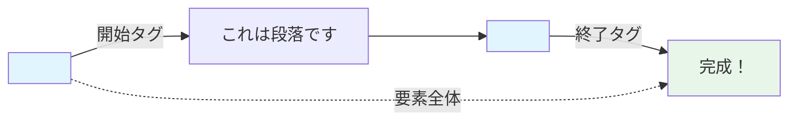

**例：**

```html
<p>これは段落です</p>
```

**各部分の名前：**
- `<p>` - **開始タグ**（ここから段落が始まる）
- `これは段落です` - **内容**（実際に表示される文字）
- `</p>` - **終了タグ**（ここで段落が終わる）
- 全体 - **要素**（タグ + 内容）

**属性を持つ要素：**

```html
<a href="https://example.com" target="_blank">リンク</a>
   │    │                      │
   │    │                      └─ 属性2: 新しいタブで開く
   │    └──────────────────────── 属性1: リンク先URL
   └───────────────────────────── タグ名
```

**属性の書き方：**
```html
<タグ名 属性名="属性値">内容</タグ名>
```

**空要素（終了タグがない）：**

```html
  <!-- 画像 -->
<br>                              <!-- 改行 -->
<hr>                              <!-- 水平線 -->
<input type="text">               <!-- 入力欄 -->
```

**初心者への補足：**
> 💡 タグは「付箋」のようなものです：
> - `<h1>` = 「これは大見出し」という付箋
> - `<p>` = 「これは段落」という付箋
> - `<strong>` = 「ここは重要」という付箋

---

### 基本的なHTMLの構造

すべてのHTMLファイルは、この構造で始まります：

```html
<!DOCTYPE html>                 <!-- ① HTML5を使いますという宣言 -->
<html lang="ja">                <!-- ② HTML文書の開始（日本語） -->
<head>                          <!-- ③ メタ情報（画面に表示されない） -->
  <meta charset="UTF-8">        <!--    文字コード -->
  <meta name="viewport" content="width=device-width, initial-scale=1.0">
  <!--    スマホ対応 -->
  <title>ページタイトル</title> <!--    ブラウザのタブに表示 -->
</head>
<body>                          <!-- ④ 実際に表示される内容 -->
  <h1>こんにちは</h1>
  <p>これはWebページです</p>
</body>
</html>                         <!-- ⑤ HTML文書の終了 -->
```

**構造の図解：**

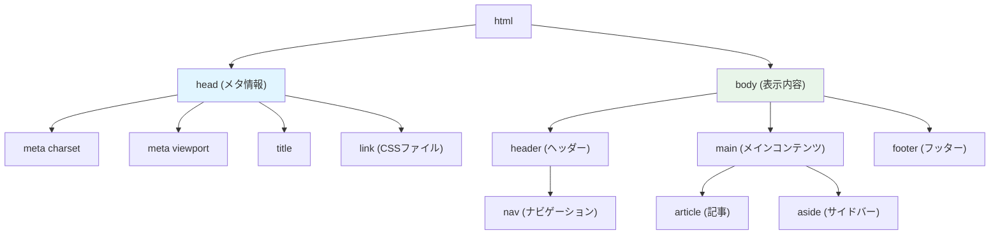

**各部分の役割：**

1. **DOCTYPE宣言**
   ```html
   <!DOCTYPE html>
   ```
   - 「HTML5を使います」という宣言
   - 必ず最初に書く
   - 大文字でも小文字でもOK

2. **html要素**
   ```html
   <html lang="ja">
   ```
   - HTML文書全体を囲む
   - `lang="ja"` = 日本語のページ
   - `lang="en"` = 英語のページ

3. **head要素**（メタ情報）
   ```html
   <head>
     <meta charset="UTF-8">
     <meta name="viewport" content="width=device-width, initial-scale=1.0">
     <meta name="description" content="ページの説明">
     <title>ページタイトル</title>
     <link rel="stylesheet" href="style.css">
   </head>
   ```
   
   - `charset` = 文字エンコーディング（UTF-8推奨）
   - `viewport` = スマホ対応の設定
   - `description` = 検索結果に表示される説明
   - `title` = ブラウザのタブに表示されるタイトル
   - `link` = CSSファイルの読み込み

4. **body要素**（表示内容）
   ```html
   <body>
     <!-- ここに実際に表示される内容を書く -->
   </body>
   ```

**最小限のHTMLファイル：**

```html
<!DOCTYPE html>
<html lang="ja">
<head>
  <meta charset="UTF-8">
  <title>マイページ</title>
</head>
<body>
  <h1>こんにちは！</h1>
</body>
</html>
```

**初心者への補足：**
> 💡 HTMLファイルは「本」の構造に似ています：
> - `<!DOCTYPE html>` = 表紙の「これは本です」という表示
> - `<head>` = 目次（読者には見えない情報）
> - `<body>` = 本文（実際に読む内容）

---

### よく使うHTMLタグ

#### 1. 見出し（h1-h6）

```html
<h1>最も重要な見出し</h1>
<h2>2番目に重要な見出し</h2>
<h3>3番目に重要な見出し</h3>
<h4>4番目に重要な見出し</h4>
<h5>5番目に重要な見出し</h5>
<h6>最も重要度が低い見出し</h6>
```

**階層構造：**

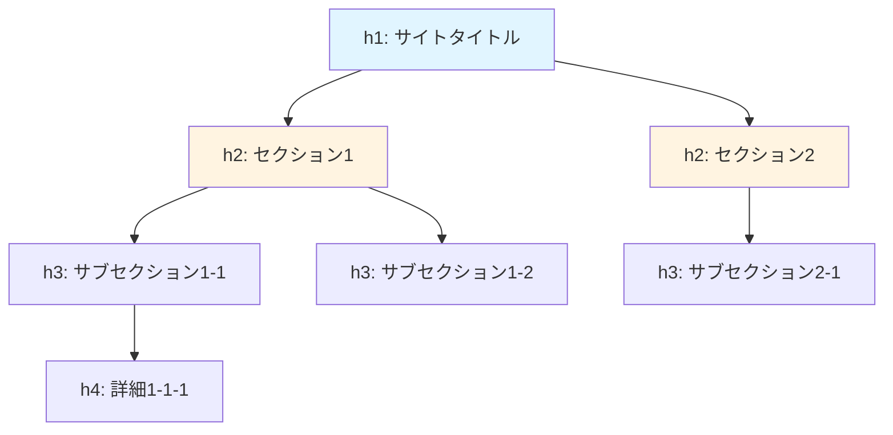

**使い方のルール：**
- `h1` はページに1つだけ（最も重要）
- 順番に使う（h1 → h2 → h3）
- 飛ばさない（h1の次にh3は NG）

**実例：**

```html
<h1>軽音サークル BOLD</h1>
  <h2>活動報告</h2>
    <h3>12月の練習</h3>
    <h3>1月のライブ</h3>
  <h2>メンバー紹介</h2>
    <h3>ギター担当</h3>
    <h3>ベース担当</h3>
```

#### 2. 段落と改行

```html
<p>これは段落です。段落は自動で改行されます。</p>
<p>次の段落です。前の段落との間に余白が入ります。</p>

<p>
  段落内で<br>
  改行したいときは<br>
  brタグを使います
</p>
```

**表示結果イメージ：**
```
これは段落です。段落は自動で改行されます。

次の段落です。前の段落との間に余白が入ります。

段落内で
改行したいときは
brタグを使います
```

#### 3. リスト

**番号なしリスト（ul）：**

```html
<ul>
  <li>ギター</li>
  <li>ベース</li>
  <li>ドラム</li>
</ul>
```

表示：
```
• ギター
• ベース
• ドラム
```

**番号付きリスト（ol）：**

```html
<ol>
  <li>チューニング</li>
  <li>ウォーミングアップ</li>
  <li>練習開始</li>
</ol>
```

表示：
```
1. チューニング
2. ウォーミングアップ
3. 練習開始
```

**入れ子構造：**

```html
<ul>
  <li>楽器
    <ul>
      <li>ギター</li>
      <li>ベース</li>
    </ul>
  </li>
  <li>ボーカル</li>
</ul>
```

表示：
```
• 楽器
  • ギター
  • ベース
• ボーカル
```

#### 4. リンク（a）

```html
<a href="https://example.com">外部サイトへ</a>
<a href="/about">サイト内のページへ</a>
<a href="#section2">ページ内の特定位置へ</a>
<a href="mailto:info@example.com">メール送信</a>
```

**属性：**
- `href` = リンク先のURL
- `target="_blank"` = 新しいタブで開く
- `rel="noopener"` = セキュリティ対策（target="_blank"と一緒に使う）

```html
<a href="https://example.com" target="_blank" rel="noopener">
  外部サイト（新しいタブで開く）
</a>
```

#### 5. 画像（img）

```html

```

**属性：**
- `src` = 画像ファイルのパス（必須）
- `alt` = 代替テキスト（画像が表示されないとき、必須）
- `width` = 幅（ピクセル）
- `height` = 高さ（ピクセル）

```html

```

**パスの指定方法：**

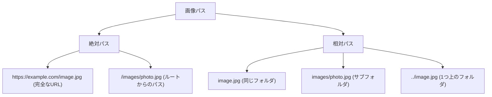

#### 6. 強調

```html
<strong>重要なテキスト</strong>  <!-- 太字、重要 -->
<em>強調したいテキスト</em>      <!-- 斜体、強調 -->
<mark>ハイライト</mark>          <!-- 黄色マーカー -->
```

表示：
- **重要なテキスト**
- *強調したいテキスト*
- <mark>ハイライト</mark>

#### 7. コンテナ要素

```html
<div>ブロックレベルのコンテナ</div>
<span>インラインのコンテナ</span>
```

**違い：**

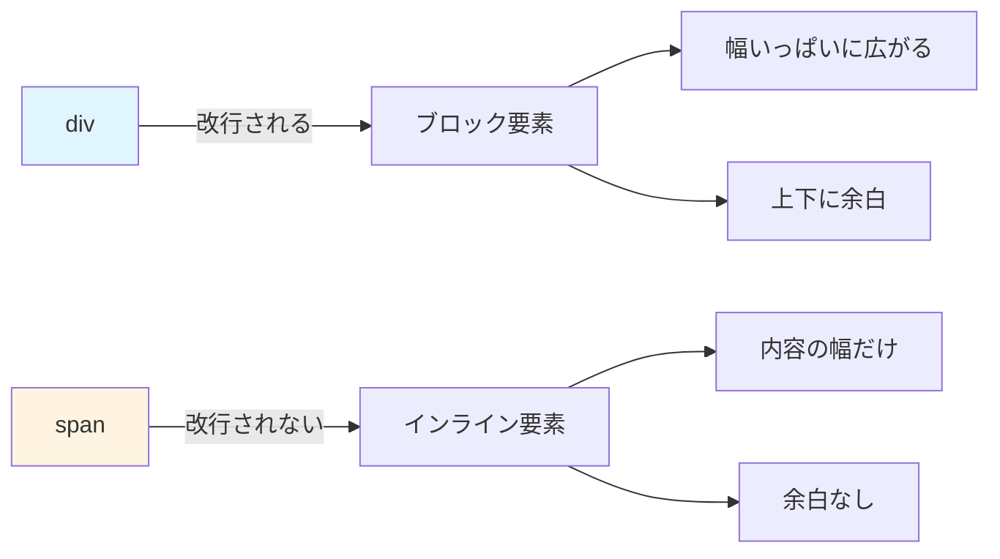

**例：**

```html
<div>これはdivです</div>
<div>これも別のdivです</div>

<span>これはspan</span><span>です</span>
```

表示：
```
これはdivです
これも別のdivです
これはspanです
```

**初心者への補足：**
> 💡 タグの使い分け：
> - **div/span** = 意味なし（デザイン用）
> - **p** = 段落
> - **h1-h6** = 見出し
> - **ul/ol** = リスト
> - **strong/em** = 強調

正しい意味のタグを使うことを「セマンティックHTML」と言います！

---
<html lang="ja">                <!-- HTML文書の始まり。日本語です -->
  <head>                        <!-- ページの情報（表示されない） -->
    <meta charset="UTF-8">      <!-- 文字コードはUTF-8 -->
    <title>ページのタイトル</title>  <!-- ブラウザのタブに表示される -->
  </head>
  <body>                        <!-- ページの本体（表示される） -->
    <h1>見出し</h1>
    <p>本文</p>
  </body>
</html>
```

> 💡 **補足**: `<!-- -->` はコメントです。実行されず、メモとして使います。

### 基本的なタグ一覧

#### 見出し

```html
<h1>一番大きな見出し</h1>
<h2>2番目に大きな見出し</h2>
<h3>3番目に大きな見出し</h3>
<h4>4番目の見出し</h4>
<h5>5番目の見出し</h5>
<h6>一番小さな見出し</h6>
```

表示イメージ：
```
一番大きな見出し          ← h1（最も重要）
  2番目に大きな見出し     ← h2
    3番目に大きな見出し   ← h3
```

#### 段落とテキスト

```html
<p>これは段落です。</p>
<br>                           <!-- 改行 -->
<strong>太字のテキスト</strong>
<em>斜体のテキスト</em>
<u>下線付きテキスト</u>
```

#### リンク

```html
<a href="https://example.com">リンクのテキスト</a>
<a href="https://example.com" target="_blank">新しいタブで開く</a>
```

- `href` - リンク先のURL
- `target="_blank"` - 新しいタブで開く

#### 画像

```html

```

- `src` - 画像のパス
- `alt` - 画像が表示されないときの代替テキスト

#### リンク

```html
<a href="https://example.com">リンクのテキスト</a>
<a href="https://example.com" target="_blank">新しいタブで開く</a>
```

- `href` - リンク先のURL
- `target="_blank"` - 新しいタブで開く

#### 画像

```html

```

- `src` - 画像のパス
- `alt` - 画像が表示されないときの代替テキスト

#### テーブル（表）

```html
<table>
  <thead>                      <!-- ヘッダー行 -->
    <tr>                       <!-- 行 -->
      <th>名前</th>            <!-- ヘッダーセル -->
      <th>年齢</th>
    </tr>
  </thead>
  <tbody>                      <!-- 本体 -->
    <tr>
      <td>田中</td>            <!-- データセル -->
      <td>25</td>
    </tr>
    <tr>
      <td>佐藤</td>
      <td>30</td>
    </tr>
  </tbody>
</table>
```

**このコードの詳しい説明：**

1. **`<table>`**
   - 表全体を囲むタグです
   - この中に行とセルを書いていきます

2. **`<thead>`（Table Head）**
   - 表のヘッダー部分（見出し行）を表します
   - スクロールしても固定表示するなど、特別な扱いができます

3. **`<tr>`（Table Row）**
   - 表の「行」を表します
   - 1つの `<tr>` が1行になります
   - この中に `<th>` や `<td>` を書きます

4. **`<th>`（Table Header）**
   - 表のヘッダーセル（見出しセル）です
   - ブラウザは自動的に**太字**で**中央揃え**にします
   - 「この列は何のデータか」を示します

5. **`<tbody>`（Table Body）**
   - 表の本体（データ部分）を表します
   - 複数の `<tr>` を含みます

6. **`<td>`（Table Data）**
   - 表のデータセルです
   - 実際のデータを入れます
   - 通常は左揃えで表示されます

**ブラウザでの表示イメージ：**
```
┌──────┬──────┐
│ 名前 │ 年齢 │  ← <th> は太字で中央揃え
├──────┼──────┤
│ 田中 │  25  │  ← <td> は通常フォントで左揃え
│ 佐藤 │  30  │
└──────┴──────┘
```

**なぜこの構造が必要なのか？**

- **`<thead>` と `<tbody>` を分ける理由：**
  - ヘッダーを固定してスクロール可能にできます
  - CSSで見た目を変えやすくなります
  - 印刷時にヘッダーを各ページに表示できます
  - スクリーンリーダー（視覚障害者向け）が理解しやすくなります

**CSSなしの場合：**
```
名前  年齢
田中  25
佐藤  30
```
↑ 線がないので見づらい！

**CSSを追加すると：**
```css
table {
  border-collapse: collapse;  /* 線を重ねて表示 */
}
th, td {
  border: 1px solid #ddd;     /* 1pxの線を追加 */
  padding: 8px;                /* セル内の余白 */
}
th {
  background-color: #f2f2f2;  /* ヘッダーの背景色 */
}
```

表示：
```
┏━━━━━━┳━━━━━━┓
┃ 名前 ┃ 年齢 ┃  ← 背景色がグレー
┣━━━━━━╋━━━━━━┫
┃ 田中 ┃  25  ┃
┃ 佐藤 ┃  30  ┃
┗━━━━━━┻━━━━━━┛
```

**セルの結合（colspan, rowspan）：**
```html
<table>
  <tr>
    <th colspan="2">名前</th>  <!-- 2列分を結合 -->
  </tr>
  <tr>
    <td>姓</td>
    <td>名</td>
  </tr>
</table>
```

表示：
```
┌──────────────┐
│    名前      │  ← 2列分の幅
├──────┬───────┤
│  姓  │  名   │
└──────┴───────┘
```

**初心者への補足：**
> 💡 **表を使うタイミング：**
> - データを比較したい時（価格表、成績表など）
> - 行と列で情報を整理したい時
> - ⚠️ **レイアウト目的では使わない**（昔はよく使われましたが、今はCSSで配置します）

#### フォーム

```html
<form action="/submit" method="POST">
  <!-- テキスト入力 -->
  <input type="text" name="username" placeholder="ユーザー名">
  
  <!-- パスワード入力 -->
  <input type="password" name="password" placeholder="パスワード">
  
  <!-- メール入力 -->
  <input type="email" name="email" placeholder="メールアドレス">
  
  <!-- テキストエリア -->
  <textarea name="message" rows="5"></textarea>
  
  <!-- チェックボックス -->
  <input type="checkbox" name="agree" id="agree">
  <label for="agree">利用規約に同意する</label>
  
  <!-- ラジオボタン -->
  <input type="radio" name="gender" value="male" id="male">
  <label for="male">男性</label>
  <input type="radio" name="gender" value="female" id="female">
  <label for="female">女性</label>
  
  <!-- セレクトボックス -->
  <select name="city">
    <option value="">選択してください</option>
    <option value="tokyo">東京</option>
    <option value="osaka">大阪</option>
  </select>
  
  <!-- 送信ボタン -->
  <button type="submit">送信</button>
</form>
```

**このコードの詳しい説明：**

### 1. `<form>` タグ

```html
<form action="/submit" method="POST">
```

- **`action="/submit"`**
  - 送信ボタンを押したときに、データを送る先のURLです
  - 例：`action="/submit"` → `/submit` というAPIにデータを送信
  
- **`method="POST"`**
  - データの送信方法を指定します
  - **POST**：データを隠して送る（パスワードなど）
  - **GET**：データをURLに含めて送る（検索など）
  
**例：GETの場合**
```
/submit?username=taro&email=taro@example.com
```
↑ URLにデータが表示される（パスワードには不適切！）

**例：POSTの場合**
```
/submit
```
↑ URLにはデータが表示されない（見えない場所で送信される）

### 2. `<input>` タグ - テキスト入力

```html
<input type="text" name="username" placeholder="ユーザー名">
```

- **`type="text"`**
  - 普通の1行テキスト入力欄です
  - 何でも入力できます

- **`name="username"`**
  - このデータの名前です
  - サーバーに送られるときに「username=入力された値」になります
  
- **`placeholder="ユーザー名"`**
  - 入力欄が空のときに表示されるヒントです
  - 入力を始めると消えます

**ブラウザでの表示：**
```
┌─────────────────┐
│ ユーザー名      │  ← グレーの文字（placeholder）
└─────────────────┘
```

入力すると：
```
┌─────────────────┐
│ taro            │  ← 黒い文字（入力された値）
└─────────────────┘
```

### 3. `<input type="password">` - パスワード入力

```html
<input type="password" name="password" placeholder="パスワード">
```

- **`type="password"`**
  - 入力された文字が「●」で隠されます
  - セキュリティのため

**表示：**
```
入力：abc123
表示：●●●●●●
```

### 4. `<input type="email">` - メール入力

```html
<input type="email" name="email" placeholder="メールアドレス">
```

- **`type="email"`**
  - メールアドレス専用の入力欄です
  - スマホでは「@」キーが出やすいキーボードになります
  - 送信時にメール形式をチェックしてくれます

**バリデーション（検証）：**
```html
<!-- ❌ 送信できない -->
<input type="email" value="abc">

<!-- ✅ 送信できる -->
<input type="email" value="abc@example.com">
```

### 5. `<textarea>` - 複数行テキスト

```html
<textarea name="message" rows="5"></textarea>
```

- **`rows="5"`**
  - 5行分の高さにします
  - ユーザーは自由にリサイズできます

**表示：**
```
┌───────────────┐
│               │
│               │
│               │  ← 5行分の高さ
│               │
│               │
└───────────────┘
```

### 6. `<input type="checkbox">` - チェックボックス

```html
<input type="checkbox" name="agree" id="agree">
<label for="agree">利用規約に同意する</label>
```

- **`type="checkbox"`**
  - ☑ チェックボックスを作ります
  - 複数選択可能です

- **`id="agree"` と `<label for="agree">`**
  - `id` と `for` を同じ値にすると、ラベルをクリックしてもチェックできます
  - ユーザーが操作しやすくなります！

**表示：**
```
□ 利用規約に同意する  ← クリックするとチェック
☑ 利用規約に同意する  ← チェック済み
```

**送信されるデータ：**
```
チェックなし → データが送られない
チェックあり → agree=on
```

### 7. `<input type="radio">` - ラジオボタン

```html
<input type="radio" name="gender" value="male" id="male">
<label for="male">男性</label>
<input type="radio" name="gender" value="female" id="female">
<label for="female">女性</label>
```

- **`type="radio"`**
  - ◯ ラジオボタンを作ります
  - **同じ `name` のものは1つしか選べません**

- **`name="gender"`**
  - 同じグループにするために必要です
  - 異なる `name` だと、複数選択できてしまいます

- **`value="male"`**
  - サーバーに送られる値です
  - 選択されたら `gender=male` が送られます

**表示：**
```
◉ 男性  ← 選択中
◯ 女性
```

**よくある間違い：**
```html
<!-- ❌ 間違い：name が違うので両方選べてしまう -->
<input type="radio" name="gender1" value="male">
<input type="radio" name="gender2" value="female">

<!-- ✅ 正しい：name が同じなので1つだけ選べる -->
<input type="radio" name="gender" value="male">
<input type="radio" name="gender" value="female">
```

### 8. `<select>` - セレクトボックス（ドロップダウン）

```html
<select name="city">
  <option value="">選択してください</option>
  <option value="tokyo">東京</option>
  <option value="osaka">大阪</option>
</select>
```

- **`<select>`**
  - ドロップダウンメニューを作ります
  - クリックすると選択肢が開きます

- **`<option value="tokyo">`**
  - 選択肢の1つです
  - `value` がサーバーに送られる値
  - タグの中身（東京）が画面に表示される値

**表示：**
```
┌─────────────────┐
│ 選択してください ▼│  ← クリック前
└─────────────────┘

クリックすると：
┌─────────────────┐
│ 選択してください  │
├─────────────────┤
│ 東京             │  ← 選択肢が開く
│ 大阪             │
└─────────────────┘
```

**送信されるデータ：**
```
「東京」を選択 → city=tokyo
```

### 9. `<button type="submit">` - 送信ボタン

```html
<button type="submit">送信</button>
```

- **`type="submit"`**
  - フォームを送信するボタンです
  - クリックすると `action` で指定したURLにデータが送られます

- **他のtype：**
  - `type="button"` → 送信しない普通のボタン
  - `type="reset"` → フォームの内容をクリア

**送信の流れ：**
```
1. ユーザーが入力する
2. 送信ボタンをクリック
3. ブラウザがデータを集める
   → username=taro
   → password=●●●●
   → email=taro@example.com
4. action="/submit" にPOSTで送信
5. サーバーが処理する
```

**初心者への補足：**
> 💡 **フォームのポイント：**
> - **`name` 属性は必須**：サーバーがデータを識別するために必要
> - **`id` と `for` でラベルと紐付け**：クリックしやすくなる
> - **`type` でバリデーション**：`email` や `url` で自動チェック
> - **`placeholder` でヒント**：何を入力すべきか示す
> 
> フォームは**ユーザーとサーバーをつなぐ重要な要素**です！

#### コンテナ（グループ化）

```html
<!-- div: 汎用的なブロック要素 -->
<div>
  <h2>セクション1</h2>
  <p>内容</p>
</div>

<!-- span: 汎用的なインライン要素 -->
<p>これは<span style="color: red">赤い文字</span>です</p>
```

### セマンティックHTML

**セマンティック**（意味のある）HTMLタグを使うと、文書の構造がより明確になります：

```html
<header>                       <!-- ヘッダー（サイトの上部） -->
  <nav>                        <!-- ナビゲーション（メニュー） -->
    <a href="/">ホーム</a>
    <a href="/about">概要</a>
  </nav>
</header>

<main>                         <!-- メインコンテンツ -->
  <article>                    <!-- 記事 -->
    <h1>記事のタイトル</h1>
    <section>                  <!-- セクション -->
      <h2>セクション1</h2>
      <p>内容...</p>
    </section>
  </article>
  
  <aside>                      <!-- サイドバー -->
    <h3>関連記事</h3>
  </aside>
</main>

<footer>                       <!-- フッター（サイトの下部） -->
  <p>&copy; 2025 サイト名</p>
</footer>
```

**このコードの詳しい説明：**

### 1. `<header>` - ヘッダー

```html
<header>
  <nav>
    <a href="/">ホーム</a>
    <a href="/about">概要</a>
  </nav>
</header>
```

- **役割：サイトやセクションの導入部**
  - サイト全体のヘッダー（ロゴ、ナビゲーション）
  - 記事のヘッダー（タイトル、著者、日付）
  
**視覚的なイメージ：**
```
┌─────────────────────────────┐
│ 🏠 サイト名  [ホーム] [概要] │ ← <header>
├─────────────────────────────┤
│                             │
│   メインコンテンツ           │
│                             │
└─────────────────────────────┘
```

### 2. `<nav>` - ナビゲーション

```html
<nav>
  <a href="/">ホーム</a>
  <a href="/about">概要</a>
  <a href="/contact">お問い合わせ</a>
</nav>
```

- **役割：サイト内のナビゲーションリンク**
  - メインメニュー
  - パンくずリスト
  - 目次

**なぜ `<nav>` を使うのか？**
- スクリーンリーダーが「これはナビゲーションだ」と認識できる
- SEOで検索エンジンがサイト構造を理解しやすくなる
- CSSで簡単にスタイルを当てられる

**`<div>` との違い：**
```html
<!-- ❌ 意味がわからない -->
<div>
  <a href="/">ホーム</a>
  <a href="/about">概要</a>
</div>

<!-- ✅ 「これはナビゲーションだ」とわかる -->
<nav>
  <a href="/">ホーム</a>
  <a href="/about">概要</a>
</nav>
```

### 3. `<main>` - メインコンテンツ

```html
<main>
  <h1>ページのタイトル</h1>
  <p>ページの内容...</p>
</main>
```

- **役割：ページのメインコンテンツ**
  - **1ページに1つだけ**使います
  - ヘッダーやフッター、サイドバーを除いた中心的な内容

**視覚的なイメージ：**
```
┌─────────────────────┐
│ <header> ヘッダー   │
├─────────────────────┤
│ <main>              │ ← ここが主役
│   ページの中心内容  │
│                     │
├─────────────────────┤
│ <footer> フッター   │
└─────────────────────┘
```

**なぜ重要？**
- スクリーンリーダーの「メインコンテンツに飛ぶ」機能が使える
- 検索エンジンが「ここが重要な内容だ」と理解する

### 4. `<article>` - 記事

```html
<article>
  <h1>ブログのタイトル</h1>
  <p>投稿日: 2025年1月1日</p>
  <p>記事の内容...</p>
</article>
```

- **役割：独立したコンテンツ**
  - ブログ記事
  - ニュース記事
  - フォーラムの投稿
  - 商品カード

**「独立した」とは？**
→ **そのまま他の場所に貼り付けても意味が通じるコンテンツ**

**例：ブログ記事一覧**
```html
<main>
  <article>
    <h2>記事1</h2>
    <p>内容1...</p>
  </article>
  
  <article>
    <h2>記事2</h2>
    <p>内容2...</p>
  </article>
</main>
```

↑ 各 `<article>` が独立していて、RSSフィードやシェアが可能

### 5. `<section>` - セクション

```html
<article>
  <h1>完全ガイド</h1>
  
  <section>
    <h2>第1章：基礎知識</h2>
    <p>内容...</p>
  </section>
  
  <section>
    <h2>第2章：応用編</h2>
    <p>内容...</p>
  </section>
</article>
```

- **役割：テーマごとのまとまり**
  - 長い文書を章で分ける
  - ページを意味のある区画に分割

**`<div>` との違い：**
```html
<!-- ❌ 意味がない：ただのグループ化 -->
<div>
  <h2>第1章</h2>
  <p>内容...</p>
</div>

<!-- ✅ 意味がある：「これは1つの章だ」とわかる -->
<section>
  <h2>第1章</h2>
  <p>内容...</p>
</section>
```

**ルール：**
- **`<section>` には見出し（h2, h3など）を入れるべき**
- 見出しがない場合は `<div>` を使う

### 6. `<aside>` - サイドバー・補足情報

```html
<main>
  <article>
    <h1>メイン記事</h1>
    <p>内容...</p>
  </article>
  
  <aside>
    <h3>関連記事</h3>
    <ul>
      <li><a href="/related1">関連記事1</a></li>
      <li><a href="/related2">関連記事2</a></li>
    </ul>
  </aside>
</main>
```

- **役割：メインコンテンツと関連するが、独立した情報**
  - サイドバー
  - 広告
  - 関連リンク
  - 補足説明

**視覚的なイメージ：**
```
┌──────────────┬──────────┐
│              │          │
│   <article>  │ <aside>  │
│   メイン記事 │ サイド   │
│              │ バー     │
│              │          │
└──────────────┴──────────┘
```

### 7. `<footer>` - フッター

```html
<footer>
  <p>&copy; 2025 サイト名</p>
  <nav>
    <a href="/privacy">プライバシーポリシー</a>
    <a href="/terms">利用規約</a>
  </nav>
</footer>
```

- **役割：サイトやセクションの末尾情報**
  - 著作権表示
  - フッターナビゲーション
  - 連絡先
  - ソーシャルメディアリンク

**視覚的なイメージ：**
```
┌─────────────────────────────┐
│                             │
│   メインコンテンツ           │
│                             │
├─────────────────────────────┤
│ © 2025 サイト名             │ ← <footer>
│ [プライバシー] [利用規約]   │
└─────────────────────────────┘
```

---

### セマンティックHTMLの3つの大きな利点

#### 利点1：コードが読みやすい

**セマンティックなし（`<div>` だけ）：**
```html
<div class="header">
  <div class="nav">...</div>
</div>
<div class="main">
  <div class="article">...</div>
  <div class="sidebar">...</div>
</div>
<div class="footer">...</div>
```
↑ 何が何だかわからない...

**セマンティックあり：**
```html
<header>
  <nav>...</nav>
</header>
<main>
  <article>...</article>
  <aside>...</aside>
</main>
<footer>...</footer>
```
↑ 一目でページ構造がわかる！

#### 利点2：SEO（検索エンジン最適化）に有利

検索エンジン（Google など）は、セマンティックタグを理解します：

```html
<!-- Googleがこう理解する -->
<article>      ← 「これは記事だ」
  <h1>タイトル</h1>  ← 「これが一番重要な見出しだ」
  <time>2025-01-01</time>  ← 「この日付に投稿された」
</article>
```

結果：
- 検索結果で上位に表示されやすくなる
- リッチスニペット（日付、評価など）が表示される

#### 利点3：アクセシビリティの向上

**スクリーンリーダー**（視覚障害者向けの読み上げソフト）が、ページ構造を理解できます：

```html
<nav>...</nav>     ← 「ナビゲーション領域です」と読み上げる
<main>...</main>   ← 「メインコンテンツに移動」ショートカットキーが使える
<article>...</article>  ← 「記事です」と伝える
```

**操作例：**
1. ユーザー：「メインコンテンツに飛びたい」
2. スクリーンリーダー：`<main>` を見つけて移動
3. ユーザー：「ナビゲーションを聞きたい」
4. スクリーンリーダー：`<nav>` 内のリンクを読み上げる

---

### セマンティックHTML vs `<div>`

| セマンティックタグ | `<div>` | 使い分け |
|---|---|---|
| 意味がある | 意味がない | 意味のある部分はセマンティックタグ |
| SEOに有利 | SEO効果なし | 重要なコンテンツはセマンティックタグ |
| 読みやすい | classを読まないとわからない | 可読性が重要ならセマンティックタグ |
| アクセシビリティ◎ | 伝わらない | ユーザー配慮ならセマンティックタグ |

**まとめ：**
- **意味のある部分**（ヘッダー、記事など） → セマンティックタグ
- **単なるスタイリング用のグループ化** → `<div>`

**実践例：**
```html
<!-- ✅ 良い例 -->
<article class="card">  ← 「記事」という意味 + スタイル用class
  <h2>タイトル</h2>
  <div class="card-footer">  ← 単なるスタイリング用なのでdivでOK
    <button>読む</button>
  </div>
</article>
```

**初心者への補足：**
> 💡 **セマンティックHTMLの覚え方：**
> - `<header>` - 「ヘッド（頭）」→ 上部
> - `<footer>` - 「フット（足）」→ 下部
> - `<nav>` - 「ナビゲーション」→ メニュー
> - `<main>` - 「メイン」→ 主役
> - `<article>` - 「アーティクル（記事）」→ 独立したコンテンツ
> - `<aside>` - 「アサイド（脇）」→ サイドバー
> - `<section>` - 「セクション（区画）」→ 章やセクション
> 
> 最初は難しいですが、**「これは何の役割か？」を意識**すると自然に使えるようになります！

---

## 2.3 CSS入門

### CSSとは

**CSS**（Cascading Style Sheets）は、Webページの**見た目**（デザイン）を作る言語です。

HTMLが「構造」、CSSが「装飾」を担当します。

```
HTML（構造）        CSS（装飾）           結果
<h1>見出し</h1>  +  色: 青            =  青い大きな見出し
                   サイズ: 大きく
                   太字
```

**例で理解する：**

```html
<!-- HTMLだけ -->
<h1>ようこそ</h1>
```
表示：
```
ようこそ  ← ただの大きな黒文字
```

```html
<!-- HTML + CSS -->
<h1 style="color: blue; font-size: 48px;">ようこそ</h1>
```
表示：
```
ようこそ  ← 青い、さらに大きい文字
```

**CSSでできること：**
- 文字の色・サイズ・フォントを変更
- 背景色や背景画像を設定
- 要素の配置やレイアウト
- アニメーション効果
- レスポンシブデザイン（スマホ・PC対応）

### CSSの書き方

CSSは以下の形式で書きます：

```css
セレクタ {
  プロパティ: 値;
  プロパティ: 値;
}
```

**各部分の説明：**

```css
h1 {              ← セレクタ（どの要素にスタイルを当てるか）
  color: blue;    ← プロパティ（何を変えるか）: 値（どう変えるか）;
  font-size: 32px;
}                 ← 中括弧で囲む
```

**このコードの詳しい説明：**

1. **`h1`（セレクタ）**
   - 「すべての `<h1>` タグ」を選択します
   - このスタイルは、ページ内のすべての `<h1>` に適用されます

2. **`color: blue;`（プロパティと値）**
   - `color` = プロパティ（文字色を変える）
   - `blue` = 値（青色にする）
   - `;` = セミコロンで終わる（必須！）

3. **`font-size: 32px;`**
   - `font-size` = プロパティ（文字サイズを変える）
   - `32px` = 値（32ピクセルにする）

**実際の適用例：**

```html
<h1>これは見出しです</h1>
<p>これは段落です</p>
<h1>もう1つの見出し</h1>
```

CSSを適用：
```css
h1 {
  color: blue;
  font-size: 32px;
  font-weight: bold;
}
```

結果：
```
これは見出しです        ← 青い、32px、太字
これは段落です          ← スタイルなし（黒、普通サイズ）
もう1つの見出し        ← 青い、32px、太字
```

**コメントの書き方：**
```css
/* これはコメントです。実行されません */
h1 {
  color: blue;  /* この行だけのコメント */
}
```

### CSSの適用方法

#### 1. インラインスタイル（直接書く）

```html
<p style="color: red; font-size: 20px;">赤い文字</p>
```

**このコードの詳しい説明：**

- **`style` 属性**
  - HTMLタグに直接CSSを書きます
  - `style="プロパティ: 値; プロパティ: 値;"`

- **デメリット：**
  - 同じスタイルを何度も書かないといけない
  - 管理が大変（変更したいときに全部書き換え）
  - HTMLとCSSが混ざって読みづらい

**例：同じスタイルを何度も書く必要がある**
```html
<p style="color: red; font-size: 20px;">段落1</p>
<p style="color: red; font-size: 20px;">段落2</p>
<p style="color: red; font-size: 20px;">段落3</p>
```
↑ 非効率！

> ⚠️ **注意**: 管理が大変なので、**あまり使わないほうが良いです**。

**使うべきタイミング：**
- メールHTMLを書くとき（メールクライアントは外部CSSを読めないことがある）
- JavaScriptで動的にスタイルを変更するとき

#### 2. 内部スタイルシート（`<style>`タグ）

```html
<head>
  <style>
    p {
      color: red;
      font-size: 20px;
    }
  </style>
</head>
<body>
  <p>赤い文字</p>
  <p>これも赤い文字</p>
</body>
```

**このコードの詳しい説明：**

1. **`<head>` の中に `<style>` タグ**
   - HTMLファイルの `<head>` セクションに書きます
   - `<body>` の前に書くことで、ページ読み込み時にスタイルが適用されます

2. **`p { ... }`**
   - ページ内のすべての `<p>` タグに適用されます
   - 1回書くだけで、すべての段落に同じスタイルが当たります

**メリット：**
- HTMLとCSSが同じファイルにある（小さいプロジェクトで便利）
- インラインより管理しやすい

**デメリット：**
- 複数のHTMLファイルでスタイルを共有できない
- ファイルが大きくなると読みづらい

**使うべきタイミング：**
- 1ページだけの小さなサイト
- そのページだけの特別なスタイル

#### 3. 外部スタイルシート（**推奨**）

**style.css:**
```css
p {
  color: red;
  font-size: 20px;
}

h1 {
  color: blue;
  font-size: 32px;
}
```

**index.html:**
```html
<head>
  <link rel="stylesheet" href="style.css">
</head>
<body>
  <h1>見出し</h1>
  <p>赤い文字</p>
</body>
```

**このコードの詳しい説明：**

1. **別ファイルにCSSを書く**
   - `style.css` という別ファイルにすべてのCSSを書きます
   - `.css` という拡張子を使います

2. **`<link>` タグで読み込む**
   ```html
   <link rel="stylesheet" href="style.css">
   ```
   - `rel="stylesheet"` → 「これはスタイルシートです」と宣言
   - `href="style.css"` → CSSファイルのパス

3. **複数ページで共有できる**
   ```
   index.html     ← style.cssを読み込む
   about.html     ← style.cssを読み込む
   contact.html   ← style.cssを読み込む
   style.css      ← すべてのページに適用される
   ```

**メリット：**
- **複数のHTMLファイルで共有できる**（1回変更すれば全ページに反映）
- HTMLとCSSが分離される（読みやすい、管理しやすい）
- ブラウザがCSSをキャッシュする（2回目以降の読み込みが速い）

**実際のプロジェクト構造：**
```
my-website/
├── index.html
├── about.html
├── css/
│   ├── style.css     ← メインのCSS
│   └── reset.css     ← ブラウザのデフォルトスタイルをリセット
└── images/
    └── logo.png
```

**index.html:**
```html
<head>
  <link rel="stylesheet" href="css/reset.css">
  <link rel="stylesheet" href="css/style.css">
</head>
```

> 💡 **ベストプラクティス**: **外部スタイルシート（方法3）を使いましょう**。チーム開発や大きなプロジェクトでは必須です。

**3つの方法の比較表：**

| 方法 | メリット | デメリット | 使うべきタイミング |
|---|---|---|---|
| **インライン** | 簡単 | 管理大変、再利用不可 | メールHTML、動的変更 |
| **内部** | HTMLと同じファイル | ファイル間で共有不可 | 1ページのみのサイト |
| **外部（推奨）** | 再利用可能、管理楽 | ファイルが増える | ほぼすべての場合 |

### セレクタ

セレクタは「どの要素にスタイルを適用するか」を指定します。

#### 要素セレクタ

```css
p {
  color: blue;
}
/* すべての<p>タグに適用 */
```

**このコードの詳しい説明：**

- **要素名をそのまま書く**
  - `p` → すべての `<p>` タグ
  - `h1` → すべての `<h1>` タグ
  - `div` → すべての `<div>` タグ

**HTMLとの対応：**
```html
<p>これは青くなる</p>
<div>これは青くならない</div>
<p>これも青くなる</p>
```

結果：
```
これは青くなる     ← 青
これは青くならない ← 黒（divなので対象外）
これも青くなる     ← 青
```

**複数の要素に同じスタイル：**
```css
h1, h2, h3 {
  color: blue;
}
/* h1, h2, h3すべてに適用 */
```

#### クラスセレクタ

```css
.button {
  background-color: blue;
  color: white;
  padding: 10px 20px;
  border-radius: 5px;
}
/* class="button" の要素に適用 */
```

```html
<button class="button">クリック</button>
<a class="button">リンク</a>
<div class="button">ボックス</div>
```

**このコードの詳しい説明：**

1. **`.` (ドット) で始める**
   - CSSでは `.button` と書きます
   - HTMLでは `class="button"` と書きます

2. **どの要素にも使える**
   - `<button>`, `<a>`, `<div>` など、どんなタグでもOK
   - 同じクラス名を何度でも使えます

3. **複数のクラスを指定**
   ```html
   <button class="button primary">送信</button>
   ```
   ↑ `button` と `primary` の両方のスタイルが適用される

   ```css
   .button {
     padding: 10px 20px;
   }
   .primary {
     background-color: blue;
   }
   ```

**クラス名の命名規則：**
```css
/* ✅ 良い名前：意味が分かる */
.button { }
.card { }
.header { }
.nav-menu { }

/* ❌ 悪い名前：意味不明 */
.a { }
.box1 { }
.red-text { }  ← 色を変えたくなったとき困る
```

> 💡 **補足**: クラスは**何度でも使えます**。複数の要素に同じスタイルを適用したいときに便利！

#### IDセレクタ

```css
#header {
  background-color: gray;
  height: 60px;
}
/* id="header" の要素に適用 */
```

```html
<header id="header">ヘッダー</header>
```

**このコードの詳しい説明：**

1. **`#` (ハッシュ) で始める**
   - CSSでは `#header` と書きます
   - HTMLでは `id="header"` と書きます

2. **1ページに1つだけ**
   - 同じIDを複数の要素に使ってはいけません
   - ユニーク（一意）な要素に使います

**IDとクラスの使い分け：**

```html
<!-- ✅ 正しい使い方 -->
<header id="header">...</header>  <!-- ページに1つだけ -->
<footer id="footer">...</footer>  <!-- ページに1つだけ -->

<div class="card">...</div>       <!-- 何度でもOK -->
<div class="card">...</div>
<div class="card">...</div>

<!-- ❌ 間違い：IDを2回使っている -->
<div id="main">...</div>
<div id="main">...</div>  ← エラー！
```

**クラスとIDの比較表：**

| | クラス `.class` | ID `#id` |
|---|---|---|
| HTML | `class="button"` | `id="header"` |
| CSS | `.button { }` | `#header { }` |
| 使用回数 | 何度でもOK | 1ページに1つだけ |
| 優先度 | 低い | 高い |
| 使うとき | 繰り返し使うスタイル | ページ内リンク、一意の要素 |

> 💡 **ベストプラクティス**: **基本的にはクラスを使う**。IDはJavaScriptで要素を取得するときや、ページ内リンク（`#section1`）に使うのが一般的です。

#### 子孫セレクタ

```css
.container p {
  color: red;
}
/* .containerの中の<p>に適用 */
```

```html
<div class="container">
  <p>赤くなる</p>
  <div>
    <p>これも赤くなる（入れ子でもOK）</p>
  </div>
</div>
<p>赤くならない（.containerの外）</p>
```

**このコードの詳しい説明：**

1. **スペースで区切る**
   - `.container p` → `.container` の中にある `<p>`
   - 直接の子でなくてもOK（孫、ひ孫も含む）

2. **特定の場所だけにスタイルを当てる**
   - サイドバー内の段落だけ小さくする
   - ヘッダー内のリンクだけ白くする

**実用例：**
```css
/* ナビゲーション内のリンクだけスタイルを変える */
.nav a {
  color: white;
  text-decoration: none;
}

/* サイドバー内の見出しだけ小さくする */
.sidebar h3 {
  font-size: 18px;
  color: gray;
}
```

#### 子セレクタ（直接の子のみ）

```css
.container > p {
  color: red;
}
/* .containerの直接の子の<p>だけに適用 */
```

```html
<div class="container">
  <p>赤くなる（直接の子）</p>
  <div>
    <p>赤くならない（孫なので対象外）</p>
  </div>
</div>
```

**子孫セレクタとの違い：**
```css
/* 子孫セレクタ（すべて） */
.container p { }  ← 子、孫、ひ孫すべて

/* 子セレクタ（直接の子のみ） */
.container > p { }  ← 直接の子だけ
```

#### 隣接セレクタ

```css
h2 + p {
  font-weight: bold;
}
/* h2の直後の<p>だけに適用 */
```

```html
<h2>見出し</h2>
<p>太字になる（h2の直後）</p>
<p>太字にならない（2番目なので対象外）</p>
```

**使用例：**
- 見出しの直後の段落を大きくする
- 最初の段落だけドロップキャップ（大きな頭文字）にする

#### 擬似クラス

```css
a:hover {
  color: red;
}
/* リンクにマウスを乗せたとき */

button:active {
  background-color: gray;
}
/* ボタンをクリックしたとき */

input:focus {
  border-color: blue;
}
/* 入力欄にフォーカスしたとき */
```

**このコードの詳しい説明：**

1. **`:hover` - マウスが乗ったとき**
   ```css
   a:hover {
     color: red;
     text-decoration: underline;
   }
   ```
   - ユーザーがマウスをリンクに乗せたときだけ適用
   - インタラクティブな体験を提供

2. **`:active` - クリックしたとき**
   ```css
   button:active {
     background-color: darkblue;
     transform: scale(0.95);  /* 少し小さくする */
   }
   ```
   - マウスボタンを押している間だけ適用
   - 「押している」感を出せる

3. **`:focus` - フォーカスされたとき**
   ```css
   input:focus {
     border-color: blue;
     outline: 2px solid lightblue;
   }
   ```
   - 入力欄をクリックしたときやTabキーで選択されたとき
   - 「今ここに入力できる」と視覚的に示す

**その他の便利な擬似クラス：**

```css
/* 最初の子要素 */
li:first-child {
  font-weight: bold;
}

/* 最後の子要素 */
li:last-child {
  border-bottom: none;
}

/* n番目の子要素 */
li:nth-child(2) {
  color: red;  /* 2番目だけ */
}

/* 偶数番目 */
tr:nth-child(even) {
  background-color: #f0f0f0;  /* ゼブラストライプ */
}

/* 奇数番目 */
tr:nth-child(odd) {
  background-color: white;
}
```

**実用例：リストのスタイリング**
```css
ul li {
  padding: 10px;
  border-bottom: 1px solid #ddd;
}

ul li:last-child {
  border-bottom: none;  /* 最後の項目は線なし */
}

ul li:hover {
  background-color: #f5f5f5;  /* マウスを乗せたらハイライト */
}
```

結果：
```
項目1            ← マウスを乗せると背景色変化
──────────────
項目2
──────────────
項目3            ← 線なし
```

#### 属性セレクタ

```css
/* type属性がtextのinput */
input[type="text"] {
  border: 1px solid blue;
}

/* href属性が.pdfで終わるリンク */
a[href$=".pdf"] {
  color: red;
}

/* title属性を持つ要素 */
[title] {
  cursor: help;
}
```

**初心者への補足：**
> 💡 **セレクタの使い分け：**
> - **要素セレクタ** → すべての要素に共通のスタイル（`p { }`, `h1 { }`）
> - **クラスセレクタ** → 繰り返し使うスタイル（`.button { }`）
> - **IDセレクタ** → 1つだけの特別な要素（`#header { }`）
> - **子孫セレクタ** → 特定の場所だけ（`.nav a { }`）
> - **擬似クラス** → 状態に応じたスタイル（`:hover`, `:focus`）
> 
> 基本は「クラス」を中心に使い、必要に応じて他を組み合わせます！

### プロパティと値

#### 色

```css
.element {
  color: red;                    /* 文字色 */
  background-color: blue;        /* 背景色 */
}
```

**色の指定方法：**

```css
/* 1. 色名（英語） */
color: red;
color: blue;
color: white;
color: black;
color: gray;

/* 2. 16進数（Hex） */
color: #FF0000;    /* 赤（R:FF, G:00, B:00） */
color: #0000FF;    /* 青（R:00, G:00, B:FF） */
color: #FFFFFF;    /* 白 */
color: #000000;    /* 黒 */
color: #F00;       /* #FF0000の短縮形 */

/* 3. RGB（Red, Green, Blue） */
color: rgb(255, 0, 0);     /* 赤（0-255で指定） */
color: rgb(0, 0, 255);     /* 青 */
color: rgb(128, 128, 128); /* グレー */

/* 4. RGBA（Aは透明度） */
color: rgba(255, 0, 0, 0.5);  /* 半透明の赤（0.5 = 50%） */
color: rgba(0, 0, 0, 0.8);    /* 少し透明な黒（80%） */
background-color: rgba(255, 255, 255, 0.3);  /* 30%の白 */
```

**このコードの詳しい説明：**

1. **色名**
   - 最も簡単ですが、種類が限られています
   - `red`, `blue`, `green`, `yellow`, `purple` など

2. **16進数（Hex）**
   - `#RRGGBB` の形式
   - RR = 赤、GG = 緑、BB = 青（00 〜 FF）
   - デザインツール（Figma, Photoshopなど）で使われる標準形式

   **例：**
   ```
   #FF0000  →  R=255, G=0, B=0  →  赤
   #00FF00  →  R=0, G=255, B=0  →  緑
   #0000FF  →  R=0, G=0, B=255  →  青
   #FFFFFF  →  R=255, G=255, B=255  →  白
   #000000  →  R=0, G=0, B=0  →  黒
   ```

3. **RGB**
   - 0 〜 255 の数値で指定
   - 直感的でわかりやすい

4. **RGBA（透明度付き）**
   - 最後の数値（Alpha）が透明度
   - 0.0 = 完全に透明
   - 1.0 = 完全に不透明
   - 0.5 = 半透明

**実用例：オーバーレイ（重ね合わせ）**
```css
.overlay {
  background-color: rgba(0, 0, 0, 0.5);  /* 半透明の黒 */
  position: absolute;
  top: 0;
  left: 0;
  width: 100%;
  height: 100%;
}
```
↑ 画像の上に半透明の黒を重ねて、テキストを読みやすくする

#### テキスト

```css
.text {
  font-size: 16px;              /* 文字サイズ */
  font-weight: bold;            /* 太字 */
  font-family: Arial, sans-serif; /* フォント */
  text-align: center;           /* 中央揃え */
  text-decoration: underline;   /* 下線 */
  line-height: 1.5;            /* 行の高さ */
  letter-spacing: 2px;         /* 文字間隔 */
}
```

**このコードの詳しい説明：**

1. **`font-size`（文字サイズ）**
   ```css
   font-size: 16px;   /* 16ピクセル */
   font-size: 1.5em;  /* 親要素の1.5倍 */
   font-size: 1.2rem; /* ルート要素の1.2倍 */
   ```
   - **px**: 固定サイズ（16px、20pxなど）
   - **em**: 親要素に対する倍率
   - **rem**: `<html>` に対する倍率（推奨）

2. **`font-weight`（太さ）**
   ```css
   font-weight: normal;   /* 通常（400） */
   font-weight: bold;     /* 太字（700） */
   font-weight: 400;      /* 数値でも指定可能 */
   font-weight: 700;      /* bold と同じ */
   ```

3. **`font-family`（フォント）**
   ```css
   font-family: Arial, sans-serif;
   ```
   - カンマ区切りで複数指定（フォールバック）
   - 1つ目がなければ2つ目を使う
   - 最後は `sans-serif` や `serif` などの汎用フォント

   **よく使うフォント：**
   ```css
   /* Windowsでよく使われる */
   font-family: "メイリオ", "Meiryo", sans-serif;
   
   /* Macでよく使われる */
   font-family: "ヒラギノ角ゴ Pro", "Hiragino Kaku Gothic Pro", sans-serif;
   
   /* 両方対応 */
   font-family: "メイリオ", "Meiryo", "ヒラギノ角ゴ Pro", sans-serif;
   ```

4. **`text-align`（揃え方）**
   ```css
   text-align: left;     /* 左揃え（デフォルト） */
   text-align: center;   /* 中央揃え */
   text-align: right;    /* 右揃え */
   text-align: justify;  /* 両端揃え */
   ```

5. **`text-decoration`（装飾）**
   ```css
   text-decoration: none;       /* なし */
   text-decoration: underline;  /* 下線 */
   text-decoration: line-through; /* 取り消し線 */
   text-decoration: overline;   /* 上線 */
   ```

   **実用例：リンクの下線を消す**
   ```css
   a {
     text-decoration: none;  /* リンクの下線を消す */
   }
   a:hover {
     text-decoration: underline;  /* マウスを乗せたら下線 */
   }
   ```

6. **`line-height`（行の高さ）**
   ```css
   line-height: 1.5;    /* フォントサイズの1.5倍 */
   line-height: 24px;   /* 固定値 */
   ```
   - 読みやすさに影響する重要なプロパティ
   - 1.5 〜 1.8 が読みやすい

   **比較：**
   ```
   line-height: 1.0  →  文字がぎゅうぎゅう
   line-height: 1.5  →  適度な余白で読みやすい
   line-height: 3.0  →  余白が多すぎて読みづらい
   ```

7. **`letter-spacing`（文字間隔）**
   ```css
   letter-spacing: 0px;    /* デフォルト */
   letter-spacing: 2px;    /* 2px広げる */
   letter-spacing: -1px;   /* 1px詰める */
   ```

**実用例：見出しのスタイリング**
```css
h1 {
  font-size: 32px;
  font-weight: bold;
  font-family: "Arial", sans-serif;
  text-align: center;
  color: #333;
  line-height: 1.2;
  letter-spacing: 1px;
}
```

#### サイズ

```css
.box {
  width: 200px;                 /* 幅 */
  height: 100px;                /* 高さ */
  max-width: 500px;             /* 最大幅 */
  min-height: 50px;             /* 最小高さ */
}
```

**このコードの詳しい説明：**

1. **`width`（幅）**
   ```css
   width: 200px;     /* 固定幅 */
   width: 50%;       /* 親要素の50% */
   width: 100vw;     /* 画面幅の100% */
   ```

2. **`height`（高さ）**
   ```css
   height: 100px;    /* 固定高さ */
   height: 100vh;    /* 画面高さの100% */
   ```

3. **`max-width`（最大幅）**
   ```css
   max-width: 500px;
   ```
   - これ以上大きくならない
   - レスポンシブデザインで重要

   **使用例：**
   ```css
   .container {
     width: 100%;       /* 画面幅いっぱい */
     max-width: 1200px; /* でも1200pxを超えない */
     margin: 0 auto;    /* 中央揃え */
   }
   ```

4. **`min-height`（最小高さ）**
   ```css
   min-height: 50px;
   ```
   - これより小さくならない
   - コンテンツが少なくても最低限の高さを保つ

**単位の詳細説明：**

| 単位 | 説明 | 例 | 使い所 |
|---|---|---|---|
| **px** | ピクセル（固定サイズ） | `16px` | 正確なサイズが必要なとき |
| **%** | 親要素に対する割合 | `50%` | レスポンシブレイアウト |
| **em** | 親要素のフォントサイズに対する倍率 | `1.5em` | 相対的なサイズ |
| **rem** | ルート要素のフォントサイズに対する倍率 | `1.2rem` | フォントサイズ（推奨） |
| **vh** | ビューポート（画面）の高さに対する割合 | `100vh` | 画面いっぱいの高さ |
| **vw** | ビューポートの幅に対する割合 | `50vw` | 画面幅の50% |

**実用例：**
```css
/* px: ボーダーなど固定サイズ */
border: 1px solid black;

/* %: レスポンシブな幅 */
.column {
  width: 50%;  /* 親要素の半分 */
}

/* rem: フォントサイズ */
h1 {
  font-size: 2rem;  /* ルートの2倍 */
}

/* vh: ヒーローセクション */
.hero {
  height: 100vh;  /* 画面いっぱいの高さ */
}
```

**px vs rem の比較：**
```css
/* px: ユーザーがブラウザのフォントサイズを変えても変わらない */
font-size: 16px;

/* rem: ユーザーがブラウザのフォントサイズを変えると連動する */
font-size: 1rem;  /* デフォルト16pxだが、ユーザー設定で変わる */
```
↑ **アクセシビリティのため `rem` を使うのが推奨**

### ボックスモデル

すべてのHTML要素は「箱」として扱われます：

```
┌─────────────────────────────────┐
│         margin（外側の余白）       │
│  ┌───────────────────────────┐  │
│  │   border（枠線）            │  │
│  │  ┌─────────────────────┐  │  │
│  │  │ padding（内側の余白） │  │  │
│  │  │  ┌───────────────┐  │  │  │
│  │  │  │   content    │  │  │  │
│  │  │  │  （内容）     │  │  │  │
│  │  │  └───────────────┘  │  │  │
│  │  └─────────────────────┘  │  │
│  └───────────────────────────┘  │
└─────────────────────────────────┘
```

**ボックスモデルとは：**
- すべてのHTML要素は、4つの層（content, padding, border, margin）から成る「箱」です
- この箱の仕組みを理解することが、CSSレイアウトの基本です

```css
.box {
  /* 内容のサイズ */
  width: 200px;
  height: 100px;
  
  /* 内側の余白（padding） */
  padding: 20px;                 /* 全方向 */
  padding-top: 10px;            /* 上だけ */
  padding-right: 15px;          /* 右だけ */
  padding-bottom: 10px;         /* 下だけ */
  padding-left: 15px;           /* 左だけ */
  padding: 10px 20px;           /* 上下 左右 */
  padding: 10px 15px 20px 15px; /* 上 右 下 左（時計回り） */
  
  /* 枠線（border） */
  border: 2px solid black;      /* 太さ スタイル 色 */
  border-top: 1px solid red;    /* 上だけ */
  border-radius: 10px;          /* 角を丸く */
  
  /* 外側の余白（margin） */
  margin: 20px;                 /* paddingと同じ指定方法 */
  margin: 0 auto;               /* 左右中央揃え */
}
```

**このコードの詳しい説明：**

### 1. Content（内容）

```css
.box {
  width: 200px;
  height: 100px;
}
```

- 実際のコンテンツ（テキストや画像）が入る領域
- `width` と `height` で指定

### 2. Padding（内側の余白）

```css
/* 全方向に同じ余白 */
padding: 20px;

/* 上下・左右で分ける */
padding: 10px 20px;  /* 上下:10px, 左右:20px */

/* 各方向を個別に指定（時計回り：上→右→下→左） */
padding: 10px 15px 20px 25px;

/* 1つずつ指定 */
padding-top: 10px;
padding-right: 15px;
padding-bottom: 20px;
padding-left: 25px;
```

**Paddingの役割：**
- **コンテンツと枠線の間の余白**
- クリック可能な領域を広げる（ボタンなど）
- 背景色が適用される領域

**例：ボタンのpadding**
```css
.button {
  padding: 10px 20px;  /* 上下10px、左右20px */
  background-color: blue;
  color: white;
}
```

表示：
```
┌────────────────────┐
│  ↑ 10px            │
│  ← 20px  ボタン → │  ← 背景色はpaddingの領域まで
│  ↓ 10px            │
└────────────────────┘
```

**Paddingなしの場合：**
```
┌──────┐
│ボタン│  ← クリックしづらい！
└──────┘
```

### 3. Border（枠線）

```css
/* 基本形：太さ スタイル 色 */
border: 2px solid black;

/* 各プロパティを個別に指定 */
border-width: 2px;
border-style: solid;
border-color: black;

/* 各辺を個別に指定 */
border-top: 1px solid red;
border-right: 2px dashed blue;
border-bottom: 3px dotted green;
border-left: 4px double orange;

/* 角を丸く */
border-radius: 10px;           /* 全角 */
border-radius: 10px 20px;      /* 左上右下, 右上左下 */
border-radius: 10px 20px 30px 40px;  /* 左上, 右上, 右下, 左下 */

/* 円形 */
border-radius: 50%;
```

**Border Styleの種類：**
```css
border-style: solid;   /* 実線 ──── */
border-style: dashed;  /* 破線 ---- */
border-style: dotted;  /* 点線 ···· */
border-style: double;  /* 二重線 ═══ */
border-style: none;    /* なし */
```

**実用例：カード**
```css
.card {
  border: 1px solid #ddd;
  border-radius: 8px;
  padding: 20px;
}
```

表示：
```
┌────────────────────┐
│                    │
│   カードの内容     │
│                    │
└────────────────────┘
```

**実用例：円形アバター**
```css
.avatar {
  width: 100px;
  height: 100px;
  border-radius: 50%;  /* 円形 */
  border: 3px solid white;
}
```

### 4. Margin（外側の余白）

```css
/* paddingと同じ指定方法 */
margin: 20px;
margin: 10px 20px;
margin: 10px 15px 20px 25px;

/* 1つずつ指定 */
margin-top: 10px;
margin-right: 15px;
margin-bottom: 20px;
margin-left: 25px;

/* 左右中央揃え（重要！） */
margin: 0 auto;

/* 負の値も使える */
margin-top: -10px;  /* 10px上に移動 */
```

**Marginの役割：**
- **要素と要素の間の余白**
- 背景色は適用されない
- 隣の要素との距離を調整

**例：要素の配置**
```css
.box1 {
  margin-bottom: 20px;  /* 下に20pxの余白 */
}
.box2 {
  margin-top: 10px;     /* 上に10pxの余白 */
}
```

表示：
```
┌─────────┐
│ box1    │
└─────────┘
   ↓ 20px（marginが重なって、実際は20px）
┌─────────┐
│ box2    │
└─────────┘
```

> 💡 **Margin Collapse（マージンの相殺）**: 上下のmarginは重なると、**大きい方が適用**されます。上記の例では、box1のmargin-bottom（20px）とbox2のmargin-top（10px）が重なり、実際の余白は20pxになります。

**左右中央揃え：**
```css
.container {
  width: 800px;
  margin: 0 auto;  /* 左右のmarginを自動調整 → 中央揃え */
}
```

表示：
```
←─────────────────────────────────→ 画面幅
    ┌──────────────┐
    │  container  │  ← 中央に配置される
    └──────────────┘
```

### Box-Sizingの重要性

```css
/* デフォルト（content-box） */
.box {
  width: 200px;
  padding: 20px;
  border: 2px solid black;
}
/* 実際の幅 = 200 + 20×2 + 2×2 = 244px */
```

**問題：指定した幅と実際の幅が違う！**

```css
/* 解決策：border-box */
.box {
  box-sizing: border-box;  /* paddingとborderを含めた幅になる */
  width: 200px;
  padding: 20px;
  border: 2px solid black;
}
/* 実際の幅 = 200px（padding, borderを含む） */
```

**ベストプラクティス：すべての要素に適用**
```css
* {
  box-sizing: border-box;
}
```
↑ これをCSSの最初に書くと、すべての要素で直感的なサイズ指定ができます

**比較表：**

| | content-box（デフォルト） | border-box（推奨） |
|---|---|---|
| width | コンテンツのみ | padding + border を含む |
| 実際の幅 | width + padding + border | width |
| 直感的 | ✗ | ✓ |

**視覚的な違い：**

```
content-box:
width: 200px
┌─────────────────────────────┐
│ border (2px)                │
│ ┌─────────────────────────┐ │
│ │ padding (20px)          │ │
│ │ ┌─────────────────────┐ │ │
│ │ │ content (200px)     │ │ │  ← width指定
│ │ └─────────────────────┘ │ │
│ └─────────────────────────┘ │
└─────────────────────────────┘
実際の幅 = 244px

border-box:
width: 200px
┌───────────────────┐
│ border (2px)      │
│ ┌───────────────┐ │
│ │ padding (20px)│ │
│ │ ┌───────────┐ │ │
│ │ │ content  │ │ │
│ │ │ (156px)  │ │ │  ← 自動調整
│ │ └───────────┘ │ │
│ └───────────────┘ │
└───────────────────┘
実際の幅 = 200px  ← width指定と一致！
```

**初心者への補足：**
> 💡 **ボックスモデルを理解するコツ：**
> 1. **Padding**: 要素の「内側」の余白（背景色が付く）
> 2. **Border**: 要素の「枠線」（見える線）
> 3. **Margin**: 要素の「外側」の余白（背景色は付かない）
> 
> **覚え方**: "P-B-M" （パブロ・マスヤ）→ Padding, Border, Margin
> 
> **実際の開発では**:
> - `box-sizing: border-box` を使う（直感的）
> - ブラウザの開発者ツールでボックスモデルを確認する
> - Chrome DevTools の Elements タブ → Computed タブで視覚的に確認できます
  padding-right: 15px;          /* 右だけ */
  padding-bottom: 10px;         /* 下だけ */
  padding-left: 15px;           /* 左だけ */
  padding: 10px 20px;           /* 上下 左右 */
  padding: 10px 15px 20px 15px; /* 上 右 下 左 */
  
  /* 枠線 */
  border: 2px solid black;      /* 太さ スタイル 色 */
  border-radius: 10px;          /* 角を丸く */
  
  /* 外側の余白 */
  margin: 20px;                 /* paddingと同じ指定方法 */
  margin: 0 auto;               /* 左右中央揃え */
}
```

### レイアウト

#### Display

```css
.element {
  display: block;        /* ブロック要素（縦に並ぶ） */
  display: inline;       /* インライン要素（横に並ぶ） */
  display: inline-block; /* 両方の特徴を持つ */
  display: none;         /* 非表示 */
}
```

**このコードの詳しい説明：**

### 1. `display: block`（ブロック要素）

```css
div {
  display: block;
}
```

**特徴：**
- 親要素の幅いっぱいに広がる
- 必ず新しい行から始まる（縦に並ぶ）
- `width`, `height`, `margin`, `padding` すべて指定可能

**ブロック要素の例：** `<div>`, `<p>`, `<h1>`, `<section>` など

```html
<div>ボックス1</div>
<div>ボックス2</div>
<div>ボックス3</div>
```

表示：
```
┌──────────────────┐
│ ボックス1        │  ← 幅いっぱい
└──────────────────┘
┌──────────────────┐
│ ボックス2        │
└──────────────────┘
┌──────────────────┐
│ ボックス3        │
└──────────────────┘
```

### 2. `display: inline`（インライン要素）

```css
span {
  display: inline;
}
```

**特徴：**
- コンテンツの幅だけ占める
- 横に並ぶ
- `width`, `height` は指定できない
- 上下の `margin`, `padding` は効かない（左右はOK）

**インライン要素の例：** `<span>`, `<a>`, `<strong>`, `<em>` など

```html
<span>テキスト1</span>
<span>テキスト2</span>
<span>テキスト3</span>
```

表示：
```
テキスト1 テキスト2 テキスト3  ← 横に並ぶ
```

### 3. `display: inline-block`（両方の特徴）

```css
.box {
  display: inline-block;
}
```

**特徴：**
- 横に並ぶ（inlineの特徴）
- `width`, `height`, `margin`, `padding` すべて指定可能（blockの特徴）
- ボタンやカードなどでよく使う

```html
<div style="display: inline-block; width: 100px; height: 50px; background: blue;"></div>
<div style="display: inline-block; width: 100px; height: 50px; background: red;"></div>
```

表示：
```
┌──────┐ ┌──────┐
│ 青   │ │ 赤   │  ← 横に並ぶ & サイズ指定可能
└──────┘ └──────┘
```

### 4. `display: none`（非表示）

```css
.hidden {
  display: none;
}
```

**特徴：**
- 要素が完全に消える
- 場所も取らない
- **`visibility: hidden` との違い：**
  - `display: none` → 要素が消える & 場所も消える
  - `visibility: hidden` → 要素が消える & 場所は残る

**比較：**
```html
<div>要素1</div>
<div style="display: none;">要素2（消える）</div>
<div>要素3</div>
```

表示：
```
要素1
要素3  ← 要素2の場所は詰まる
```

```html
<div>要素1</div>
<div style="visibility: hidden;">要素2（消える）</div>
<div>要素3</div>
```

表示：
```
要素1
       ← 要素2の場所は残る（空白）
要素3
```

**displayの使い分け表：**

| display | 幅 | 並び方 | サイズ指定 | 使い所 |
|---|---|---|---|---|
| `block` | 親いっぱい | 縦 | ✓ | div, p, section |
| `inline` | コンテンツのみ | 横 | ✗ | span, a, strong |
| `inline-block` | コンテンツのみ | 横 | ✓ | ボタン、カード |
| `none` | - | - | - | JavaScript で切り替え |

#### Position

```css
.element {
  position: static;      /* デフォルト（通常配置） */
  position: relative;    /* 相対位置 */
  position: absolute;    /* 絶対位置 */
  position: fixed;       /* 固定位置（スクロールしても動かない） */
  position: sticky;      /* スクロール時に固定 */
  
  /* 位置の指定 */
  top: 10px;
  right: 20px;
  bottom: 10px;
  left: 20px;
}
```

**このコードの詳しい説明：**

### 1. `position: static`（デフォルト）

```css
.element {
  position: static;
}
```

- デフォルトの配置
- `top`, `left` などは効かない
- 通常のドキュメントフローに従う

### 2. `position: relative`（相対位置）

```css
.element {
  position: relative;
  top: 10px;   /* 元の位置から下に10px */
  left: 20px;  /* 元の位置から右に20px */
}
```

**特徴：**
- **元の位置を基準**に移動
- 元の位置の場所は確保される（他の要素はずれない）
- 子要素の `absolute` の基準になる

**例：**
```html
<div class="box1">ボックス1</div>
<div class="box2" style="position: relative; top: 20px; left: 30px;">ボックス2</div>
<div class="box3">ボックス3</div>
```

表示：
```
┌──────────┐
│ ボックス1│
└──────────┘
             ┌──────────┐
             │ ボックス2│  ← 元の位置から右下に移動
             └──────────┘
             （ここは空白）
┌──────────┐
│ ボックス3│  ← ボックス2の元の位置を避けて配置
└──────────┘
```

### 3. `position: absolute`（絶対位置）

```css
.element {
  position: absolute;
  top: 0;
  right: 0;
}
```

**特徴：**
- **親要素（`position: relative` の親）を基準**に配置
- 元の位置の場所は確保されない（他の要素に重なる）
- 親に `position` がない場合は、`<body>` が基準になる

**実用例：バッジ**
```html
<div style="position: relative; width: 100px; height: 100px; background: blue;">
  親ボックス
  <span style="position: absolute; top: 0; right: 0; background: red; color: white;">99+</span>
</div>
```

表示：
```
┌────────────────┐ [99+]  ← 右上に固定
│                │
│   親ボックス    │
│                │
└────────────────┘
```

**よくある間違い：**
```html
<!-- ❌ 親に position: relative がない -->
<div>
  <span style="position: absolute; top: 0; right: 0;">バッジ</span>
</div>
<!-- → バッジが画面全体の右上に行ってしまう -->

<!-- ✅ 親に position: relative がある -->
<div style="position: relative;">
  <span style="position: absolute; top: 0; right: 0;">バッジ</span>
</div>
<!-- → バッジが親要素の右上に配置される -->
```

### 4. `position: fixed`（固定位置）

```css
.element {
  position: fixed;
  top: 0;
  left: 0;
  width: 100%;
}
```

**特徴：**
- **画面（viewport）を基準**に配置
- スクロールしても動かない
- 元の位置の場所は確保されない

**実用例：固定ヘッダー**
```css
.header {
  position: fixed;
  top: 0;
  left: 0;
  width: 100%;
  background: white;
  box-shadow: 0 2px 4px rgba(0,0,0,0.1);
  z-index: 1000;  /* 他の要素より前面に */
}
```

表示：
```
┌────────────────────────────┐
│ ヘッダー（固定）            │
├────────────────────────────┤
│                            │
│   スクロールするコンテンツ  │
│                            │
│                            │  ← スクロールしても
│                            │     ヘッダーは動かない
│                            │
```

### 5. `position: sticky`（スティッキー）

```css
.element {
  position: sticky;
  top: 0;
}
```

**特徴：**
- 普段は `relative` のように動作
- スクロールして指定位置に達すると `fixed` のように固定される
- 親要素の範囲内でのみ動作

**実用例：スティッキーヘッダー**
```css
.section-header {
  position: sticky;
  top: 0;
  background: white;
}
```

**動作：**
```
スクロール前：
┌─────────────────┐
│ セクション1     │
├─────────────────┤  ← セクション1のヘッダー
│ 内容...         │
│                 │

スクロール中：
┌─────────────────┐  ← セクション1のヘッダー（固定）
│ 内容...         │
│                 │
│ セクション2     │
├─────────────────┤  ← セクション2のヘッダー
```

**Positionの比較表：**

| position | 基準 | 場所確保 | スクロール | 使い所 |
|---|---|---|---|---|
| `static` | 通常フロー | ✓ | 連動 | デフォルト |
| `relative` | 自分の元の位置 | ✓ | 連動 | 軽微な調整、absolute の親 |
| `absolute` | 親要素 | ✗ | 連動 | モーダル、ツールチップ、バッジ |
| `fixed` | 画面 | ✗ | 固定 | 固定ヘッダー、フローティングボタン |
| `sticky` | 親要素 | ✓ | 条件付き固定 | テーブルヘッダー、サイドバー |

**z-indexの重要性：**
```css
.modal {
  position: fixed;
  z-index: 1000;  /* 重なり順（大きいほど前面） */
}

.header {
  position: fixed;
  z-index: 100;   /* モーダルより後ろ */
}
```

> 💡 **Position の使い分け：**
> - **軽い調整** → `relative`
> - **重ねる** → `absolute`
> - **常に見える** → `fixed`
> - **スクロールで固定** → `sticky`

#### Flexbox（重要！）

**Flexbox**は、要素を柔軟に配置するための強力なレイアウトシステムです。横並び・縦並び・中央揃えなどが簡単にできます。

**基本概念：**
- **Flexコンテナ**：`display: flex` を指定した親要素
- **Flexアイテム**：コンテナの直接の子要素
- **主軸（Main Axis）**：アイテムが並ぶ方向
- **交差軸（Cross Axis）**：主軸に対して垂直な方向

```
主軸（row の場合）
───────────────────→
┌─────┬─────┬─────┐
│     │     │     │ ↑
│  1  │  2  │  3  │ │ 交差軸
│     │     │     │ ↓
└─────┴─────┴─────┘
```

### Flexコンテナのプロパティ

```css
.container {
  display: flex;                  /* Flexboxを有効化 */
  
  /* 主軸の方向 */
  flex-direction: row;            /* 横並び（デフォルト） */
  flex-direction: column;         /* 縦並び */
  flex-direction: row-reverse;    /* 横並び（逆順） */
  flex-direction: column-reverse; /* 縦並び（逆順） */
  
  /* 主軸の配置 */
  justify-content: flex-start;    /* 左揃え（デフォルト） */
  justify-content: center;        /* 中央揃え */
  justify-content: flex-end;      /* 右揃え */
  justify-content: space-between; /* 両端揃え */
  justify-content: space-around;  /* 均等配置（両端に半分の余白） */
  justify-content: space-evenly;  /* 完全に均等配置 */
  
  /* 交差軸の配置 */
  align-items: flex-start;        /* 上揃え */
  align-items: center;            /* 中央揃え */
  align-items: flex-end;          /* 下揃え */
  align-items: stretch;           /* 伸ばす（デフォルト） */
  
  /* 折り返し */
  flex-wrap: nowrap;              /* 折り返さない（デフォルト） */
  flex-wrap: wrap;                /* 折り返す */
  flex-wrap: wrap-reverse;        /* 折り返す（逆順） */
  
  /* 間隔 */
  gap: 10px;                      /* アイテム間の間隔 */
  row-gap: 10px;                  /* 行の間隔 */
  column-gap: 20px;               /* 列の間隔 */
}
```

**このコードの詳しい説明：**

### 1. `flex-direction`（並び方向）

```css
/* 横並び（デフォルト） */
.container {
  display: flex;
  flex-direction: row;
}
```

```html
<div class="container">
  <div>1</div>
  <div>2</div>
  <div>3</div>
</div>
```

表示：
```
┌───┬───┬───┐
│ 1 │ 2 │ 3 │  ← 左から右に並ぶ
└───┴───┴───┘
```

```css
/* 縦並び */
.container {
  flex-direction: column;
}
```

表示：
```
┌───┐
│ 1 │  ← 上から下に並ぶ
├───┤
│ 2 │
├───┤
│ 3 │
└───┘
```

### 2. `justify-content`（主軸の配置）

**主軸方向（横並びの場合は左右、縦並びの場合は上下）の配置を制御します。**

```css
/* flex-start（左揃え） */
justify-content: flex-start;
```
```
┌───┬───┬───┐          ← 左に寄せる
│ 1 │ 2 │ 3 │          
└───┴───┴───┘          
```

```css
/* center（中央揃え） */
justify-content: center;
```
```
     ┌───┬───┬───┐     ← 中央に配置
     │ 1 │ 2 │ 3 │
     └───┴───┴───┘
```

```css
/* flex-end（右揃え） */
justify-content: flex-end;
```
```
          ┌───┬───┬───┐ ← 右に寄せる
          │ 1 │ 2 │ 3 │
          └───┴───┴───┘
```

```css
/* space-between（両端揃え） */
justify-content: space-between;
```
```
┌───┐     ┌───┐     ┌───┐
│ 1 │     │ 2 │     │ 3 │  ← 両端にピッタリ、間隔は均等
└───┘     └───┘     └───┘
```

```css
/* space-around（均等配置、両端に半分の余白） */
justify-content: space-around;
```
```
  ┌───┐   ┌───┐   ┌───┐
  │ 1 │   │ 2 │   │ 3 │    ← 各アイテムの左右に同じ余白
  └───┘   └───┘   └───┘
```

```css
/* space-evenly（完全に均等配置） */
justify-content: space-evenly;
```
```
   ┌───┐   ┌───┐   ┌───┐
   │ 1 │   │ 2 │   │ 3 │    ← すべての間隔が同じ
   └───┘   └───┘   └───┘
```

### 3. `align-items`（交差軸の配置）

**交差軸方向（横並びの場合は上下、縦並びの場合は左右）の配置を制御します。**

```css
/* flex-start（上揃え） */
align-items: flex-start;
```
```
┌────┬──────┬───────┐
│ 1  │  2   │   3   │  ← 上に揃える
└────┴──────┴───────┘
```

```css
/* center（中央揃え） */
align-items: center;
```
```
     ┌────┐
     │ 1  │
┌────┼────┼────┬───────┐
│    │    │ 2  │   3   │  ← 縦方向の中央
└────┴────┴────┴───────┘
     └────┘
```

```css
/* stretch（伸ばす、デフォルト） */
align-items: stretch;
```
```
┌────┬────┬────┐
│    │    │    │
│ 1  │ 2  │ 3  │  ← 高さがコンテナいっぱいに伸びる
│    │    │    │
└────┴────┴────┘
```

### 4. `flex-wrap`（折り返し）

```css
/* nowrap（折り返さない、デフォルト） */
flex-wrap: nowrap;
```
```
┌──┬──┬──┬──┬──┬──┐
│1 │2 │3 │4 │5 │6 │  ← 1行に収まらなくても折り返さない（縮小される）
└──┴──┴──┴──┴──┴──┘
```

```css
/* wrap（折り返す） */
flex-wrap: wrap;
```
```
┌───┬───┬───┬───┐
│ 1 │ 2 │ 3 │ 4 │
├───┼───┼───┼───┤
│ 5 │ 6 │   │   │  ← 2行目に折り返す
└───┴───┴───┴───┘
```

### 5. `gap`（間隔）

```css
.container {
  display: flex;
  gap: 20px;  /* アイテム間に20pxの間隔 */
}
```

表示：
```
┌───┐    ┌───┐    ┌───┐
│ 1 │ 20 │ 2 │ 20 │ 3 │
└───┘ px └───┘ px └───┘
```

**以前の方法（margin）との比較：**
```css
/* ❌ 古い方法：最後の要素にも余白ができる */
.item {
  margin-right: 20px;
}

/* ✅ 新しい方法：自動で間隔を調整 */
.container {
  gap: 20px;
}
```

### Flexアイテムのプロパティ

```css
.item {
  /* 伸縮比率 */
  flex: 1;              /* flex-grow: 1, flex-shrink: 1, flex-basis: 0 */
  flex-grow: 1;         /* 伸びる比率 */
  flex-shrink: 0;       /* 縮小しない */
  flex-basis: 200px;    /* 基本サイズ */
  
  /* 個別の配置 */
  align-self: center;   /* このアイテムだけ中央揃え */
  
  /* 順序 */
  order: 2;             /* 表示順序（小さいほど前） */
}
```

**`flex` プロパティの詳細：**

```css
/* flex: 1 と書くと... */
flex: 1;
/* 以下と同じ */
flex-grow: 1;    /* 余白があれば伸びる */
flex-shrink: 1;  /* スペースが足りなければ縮む */
flex-basis: 0;   /* 基本サイズは0 */
```

**実用例：3カラムレイアウト**
```css
.container {
  display: flex;
  gap: 20px;
}

.sidebar {
  flex: 0 0 200px;  /* 伸びない、縮まない、200px固定 */
}

.main {
  flex: 1;  /* 残りのスペースを使う */
}

.sidebar-right {
  flex: 0 0 200px;
}
```

表示：
```
┌────────┬─────────────────────┬────────┐
│sidebar │       main          │sidebar │
│ 200px  │     可変（flex:1）   │ 200px  │
└────────┴─────────────────────┴────────┘
```

### Flexboxの実用例

#### 例1：ヘッダーのレイアウト

```html
<header class="header">
  <div class="logo">ロゴ</div>
  <nav class="nav">
    <a href="/">ホーム</a>
    <a href="/about">概要</a>
    <a href="/contact">お問い合わせ</a>
  </nav>
  <button class="login">ログイン</button>
</header>
```

```css
.header {
  display: flex;
  justify-content: space-between;
  align-items: center;
  padding: 20px;
}

.nav {
  display: flex;
  gap: 20px;
}
```

表示：
```
┌──────────────────────────────────────────┐
│ ロゴ  [ホーム][概要][お問い合わせ] [ログイン] │
└──────────────────────────────────────────┘
```

#### 例2：カードの縦横中央揃え

```css
.card {
  display: flex;
  justify-content: center;  /* 横方向：中央 */
  align-items: center;      /* 縦方向：中央 */
  height: 200px;
}
```

#### 例3：レスポンシブなカードグリッド

```css
.card-container {
  display: flex;
  flex-wrap: wrap;
  gap: 20px;
}

.card {
  flex: 0 0 calc(33.333% - 20px);  /* 3列 */
}

/* スマホでは1列 */
@media (max-width: 768px) {
  .card {
    flex: 0 0 100%;
  }
}
```

**初心者への補足：**
> 💡 **Flexboxを使う理由：**
> - **簡単に中央揃え**：`justify-content: center; align-items: center;` だけ
> - **柔軟なレイアウト**：画面サイズに応じて自動調整
> - **折り返しが簡単**：`flex-wrap: wrap` だけ
> 
> **覚え方：**
> - `justify-content` = 主軸（横並びなら左右、縦並びなら上下）
> - `align-items` = 交差軸（横並びなら上下、縦並びなら左右）
> - `flex: 1` = 「残りのスペース全部使って！」
> 
> Flexboxは**現代のCSSレイアウトの必須テクニック**です！

#### Grid

**Grid**は、2次元（行と列）のレイアウトを作るための強力なシステムです。Flexboxは1次元（横または縦）ですが、Gridは両方を同時に制御できます。

**基本概念：**
- **Gridコンテナ**：`display: grid` を指定した親要素
- **Gridアイテム**：コンテナの直接の子要素
- **グリッド線**：行と列を区切る線
- **セル**：1つのマス目
- **トラック**：行または列

```
グリッド線
    1   2   3   4
  ┌───┬───┬───┐
1 │   │   │   │  ← 行トラック
  ├───┼───┼───┤
2 │   │   │   │
  ├───┼───┼───┤
3 │   │   │   │
  └───┴───┴───┘
    ↑ 列トラック
```

### Gridコンテナのプロパティ

```css
.container {
  display: grid;
  
  /* 列の定義 */
  grid-template-columns: 1fr 1fr 1fr;  /* 3列（均等） */
  grid-template-columns: 200px 1fr;    /* 固定幅と可変幅 */
  grid-template-columns: repeat(3, 1fr); /* 3列を繰り返し */
  grid-template-columns: repeat(auto-fit, minmax(200px, 1fr)); /* レスポンシブ */
  
  /* 行の定義 */
  grid-template-rows: 100px 200px;
  grid-template-rows: repeat(3, 150px);
  
  /* 間隔 */
  gap: 20px;                           /* 行と列の間隔 */
  row-gap: 10px;                       /* 行の間隔 */
  column-gap: 20px;                    /* 列の間隔 */
  
  /* アイテムの配置 */
  justify-items: start;                /* 列方向：左揃え */
  justify-items: center;               /* 列方向：中央揃え */
  align-items: start;                  /* 行方向：上揃え */
  align-items: center;                 /* 行方向：中央揃え */
  
  /* グリッド全体の配置 */
  justify-content: center;             /* グリッド全体を中央に */
  align-content: center;
}
```

**このコードの詳しい説明：**

### 1. `grid-template-columns`（列の定義）

```css
/* 3列、均等幅 */
.container {
  display: grid;
  grid-template-columns: 1fr 1fr 1fr;
}
```

**`fr`（fraction）の意味：**
- 利用可能なスペースの分数
- `1fr 1fr 1fr` = 1:1:1 の比率で分割

```html
<div class="container">
  <div>1</div>
  <div>2</div>
  <div>3</div>
  <div>4</div>
  <div>5</div>
  <div>6</div>
</div>
```

表示：
```
┌──────┬──────┬──────┐
│  1   │  2   │  3   │  ← 3列（均等）
├──────┼──────┼──────┤
│  4   │  5   │  6   │
└──────┴──────┴──────┘
```

**固定幅と可変幅の組み合わせ：**
```css
grid-template-columns: 200px 1fr 200px;
```

表示：
```
┌────┬────────────────┬────┐
│200 │     可変       │200 │
│px  │    (1fr)       │px  │
└────┴────────────────┴────┘
```

**`repeat()` 関数：**
```css
/* これは... */
grid-template-columns: 1fr 1fr 1fr 1fr;

/* これと同じ */
grid-template-columns: repeat(4, 1fr);
```

**レスポンシブなグリッド（重要！）：**
```css
grid-template-columns: repeat(auto-fit, minmax(200px, 1fr));
```

**この1行の意味：**
- `auto-fit`：画面幅に合わせて列数を自動調整
- `minmax(200px, 1fr)`：最小200px、最大1fr（残りのスペース）
- 結果：**画面幅に応じて自動的に列数が変わる！**

```
広い画面：
┌─────┬─────┬─────┬─────┐
│  1  │  2  │  3  │  4  │  ← 4列
└─────┴─────┴─────┴─────┘

中くらい：
┌─────┬─────┬─────┐
│  1  │  2  │  3  │  ← 3列
├─────┼─────┼─────┤
│  4  │     │     │
└─────┴─────┴─────┘

狭い画面：
┌─────┬─────┐
│  1  │  2  │  ← 2列
├─────┼─────┤
│  3  │  4  │
└─────┴─────┘
```

### 2. `gap`（間隔）

```css
.container {
  display: grid;
  grid-template-columns: repeat(3, 1fr);
  gap: 20px;  /* すべての間隔 */
}
```

```css
/* 行と列で別々に指定 */
.container {
  row-gap: 30px;     /* 行の間隔 */
  column-gap: 20px;  /* 列の間隔 */
}
```

### 3. Gridアイテムの配置

個々のアイテムを特定の位置に配置できます：

```css
.item {
  /* 列の位置を指定 */
  grid-column: 1 / 3;      /* 列1から列3まで（2列分） */
  grid-column: 2 / span 2; /* 列2から2列分 */
  
  /* 行の位置を指定 */
  grid-row: 1 / 3;         /* 行1から行3まで（2行分） */
  
  /* 短縮形 */
  grid-area: 1 / 1 / 3 / 3; /* row-start / col-start / row-end / col-end */
}
```

**例：ヘッダーを全幅に**
```html
<div class="container">
  <header class="header">ヘッダー</header>
  <aside class="sidebar">サイドバー</aside>
  <main class="main">メイン</main>
  <footer class="footer">フッター</footer>
</div>
```

```css
.container {
  display: grid;
  grid-template-columns: 200px 1fr;
  gap: 20px;
}

.header {
  grid-column: 1 / 3;  /* 1列目から3列目まで（全幅） */
}

.footer {
  grid-column: 1 / 3;  /* 1列目から3列目まで（全幅） */
}
```

表示：
```
┌──────────────────────────┐
│      ヘッダー（全幅）      │
├────────┬─────────────────┤
│sidebar │      main       │
│        │                 │
├────────┴─────────────────┤
│      フッター（全幅）      │
└──────────────────────────┘
```

### 4. Grid Template Areas（名前付きエリア）

```css
.container {
  display: grid;
  grid-template-columns: 200px 1fr 200px;
  grid-template-rows: 80px 1fr 60px;
  grid-template-areas:
    "header  header  header"
    "sidebar main    ads"
    "footer  footer  footer";
  gap: 20px;
}

.header {
  grid-area: header;
}

.sidebar {
  grid-area: sidebar;
}

.main {
  grid-area: main;
}

.ads {
  grid-area: ads;
}

.footer {
  grid-area: footer;
}
```

**視覚的にわかりやすい！**

表示：
```
┌─────────────────────────────────┐
│          header (80px)          │
├────────┬──────────────┬─────────┤
│sidebar │              │   ads   │
│(200px) │     main     │ (200px) │
│        │   (可変)      │         │
├────────┴──────────────┴─────────┤
│          footer (60px)          │
└─────────────────────────────────┘
```

### Gridの実用例

#### 例1：シンプルなカードグリッド

```css
.card-grid {
  display: grid;
  grid-template-columns: repeat(auto-fit, minmax(300px, 1fr));
  gap: 30px;
}
```

↑ **この1行で完全にレスポンシブ！**

#### 例2：複雑なレイアウト

```css
.layout {
  display: grid;
  grid-template-columns: 250px 1fr 250px;
  grid-template-rows: 80px 1fr 60px;
  grid-template-areas:
    "header header  header"
    "nav    main    aside"
    "nav    footer  footer";
  gap: 20px;
  height: 100vh;
}
```

#### 例3：写真ギャラリー（不均等なサイズ）

```css
.gallery {
  display: grid;
  grid-template-columns: repeat(6, 1fr);
  gap: 10px;
}

.photo-large {
  grid-column: span 2;  /* 2列分 */
  grid-row: span 2;     /* 2行分 */
}

.photo-wide {
  grid-column: span 2;  /* 2列分 */
}
```

### FlexboxとGridの使い分け

| | Flexbox | Grid |
|---|---|---|
| **次元** | 1次元（横または縦） | 2次元（行と列） |
| **用途** | ナビゲーション、ボタン配置、小規模 | ページレイアウト、複雑な配置 |
| **得意** | コンテンツに応じたサイズ | 明確なグリッド構造 |
| **レスポンシブ** | `flex-wrap` | `auto-fit` / `auto-fill` |

**使い分けの例：**
```
┌──────────────────────────────────┐
│ [ロゴ]   [メニュー]   [ログイン] │ ← Flexbox（1次元）
├──────────────────────────────────┤
│ ┌────┬────┬────┬────┐          │
│ │    │    │    │    │          │ ← Grid（2次元）
│ ├────┼────┼────┼────┤          │
│ │    │    │    │    │          │
│ └────┴────┴────┴────┘          │
└──────────────────────────────────┘
```

**実際の開発では：**
- **外側のレイアウト** → Grid
- **内側の要素配置** → Flexbox
- **両方を組み合わせる**のが一般的

**初心者への補足：**
> 💡 **Gridを使う理由：**
> - **2次元のレイアウトが簡単**：行と列を同時に制御
> - **複雑なレイアウトがシンプルに**：`grid-template-areas` で視覚的に定義
> - **レスポンシブが自動**：`auto-fit` + `minmax()` で完璧
> 
> **覚え方：**
> - `grid-template-columns` = 列の定義（何列？幅は？）
> - `gap` = 間隔（簡単！）
> - `grid-column: span 2` = 「2列分使う」
> 
> **最初は難しく感じますが、慣れると最強のツールです！**
> 
> **実験方法：**
> ブラウザの開発者ツール（F12）で `display: grid` の要素を選ぶと、グリッド線が表示されて視覚的に理解できます。
}

.item {
  /* アイテムの配置 */
  grid-column: 1 / 3;                  /* 1列目から3列目まで */
  grid-row: 1 / 2;                     /* 1行目から2行目まで */
}
```

**Gridの例：**

```css
.grid {
  display: grid;
  grid-template-columns: repeat(3, 1fr);
  gap: 10px;
}
```

表示イメージ：
```
┌─────┬─────┬─────┐
│  1  │  2  │  3  │
├─────┼─────┼─────┤
│  4  │  5  │  6  │
└─────┴─────┴─────┘
```

### レスポンシブデザイン

画面サイズに応じてスタイルを変更します：

```css
/* スマートフォン（デフォルト） */
.container {
  width: 100%;
  padding: 10px;
}

/* タブレット以上 */
@media (min-width: 768px) {
  .container {
    width: 750px;
    padding: 20px;
  }
}

/* デスクトップ以上 */
@media (min-width: 1024px) {
  .container {
    width: 1000px;
    padding: 30px;
  }
}
```

---

## 2.4 JavaScript入門

### JavaScriptとは

**JavaScript**は、Webページに**動き**や**インタラクション**（ユーザーとのやり取り）を付ける言語です。

```
HTML（構造） + CSS（装飾） + JavaScript（動き） = 動的なWebページ
```

**JavaScriptでできること：**
- ボタンをクリックしたときの処理
- フォームの入力チェック
- アニメーション
- サーバーとのデータのやり取り（API通信）
- ページの内容を動的に変更
- ゲーム、チャット、リアルタイム更新

**例：**
```
静的（HTMLだけ）:
┌────────────┐
│ こんにちは  │  ← 変わらない
└────────────┘

動的（JavaScript）:
┌────────────┐
│ こんにちは  │  [ボタン]
└────────────┘
  ↓ クリック
┌────────────┐
│ ありがとう！ │  ← 変わる！
└────────────┘
```

### JavaScriptの書き方

#### 1. インラインスクリプト（非推奨）

```html
<button onclick="alert('クリックされました！')">クリック</button>
```

**デメリット：**
- HTMLとJavaScriptが混ざって読みづらい
- 同じコードを何度も書く必要がある
- 管理が大変

#### 2. 内部スクリプト

```html
<!DOCTYPE html>
<html>
<head>
  <title>ページ</title>
</head>
<body>
  <h1>こんにちは</h1>
  
  <script>
    console.log('Hello, JavaScript!');
  </script>
</body>
</html>
```

**`<script>` タグの配置：**
- **`</body>` の直前**に書くのが推奨
- 理由：HTMLの読み込みが完了してから実行される

#### 3. 外部スクリプト（**推奨**）

**script.js:**
```javascript
console.log('Hello, JavaScript!');
```

**index.html:**
```html
<!DOCTYPE html>
<html>
<head>
  <title>ページ</title>
</head>
<body>
  <h1>こんにちは</h1>
  
  <script src="script.js"></script>
</body>
</html>
```

**メリット：**
- HTMLとJavaScriptが分離される
- 複数のHTMLファイルで再利用できる
- コードが読みやすい

### コンソールの使い方

**`console.log()`** は開発者向けのメッセージ表示です。

```javascript
console.log('Hello, World!');
console.log('変数の値:', age);
console.log('計算結果:', 10 + 5);
```

**ブラウザで確認：**
1. ブラウザで F12 を押す
2. 「Console」タブを開く
3. メッセージが表示される

```
Console:
> Hello, World!
> 変数の値: 25
> 計算結果: 15
```

### 変数と定数

変数はデータを入れる「箱」です。

#### let（変数）

```javascript
let name = '田中';        // 文字列
let age = 25;             // 数値
let isStudent = true;     // 真偽値

// 後から変更できる
name = '佐藤';
age = 26;

console.log(name);  // '佐藤'
console.log(age);   // 26
```

**このコードの詳しい説明：**

1. **`let name = '田中';`**
   - `let` = 変数の宣言キーワード
   - `name` = 変数名（好きな名前を付けられる）
   - `=` = 代入演算子
   - `'田中'` = 文字列の値

2. **変更が可能**
   ```javascript
   name = '佐藤';  // 新しい値を代入
   ```

3. **再宣言はできない**
   ```javascript
   let name = '田中';
   let name = '佐藤';  // ❌ エラー！すでに宣言済み
   ```

**変数名のルール：**
```javascript
// ✅ 良い変数名
let userName = '太郎';      // キャメルケース（推奨）
let user_name = '太郎';     // スネークケース
let age = 25;
let isActive = true;

// ❌ 悪い変数名
let a = '太郎';             // 意味不明
let 123abc = 'test';        // 数字から始まる（エラー）
let user-name = '太郎';     // ハイフンは使えない
let let = 'test';           // 予約語は使えない
```

#### const（定数）

```javascript
const PI = 3.14;          // 定数（変更できない）
const siteName = 'BOLD軽音';
const MAX_USERS = 100;

// ❌ エラー！変更できない
// PI = 3.15;
```

**このコードの詳しい説明：**

1. **`const PI = 3.14;`**
   - `const` = 定数の宣言キーワード
   - 一度代入したら変更できない

2. **なぜ `const` を使うのか？**
   - 変更されない値を保護する
   - バグを防ぐ
   - コードの意図が明確になる

**例：設定値**
```javascript
const API_URL = 'https://api.example.com';
const MAX_FILE_SIZE = 10 * 1024 * 1024;  // 10MB
const ADMIN_EMAIL = 'admin@example.com';
```
↑ これらは変更されるべきでない値

#### var（古い書き方）

```javascript
var oldWay = 'これは古い書き方';
// 今はletとconstを使います
```

**`var` の問題点：**
```javascript
// 問題1: 再宣言できてしまう
var name = '田中';
var name = '佐藤';  // エラーにならない（混乱の原因）

// 問題2: スコープが関数単位（後述）
if (true) {
  var x = 10;
}
console.log(x);  // 10（外からアクセスできてしまう）

// let/const は再宣言できない
let name2 = '田中';
let name2 = '佐藤';  // ❌ エラー！
```

> 💡 **使い分け：**
> - **基本は `const`** を使う（変更しない値）
> - **変更が必要なときだけ `let`** を使う（カウンターなど）
> - **`var` は使わない**（古い書き方）

**実用例：**
```javascript
// ✅ 良い例
const userName = '田中';      // 変更しない
let score = 0;                // 変更する
score = score + 10;

// ❌ 悪い例
let userName = '田中';        // constで良い
const score = 0;              // 変更できない！
score = score + 10;           // エラー
```

### データ型

JavaScriptには主に7つのデータ型があります。

#### 文字列（String）

```javascript
const str1 = 'シングルクォート';
const str2 = "ダブルクォート";
const str3 = `バッククォート（テンプレートリテラル）`;

// 文字列の結合
const firstName = '太郎';
const lastName = '山田';
const fullName = lastName + firstName;  // '山田太郎'

// テンプレートリテラル（便利！）
const greeting = `こんにちは、${fullName}さん`;  // 'こんにちは、山田太郎さん'
```

**このコードの詳しい説明：**

1. **3種類のクォート**
   ```javascript
   const str1 = 'シングルクォート';   // 最もよく使う
   const str2 = "ダブルクォート";      // どちらでもOK
   const str3 = `バッククォート`;      // テンプレートリテラル用
   ```

2. **文字列の結合（古い方法）**
   ```javascript
   const fullName = lastName + firstName;
   const message = 'こんにちは、' + fullName + 'さん';
   ```
   ↑ `+` で連結するが、読みづらい

3. **テンプレートリテラル（新しい方法、推奨）**
   ```javascript
   const age = 25;
   const message = `私は${age}歳です`;  // '私は25歳です'
   ```
   - **`${変数名}`** で変数を埋め込める
   - 読みやすい、書きやすい

   **計算も可能：**
   ```javascript
   const price = 1000;
   const tax = `税込: ${price * 1.1}円`;  // '税込: 1100円'
   ```

4. **複数行の文字列**
   ```javascript
   // ❌ 古い方法
   const message = '1行目\n2行目\n3行目';
   
   // ✅ テンプレートリテラル
   const message = `1行目
   2行目
   3行目`;
   ```

**文字列のメソッド（便利な操作）：**
```javascript
const text = 'Hello, World!';

console.log(text.length);           // 13（文字数）
console.log(text.toUpperCase());    // 'HELLO, WORLD!'（大文字に）
console.log(text.toLowerCase());    // 'hello, world!'（小文字に）
console.log(text.includes('World')); // true（含まれているか）
console.log(text.slice(0, 5));      // 'Hello'（切り出し）
console.log(text.replace('World', 'JavaScript'));  // 'Hello, JavaScript!'
```

#### 数値（Number）

```javascript
const integer = 10;        // 整数
const float = 3.14;        // 小数
const negative = -5;       // 負の数

// 計算
const sum = 10 + 5;        // 15（足し算）
const diff = 10 - 5;       // 5（引き算）
const product = 10 * 5;    // 50（掛け算）
const quotient = 10 / 5;   // 2（割り算）
const remainder = 10 % 3;  // 1（余り）
const power = 2 ** 3;      // 8（べき乗、2の3乗）
```

**このコードの詳しい説明：**

1. **整数と小数の区別なし**
   ```javascript
   const a = 10;      // 整数
   const b = 10.0;    // 小数（でも同じ）
   console.log(a === b);  // true
   ```

2. **剰余演算子（%）の使い道**
   ```javascript
   // 偶数か奇数かの判定
   const num = 10;
   if (num % 2 === 0) {
     console.log('偶数');
   }
   
   // 5で割り切れるか
   if (num % 5 === 0) {
     console.log('5の倍数');
   }
   ```

3. **特殊な数値**
   ```javascript
   const inf = 1 / 0;           // Infinity（無限大）
   const negInf = -1 / 0;       // -Infinity
   const notNum = 0 / 0;        // NaN（Not a Number）
   
   console.log(isNaN(notNum));  // true（NaNかどうかチェック）
   ```

**数値のメソッド：**
```javascript
const num = 3.14159;

console.log(num.toFixed(2));        // '3.14'（小数点以下2桁）
console.log(parseInt('10'));        // 10（文字列を整数に）
console.log(parseFloat('3.14'));    // 3.14（文字列を小数に）
console.log(Math.round(3.6));       // 4（四捨五入）
console.log(Math.floor(3.9));       // 3（切り捨て）
console.log(Math.ceil(3.1));        // 4（切り上げ）
console.log(Math.random());         // 0〜1のランダムな数
```

#### 真偽値（Boolean）

```javascript
const isTrue = true;
const isFalse = false;

// 比較演算子
const isEqual = 10 === 10;        // true（等しい）
const isNotEqual = 10 !== 5;      // true（等しくない）
const isGreater = 10 > 5;         // true（より大きい）
const isLess = 10 < 5;            // false（より小さい）
const isGreaterOrEqual = 10 >= 10; // true（以上）
const isLessOrEqual = 10 <= 5;    // false（以下）
```

**このコードの詳しい説明：**

1. **厳密等価（`===`）と等価（`==`）の違い**
   ```javascript
   // ✅ 厳密等価（推奨）
   console.log(10 === 10);      // true
   console.log(10 === '10');    // false（型が違う）
   
   // ⚠️ 等価（非推奨）
   console.log(10 == '10');     // true（型変換される）
   console.log(0 == false);     // true（混乱の元）
   ```
   ↑ **必ず `===` を使いましょう**

2. **真偽値に変換される値**
   ```javascript
   // Falsy（falseとして扱われる）
   console.log(Boolean(false));     // false
   console.log(Boolean(0));         // false
   console.log(Boolean(''));        // false（空文字列）
   console.log(Boolean(null));      // false
   console.log(Boolean(undefined)); // false
   console.log(Boolean(NaN));       // false
   
   // Truthy（trueとして扱われる）
   console.log(Boolean(true));      // true
   console.log(Boolean(1));         // true
   console.log(Boolean('Hello'));   // true
   console.log(Boolean([]));        // true（空配列でも）
   console.log(Boolean({}));        // true（空オブジェクトでも）
   ```

**実用例：**
```javascript
const username = '';

if (username) {
  console.log(`ようこそ、${username}さん`);
} else {
  console.log('ユーザー名を入力してください');
}
// → 'ユーザー名を入力してください'（空文字列はfalsy）
```

#### 配列（Array）

```javascript
const fruits = ['りんご', 'バナナ', 'オレンジ'];

// アクセス
console.log(fruits[0]);     // 'りんご'（0番目）
console.log(fruits[1]);     // 'バナナ'（1番目）
console.log(fruits.length); // 3（要素数）

// 追加・削除
fruits.push('ぶどう');      // 末尾に追加
fruits.pop();               // 末尾を削除
fruits.unshift('いちご');   // 先頭に追加
fruits.shift();             // 先頭を削除
```

**このコードの詳しい説明：**

1. **配列のインデックスは0から始まる**
   ```javascript
   const fruits = ['りんご', 'バナナ', 'オレンジ'];
   //              0         1         2
   
   console.log(fruits[0]);  // 'りんご'
   console.log(fruits[2]);  // 'オレンジ'
   ```

2. **配列の操作**
   ```javascript
   const numbers = [1, 2, 3];
   
   // 追加
   numbers.push(4);        // [1, 2, 3, 4]（末尾に追加）
   numbers.unshift(0);     // [0, 1, 2, 3, 4]（先頭に追加）
   
   // 削除
   numbers.pop();          // [0, 1, 2, 3]（末尾を削除）
   numbers.shift();        // [1, 2, 3]（先頭を削除）
   
   // 結合
   const arr1 = [1, 2];
   const arr2 = [3, 4];
   const combined = arr1.concat(arr2);  // [1, 2, 3, 4]
   
   // スプレッド構文（新しい方法）
   const combined2 = [...arr1, ...arr2];  // [1, 2, 3, 4]
   ```

**配列の便利なメソッド：**
```javascript
const numbers = [1, 2, 3, 4, 5];

// map: 各要素を変換
const doubled = numbers.map(n => n * 2);
console.log(doubled);  // [2, 4, 6, 8, 10]

// filter: 条件に合う要素だけ抽出
const evens = numbers.filter(n => n % 2 === 0);
console.log(evens);  // [2, 4]

// find: 条件に合う最初の要素
const found = numbers.find(n => n > 3);
console.log(found);  // 4

// includes: 含まれているか
console.log(numbers.includes(3));  // true

// forEach: 各要素に対して処理
numbers.forEach(n => {
  console.log(n * 2);
});
```

#### オブジェクト（Object）

```javascript
const user = {
  name: '田中太郎',
  age: 25,
  email: 'tanaka@example.com',
  isActive: true
};

// アクセス
console.log(user.name);      // '田中太郎'（ドット記法）
console.log(user['age']);    // 25（ブラケット記法）

// 変更
user.age = 26;

// 追加
user.city = '東京';

// 削除
delete user.isActive;
```

**このコードの詳しい説明：**

1. **オブジェクトはキーと値のペア**
   ```javascript
   const user = {
     name: '田中',    // キー: 値
     age: 25
   };
   ```

2. **アクセス方法2つ**
   ```javascript
   // ドット記法（推奨）
   console.log(user.name);
   
   // ブラケット記法（キーが動的な場合）
   const key = 'name';
   console.log(user[key]);  // '田中'
   ```

3. **ネストされたオブジェクト**
   ```javascript
   const user = {
     name: '田中',
     address: {
       city: '東京',
       zipCode: '100-0001'
     }
   };
   
   console.log(user.address.city);  // '東京'
   ```

#### null と undefined

```javascript
let empty = null;          // 明示的に「空」
let notDefined;            // undefined（未定義）

console.log(notDefined);   // undefined
console.log(empty);        // null
```

**このコードの詳しい説明：**

- **`null`**: 意図的に「値がない」ことを示す
- **`undefined`**: 値が代入されていない

```javascript
let user = null;           // ユーザーがいないことを明示

let name;                  // 宣言だけでundefined
console.log(name);         // undefined

function test() {
  // 何も返さない
}
console.log(test());       // undefined
```

**初心者への補足：**
> 💡 **データ型のまとめ：**
> - **String**：文字列（`'こんにちは'`）
> - **Number**：数値（`10`, `3.14`）
> - **Boolean**：真偽値（`true`, `false`）
> - **Array**：配列（`[1, 2, 3]`）
> - **Object**：オブジェクト（`{ name: '田中' }`）
> - **null**：意図的な空
> - **undefined**：未定義
> 
> **typeof で確認：**
> ```javascript
> console.log(typeof 'Hello');   // 'string'
> console.log(typeof 123);       // 'number'
> console.log(typeof true);      // 'boolean'
> console.log(typeof []);        // 'object'
> console.log(typeof {});        // 'object'
> console.log(typeof null);      // 'object'（バグ）
> console.log(typeof undefined); // 'undefined'
> ```

### 演算子

JavaScriptでは、さまざまな演算子を使って計算や比較、論理判定を行います。

#### 算術演算子

```javascript
const a = 10;
const b = 3;

console.log(a + b);   // 13（加算）
console.log(a - b);   // 7（減算）
console.log(a * b);   // 30（乗算）
console.log(a / b);   // 3.333...（除算）
console.log(a % b);   // 1（剰余）
console.log(a ** b);  // 1000（べき乗：10の3乗）
```

**このコードの詳しい説明：**

1. **基本的な四則演算**
   ```javascript
   const price = 100;
   const quantity = 3;
   const total = price * quantity;  // 300
   ```

2. **剰余演算子（%）の実用例**
   ```javascript
   // 偶数・奇数の判定
   const num = 10;
   if (num % 2 === 0) {
     console.log('偶数');  // これが実行される
   }
   
   // 3の倍数チェック
   const number = 9;
   console.log(number % 3 === 0);  // true（9は3の倍数）
   
   // 配列のループで周回する
   const colors = ['赤', '青', '緑'];
   const index = 7;
   console.log(colors[index % 3]);  // '青'（7 % 3 = 1）
   ```

3. **べき乗演算子（**）**
   ```javascript
   console.log(2 ** 3);    // 8（2の3乗）
   console.log(10 ** 2);   // 100（10の2乗）
   console.log(5 ** 0);    // 1（どんな数も0乗は1）
   
   // 平方根（0.5乗）
   console.log(16 ** 0.5); // 4（√16）
   ```

4. **インクリメント・デクリメント**
   ```javascript
   let count = 0;
   
   // 後置（値を使った後に増減）
   console.log(count++);   // 0（表示してから +1）
   console.log(count);     // 1
   
   // 前置（増減してから値を使う）
   console.log(++count);   // 2（+1 してから表示）
   
   // デクリメント
   count--;                // count = count - 1
   console.log(count);     // 1
   ```

**初心者への補足：**
> 💡 **演算子の優先順位：**
> ```javascript
> const result = 2 + 3 * 4;  // 14（掛け算が先）
> const result2 = (2 + 3) * 4;  // 20（カッコが最優先）
> ```
> 
> 迷ったらカッコを使いましょう！可読性も上がります。

#### 代入演算子

```javascript
let x = 10;

x += 5;   // x = x + 5  → 15
x -= 3;   // x = x - 3  → 12
x *= 2;   // x = x * 2  → 24
x /= 4;   // x = x / 4  → 6
x %= 3;   // x = x % 3  → 0
```

**このコードの詳しい説明：**

1. **代入演算子は省略記法**
   ```javascript
   // 通常の書き方
   let score = 100;
   score = score + 10;  // 110
   
   // 省略記法
   let score2 = 100;
   score2 += 10;        // 110（同じ結果）
   ```

2. **実用例：カウンターアプリ**
   ```javascript
   let likes = 0;
   
   // いいねボタンを押したとき
   likes++;             // likes += 1 と同じ
   
   // いいね解除したとき
   likes--;             // likes -= 1 と同じ
   ```

3. **文字列でも使える +=**
   ```javascript
   let message = 'こんにちは';
   message += '、';
   message += '世界！';
   console.log(message);  // 'こんにちは、世界！'
   
   // HTML を組み立てる
   let html = '<ul>';
   html += '<li>りんご</li>';
   html += '<li>バナナ</li>';
   html += '</ul>';
   ```

**初心者への補足：**
> 💡 **`+=` は文字列連結にも使えます！**
> ```javascript
> let greeting = 'Hello';
> greeting += ' World';  // 'Hello World'
> ```

#### 比較演算子

```javascript
const a = 10;
const b = 5;

console.log(a === b);   // false（等しい）
console.log(a !== b);   // true（等しくない）
console.log(a > b);     // true（より大きい）
console.log(a < b);     // false（より小さい）
console.log(a >= b);    // true（以上）
console.log(a <= b);    // false（以下）
```

**このコードの詳しい説明：**

1. **厳密等価（===）を使う理由**
   ```javascript
   // ✅ 常に === を使う（型も比較）
   console.log(10 === 10);      // true
   console.log(10 === '10');    // false（型が違う）
   
   // ❌ == は使わない（型変換が起きる）
   console.log(10 == '10');     // true（意図しない結果）
   console.log(0 == false);     // true（混乱の元）
   console.log('' == false);    // true（予期しない）
   ```

2. **数値の比較**
   ```javascript
   const age = 20;
   
   if (age >= 18) {
     console.log('成人です');
   }
   
   const score = 85;
   if (score >= 80) {
     console.log('優秀！');
   } else if (score >= 60) {
     console.log('合格');
   } else {
     console.log('不合格');
   }
   ```

3. **文字列の比較**
   ```javascript
   const name = '田中';
   
   console.log(name === '田中');  // true
   console.log(name !== '佐藤');  // true
   
   // 文字列は辞書順で比較される
   console.log('apple' < 'banana');  // true
   console.log('A' < 'a');           // true（大文字が先）
   ```

**初心者への補足：**
> 💡 **比較演算子の使い分け：**
> 
> | 演算子 | 意味 | 使用例 |
> |--------|------|--------|
> | `===` | 等しい | `age === 20` |
> | `!==` | 等しくない | `status !== 'error'` |
> | `>` | より大きい | `score > 80` |
> | `<` | より小さい | `price < 1000` |
> | `>=` | 以上 | `age >= 18` |
> | `<=` | 以下 | `count <= 10` |
> 
> **絶対に `===` を使いましょう！** `==` は予期しない動作を引き起こします。

#### 論理演算子

```javascript
const a = true;
const b = false;

console.log(a && b);  // false（AND：両方true）
console.log(a || b);  // true（OR：どちらかtrue）
console.log(!a);      // false（NOT：反転）
```

**このコードの詳しい説明：**

1. **AND演算子（&&）：両方trueの時だけtrue**
   ```javascript
   const age = 25;
   const hasLicense = true;
   
   // 20歳以上 AND 免許あり
   if (age >= 20 && hasLicense) {
     console.log('運転できます');
   }
   
   // 真理値表
   console.log(true && true);    // true
   console.log(true && false);   // false
   console.log(false && true);   // false
   console.log(false && false);  // false
   ```

2. **OR演算子（||）：どちらかtrueならtrue**
   ```javascript
   const isWeekend = true;
   const isHoliday = false;
   
   // 週末 OR 祝日
   if (isWeekend || isHoliday) {
     console.log('休みです！');
   }
   
   // 真理値表
   console.log(true || true);    // true
   console.log(true || false);   // true
   console.log(false || true);   // true
   console.log(false || false);  // false
   
   // デフォルト値の設定
   const username = userInput || 'ゲスト';  // userInputが空なら'ゲスト'
   ```

3. **NOT演算子（!）：真偽を反転**
   ```javascript
   const isLoggedIn = false;
   
   if (!isLoggedIn) {
     console.log('ログインしてください');
   }
   
   console.log(!true);   // false
   console.log(!false);  // true
   
   // 二重否定で真偽値に変換
   console.log(!!'Hello');  // true
   console.log(!!0);        // false
   ```

4. **複雑な条件**
   ```javascript
   const age = 25;
   const hasTicket = true;
   const isVIP = false;
   
   // 18歳以上で、（チケットありorVIP）
   if (age >= 18 && (hasTicket || isVIP)) {
     console.log('入場できます');
   }
   
   // ログイン状態の確認
   const user = { name: '田中', isAdmin: true };
   if (user && user.isAdmin) {
     console.log('管理者です');
   }
   ```

**初心者への補足：**
> 💡 **論理演算子のまとめ：**
> 
> | 演算子 | 意味 | 結果がtrueになる条件 |
> |--------|------|---------------------|
> | `&&` | AND（かつ） | **両方**がtrue |
> | `\|\|` | OR（または） | **どちらか**がtrue |
> | `!` | NOT（否定） | trueとfalseを**反転** |
> 
> **実用例：**
> ```javascript
> // ログイン中かつ管理者
> if (isLoggedIn && isAdmin) { /* ... */ }
> 
> // 週末または祝日
> if (isWeekend || isHoliday) { /* ... */ }
> 
> // ログインしていない
> if (!isLoggedIn) { /* ... */ }
> ```

### 条件分岐

プログラムで「もし〜なら」という判断をするために条件分岐を使います。

#### if文

```javascript
const age = 20;

if (age >= 20) {
  console.log('成人です');
} else if (age >= 13) {
  console.log('未成年です');
} else {
  console.log('子供です');
}
```

**このコードの詳しい説明：**

1. **基本的なif文**
   ```javascript
   const score = 85;
   
   if (score >= 80) {
     console.log('優秀！');
   }
   // scoreが80以上の時だけ実行される
   ```

2. **if...else（2択）**
   ```javascript
   const isLoggedIn = true;
   
   if (isLoggedIn) {
     console.log('ダッシュボードを表示');
   } else {
     console.log('ログインページへ');
   }
   ```

3. **if...else if...else（3択以上）**
   ```javascript
   const temperature = 25;
   
   if (temperature >= 30) {
     console.log('暑い');
   } else if (temperature >= 20) {
     console.log('快適');  // これが実行される
   } else if (temperature >= 10) {
     console.log('涼しい');
   } else {
     console.log('寒い');
   }
   ```

4. **ネストしたif文（条件の組み合わせ）**
   ```javascript
   const age = 25;
   const hasLicense = true;
   
   if (age >= 18) {
     if (hasLicense) {
       console.log('運転できます');
     } else {
       console.log('免許を取得してください');
     }
   } else {
     console.log('18歳以上になったら免許が取れます');
   }
   
   // 論理演算子で簡潔に書ける
   if (age >= 18 && hasLicense) {
     console.log('運転できます');
   }
   ```

5. **空文字や null のチェック**
   ```javascript
   const username = '';
   
   if (username) {
     console.log(`こんにちは、${username}さん`);
   } else {
     console.log('名前を入力してください');  // これが実行される
   }
   
   // null チェック
   const user = null;
   if (user) {
     console.log(user.name);
   } else {
     console.log('ユーザーが見つかりません');
   }
   ```

**初心者への補足：**
> 💡 **if文の条件式：**
> - `if (条件)` の条件部分は、`true` か `false` になる式を書きます
> - Truthy/Falsy を思い出しましょう！
>   ```javascript
>   if (0)           { /* 実行されない */ }
>   if ('')          { /* 実行されない */ }
>   if (null)        { /* 実行されない */ }
>   if (undefined)   { /* 実行されない */ }
>   if (1)           { /* 実行される */ }
>   if ('Hello')     { /* 実行される */ }
>   if ([])          { /* 実行される */ }
>   ```

#### 三項演算子

```javascript
const age = 20;
const message = age >= 20 ? '成人' : '未成年';
console.log(message);  // '成人'
```

**このコードの詳しい説明：**

1. **三項演算子の構文**
   ```javascript
   const result = 条件 ? trueの時の値 : falseの時の値;
   
   // if文で書くと
   let result;
   if (条件) {
     result = trueの時の値;
   } else {
     result = falseの時の値;
   }
   ```

2. **実用例：表示テキストの切り替え**
   ```javascript
   const isLoggedIn = true;
   const buttonText = isLoggedIn ? 'ログアウト' : 'ログイン';
   
   // HTMLに表示
   // <button>${buttonText}</button>
   ```

3. **数値の判定**
   ```javascript
   const score = 85;
   const grade = score >= 80 ? '優' : score >= 60 ? '良' : '不可';
   console.log(grade);  // '優'
   
   // ⚠️ ネストは読みにくいので、if文の方が良い場合も
   ```

4. **いつ使うべきか**
   ```javascript
   // ✅ Good: シンプルな2択
   const status = isActive ? '有効' : '無効';
   
   // ✅ Good: クラス名の切り替え
   const className = isSelected ? 'active' : 'inactive';
   
   // ❌ Bad: 複雑な条件やネスト
   const result = a > b ? (c > d ? x : y) : (e > f ? z : w);
   // → if文で書いた方が読みやすい
   ```

**初心者への補足：**
> 💡 **三項演算子のポイント：**
> - **短く書ける**：シンプルな条件分岐に便利
> - **式として使える**：変数に直接代入できる
> - **読みやすさ優先**：複雑な場合は if文 を使う
> 
> ```javascript
> // ✅ これはOK
> const message = age >= 18 ? '成人' : '未成年';
> 
> // ❌ これは読みにくい（if文で書こう）
> const result = a ? b ? c : d : e ? f : g;
> ```

#### switch文

```javascript
const day = '月曜日';

switch (day) {
  case '月曜日':
    console.log('週の始まり');
    break;
  case '金曜日':
    console.log('週末が近い！');
    break;
  case '土曜日':
  case '日曜日':
    console.log('週末です');
    break;
  default:
    console.log('平日です');
}
```

**このコードの詳しい説明：**

1. **switchの基本構造**
   ```javascript
   switch (式) {
     case 値1:
       // 式 === 値1 の時に実行
       break;
     case 値2:
       // 式 === 値2 の時に実行
       break;
     default:
       // どのcaseにも一致しない時に実行
   }
   ```

2. **break の重要性**
   ```javascript
   const number = 2;
   
   // ❌ break を忘れると、次のcaseも実行される（フォールスルー）
   switch (number) {
     case 1:
       console.log('1');
     case 2:
       console.log('2');  // ここ
     case 3:
       console.log('3');  // ここも実行される！
   }
   // 出力: '2', '3'
   
   // ✅ break で止める
   switch (number) {
     case 1:
       console.log('1');
       break;
     case 2:
       console.log('2');  // ここだけ
       break;
     case 3:
       console.log('3');
       break;
   }
   // 出力: '2'
   ```

3. **複数のcaseをまとめる（フォールスルーの活用）**
   ```javascript
   const fruit = 'りんご';
   
   switch (fruit) {
     case 'りんご':
     case 'バナナ':
     case 'オレンジ':
       console.log('果物です');
       break;
     case 'にんじん':
     case 'キャベツ':
       console.log('野菜です');
       break;
     default:
       console.log('わかりません');
   }
   ```

4. **実用例：コマンド処理**
   ```javascript
   const command = 'save';
   
   switch (command) {
     case 'save':
       console.log('ファイルを保存しました');
       // saveToFile();
       break;
     case 'load':
       console.log('ファイルを読み込みました');
       // loadFromFile();
       break;
     case 'delete':
       console.log('ファイルを削除しました');
       // deleteFile();
       break;
     default:
       console.log('不明なコマンドです');
   }
   ```

5. **default の位置**
   ```javascript
   // default は最後に書くのが一般的
   switch (value) {
     case 'A':
       // ...
       break;
     case 'B':
       // ...
       break;
     default:
       // ...
   }
   
   // でも、途中に書いてもOK（break を忘れずに）
   switch (value) {
     default:
       // ...
       break;
     case 'A':
       // ...
       break;
   }
   ```

**初心者への補足：**
> 💡 **if vs switch の使い分け：**
> 
> | 場面 | 推奨 | 理由 |
> |------|------|------|
> | 同じ変数を複数の値と比較 | `switch` | すっきり書ける |
> | 範囲の判定（`>=`, `<` など） | `if` | switchは`===`のみ |
> | 複雑な条件（`&&`, `\|\|`） | `if` | switchは単純な比較のみ |
> | 2〜3個の条件 | `if` | シンプル |
> | 5個以上の条件 | `switch` | 見やすい |
> 
> **例：**
> ```javascript
> // ✅ switch が向いている
> switch (status) {
>   case 'pending': /* ... */ break;
>   case 'approved': /* ... */ break;
>   case 'rejected': /* ... */ break;
> }
> 
> // ✅ if が向いている
> if (age >= 20 && hasLicense) {
>   // ...
> }
> ```
> 
> **⚠️ break を忘れないように！**

### ループ

繰り返し処理を行うためのループ構文を学びます。

#### for文

```javascript
// 0から4まで繰り返し
for (let i = 0; i < 5; i++) {
  console.log(i);  // 0, 1, 2, 3, 4
}
```

**このコードの詳しい説明：**

1. **for文の構造**
   ```javascript
   for (初期化; 条件; 増減) {
     // 繰り返す処理
   }
   
   // 具体例
   for (let i = 0; i < 5; i++) {
     console.log(i);
   }
   
   // 実行順序：
   // 1. let i = 0       （初期化：最初だけ1回）
   // 2. i < 5           （条件チェック：true なら実行）
   // 3. console.log(i)  （処理を実行）
   // 4. i++             （増減）
   // 5. i < 5           （条件チェック：true なら3へ戻る）
   ```

2. **配列のループ**
   ```javascript
   const fruits = ['りんご', 'バナナ', 'オレンジ'];
   
   for (let i = 0; i < fruits.length; i++) {
     console.log(`${i + 1}番目: ${fruits[i]}`);
   }
   // 出力:
   // 1番目: りんご
   // 2番目: バナナ
   // 3番目: オレンジ
   ```

3. **逆順のループ**
   ```javascript
   for (let i = 5; i > 0; i--) {
     console.log(i);  // 5, 4, 3, 2, 1
   }
   console.log('発射！');
   ```

4. **2ずつ増やす**
   ```javascript
   for (let i = 0; i < 10; i += 2) {
     console.log(i);  // 0, 2, 4, 6, 8
   }
   ```

5. **九九の表**
   ```javascript
   for (let i = 1; i <= 9; i++) {
     for (let j = 1; j <= 9; j++) {
       console.log(`${i} × ${j} = ${i * j}`);
     }
   }
   ```

**初心者への補足：**
> 💡 **for文のポイント：**
> - `i` は「index」の略。慣習的に使われます
> - `i < 5` と `i <= 5` の違いに注意
>   - `i < 5`: 0, 1, 2, 3, 4（5回）
>   - `i <= 5`: 0, 1, 2, 3, 4, 5（6回）
> - 配列は `array.length` で長さを取得

#### for...of（配列のループ）

```javascript
const fruits = ['りんご', 'バナナ', 'オレンジ'];

for (const fruit of fruits) {
  console.log(fruit);
}
// りんご
// バナナ
// オレンジ
```

**このコードの詳しい説明：**

1. **for...of の利点**
   ```javascript
   const numbers = [10, 20, 30, 40, 50];
   
   // ❌ 従来のfor文：インデックスを管理
   for (let i = 0; i < numbers.length; i++) {
     console.log(numbers[i]);
   }
   
   // ✅ for...of：値を直接取得（簡潔）
   for (const num of numbers) {
     console.log(num);
   }
   ```

2. **文字列のループ**
   ```javascript
   const text = 'Hello';
   
   for (const char of text) {
     console.log(char);
   }
   // H
   // e
   // l
   // l
   // o
   ```

3. **インデックスが必要な場合**
   ```javascript
   const fruits = ['りんご', 'バナナ', 'オレンジ'];
   
   // entries() でインデックスと値を取得
   for (const [index, fruit] of fruits.entries()) {
     console.log(`${index}: ${fruit}`);
   }
   // 0: りんご
   // 1: バナナ
   // 2: オレンジ
   ```

**初心者への補足：**
> 💡 **for vs for...of：**
> - **インデックス不要** → `for...of` を使う（シンプル）
> - **インデックス必要** → 従来の `for` を使う
> 
> ```javascript
> // ✅ 値だけ必要
> for (const item of items) {
>   console.log(item);
> }
> 
> // ✅ インデックスも必要
> for (let i = 0; i < items.length; i++) {
>   console.log(`${i}: ${items[i]}`);
> }
> ```

#### for...in（オブジェクトのループ）

```javascript
const user = {
  name: '田中',
  age: 25,
  city: '東京'
};

for (const key in user) {
  console.log(`${key}: ${user[key]}`);
}
// name: 田中
// age: 25
// city: 東京
```

**このコードの詳しい説明：**

1. **オブジェクトのプロパティを取得**
   ```javascript
   const product = {
     name: 'ノートPC',
     price: 80000,
     stock: 5
   };
   
   for (const key in product) {
     console.log(key);         // プロパティ名
     console.log(product[key]); // プロパティの値
   }
   ```

2. **Object.keys() を使う方法（推奨）**
   ```javascript
   const user = { name: '田中', age: 25 };
   
   // キーの配列を取得してfor...of
   for (const key of Object.keys(user)) {
     console.log(`${key}: ${user[key]}`);
   }
   
   // 値の配列を取得
   for (const value of Object.values(user)) {
     console.log(value);  // '田中', 25
   }
   
   // キーと値のペアを取得
   for (const [key, value] of Object.entries(user)) {
     console.log(`${key}: ${value}`);
   }
   ```

**初心者への補足：**
> 💡 **for...in の注意点：**
> - **配列には使わない**（for...of を使う）
> - **プロトタイプチェーンの影響**を受ける
> - **Object.keys() の方が安全**
> 
> ```javascript
> // ❌ 配列でfor...inは避ける
> const arr = [10, 20, 30];
> for (const i in arr) {
>   console.log(arr[i]);  // 動くけど推奨されない
> }
> 
> // ✅ 配列はfor...ofを使う
> for (const value of arr) {
>   console.log(value);
> }
> ```

#### while文

```javascript
let count = 0;

while (count < 5) {
  console.log(count);
  count++;
}
```

**このコードの詳しい説明：**

1. **while の基本**
   ```javascript
   let i = 0;
   
   while (i < 3) {
     console.log(i);
     i++;
   }
   // 0, 1, 2
   
   // for文で書くと
   for (let i = 0; i < 3; i++) {
     console.log(i);
   }
   ```

2. **条件によって回数が変わる場合**
   ```javascript
   let password = '';
   
   // パスワードが入力されるまで繰り返す
   while (password !== 'secret') {
     password = prompt('パスワードを入力:');
   }
   console.log('ログイン成功！');
   ```

3. **無限ループに注意**
   ```javascript
   // ❌ これは無限ループ！
   let count = 0;
   while (count < 5) {
     console.log(count);
     // count++ を忘れた！
   }
   
   // ✅ 増減を忘れずに
   let count2 = 0;
   while (count2 < 5) {
     console.log(count2);
     count2++;  // これが必要
   }
   ```

4. **実用例：ゲームのメインループ**
   ```javascript
   let gameOver = false;
   let score = 0;
   
   while (!gameOver) {
     // ゲームの処理
     score += 10;
     
     if (score >= 100) {
       gameOver = true;
     }
   }
   console.log(`最終スコア: ${score}`);
   ```

**初心者への補足：**
> 💡 **for vs while：**
> - **回数が決まっている** → `for` を使う
> - **条件によって変わる** → `while` を使う
> 
> ```javascript
> // ✅ 5回繰り返す → for
> for (let i = 0; i < 5; i++) { }
> 
> // ✅ 条件が満たされるまで → while
> while (!isComplete) { }
> ```

#### do...while文

```javascript
let count = 0;

do {
  console.log(count);
  count++;
} while (count < 5);
// 少なくとも1回は実行される
```

**このコードの詳しい説明：**

1. **while と do...while の違い**
   ```javascript
   // while: 条件を先にチェック
   let i = 10;
   while (i < 5) {
     console.log(i);  // 実行されない
   }
   
   // do...while: 先に1回実行してからチェック
   let j = 10;
   do {
     console.log(j);  // 10（1回は実行される）
   } while (j < 5);
   ```

2. **実用例：入力の検証**
   ```javascript
   let age;
   
   do {
     age = prompt('年齢を入力してください（0以上）:');
     age = parseInt(age);
   } while (isNaN(age) || age < 0);
   
   console.log(`入力された年齢: ${age}`);
   ```

3. **メニュー表示**
   ```javascript
   let choice;
   
   do {
     console.log('1. 新規作成');
     console.log('2. 開く');
     console.log('3. 終了');
     choice = prompt('選択してください:');
   } while (choice !== '3');
   ```

**初心者への補足：**
> 💡 **do...while はあまり使わない：**
> - 「最低1回は実行したい」場合に使う
> - 多くの場合、while で十分
> - 使用頻度: for > while > do...while

#### break と continue

```javascript
// break: ループを抜ける
for (let i = 0; i < 10; i++) {
  if (i === 5) break;
  console.log(i);  // 0, 1, 2, 3, 4
}

// continue: 次のループへ
for (let i = 0; i < 5; i++) {
  if (i === 2) continue;
  console.log(i);  // 0, 1, 3, 4（2をスキップ）
}
```

**このコードの詳しい説明：**

1. **break の使い方**
   ```javascript
   // 配列から特定の値を探す
   const numbers = [1, 2, 3, 4, 5, 6, 7, 8, 9, 10];
   let found = false;
   
   for (const num of numbers) {
     if (num === 5) {
       found = true;
       break;  // 見つかったらループを抜ける
     }
   }
   console.log(found);  // true
   
   // （実際は find() メソッドを使う方が簡潔）
   const result = numbers.find(n => n === 5);
   ```

2. **continue の使い方**
   ```javascript
   // 偶数だけ表示
   for (let i = 1; i <= 10; i++) {
     if (i % 2 !== 0) {
       continue;  // 奇数はスキップ
     }
     console.log(i);  // 2, 4, 6, 8, 10
   }
   
   // （実際は filter() の方が読みやすい）
   const numbers = [1, 2, 3, 4, 5, 6, 7, 8, 9, 10];
   const evens = numbers.filter(n => n % 2 === 0);
   ```

3. **ネストしたループでのbreak**
   ```javascript
   // ❌ 内側のループしか抜けない
   for (let i = 0; i < 3; i++) {
     for (let j = 0; j < 3; j++) {
       if (j === 1) break;  // 内側のループだけ抜ける
       console.log(`i=${i}, j=${j}`);
     }
   }
   
   // ✅ ラベルを使って外側も抜ける
   outer: for (let i = 0; i < 3; i++) {
     for (let j = 0; j < 3; j++) {
       if (j === 1) break outer;  // 外側も抜ける
       console.log(`i=${i}, j=${j}`);
     }
   }
   ```

4. **実用例：バリデーション**
   ```javascript
   const emails = ['test@example.com', 'invalid', 'user@test.com'];
   let hasInvalid = false;
   
   for (const email of emails) {
     if (!email.includes('@')) {
       hasInvalid = true;
       break;  // 無効なメールが見つかったら終了
     }
   }
   
   if (hasInvalid) {
     console.log('無効なメールアドレスがあります');
   }
   ```

**初心者への補足：**
> 💡 **break と continue のまとめ：**
> 
> | キーワード | 動作 | 使い所 |
> |-----------|------|--------|
> | `break` | ループを**完全に抜ける** | 目的の要素が見つかった |
> | `continue` | その回だけ**スキップ** | 特定の条件を飛ばす |
> 
> **例：**
> ```javascript
> // break: 5を見つけたら終了
> for (let i = 1; i <= 10; i++) {
>   if (i === 5) break;
>   console.log(i);  // 1, 2, 3, 4
> }
> 
> // continue: 5だけスキップ
> for (let i = 1; i <= 10; i++) {
>   if (i === 5) continue;
>   console.log(i);  // 1, 2, 3, 4, 6, 7, 8, 9, 10
> }
> ```
> 
> **⚠️ 使いすぎると読みにくくなる：**
> - 配列メソッド（map, filter, find）の方が読みやすい場合が多い

### 関数

関数は、**処理をまとめて名前を付けたもの**です。繰り返し使う処理を関数にすることで、コードが読みやすく、保守しやすくなります。

#### 関数宣言

```javascript
function greet(name) {
  return `こんにちは、${name}さん`;
}

const message = greet('田中');
console.log(message);  // 'こんにちは、田中さん'
```

**このコードの詳しい説明：**

1. **関数の基本構造**
   ```javascript
   function 関数名(引数1, 引数2) {
     // 処理
     return 戻り値;
   }
   
   // 具体例
   function add(a, b) {
     return a + b;
   }
   
   const result = add(5, 3);  // 8
   ```

2. **引数と戻り値**
   ```javascript
   // 引数: 関数に渡す値
   function multiply(x, y) {
     const result = x * y;
     return result;  // 戻り値: 関数から返す値
   }
   
   const answer = multiply(4, 5);  // 20
   console.log(answer);
   ```

3. **returnがない関数**
   ```javascript
   function sayHello() {
     console.log('こんにちは！');
     // return がない → undefined が返される
   }
   
   const result = sayHello();  // 'こんにちは！'
   console.log(result);        // undefined
   ```

4. **複数の引数**
   ```javascript
   function introduce(name, age, city) {
     return `${name}、${age}歳、${city}在住`;
   }
   
   console.log(introduce('田中', 25, '東京'));
   // '田中、25歳、東京在住'
   ```

5. **return で処理を終了**
   ```javascript
   function checkAge(age) {
     if (age < 0) {
       return '年齢が不正です';  // ここで終了
     }
     if (age < 18) {
       return '未成年です';
     }
     return '成人です';
   }
   
   console.log(checkAge(20));   // '成人です'
   console.log(checkAge(-5));   // '年齢が不正です'
   ```

**初心者への補足：**
> 💡 **関数を使う理由：**
> - **再利用**：同じ処理を何度も書かなくて済む
> - **整理**：複雑な処理を小さな単位に分ける
> - **テスト**：個別にテストしやすい
> 
> ```javascript
> // ❌ 同じ処理を繰り返す
> const tax1 = 1000 * 1.1;
> const tax2 = 2000 * 1.1;
> const tax3 = 3000 * 1.1;
> 
> // ✅ 関数で再利用
> function addTax(price) {
>   return price * 1.1;
> }
> const tax1 = addTax(1000);
> const tax2 = addTax(2000);
> const tax3 = addTax(3000);
> ```

#### 関数式

```javascript
const greet = function(name) {
  return `こんにちは、${name}さん`;
};

console.log(greet('佐藤'));  // 'こんにちは、佐藤さん'
```

**このコードの詳しい説明：**

1. **関数宣言 vs 関数式**
   ```javascript
   // 関数宣言
   function add(a, b) {
     return a + b;
   }
   
   // 関数式
   const add2 = function(a, b) {
     return a + b;
   };
   ```

2. **ホイスティング（巻き上げ）の違い**
   ```javascript
   // ✅ 関数宣言: 定義前に呼び出せる
   console.log(sayHello());  // 'Hello'
   
   function sayHello() {
     return 'Hello';
   }
   
   // ❌ 関数式: 定義前に呼び出せない
   console.log(greet());  // Error!
   
   const greet = function() {
     return 'Hello';
   };
   ```

3. **変数に関数を代入**
   ```javascript
   const calculate = function(a, b) {
     return a + b;
   };
   
   // 別の関数に変更
   calculate = function(a, b) {
     return a * b;
   };  // Error!（constは再代入不可）
   
   // let なら変更可能
   let calc = function(a, b) { return a + b; };
   calc = function(a, b) { return a * b; };  // OK
   ```

**初心者への補足：**
> 💡 **どちらを使うべき？**
> - **基本は関数宣言**を使う（シンプル）
> - **関数を変数に代入したい**時は関数式
> - アロー関数（次で説明）が主流になってきた

#### アロー関数（モダンな書き方）

```javascript
const greet = (name) => {
  return `こんにちは、${name}さん`;
};

// 1行なら{}とreturnを省略できる
const greet2 = (name) => `こんにちは、${name}さん`;

// 引数が1つなら()も省略できる
const greet3 = name => `こんにちは、${name}さん`;
```

**このコードの詳しい説明：**

1. **アロー関数の書き方パターン**
   ```javascript
   // 通常の関数式
   const add = function(a, b) {
     return a + b;
   };
   
   // ① アロー関数（基本形）
   const add1 = (a, b) => {
     return a + b;
   };
   
   // ② 1行なら{}とreturnを省略
   const add2 = (a, b) => a + b;
   
   // ③ 引数が1つなら()を省略
   const double = n => n * 2;
   
   // ④ 引数がない場合
   const greet = () => 'Hello';
   ```

2. **複数行の処理**
   ```javascript
   const calculateTax = price => {
     const tax = price * 0.1;
     const total = price + tax;
     return total;
   };
   
   console.log(calculateTax(1000));  // 1100
   ```

3. **オブジェクトを返す時の注意**
   ```javascript
   // ❌ これはエラー（{}がブロックと解釈される）
   const makeUser = name => { name: name, age: 20 };
   
   // ✅ ()で囲む
   const makeUser2 = name => ({ name: name, age: 20 });
   
   console.log(makeUser2('田中'));  // { name: '田中', age: 20 }
   
   // プロパティ名と値が同じなら省略可能
   const makeUser3 = name => ({ name, age: 20 });
   ```

4. **配列メソッドでの活用**
   ```javascript
   const numbers = [1, 2, 3, 4, 5];
   
   // 通常の関数
   const doubled1 = numbers.map(function(n) {
     return n * 2;
   });
   
   // アロー関数（簡潔！）
   const doubled2 = numbers.map(n => n * 2);
   
   console.log(doubled2);  // [2, 4, 6, 8, 10]
   ```

5. **this の違い（上級者向け）**
   ```javascript
   const obj = {
     name: '田中',
     
     // 通常の関数: this は obj
     greet1: function() {
       console.log(`こんにちは、${this.name}です`);
     },
     
     // アロー関数: this は外側のスコープ
     greet2: () => {
       console.log(`こんにちは、${this.name}です`);
     }
   };
   
   obj.greet1();  // 'こんにちは、田中です'
   obj.greet2();  // 'こんにちは、undefinedです'
   ```

**初心者への補足：**
> 💡 **アロー関数のメリット：**
> - **短く書ける**：特に1行の処理
> - **map, filter などで便利**
> - **モダン**：最近のJavaScriptで主流
> 
> **使い分け：**
> ```javascript
> // ✅ 配列操作: アロー関数が簡潔
> const doubled = numbers.map(n => n * 2);
> 
> // ✅ オブジェクトのメソッド: 通常の関数
> const user = {
>   name: '田中',
>   greet() {  // メソッド短縮記法
>     return `こんにちは、${this.name}です`;
>   }
> };
> ```

#### デフォルト引数

```javascript
function greet(name = 'ゲスト') {
  return `こんにちは、${name}さん`;
}

console.log(greet());        // 'こんにちは、ゲストさん'
console.log(greet('田中'));  // 'こんにちは、田中さん'
```

**このコードの詳しい説明：**

1. **デフォルト値の設定**
   ```javascript
   function introduce(name = '名無し', age = 0, city = '不明') {
     return `${name}、${age}歳、${city}在住`;
   }
   
   console.log(introduce());  
   // '名無し、0歳、不明在住'
   
   console.log(introduce('田中', 25));  
   // '田中、25歳、不明在住'
   
   console.log(introduce('佐藤', 30, '大阪'));  
   // '佐藤、30歳、大阪在住'
   ```

2. **undefinedの場合にデフォルト値**
   ```javascript
   function test(value = 'デフォルト') {
     return value;
   }
   
   console.log(test());          // 'デフォルト'
   console.log(test(undefined)); // 'デフォルト'
   console.log(test(null));      // null（デフォルト値にならない）
   console.log(test(''));        // ''（デフォルト値にならない）
   ```

3. **計算式も使える**
   ```javascript
   function createArray(length = 10, initial = 0) {
     return Array(length).fill(initial);
   }
   
   console.log(createArray());        // [0,0,0,0,0,0,0,0,0,0]
   console.log(createArray(3, 5));    // [5,5,5]
   ```

4. **前の引数を使う**
   ```javascript
   function greet(firstName, lastName, fullName = `${firstName} ${lastName}`) {
     return `こんにちは、${fullName}さん`;
   }
   
   console.log(greet('太郎', '田中'));
   // 'こんにちは、太郎 田中さん'
   
   console.log(greet('太郎', '田中', '田中太郎'));
   // 'こんにちは、田中太郎さん'
   ```

**初心者への補足：**
> 💡 **デフォルト引数のポイント：**
> - 引数を省略した時の**初期値**を設定
> - **undefined** の時にデフォルト値が使われる
> - **null, '', 0 ではデフォルト値にならない**
> 
> ```javascript
> function test(value = 'default') {
>   console.log(value);
> }
> 
> test();          // 'default'
> test(undefined); // 'default'
> test(null);      // null
> test('');        // ''
> test(0);         // 0
> ```

#### 残余引数（Rest Parameters）

```javascript
function sum(...numbers) {
  let total = 0;
  for (const num of numbers) {
    total += num;
  }
  return total;
}

console.log(sum(1, 2, 3));        // 6
console.log(sum(1, 2, 3, 4, 5));  // 15
```

**このコードの詳しい説明：**

1. **可変長引数**
   ```javascript
   // 引数の数が決まっていない
   function printAll(...items) {
     console.log(items);  // 配列になる
   }
   
   printAll('a');           // ['a']
   printAll('a', 'b', 'c'); // ['a', 'b', 'c']
   ```

2. **通常の引数と組み合わせ**
   ```javascript
   function greetAll(greeting, ...names) {
     for (const name of names) {
       console.log(`${greeting}、${name}さん`);
     }
   }
   
   greetAll('こんにちは', '田中', '佐藤', '鈴木');
   // こんにちは、田中さん
   // こんにちは、佐藤さん
   // こんにちは、鈴木さん
   ```

3. **配列メソッドが使える**
   ```javascript
   function average(...numbers) {
     if (numbers.length === 0) return 0;
     const sum = numbers.reduce((acc, n) => acc + n, 0);
     return sum / numbers.length;
   }
   
   console.log(average(80, 90, 70));  // 80
   ```

4. **注意点**
   ```javascript
   // ✅ 残余引数は最後に1つだけ
   function test(a, b, ...rest) { }
   
   // ❌ 残余引数は最後でなければならない
   function test(...rest, a) { }  // Error!
   
   // ❌ 残余引数は1つだけ
   function test(...rest1, ...rest2) { }  // Error!
   ```

**初心者への補足：**
> 💡 **残余引数の使い所：**
> - **引数の数が不定**な関数
> - **配列として処理**したい
> 
> ```javascript
> // 例: 最大値を求める
> function max(...numbers) {
>   return Math.max(...numbers);
> }
> 
> console.log(max(5, 10, 3, 8));  // 10
> ```

#### スコープ（変数の有効範囲）

```javascript
const global = 'グローバル';

function test() {
  const local = 'ローカル';
  console.log(global);  // アクセス可能
  console.log(local);   // アクセス可能
}

test();
console.log(global);  // アクセス可能
console.log(local);   // Error!（スコープ外）
```

**このコードの詳しい説明：**

1. **グローバルスコープ**
   ```javascript
   // ファイルのトップレベルで宣言
   const message = 'Hello';
   
   function greet() {
     console.log(message);  // アクセス可能
   }
   
   greet();  // 'Hello'
   ```

2. **関数スコープ**
   ```javascript
   function outer() {
     const x = 10;
     
     function inner() {
       console.log(x);  // 外側の関数の変数にアクセス可能
     }
     
     inner();  // 10
   }
   
   outer();
   console.log(x);  // Error!（関数の外からはアクセス不可）
   ```

3. **ブロックスコープ**
   ```javascript
   if (true) {
     const x = 10;
     let y = 20;
     var z = 30;
     
     console.log(x, y, z);  // 10, 20, 30
   }
   
   console.log(z);  // 30（varはブロックスコープを無視）
   console.log(x);  // Error!（constはブロックスコープ）
   console.log(y);  // Error!（letもブロックスコープ）
   ```

4. **シャドーイング（同名変数）**
   ```javascript
   const name = '外側';
   
   function test() {
     const name = '内側';  // 同名でも別の変数
     console.log(name);    // '内側'
   }
   
   test();
   console.log(name);  // '外側'
   ```

**初心者への補足：**
> 💡 **スコープのルール：**
> - **内側から外側は見える**
> - **外側から内側は見えない**
> - **できるだけ狭いスコープで宣言**する
> 
> ```javascript
> // ❌ グローバルに宣言しすぎ
> let total = 0;
> function calculate() {
>   total = 100;  // グローバル変数を変更
> }
> 
> // ✅ 関数内で完結
> function calculate() {
>   const total = 100;  // ローカル変数
>   return total;
> }
> ```

### オブジェクトと配列（復習）

JavaScriptでよく使うオブジェクトと配列について、もう一度詳しく見ていきましょう。

#### オブジェクト

```javascript
const user = {
  name: '田中太郎',
  age: 25,
  email: 'tanaka@example.com',
  isStudent: true
};

// プロパティへのアクセス
console.log(user.name);       // '田中太郎'
console.log(user['age']);     // 25

// プロパティの追加
user.city = '東京';

// プロパティの削除
delete user.isStudent;

// メソッド（オブジェクトの中の関数）
const user2 = {
  name: '田中',
  greet: function() {
    return `こんにちは、${this.name}です`;
  }
};

console.log(user2.greet());  // 'こんにちは、田中です'
```

#### 配列

```javascript
const fruits = ['りんご', 'バナナ', 'オレンジ'];

// インデックスでアクセス（0から始まる）
console.log(fruits[0]);      // 'りんご'
console.log(fruits[1]);      // 'バナナ'

// 長さ
console.log(fruits.length);  // 3

// 要素の追加
fruits.push('ぶどう');       // 末尾に追加
fruits.unshift('いちご');    // 先頭に追加

// 要素の削除
fruits.pop();                // 末尾から削除
fruits.shift();              // 先頭から削除

// 要素の検索
console.log(fruits.includes('りんご'));  // true
console.log(fruits.indexOf('バナナ'));   // 1
```

#### 配列の便利なメソッド

```javascript
const numbers = [1, 2, 3, 4, 5];

// map: 各要素を変換
const doubled = numbers.map(n => n * 2);
console.log(doubled);  // [2, 4, 6, 8, 10]

// filter: 条件に合う要素を抽出
const evens = numbers.filter(n => n % 2 === 0);
console.log(evens);    // [2, 4]

// reduce: 累積計算
const sum = numbers.reduce((acc, n) => acc + n, 0);
console.log(sum);      // 15

// find: 条件に合う最初の要素
const found = numbers.find(n => n > 3);
console.log(found);    // 4

// forEach: 各要素に対して処理
numbers.forEach(n => console.log(n));
```

### DOM操作

**DOM**（Document Object Model）は、HTMLをJavaScriptで操作するための仕組みです。Webページを動的に変更できます。

#### 要素の取得

```javascript
// IDで取得
const element = document.getElementById('myId');

// クラスで取得（最初の1つ）
const element2 = document.querySelector('.myClass');

// クラスで取得（すべて）
const elements = document.querySelectorAll('.myClass');

// タグで取得
const paragraphs = document.getElementsByTagName('p');
```

**このコードの詳しい説明：**

1. **document.getElementById()**
   ```html
   <div id="header">ヘッダー</div>
   ```
   ```javascript
   const header = document.getElementById('header');
   console.log(header);  // <div id="header">ヘッダー</div>
   
   // IDは1つだけ（同じIDを複数使ってはいけない）
   // 見つからない場合は null
   const notFound = document.getElementById('missing');
   console.log(notFound);  // null
   ```

2. **document.querySelector()（最も便利）**
   ```html
   <div class="box">ボックス1</div>
   <div class="box">ボックス2</div>
   <p id="text">テキスト</p>
   ```
   ```javascript
   // CSSセレクタが使える
   const box = document.querySelector('.box');      // 最初の.box
   const text = document.querySelector('#text');    // #text
   const firstP = document.querySelector('p');      // 最初の<p>
   
   // 複雑なセレクタも可能
   const link = document.querySelector('nav a.active');
   const input = document.querySelector('input[type="email"]');
   ```

3. **document.querySelectorAll()（複数取得）**
   ```html
   <li class="item">アイテム1</li>
   <li class="item">アイテム2</li>
   <li class="item">アイテム3</li>
   ```
   ```javascript
   const items = document.querySelectorAll('.item');
   console.log(items.length);  // 3
   
   // NodeList（配列のようなもの）
   items.forEach(item => {
     console.log(item.textContent);
   });
   // アイテム1
   // アイテム2
   // アイテム3
   
   // 配列に変換
   const itemsArray = Array.from(items);
   const itemsArray2 = [...items];  // スプレッド構文
   ```

4. **getElementsBy系（古い方法）**
   ```javascript
   // タグ名で取得
   const paragraphs = document.getElementsByTagName('p');
   
   // クラス名で取得
   const boxes = document.getElementsByClassName('box');
   
   // HTMLCollection が返る（forEach が使えない）
   // for...of は使える
   for (const p of paragraphs) {
     console.log(p);
   }
   ```

**初心者への補足：**
> 💡 **要素取得のベストプラクティス：**
> 
> | メソッド | 用途 | 返り値 |
> |---------|------|--------|
> | `querySelector()` | **1つ取得（推奨）** | 要素 or null |
> | `querySelectorAll()` | **複数取得（推奨）** | NodeList |
> | `getElementById()` | IDで1つ | 要素 or null |
> | `getElementsByClassName()` | クラスで複数（非推奨） | HTMLCollection |
> 
> **基本は `querySelector()` と `querySelectorAll()` を使いましょう！**
> 
> ```javascript
> // ✅ 推奨
> const btn = document.querySelector('#submitBtn');
> const items = document.querySelectorAll('.item');
> 
> // ❌ 古い方法
> const btn = document.getElementById('submitBtn');
> const items = document.getElementsByClassName('item');
> ```

#### 要素の操作

```javascript
// テキストの変更
element.textContent = '新しいテキスト';

// HTMLの変更
element.innerHTML = '<strong>太字のテキスト</strong>';

// 属性の取得・設定
const href = element.getAttribute('href');
element.setAttribute('href', 'https://example.com');

// スタイルの変更
element.style.color = 'red';
element.style.fontSize = '20px';

// クラスの操作
element.classList.add('active');
element.classList.remove('hidden');
element.classList.toggle('selected');
element.classList.contains('active');  // true/false
```

**このコードの詳しい説明：**

1. **textContent vs innerHTML**
   ```html
   <div id="demo">こんにちは</div>
   ```
   ```javascript
   const demo = document.querySelector('#demo');
   
   // textContent: テキストのみ（安全）
   demo.textContent = 'Hello <strong>World</strong>';
   // 表示: Hello <strong>World</strong>（タグがそのまま表示）
   
   // innerHTML: HTMLとして解釈（注意が必要）
   demo.innerHTML = 'Hello <strong>World</strong>';
   // 表示: Hello World（Worldが太字）
   
   // ⚠️ ユーザー入力をinnerHTMLに入れるのは危険（XSS攻撃）
   const userInput = '<script>alert("危険")</script>';
   demo.innerHTML = userInput;  // ❌ 絶対にやらない
   demo.textContent = userInput;  // ✅ 安全
   ```

2. **属性の操作**
   ```html
   
   <a id="link" href="https://example.com">リンク</a>
   ```
   ```javascript
   const photo = document.querySelector('#photo');
   const link = document.querySelector('#link');
   
   // 取得
   console.log(photo.getAttribute('src'));  // 'old.jpg'
   console.log(link.href);                   // 'https://example.com'
   
   // 設定
   photo.setAttribute('src', 'new.jpg');
   photo.setAttribute('alt', '新しい写真');
   
   // data-* 属性
   // <div data-user-id="123" data-role="admin"></div>
   const div = document.querySelector('div');
   console.log(div.dataset.userId);  // '123'
   console.log(div.dataset.role);    // 'admin'
   
   div.dataset.userId = '456';  // 変更
   ```

3. **スタイルの変更**
   ```html
   <div id="box">ボックス</div>
   ```
   ```javascript
   const box = document.querySelector('#box');
   
   // CSSプロパティをキャメルケースで
   box.style.color = 'red';
   box.style.backgroundColor = 'yellow';  // background-color
   box.style.fontSize = '20px';           // font-size
   box.style.marginTop = '10px';          // margin-top
   
   // 複数のスタイルをまとめて
   Object.assign(box.style, {
     color: 'white',
     backgroundColor: 'blue',
     padding: '10px',
     borderRadius: '5px'
   });
   
   // ⚠️ style は inline style（優先度が高い）
   // 可能ならクラスで制御する方が良い
   ```

4. **classList（クラスの操作）**
   ```html
   <div id="menu" class="menu">メニュー</div>
   ```
   ```javascript
   const menu = document.querySelector('#menu');
   
   // 追加
   menu.classList.add('active');
   // <div class="menu active">
   
   // 削除
   menu.classList.remove('active');
   // <div class="menu">
   
   // トグル（あれば削除、なければ追加）
   menu.classList.toggle('active');
   
   // 確認
   if (menu.classList.contains('active')) {
     console.log('activeクラスがあります');
   }
   
   // 複数のクラスを一度に
   menu.classList.add('active', 'highlighted', 'expanded');
   menu.classList.remove('active', 'highlighted');
   
   // 置き換え
   menu.classList.replace('menu', 'sidebar');
   ```

**初心者への補足：**
> 💡 **要素操作のベストプラクティス：**
> 
> | 目的 | 推奨方法 | 理由 |
> |------|---------|------|
> | テキスト変更 | `textContent` | 安全 |
> | HTML変更 | `innerHTML`（注意） | XSSに注意 |
> | 見た目変更 | `classList` | CSSとの分離 |
> | データ保存 | `dataset` | HTML5標準 |
> 
> **例：モーダルの開閉**
> ```javascript
> const modal = document.querySelector('#modal');
> const openBtn = document.querySelector('#openModal');
> const closeBtn = document.querySelector('#closeModal');
> 
> // ✅ classで制御（推奨）
> openBtn.addEventListener('click', () => {
>   modal.classList.add('active');
> });
> 
> closeBtn.addEventListener('click', () => {
>   modal.classList.remove('active');
> });
> ```

#### 要素の作成・削除

```javascript
// 要素の作成
const newDiv = document.createElement('div');
newDiv.textContent = '新しい要素';
newDiv.className = 'box';

// 要素の追加
document.body.appendChild(newDiv);

// 要素の削除
element.remove();

// 子要素の削除
parent.removeChild(child);
```

**このコードの詳しい説明：**

1. **要素の作成と追加**
   ```javascript
   // 1. 要素を作成
   const newDiv = document.createElement('div');
   
   // 2. 内容を設定
   newDiv.textContent = 'Hello';
   newDiv.classList.add('box');
   newDiv.id = 'myBox';
   
   // 3. DOMに追加
   document.body.appendChild(newDiv);  // body の最後に追加
   ```

2. **リストに要素を追加**
   ```html
   <ul id="list">
     <li>アイテム1</li>
   </ul>
   ```
   ```javascript
   const list = document.querySelector('#list');
   
   // 新しいリストアイテムを作成
   const newItem = document.createElement('li');
   newItem.textContent = 'アイテム2';
   
   // リストに追加
   list.appendChild(newItem);
   
   // 結果:
   // <ul id="list">
   //   <li>アイテム1</li>
   //   <li>アイテム2</li>
   // </ul>
   ```

3. **複雑な要素の作成**
   ```javascript
   // <div class="card">
   //   <h3>タイトル</h3>
   //   <p>説明文</p>
   //   <button>クリック</button>
   // </div>
   
   const card = document.createElement('div');
   card.className = 'card';
   
   const title = document.createElement('h3');
   title.textContent = 'タイトル';
   card.appendChild(title);
   
   const desc = document.createElement('p');
   desc.textContent = '説明文';
   card.appendChild(desc);
   
   const btn = document.createElement('button');
   btn.textContent = 'クリック';
   card.appendChild(btn);
   
   document.body.appendChild(card);
   ```

4. **insertBefore（特定の位置に挿入）**
   ```html
   <div id="parent">
     <div id="child1">子要素1</div>
     <div id="child2">子要素2</div>
   </div>
   ```
   ```javascript
   const parent = document.querySelector('#parent');
   const child2 = document.querySelector('#child2');
   
   const newChild = document.createElement('div');
   newChild.textContent = '新しい子要素';
   
   // child2の前に挿入
   parent.insertBefore(newChild, child2);
   
   // 結果:
   // <div id="parent">
   //   <div id="child1">子要素1</div>
   //   <div>新しい子要素</div>
   //   <div id="child2">子要素2</div>
   // </div>
   ```

5. **insertAdjacentHTML（HTML文字列で追加）**
   ```html
   <div id="container">既存の内容</div>
   ```
   ```javascript
   const container = document.querySelector('#container');
   
   // beforebegin: 要素の前
   container.insertAdjacentHTML('beforebegin', '<p>前</p>');
   
   // afterbegin: 要素の最初の子として
   container.insertAdjacentHTML('afterbegin', '<p>最初</p>');
   
   // beforeend: 要素の最後の子として
   container.insertAdjacentHTML('beforeend', '<p>最後</p>');
   
   // afterend: 要素の後
   container.insertAdjacentHTML('afterend', '<p>後</p>');
   
   // 結果:
   // <p>前</p>
   // <div id="container">
   //   <p>最初</p>
   //   既存の内容
   //   <p>最後</p>
   // </div>
   // <p>後</p>
   ```

6. **要素の削除**
   ```html
   <div id="parent">
     <div id="child">削除される要素</div>
   </div>
   ```
   ```javascript
   const child = document.querySelector('#child');
   
   // ① Modern: 直接削除
   child.remove();
   
   // ② Old: 親から削除
   const parent = document.querySelector('#parent');
   parent.removeChild(child);
   ```

7. **すべての子要素を削除**
   ```html
   <ul id="list">
     <li>アイテム1</li>
     <li>アイテム2</li>
     <li>アイテム3</li>
   </ul>
   ```
   ```javascript
   const list = document.querySelector('#list');
   
   // ① innerHTML を空にする（簡単だがイベントリスナーが残る）
   list.innerHTML = '';
   
   // ② すべての子要素を削除（推奨）
   while (list.firstChild) {
     list.removeChild(list.firstChild);
   }
   
   // ③ replaceChildren（Modern）
   list.replaceChildren();  // すべて削除
   
   // 新しい子要素で置き換え
   const item1 = document.createElement('li');
   item1.textContent = '新アイテム1';
   const item2 = document.createElement('li');
   item2.textContent = '新アイテム2';
   list.replaceChildren(item1, item2);
   ```

**初心者への補足：**
> 💡 **要素作成のベストプラクティス：**
> 
> | 方法 | メリット | デメリット |
> |------|---------|-----------|
> | `createElement()` | **安全、推奨** | 少し長い |
> | `innerHTML` | 簡単 | XSS危険、イベント消失 |
> | `insertAdjacentHTML()` | 便利 | XSS注意 |
> 
> **実用例：動的なリスト**
> ```javascript
> const todos = ['買い物', '掃除', '勉強'];
> const list = document.querySelector('#todoList');
> 
> todos.forEach(todo => {
>   const li = document.createElement('li');
>   li.textContent = todo;
>   li.classList.add('todo-item');
>   list.appendChild(li);
> });
> ```

#### イベントリスナー

```javascript
const button = document.querySelector('#myButton');

// クリックイベント
button.addEventListener('click', () => {
  console.log('ボタンがクリックされました！');
});

// フォーム送信イベント
const form = document.querySelector('#myForm');
form.addEventListener('submit', (event) => {
  event.preventDefault();  // デフォルトの動作を防ぐ
  console.log('フォームが送信されました');
});

// 入力イベント
const input = document.querySelector('#myInput');
input.addEventListener('input', (event) => {
  console.log('入力値:', event.target.value);
});
```

**このコードの詳しい説明：**

1. **addEventListener の基本**
   ```javascript
   const button = document.querySelector('#btn');
   
   // イベントタイプ, ハンドラ関数
   button.addEventListener('click', function() {
     console.log('クリックされた！');
   });
   
   // アロー関数で書く（推奨）
   button.addEventListener('click', () => {
     console.log('クリックされた！');
   });
   ```

2. **event オブジェクト**
   ```javascript
   button.addEventListener('click', (event) => {
     console.log('イベントタイプ:', event.type);        // 'click'
     console.log('クリックした要素:', event.target);     // button要素
     console.log('クリック座標:', event.clientX, event.clientY);
   });
   ```

3. **複数のイベントリスナー**
   ```javascript
   button.addEventListener('click', () => {
     console.log('1つ目');
   });
   
   button.addEventListener('click', () => {
     console.log('2つ目');
   });
   
   // クリックすると両方実行される
   // 1つ目
   // 2つ目
   ```

4. **event.preventDefault()（デフォルト動作を防ぐ）**
   ```javascript
   // フォーム送信を防ぐ
   const form = document.querySelector('#form');
   form.addEventListener('submit', (event) => {
     event.preventDefault();  // ページリロードを防ぐ
     
     // フォームデータを取得
     const formData = new FormData(event.target);
     console.log(formData.get('username'));
   });
   
   // リンクの遷移を防ぐ
   const link = document.querySelector('#link');
   link.addEventListener('click', (event) => {
     event.preventDefault();  // ページ遷移を防ぐ
     console.log('リンクがクリックされたけど遷移しない');
   });
   ```

5. **input イベント（リアルタイム入力）**
   ```html
   <input type="text" id="search" placeholder="検索...">
   <div id="result"></div>
   ```
   ```javascript
   const search = document.querySelector('#search');
   const result = document.querySelector('#result');
   
   search.addEventListener('input', (event) => {
     const query = event.target.value;
     result.textContent = `検索中: ${query}`;
     
     // 実際はここでAPI呼び出しなど
   });
   ```

6. **change イベント（変更確定）**
   ```html
   <select id="color">
     <option value="red">赤</option>
     <option value="blue">青</option>
   </select>
   ```
   ```javascript
   const select = document.querySelector('#color');
   
   // input: 入力のたびに発火
   // change: 確定したときだけ発火
   select.addEventListener('change', (event) => {
     const color = event.target.value;
     document.body.style.backgroundColor = color;
   });
   ```

7. **キーボードイベント**
   ```javascript
   const input = document.querySelector('#input');
   
   input.addEventListener('keydown', (event) => {
     console.log('押されたキー:', event.key);
     
     if (event.key === 'Enter') {
       console.log('Enterキーが押された');
     }
     
     if (event.key === 'Escape') {
       input.value = '';  // Escapeでクリア
     }
     
     // 特殊キーの確認
     if (event.ctrlKey && event.key === 's') {
       event.preventDefault();  // Ctrl+S を防ぐ
       console.log('保存処理');
     }
   });
   ```

8. **イベントの削除**
   ```javascript
   // 名前付き関数を使う必要がある
   function handleClick() {
     console.log('クリック！');
   }
   
   button.addEventListener('click', handleClick);
   
   // イベントを削除
   button.removeEventListener('click', handleClick);
   
   // ❌ これは削除できない（関数が異なる）
   button.addEventListener('click', () => {});
   button.removeEventListener('click', () => {});  // 削除されない
   ```

9. **once オプション（1回だけ実行）**
   ```javascript
   button.addEventListener('click', () => {
     console.log('1回だけ実行される');
   }, { once: true });
   
   // 2回目以降はクリックしても実行されない
   ```

**初心者への補足：**
> 💡 **よく使うイベント一覧：**
> 
> | カテゴリ | イベント | 発火タイミング |
> |---------|---------|---------------|
> | **マウス** | `click` | クリック |
> | | `dblclick` | ダブルクリック |
> | | `mouseover` | マウスが乗った |
> | | `mouseout` | マウスが離れた |
> | **キーボード** | `keydown` | キーを押した |
> | | `keyup` | キーを離した |
> | **フォーム** | `submit` | 送信 |
> | | `input` | 入力（リアルタイム） |
> | | `change` | 変更確定 |
> | | `focus` | フォーカス |
> | | `blur` | フォーカスが外れた |
> | **その他** | `load` | ページ読み込み完了 |
> | | `scroll` | スクロール |
> | | `resize` | ウィンドウサイズ変更 |
> 
> **実用例：カウンターアプリ**
> ```javascript
> let count = 0;
> const display = document.querySelector('#count');
> const incBtn = document.querySelector('#increment');
> const decBtn = document.querySelector('#decrement');
> 
> incBtn.addEventListener('click', () => {
>   count++;
>   display.textContent = count;
> });
> 
> decBtn.addEventListener('click', () => {
>   count--;
>   display.textContent = count;
> });
> ```

**よく使うイベント：**
- `click` - クリック
- `dblclick` - ダブルクリック
- `mouseover` - マウスオーバー
- `mouseout` - マウスアウト
- `keydown` - キーボードを押したとき
- `keyup` - キーボードを離したとき
- `submit` - フォーム送信
- `change` - 値の変更
- `input` - 入力
- `focus` - フォーカス
- `blur` - フォーカスが外れる

---

## 実践練習

ここまでの知識を使って、実際に動くWebページを作ってみましょう！各練習には詳しい解説を付けています。

### 練習1: カウンターアプリ

**HTML:**
```html
<!DOCTYPE html>
<html lang="ja">
<head>
  <meta charset="UTF-8">
  <meta name="viewport" content="width=device-width, initial-scale=1.0">
  <title>カウンター</title>
  <style>
    * {
      margin: 0;
      padding: 0;
      box-sizing: border-box;
    }
    
    body {
      display: flex;
      justify-content: center;
      align-items: center;
      min-height: 100vh;
      font-family: 'Arial', sans-serif;
      background: linear-gradient(135deg, #667eea 0%, #764ba2 100%);
    }
    
    .container {
      text-align: center;
      background: white;
      padding: 40px;
      border-radius: 20px;
      box-shadow: 0 20px 60px rgba(0, 0, 0, 0.3);
    }
    
    h1 {
      color: #333;
      margin-bottom: 20px;
    }
    
    .count {
      font-size: 72px;
      font-weight: bold;
      margin: 20px 0;
      transition: all 0.3s ease;
    }
    
    .buttons {
      display: flex;
      gap: 10px;
      justify-content: center;
      margin-bottom: 20px;
    }
    
    button {
      font-size: 20px;
      padding: 10px 20px;
      border: none;
      border-radius: 8px;
      cursor: pointer;
      background: #667eea;
      color: white;
      transition: all 0.3s ease;
    }
    
    button:hover {
      background: #764ba2;
      transform: translateY(-2px);
    }
    
    button:active {
      transform: translateY(0);
    }
    
    #reset {
      background: #f56565;
    }
    
    #reset:hover {
      background: #e53e3e;
    }
  </style>
</head>
<body>
  <div class="container">
    <h1>カウンター</h1>
    <div class="count" id="count">0</div>
    <div class="buttons">
      <button id="decrease">−</button>
      <button id="reset">リセット</button>
      <button id="increase">＋</button>
    </div>
  </div>

  <script>
    // 変数の初期化
    let count = 0;
    
    // 要素の取得
    const countElement = document.getElementById('count');
    const decreaseButton = document.getElementById('decrease');
    const resetButton = document.getElementById('reset');
    const increaseButton = document.getElementById('increase');

    // 表示を更新する関数
    function updateDisplay() {
      countElement.textContent = count;
      
      // カウントに応じて色を変更
      if (count > 0) {
        countElement.style.color = '#48bb78';  // 緑
      } else if (count < 0) {
        countElement.style.color = '#f56565';  // 赤
      } else {
        countElement.style.color = '#333';     // 黒
      }
      
      // アニメーション効果
      countElement.style.transform = 'scale(1.2)';
      setTimeout(() => {
        countElement.style.transform = 'scale(1)';
      }, 200);
    }

    // イベントリスナーの設定
    increaseButton.addEventListener('click', () => {
      count++;
      updateDisplay();
    });

    decreaseButton.addEventListener('click', () => {
      count--;
      updateDisplay();
    });

    resetButton.addEventListener('click', () => {
      count = 0;
      updateDisplay();
    });
  </script>
</body>
</html>
```

**このコードの詳しい解説：**

1. **HTML構造**
   ```html
   <div class="container">
     <h1>カウンター</h1>           <!-- タイトル -->
     <div class="count" id="count">0</div>  <!-- カウント表示 -->
     <div class="buttons">          <!-- ボタンエリア -->
       <button id="decrease">−</button>
       <button id="reset">リセット</button>
       <button id="increase">＋</button>
     </div>
   </div>
   ```

2. **CSS のポイント**
   ```css
   /* Flexbox で中央配置 */
   body {
     display: flex;
     justify-content: center;
     align-items: center;
     min-height: 100vh;  /* 画面全体の高さ */
   }
   
   /* グラデーション背景 */
   background: linear-gradient(135deg, #667eea 0%, #764ba2 100%);
   
   /* ホバー時のアニメーション */
   button:hover {
     transform: translateY(-2px);  /* 少し浮く */
   }
   ```

3. **JavaScript のポイント**
   ```javascript
   // 状態管理
   let count = 0;  // カウントの値を保持
   
   // DOM要素の取得
   const countElement = document.getElementById('count');
   
   // 表示更新関数（DRY原則）
   function updateDisplay() {
     countElement.textContent = count;
     // 色の変更
     // アニメーション
   }
   
   // イベントリスナー
   increaseButton.addEventListener('click', () => {
     count++;           // カウントを増やす
     updateDisplay();   // 表示を更新
   });
   ```

**🎯 チャレンジ課題：**

1. **+5/-5 ボタンを追加**
   ```javascript
   // HTML に追加
   <button id="increase5">＋5</button>
   <button id="decrease5">−5</button>
   
   // JavaScript に追加
   const increase5Button = document.getElementById('increase5');
   increase5Button.addEventListener('click', () => {
     count += 5;
     updateDisplay();
   });
   ```

2. **10の倍数でアラート**
   ```javascript
   function updateDisplay() {
     countElement.textContent = count;
     
     // 10の倍数チェック
     if (count !== 0 && count % 10 === 0) {
       alert(`${count}になりました！`);
     }
     
     // ...
   }
   ```

3. **履歴機能**
   ```javascript
   const history = [];
   
   function updateDisplay() {
     history.push(count);  // 履歴に追加
     
     // 最後の5件を表示
     const historyText = history.slice(-5).join(' → ');
     historyElement.textContent = historyText;
     
     // ...
   }
   ```

### 練習2: ToDoリスト

**完全なコード：**
```html
<!DOCTYPE html>
<html lang="ja">
<head>
  <meta charset="UTF-8">
  <meta name="viewport" content="width=device-width, initial-scale=1.0">
  <title>ToDoリスト</title>
  <style>
    * {
      margin: 0;
      padding: 0;
      box-sizing: border-box;
    }
    
    body {
      font-family: 'Arial', sans-serif;
      background: #f0f4f8;
      padding: 20px;
    }
    
    .container {
      max-width: 600px;
      margin: 0 auto;
      background: white;
      padding: 30px;
      border-radius: 10px;
      box-shadow: 0 4px 6px rgba(0, 0, 0, 0.1);
    }
    
    h1 {
      color: #2d3748;
      margin-bottom: 20px;
      text-align: center;
    }
    
    .input-section {
      display: flex;
      gap: 10px;
      margin-bottom: 20px;
    }
    
    #todoInput {
      flex: 1;
      padding: 10px;
      border: 2px solid #e2e8f0;
      border-radius: 5px;
      font-size: 16px;
    }
    
    #todoInput:focus {
      outline: none;
      border-color: #4299e1;
    }
    
    #addButton {
      padding: 10px 20px;
      background: #4299e1;
      color: white;
      border: none;
      border-radius: 5px;
      cursor: pointer;
      font-size: 16px;
    }
    
    #addButton:hover {
      background: #3182ce;
    }
    
    .todo-list {
      list-style: none;
    }
    
    .todo-item {
      display: flex;
      align-items: center;
      gap: 10px;
      padding: 15px;
      background: #f7fafc;
      margin-bottom: 10px;
      border-radius: 5px;
      transition: all 0.3s ease;
    }
    
    .todo-item:hover {
      background: #edf2f7;
    }
    
    .todo-item.completed {
      opacity: 0.6;
    }
    
    .todo-item input[type="checkbox"] {
      width: 20px;
      height: 20px;
      cursor: pointer;
    }
    
    .todo-text {
      flex: 1;
      font-size: 16px;
    }
    
    .todo-text.completed {
      text-decoration: line-through;
      color: #a0aec0;
    }
    
    .delete-button {
      padding: 5px 10px;
      background: #fc8181;
      color: white;
      border: none;
      border-radius: 3px;
      cursor: pointer;
    }
    
    .delete-button:hover {
      background: #f56565;
    }
    
    .stats {
      margin-top: 20px;
      padding: 15px;
      background: #edf2f7;
      border-radius: 5px;
      text-align: center;
      color: #4a5568;
    }
  </style>
</head>
<body>
  <div class="container">
    <h1>📝 ToDoリスト</h1>
    
    <div class="input-section">
      <input type="text" id="todoInput" placeholder="新しいタスクを入力...">
      <button id="addButton">追加</button>
    </div>
    
    <ul class="todo-list" id="todoList"></ul>
    
    <div class="stats" id="stats">
      タスク: 0個 | 完了: 0個 | 残り: 0個
    </div>
  </div>

  <script>
    // 要素の取得
    const todoInput = document.getElementById('todoInput');
    const addButton = document.getElementById('addButton');
    const todoList = document.getElementById('todoList');
    const statsElement = document.getElementById('stats');
    
    // ToDoリストの配列
    let todos = [];
    
    // ToDo を追加する関数
    function addTodo() {
      const text = todoInput.value.trim();
      
      // 空文字チェック
      if (text === '') {
        alert('タスクを入力してください');
        return;
      }
      
      // ToDo オブジェクトを作成
      const todo = {
        id: Date.now(),          // ユニークなID
        text: text,              // タスク内容
        completed: false         // 完了状態
      };
      
      todos.push(todo);
      todoInput.value = '';     // 入力欄をクリア
      renderTodos();            // 再描画
    }
    
    // ToDo を削除する関数
    function deleteTodo(id) {
      todos = todos.filter(todo => todo.id !== id);
      renderTodos();
    }
    
    // ToDo の完了状態を切り替える関数
    function toggleTodo(id) {
      todos = todos.map(todo => {
        if (todo.id === id) {
          return { ...todo, completed: !todo.completed };
        }
        return todo;
      });
      renderTodos();
    }
    
    // ToDo リストを描画する関数
    function renderTodos() {
      // リストをクリア
      todoList.innerHTML = '';
      
      // 各 ToDo を描画
      todos.forEach(todo => {
        const li = document.createElement('li');
        li.className = `todo-item ${todo.completed ? 'completed' : ''}`;
        
        // チェックボックス
        const checkbox = document.createElement('input');
        checkbox.type = 'checkbox';
        checkbox.checked = todo.completed;
        checkbox.addEventListener('change', () => toggleTodo(todo.id));
        
        // テキスト
        const span = document.createElement('span');
        span.className = `todo-text ${todo.completed ? 'completed' : ''}`;
        span.textContent = todo.text;
        
        // 削除ボタン
        const deleteBtn = document.createElement('button');
        deleteBtn.className = 'delete-button';
        deleteBtn.textContent = '削除';
        deleteBtn.addEventListener('click', () => deleteTodo(todo.id));
        
        li.appendChild(checkbox);
        li.appendChild(span);
        li.appendChild(deleteBtn);
        todoList.appendChild(li);
      });
      
      // 統計を更新
      updateStats();
    }
    
    // 統計を更新する関数
    function updateStats() {
      const total = todos.length;
      const completed = todos.filter(todo => todo.completed).length;
      const remaining = total - completed;
      
      statsElement.textContent = 
        `タスク: ${total}個 | 完了: ${completed}個 | 残り: ${remaining}個`;
    }
    
    // イベントリスナー
    addButton.addEventListener('click', addTodo);
    
    // Enter キーでも追加
    todoInput.addEventListener('keypress', (event) => {
      if (event.key === 'Enter') {
        addTodo();
      }
    });
    
    // 初期表示
    renderTodos();
  </script>
</body>
</html>
```

**このコードの詳しい解説：**

1. **データ構造**
   ```javascript
   // ToDo を配列で管理
   let todos = [
     { id: 1, text: '買い物', completed: false },
     { id: 2, text: '勉強', completed: true }
   ];
   ```

2. **CRUD操作**
   ```javascript
   // Create: 追加
   function addTodo() {
     const todo = { id: Date.now(), text: text, completed: false };
     todos.push(todo);
   }
   
   // Read: 描画（renderTodos関数）
   
   // Update: 完了状態の切り替え
   function toggleTodo(id) {
     todos = todos.map(todo => 
       todo.id === id ? { ...todo, completed: !todo.completed } : todo
     );
   }
   
   // Delete: 削除
   function deleteTodo(id) {
     todos = todos.filter(todo => todo.id !== id);
   }
   ```

3. **動的な要素作成**
   ```javascript
   function renderTodos() {
     todoList.innerHTML = '';  // クリア
     
     todos.forEach(todo => {
       const li = document.createElement('li');
       const checkbox = document.createElement('input');
       const span = document.createElement('span');
       const deleteBtn = document.createElement('button');
       
       // 要素を組み立て
       li.appendChild(checkbox);
       li.appendChild(span);
       li.appendChild(deleteBtn);
       todoList.appendChild(li);
     });
   }
   ```

4. **キーボードイベント**
   ```javascript
   todoInput.addEventListener('keypress', (event) => {
     if (event.key === 'Enter') {
       addTodo();  // Enterキーで追加
     }
   });
   ```

**🎯 チャレンジ課題：**

1. **LocalStorage で保存**
   ```javascript
   function saveTodos() {
     localStorage.setItem('todos', JSON.stringify(todos));
   }
   
   function loadTodos() {
     const saved = localStorage.getItem('todos');
     if (saved) {
       todos = JSON.parse(saved);
       renderTodos();
     }
   }
   
   // 各操作の後に saveTodos() を呼ぶ
   ```

2. **フィルター機能（全て/未完了/完了）**
   ```javascript
   let filter = 'all';  // 'all', 'active', 'completed'
   
   function renderTodos() {
     let filtered = todos;
     
     if (filter === 'active') {
       filtered = todos.filter(todo => !todo.completed);
     } else if (filter === 'completed') {
       filtered = todos.filter(todo => todo.completed);
     }
     
     // filtered を描画
   }
   ```

3. **編集機能**
   ```javascript
   function editTodo(id) {
     const todo = todos.find(t => t.id === id);
     const newText = prompt('新しい内容:', todo.text);
     
     if (newText !== null && newText.trim() !== '') {
       todos = todos.map(t => 
         t.id === id ? { ...t, text: newText.trim() } : t
       );
       renderTodos();
     }
   }
   ```

### 練習3: モーダルウィンドウ

**完全なコード：**
```html
<!DOCTYPE html>
<html lang="ja">
<head>
  <meta charset="UTF-8">
  <meta name="viewport" content="width=device-width, initial-scale=1.0">
  <title>モーダルウィンドウ</title>
  <style>
    * {
      margin: 0;
      padding: 0;
      box-sizing: border-box;
    }
    
    body {
      font-family: 'Arial', sans-serif;
      padding: 40px;
      background: #f7fafc;
    }
    
    .content {
      max-width: 800px;
      margin: 0 auto;
    }
    
    h1 {
      margin-bottom: 20px;
      color: #2d3748;
    }
    
    .open-button {
      padding: 12px 24px;
      background: #4299e1;
      color: white;
      border: none;
      border-radius: 5px;
      cursor: pointer;
      font-size: 16px;
    }
    
    .open-button:hover {
      background: #3182ce;
    }
    
    /* モーダルのオーバーレイ */
    .modal-overlay {
      display: none;
      position: fixed;
      top: 0;
      left: 0;
      width: 100%;
      height: 100%;
      background: rgba(0, 0, 0, 0.5);
      z-index: 999;
      animation: fadeIn 0.3s ease;
    }
    
    .modal-overlay.active {
      display: flex;
      justify-content: center;
      align-items: center;
    }
    
    /* モーダル本体 */
    .modal {
      background: white;
      padding: 30px;
      border-radius: 10px;
      max-width: 500px;
      width: 90%;
      max-height: 80vh;
      overflow-y: auto;
      animation: slideUp 0.3s ease;
    }
    
    .modal-header {
      display: flex;
      justify-content: space-between;
      align-items: center;
      margin-bottom: 20px;
    }
    
    .modal-title {
      font-size: 24px;
      color: #2d3748;
    }
    
    .close-button {
      background: none;
      border: none;
      font-size: 28px;
      cursor: pointer;
      color: #a0aec0;
      line-height: 1;
    }
    
    .close-button:hover {
      color: #718096;
    }
    
    .modal-body {
      color: #4a5568;
      line-height: 1.6;
    }
    
    .modal-footer {
      margin-top: 20px;
      display: flex;
      justify-content: flex-end;
      gap: 10px;
    }
    
    .button {
      padding: 10px 20px;
      border: none;
      border-radius: 5px;
      cursor: pointer;
      font-size: 14px;
    }
    
    .button-primary {
      background: #4299e1;
      color: white;
    }
    
    .button-primary:hover {
      background: #3182ce;
    }
    
    .button-secondary {
      background: #e2e8f0;
      color: #4a5568;
    }
    
    .button-secondary:hover {
      background: #cbd5e0;
    }
    
    @keyframes fadeIn {
      from { opacity: 0; }
      to { opacity: 1; }
    }
    
    @keyframes slideUp {
      from {
        transform: translateY(50px);
        opacity: 0;
      }
      to {
        transform: translateY(0);
        opacity: 1;
      }
    }
  </style>
</head>
<body>
  <div class="content">
    <h1>モーダルウィンドウの例</h1>
    <button class="open-button" id="openModal">モーダルを開く</button>
  </div>
  
  <div class="modal-overlay" id="modalOverlay">
    <div class="modal">
      <div class="modal-header">
        <h2 class="modal-title">モーダルタイトル</h2>
        <button class="close-button" id="closeButton">&times;</button>
      </div>
      <div class="modal-body">
        <p>これはモーダルウィンドウの内容です。</p>
        <p>ここに好きな HTML を配置できます。</p>
        <ul>
          <li>リスト項目1</li>
          <li>リスト項目2</li>
          <li>リスト項目3</li>
        </ul>
      </div>
      <div class="modal-footer">
        <button class="button button-secondary" id="cancelButton">キャンセル</button>
        <button class="button button-primary" id="confirmButton">確認</button>
      </div>
    </div>
  </div>

  <script>
    // 要素の取得
    const openButton = document.getElementById('openModal');
    const modalOverlay = document.getElementById('modalOverlay');
    const closeButton = document.getElementById('closeButton');
    const cancelButton = document.getElementById('cancelButton');
    const confirmButton = document.getElementById('confirmButton');
    
    // モーダルを開く
    function openModal() {
      modalOverlay.classList.add('active');
      document.body.style.overflow = 'hidden';  // スクロール防止
    }
    
    // モーダルを閉じる
    function closeModal() {
      modalOverlay.classList.remove('active');
      document.body.style.overflow = '';  // スクロール復元
    }
    
    // イベントリスナー
    openButton.addEventListener('click', openModal);
    closeButton.addEventListener('click', closeModal);
    cancelButton.addEventListener('click', closeModal);
    
    confirmButton.addEventListener('click', () => {
      alert('確認ボタンがクリックされました');
      closeModal();
    });
    
    // オーバーレイをクリックしたら閉じる
    modalOverlay.addEventListener('click', (event) => {
      if (event.target === modalOverlay) {
        closeModal();
      }
    });
    
    // Escape キーで閉じる
    document.addEventListener('keydown', (event) => {
      if (event.key === 'Escape' && modalOverlay.classList.contains('active')) {
        closeModal();
      }
    });
  </script>
</body>
</html>
```

**このコードの詳しい解説：**

1. **モーダルの構造**
   ```html
   <!-- オーバーレイ（背景） -->
   <div class="modal-overlay">
     <!-- モーダル本体 -->
     <div class="modal">
       <div class="modal-header">...</div>
       <div class="modal-body">...</div>
       <div class="modal-footer">...</div>
     </div>
   </div>
   ```

2. **CSS のポイント**
   ```css
   /* 画面全体を覆う */
   .modal-overlay {
     position: fixed;
     top: 0;
     left: 0;
     width: 100%;
     height: 100%;
     background: rgba(0, 0, 0, 0.5);  /* 半透明の黒 */
   }
   
   /* 中央配置 */
   .modal-overlay.active {
     display: flex;
     justify-content: center;
     align-items: center;
   }
   
   /* アニメーション */
   @keyframes slideUp {
     from { transform: translateY(50px); opacity: 0; }
     to { transform: translateY(0); opacity: 1; }
   }
   ```

3. **JavaScript のポイント**
   ```javascript
   // モーダルを開く
   function openModal() {
     modalOverlay.classList.add('active');
     document.body.style.overflow = 'hidden';  // 背景のスクロール防止
   }
   
   // モーダルを閉じる
   function closeModal() {
     modalOverlay.classList.remove('active');
     document.body.style.overflow = '';  // スクロール復元
   }
   ```

4. **ユーザビリティ**
   ```javascript
   // オーバーレイクリックで閉じる
   modalOverlay.addEventListener('click', (event) => {
     if (event.target === modalOverlay) {  // オーバーレイ自体がクリックされた
       closeModal();
     }
   });
   
   // Escapeキーで閉じる
   document.addEventListener('keydown', (event) => {
     if (event.key === 'Escape') {
       closeModal();
     }
   });
   ```

**🎯 チャレンジ課題：**

1. **複数のモーダル**
   ```javascript
   function createModal(title, content) {
     const overlay = document.createElement('div');
     overlay.className = 'modal-overlay';
     // モーダルを構築...
     document.body.appendChild(overlay);
     return overlay;
   }
   ```

2. **フォーム付きモーダル**
   ```html
   <div class="modal-body">
     <form id="modalForm">
       <input type="text" name="name" placeholder="名前">
       <input type="email" name="email" placeholder="メール">
     </form>
   </div>
   ```

3. **アニメーション改善**
   ```css
   @keyframes scaleIn {
     from {
       transform: scale(0.8);
       opacity: 0;
     }
     to {
       transform: scale(1);
       opacity: 1;
     }
   }
   ```

**初心者への補足：**
> 💡 **実践練習のポイント：**
> - **まず動かす**：コピー&ペーストでOK
> - **理解する**：なぜそう書くのか考える
> - **改造する**：チャレンジ課題に挑戦
> - **エラーを恐れない**：Console で確認しながら
> 
> **学習の流れ：**
> 1. 完成コードを動かす
> 2. 1行ずつコメントを読む
> 3. 小さな変更を加えてみる
> 4. 自分なりの機能を追加

---

## まとめ

この章では、Web開発の基礎となる**HTML**、**CSS**、**JavaScript**を学びました。これらは全てのWeb開発の土台となる重要な技術です。

### HTML：構造を作る

**学んだこと：**
- ✅ HTMLの基本構文とタグの使い方
- ✅ リスト（ul, ol, li）でコンテンツを整理
- ✅ テーブル（table, thead, tbody, tr, th, td）でデータを表形式で表示
- ✅ フォーム（form, input, select, textarea, button）でユーザー入力を受け取る
- ✅ セマンティックHTML（header, nav, main, article, section, aside, footer）で意味のある構造を作る

**HTMLのポイント：**
```html
<!-- ✅ 良い例：セマンティックで読みやすい -->
<article>
  <header>
    <h1>記事タイトル</h1>
  </header>
  <section>
    <p>本文...</p>
  </section>
</article>

<!-- ❌ 悪い例：divだけでは意味が伝わらない -->
<div>
  <div>
    <div>記事タイトル</div>
  </div>
  <div>
    <div>本文...</div>
  </div>
</div>
```

**HTMLで大切なこと：**
1. **セマンティック（意味）を意識**：適切なタグを使う
2. **アクセシビリティ**：alt属性、label要素など
3. **階層構造**：見出しレベル（h1→h2→h3）を守る

### CSS：見た目を整える

**学んだこと：**
- ✅ セレクタ（要素、クラス、ID、疑似クラス）で要素を指定
- ✅ プロパティ（color, font-size, margin, padding）でスタイル設定
- ✅ ボックスモデル（content, padding, border, margin）でレイアウト
- ✅ Display（block, inline, inline-block, none）で表示方法を制御
- ✅ Position（static, relative, absolute, fixed, sticky）で配置
- ✅ Flexbox（flex-direction, justify-content, align-items）で1次元レイアウト
- ✅ Grid（grid-template-columns, grid-template-areas）で2次元レイアウト

**CSSのポイント：**
```css
/* ✅ 良い例：Flexboxで簡潔に */
.container {
  display: flex;
  justify-content: space-between;
  align-items: center;
  gap: 20px;
}

/* ❌ 悪い例：floatは古い */
.container {
  overflow: hidden;
}
.item {
  float: left;
  margin-right: 20px;
}
```

**CSSで大切なこと：**
1. **クラスベース**：IDは避け、クラスで管理
2. **モダンな手法**：Flexbox、Gridを活用
3. **保守性**：命名規則（BEM）を意識

**レイアウトの使い分け：**
| 用途 | 推奨技術 | 理由 |
|------|---------|------|
| ナビゲーションバー | Flexbox | 1列に並べる |
| カード一覧 | Grid | 均等に配置 |
| 中央配置 | Flexbox or Grid | 簡潔 |
| レスポンシブ | Grid + minmax() | 自動調整 |

### JavaScript：動きをつける

**学んだこと：**

**1. 基本文法**
- ✅ 変数と定数（let, const）- varは使わない
- ✅ データ型（String, Number, Boolean, Array, Object, null, undefined）
- ✅ 演算子（算術、代入、比較、論理）
- ✅ テンプレートリテラル（\`${変数}\`）

**2. 制御構文**
- ✅ 条件分岐（if/else, switch, 三項演算子）
- ✅ ループ（for, for...of, for...in, while, break, continue）

**3. 関数**
- ✅ 関数宣言（function name() {}）
- ✅ 関数式（const name = function() {}）
- ✅ アロー関数（const name = () => {}）
- ✅ デフォルト引数、残余引数
- ✅ スコープ（グローバル、関数、ブロック）

**4. DOM操作**
- ✅ 要素の取得（querySelector, querySelectorAll）
- ✅ 要素の操作（textContent, innerHTML, classList, style）
- ✅ 要素の作成・削除（createElement, appendChild, remove）

**5. イベント処理**
- ✅ イベントリスナー（addEventListener）
- ✅ イベントオブジェクト（event.target, event.preventDefault）
- ✅ よく使うイベント（click, input, submit, keydown）

**JavaScriptのポイント：**
```javascript
// ✅ 良い例：モダンな書き方
const numbers = [1, 2, 3, 4, 5];
const doubled = numbers.map(n => n * 2);
const evens = numbers.filter(n => n % 2 === 0);

// ❌ 悪い例：古い書き方
var numbers = [1, 2, 3, 4, 5];
var doubled = [];
for (var i = 0; i < numbers.length; i++) {
  doubled.push(numbers[i] * 2);
}
```

**JavaScriptで大切なこと：**
1. **const優先**：再代入が必要な時だけlet
2. **アロー関数**：短く書ける、thisの扱いが異なる
3. **配列メソッド**：map, filter, find を活用
4. **querySelector**：古いgetElementByIdより柔軟
5. **classList**：styleより保守性が高い

### 実践で学んだパターン

**1. カウンターアプリ**
```javascript
// 状態管理
let count = 0;

// 表示更新
function updateDisplay() {
  element.textContent = count;
}

// イベント処理
button.addEventListener('click', () => {
  count++;
  updateDisplay();
});
```

**2. ToDoリスト**
```javascript
// データ構造
let todos = [
  { id: 1, text: 'タスク1', completed: false }
];

// CRUD操作
function addTodo(text) { /* ... */ }
function deleteTodo(id) { /* ... */ }
function toggleTodo(id) { /* ... */ }
function renderTodos() { /* ... */ }
```

**3. モーダルウィンドウ**
```javascript
// 開閉制御
function openModal() {
  overlay.classList.add('active');
  document.body.style.overflow = 'hidden';
}

function closeModal() {
  overlay.classList.remove('active');
  document.body.style.overflow = '';
}
```

### よくある間違いと対策

**HTML**
| ❌ 間違い | ✅ 正しい書き方 |
|----------|--------------|
| `<div>` だけ使う | セマンティックタグを使う |
| alt属性を省略 | `` |
| インライン CSS | 外部 CSS ファイル |

**CSS**
| ❌ 間違い | ✅ 正しい書き方 |
|----------|--------------|
| ID セレクタ多用 | クラスセレクタ使用 |
| float でレイアウト | Flexbox or Grid |
| !important 多用 | 適切な詳細度 |

**JavaScript**
| ❌ 間違い | ✅ 正しい書き方 |
|----------|--------------|
| `var` を使う | `const` or `let` |
| `==` で比較 | `===` で比較 |
| グローバル変数多用 | スコープを狭く |
| innerHTML で追加 | createElement 使用 |

### 次のステップ

これで Web開発の基礎は完璧です！次の章では以下を学びます：

**第3章：モダンJavaScriptの基礎**
- 分割代入（Destructuring）
- スプレッド構文（Spread/Rest）
- 非同期処理（Promise, async/await）
- モジュール（import/export）

**第4章：Reactの基礎**
- コンポーネント
- JSX
- State と Props
- Hooks（useState, useEffect）

**学習のアドバイス：**
1. **手を動かす**：コードを写経するだけでなく、改造する
2. **エラーに慣れる**：Console を見て、エラーメッセージを読む
3. **小さく作る**：いきなり大きなアプリを作らない
4. **繰り返す**：同じことを何度も書いて体で覚える
5. **調べる**：MDN（Mozilla Developer Network）を活用

**推奨リソース：**
- **MDN Web Docs**：https://developer.mozilla.org/ja/
- **Can I Use**：https://caniuse.com/（ブラウザ対応確認）
- **CSS-Tricks**：https://css-tricks.com/
- **JavaScript.info**：https://ja.javascript.info/

**復習チェックリスト：**
- [ ] HTMLの基本タグを10個言える
- [ ] Flexboxで要素を中央配置できる
- [ ] Gridで2列レイアウトを作れる
- [ ] const, let, var の違いを説明できる
- [ ] 配列の map, filter を使える
- [ ] querySelector で要素を取得できる
- [ ] イベントリスナーを追加できる
- [ ] カウンターアプリを1から作れる
- [ ] ToDoリストを1から作れる
- [ ] モーダルウィンドウを実装できる

全てチェックできたら、次の章へ進みましょう！

---

[← 前の章：第1章 はじめに](01-はじめに.md) | [目次に戻る](00-目次.md) | [次の章へ：第3章 モダンJavaScriptの基礎 →](03-モダンJavaScriptの基礎.md)
