# 第2章：Web開発の基礎知識

## この章で学ぶこと

この章では、Web開発の基本となる **HTML**、**CSS**、**JavaScript** について学びます。

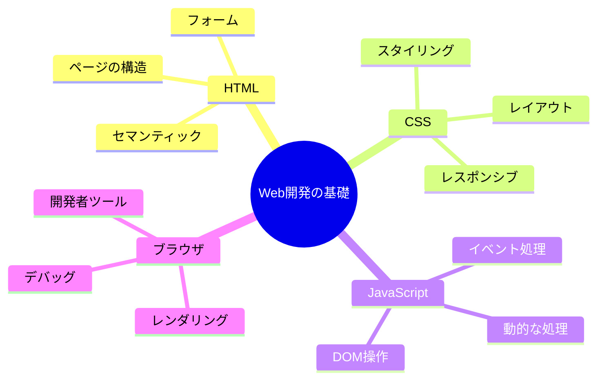

**学習の流れ：**

1. **Webページの仕組み**（20分）
   - クライアント・サーバーモデル
   - HTTP通信
   - URLの構造

2. **HTML**（1-2時間）
   - タグと要素の基本
   - セマンティックHTML
   - フォーム要素

3. **CSS**（2-3時間）
   - セレクタとプロパティ
   - ボックスモデル
   - FlexboxとGrid

4. **JavaScript**（3-4時間）
   - 変数と型
   - 関数
   - DOM操作

5. **実践演習**（1時間）
   - 簡単なWebページを作成

**到達目標：**
- ✅ Webページがどのように表示されるか理解できる
- ✅ HTMLで文書構造を作れる
- ✅ CSSでスタイリングができる
- ✅ JavaScriptで動的な処理を追加できる

---

## 2.1 Webページの仕組み

### Web技術の全体像

まず、Web技術全体がどのように関連しているかを理解しましょう：

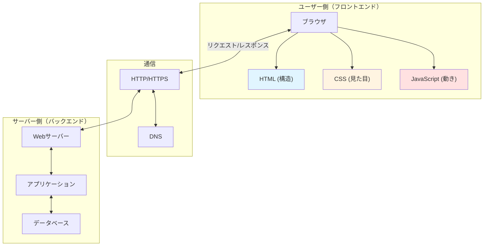

**初心者への補足：**
> 💡 Webページは「3つの言語」で作られています：
> - **HTML** = 家の骨組み（構造）
> - **CSS** = 家の内装（デザイン）
> - **JavaScript** = 家の設備（動く部分）

---

### クライアントとサーバー

Webページを見るとき、実は裏側でこんなやり取りが行われています：

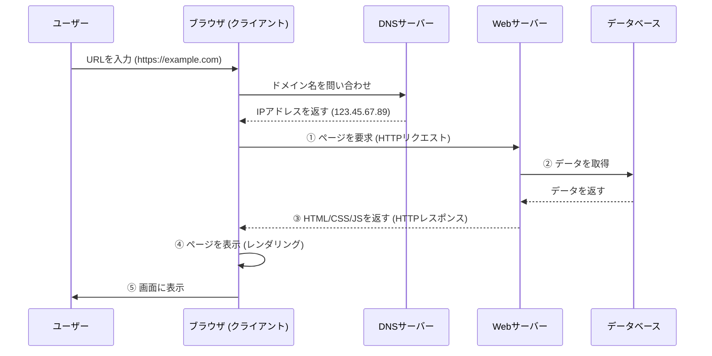

**各ステップの詳細：**

1. **DNS解決**
   ```
   example.com
   ↓
   DNS（電話帳みたいなもの）で検索
   ↓
   123.45.67.89（実際のサーバーの住所）
   ```

2. **HTTPリクエスト送信**
   ```http
   GET /index.html HTTP/1.1
   Host: example.com
   User-Agent: Mozilla/5.0...
   Accept: text/html
   ```

3. **サーバー処理**
   - リクエストを受け取る
   - 必要なデータをデータベースから取得
   - HTMLを生成

4. **HTTPレスポンス返却**
   ```http
   HTTP/1.1 200 OK
   Content-Type: text/html
   Content-Length: 1234
   
   <!DOCTYPE html>
   <html>...</html>
   ```

5. **ブラウザでレンダリング**
   - HTMLを解析（パース）
   - CSSを読み込んでスタイル適用
   - JavaScriptを実行
   - 画面に表示

**用語の説明：**

- **クライアント**: ユーザーが使うブラウザ（Chrome、Safari、Firefoxなど）
- **サーバー**: Webページのデータを保存して送ってくれるコンピューター
- **リクエスト**: クライアントがサーバーに「データください」と頼むこと
- **レスポンス**: サーバーがクライアントにデータを返すこと
- **DNS**: ドメイン名（example.com）をIPアドレス（123.45.67.89）に変換する仕組み
- **レンダリング**: HTMLやCSSを解析して、画面に表示すること

**初心者への補足：**
> 💡 Webページを見るのは、レストランで料理を注文するようなものです：
> 1. あなた（ブラウザ）がメニュー（URL）を見て注文
> 2. 店員（サーバー）が厨房（データベース）に伝える
> 3. 料理（HTML/CSS/JS）ができて運ばれてくる
> 4. あなたが料理を食べる（ブラウザで表示）

---

### HTTPプロトコル

**HTTP**（HyperText Transfer Protocol）は、クライアントとサーバーが会話するときのルールです。

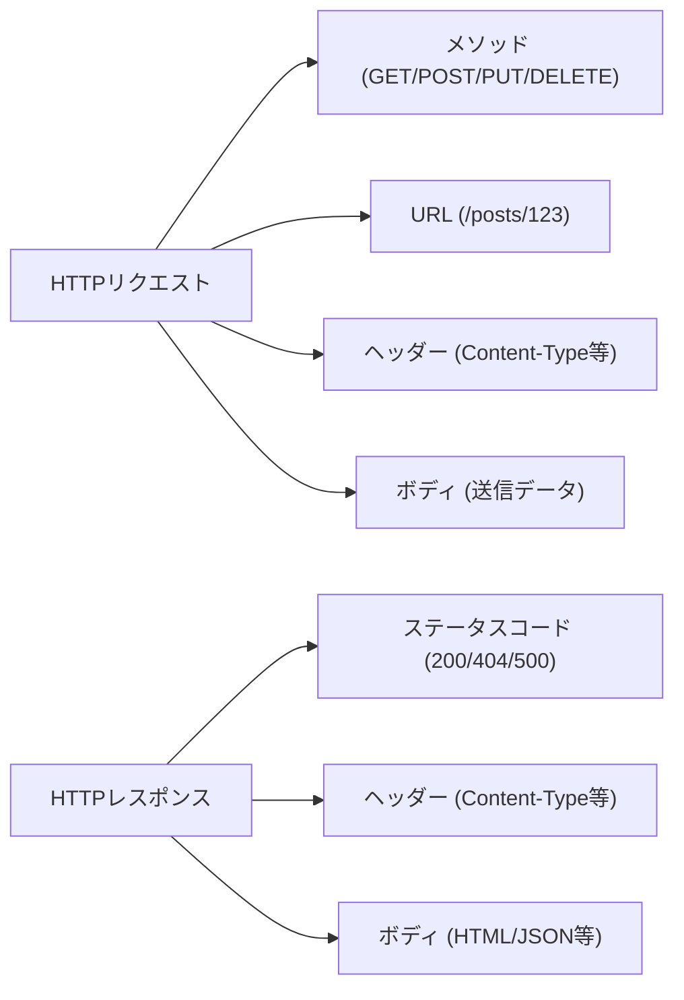

**リクエストの例：**

```http
GET /api/posts/123 HTTP/1.1
Host: example.com
User-Agent: Mozilla/5.0 (Windows NT 10.0; Win64; x64)
Accept: application/json
Authorization: Bearer abc123xyz
```

**各行の意味：**
1. `GET /api/posts/123 HTTP/1.1` - GETメソッドで `/api/posts/123` を取得
2. `Host: example.com` - アクセス先のドメイン
3. `User-Agent: ...` - ブラウザの種類とバージョン
4. `Accept: application/json` - JSON形式のレスポンスが欲しい
5. `Authorization: ...` - 認証トークン（ログイン済み証明）

**レスポンスの例：**

```http
HTTP/1.1 200 OK
Content-Type: application/json
Content-Length: 234
Cache-Control: max-age=3600

{
  "id": 123,
  "title": "練習報告",
  "content": "今日は..."
}
```

**各行の意味：**
1. `HTTP/1.1 200 OK` - リクエスト成功
2. `Content-Type: application/json` - JSONデータを返す
3. `Content-Length: 234` - データサイズは234バイト
4. `Cache-Control: max-age=3600` - 1時間キャッシュしてOK

**主なHTTPメソッド：**

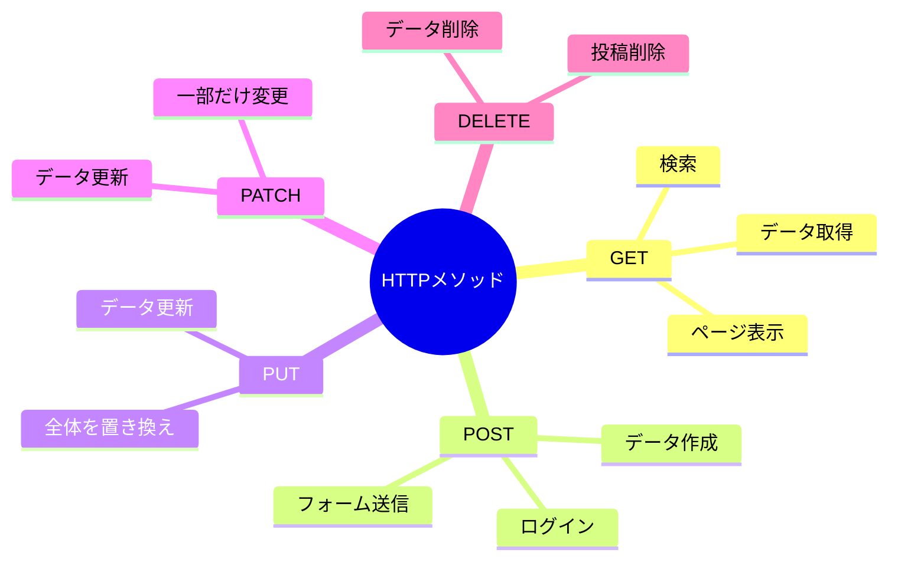

| メソッド | 意味 | 例 | 特徴 |
|---------|------|-----|------|
| GET | データを取得 | ページを表示、投稿一覧取得 | ・URLにパラメータ<br/>・安全（データ変更なし）<br/>・キャッシュ可能 |
| POST | データを送信 | フォームの送信、新規投稿作成 | ・ボディにデータ<br/>・データ作成<br/>・キャッシュ不可 |
| PUT | データを更新 | プロフィール編集、投稿全体を更新 | ・全体を置き換え<br/>・べき等性あり |
| PATCH | データを一部更新 | いいね追加、閲覧数更新 | ・一部だけ変更<br/>・効率的 |
| DELETE | データを削除 | 投稿の削除、コメント削除 | ・データ削除<br/>・べき等性あり |

**実際の使用例：**

```typescript
// GET - 投稿一覧を取得
fetch('/api/posts')
  .then(res => res.json())
  .then(data => console.log(data));
```

**このコードの詳しい説明：**

1. `fetch('/api/posts')` - `/api/posts`にGETリクエストを送信
   - デフォルトでGETメソッドが使われる
   - サーバーに「投稿一覧をください」とお願い

2. `.then(res => res.json())` - レスポンスを受け取る
   - `res`はHTTPレスポンス（サーバーからの返事）
   - `res.json()`でJSON形式のデータに変換
   - Promiseを返すので次の`.then()`に渡される

3. `.then(data => console.log(data))` - データを使う
   - `data`には投稿一覧のデータが入っている
   - `console.log(data)`でコンソールに表示
   - 実際のアプリでは画面に表示する処理を書く

**実行結果のイメージ：**
```javascript
// dataの中身
[
  { id: 1, title: "練習報告", content: "今日は..." },
  { id: 2, title: "ライブ報告", content: "無事終了" }
]
```

---

```typescript
// POST - 新規投稿を作成
fetch('/api/posts', {
  method: 'POST',
  headers: { 'Content-Type': 'application/json' },
  body: JSON.stringify({
    title: '練習報告',
    content: '今日は...'
  })
});
```

**このコードの詳しい説明：**

1. `fetch('/api/posts', { ... })` - 第2引数にオプションを指定
   - `/api/posts`にリクエストを送る
   - `{ ... }`の中に詳細設定を書く

2. `method: 'POST'` - HTTPメソッドをPOSTに指定
   - データを作成したいのでPOSTを使う
   - GETと違い、データをサーバーに送信できる

3. `headers: { 'Content-Type': 'application/json' }` - ヘッダーを設定
   - `Content-Type`は「どんな形式のデータか」を示す
   - `application/json`は「JSON形式です」という意味
   - サーバーがデータを正しく解釈できるようになる

4. `body: JSON.stringify({ ... })` - 送信するデータ
   - `body`にはリクエストの本文（送りたいデータ）を書く
   - JavaScriptのオブジェクト `{ title: ..., content: ... }` を作成
   - `JSON.stringify()`でJSON文字列に変換（必須！）
   - サーバーに送れる形式にする

**なぜJSON.stringify()が必要？**
```javascript
// ❌ これはダメ（オブジェクトのまま）
body: { title: '練習報告' }

// ✅ これが正しい（JSON文字列に変換）
body: JSON.stringify({ title: '練習報告' })
// → '{"title":"練習報告"}' という文字列になる
```

**実行後にサーバーで起こること：**
1. POSTリクエストを受信
2. JSON文字列をパース（解析）
3. データベースに新しい投稿を保存
4. 成功レスポンス（201 Created）を返す

---

```typescript
// PUT - 投稿を更新
fetch('/api/posts/123', {
  method: 'PUT',
  body: JSON.stringify({
    title: '練習報告（更新）',
    content: '今日は...（追記）'
  })
});
```

**このコードの詳しい説明：**

1. `'/api/posts/123'` - 更新したい投稿を指定
   - `123`は投稿のID
   - この投稿を丸ごと置き換える

2. `method: 'PUT'` - 更新のためPUTメソッド
   - リソース全体を置き換える
   - POSTは「作成」、PUTは「更新」

3. `body: JSON.stringify({ ... })` - 新しい内容
   - titleとcontentを両方指定
   - 指定しなかったフィールドは削除される可能性あり

**PUTとPATCHの違い：**
```typescript
// PUT - 全体を置き換え
fetch('/api/posts/123', {
  method: 'PUT',
  body: JSON.stringify({
    title: '新しいタイトル',
    content: '新しい内容',
    // すべてのフィールドを指定する必要がある
  })
});

// PATCH - 一部だけ更新
fetch('/api/posts/123', {
  method: 'PATCH',
  body: JSON.stringify({
    title: '新しいタイトル'
    // titleだけ更新、contentはそのまま
  })
});
```

---

```typescript
// DELETE - 投稿を削除
fetch('/api/posts/123', {
  method: 'DELETE'
});
```

**このコードの詳しい説明：**

1. `'/api/posts/123'` - 削除したい投稿を指定
   - URLのパスで対象を特定
   - `123`は削除する投稿のID

2. `method: 'DELETE'` - DELETEメソッドを指定
   - 削除したいのでDELETEを使う
   - データを送る必要がないので`body`は不要

3. `body`なし - 削除するだけなので送信データ不要
   - URLで削除対象を指定済み
   - 追加情報は必要ない

**実行後にサーバーで起こること：**
1. DELETEリクエストを受信
2. ID=123の投稿をデータベースから削除
3. 成功レスポンス（200 OK または 204 No Content）を返す

**安全な削除の実装例：**
```typescript
// 確認してから削除
if (confirm('本当に削除しますか？')) {
  fetch('/api/posts/123', {
    method: 'DELETE'
  })
  .then(res => {
    if (res.ok) {
      alert('削除しました');
      // 画面から削除した投稿を消す処理
    } else {
      alert('削除に失敗しました');
    }
  });
}
```

**初心者への補足：**
> 💡 HTTPメソッドは「動詞」です：
> - **GET** = 「見せて」（取得）
> - **POST** = 「作って」（作成）
> - **PUT/PATCH** = 「直して」（更新）
> - **DELETE** = 「消して」（削除）

---

**HTTPステータスコード：**

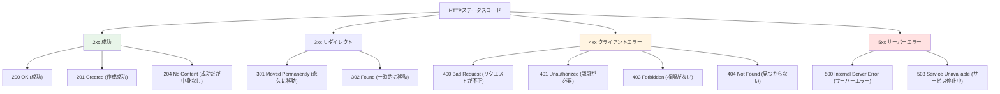

**よくあるステータスコード：**

| コード | 名前 | 意味 | よくある原因 |
|-------|------|------|------------|
| 200 | OK | 成功 | 正常にデータを取得 |
| 201 | Created | 作成成功 | 投稿を作成した |
| 400 | Bad Request | リクエストが不正 | 必須項目が未入力 |
| 401 | Unauthorized | 認証エラー | ログインしていない |
| 403 | Forbidden | 権限エラー | 他人の投稿を削除しようとした |
| 404 | Not Found | 見つからない | 存在しないページ |
| 500 | Internal Server Error | サーバーエラー | プログラムのバグ |

**初心者への補足：**
> 💡 HTTPステータスコードは「店員さんの返事」です：
> - 200 OK = 「かしこまりました！」
> - 404 Not Found = 「その商品はございません」
> - 500 Internal Server Error = 「申し訳ございません、エラーが発生しました」

---

### URLの構造

URLは住所のようなものです：

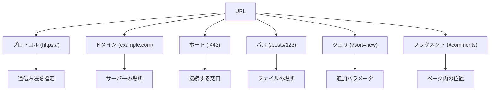

**完全なURLの例：**

```
https://keion-circle-site.vercel.app:443/posts/123?sort=new&filter=practice#comments
  │        │                │         │    │      │                       │
  │        │                │         │    │      │                       └─ フラグメント
  │        │                │         │    │      └───────────────────────── クエリパラメータ
  │        │                │         │    └──────────────────────────────── パス
  │        │                │         └───────────────────────────────────── ポート番号
  │        │                └─────────────────────────────────────────────── ドメイン
  │        └──────────────────────────────────────────────────────────────── サブドメイン
  └───────────────────────────────────────────────────────────────────────── プロトコル
```

**各部分の詳細：**

1. **プロトコル**（https://）
   ```
   http://  - 暗号化なし（平文通信）
   https:// - 暗号化あり（SSL/TLS）← 推奨！
   ```
   
   **httpとhttpsの違い：**
   ```mermaid
   graph LR
       A[HTTP] -->|暗号化なし| B[第三者が盗聴可能]
       C[HTTPS] -->|暗号化あり| D[安全な通信]
       
       style A fill:#ffe1e1
       style C fill:#e8f5e9
   ```

2. **ドメイン**（keion-circle-site.vercel.app）
   ```
   keion-circle-site - サブドメイン（サービス名）
   vercel.app        - ドメイン（会社名）
   ```

3. **ポート番号**（:443）
   ```
   :80  - HTTP のデフォルト
   :443 - HTTPS のデフォルト
   :3000 - 開発環境でよく使う
   ```
   通常は省略可能（デフォルトポートの場合）

4. **パス**（/posts/123）
   ```
   /           - トップページ
   /posts      - 投稿一覧
   /posts/123  - 123番の投稿
   /posts/123/edit - 123番の投稿の編集ページ
   ```

5. **クエリパラメータ**（?sort=new&filter=practice）
   ```
   ?sort=new             - 1つのパラメータ
   ?sort=new&filter=practice - 複数のパラメータ
   
   形式: ?key=value&key=value
   ```
   
   **使用例：**
   ```
   /posts?sort=new          - 新しい順に並べる
   /posts?sort=old          - 古い順に並べる
   /posts?page=2&limit=10   - 2ページ目、10件ずつ
   /search?q=React          - 「React」で検索
   ```

6. **フラグメント**（#comments）
   ```
   #top      - ページの一番上
   #comments - commentsというIDの要素
   #section2 - section2というIDの要素
   ```
   ページ内の特定の位置にスクロール

**URLエンコーディング：**

特殊文字はエンコードする必要があります：

```javascript
// スペースや日本語をエンコード
encodeURIComponent('こんにちは')
// → '%E3%81%93%E3%82%93%E3%81%AB%E3%81%A1%E3%81%AF'

encodeURIComponent('hello world')
// → 'hello%20world'

// 実際の使用例
const query = 'React 入門';
const url = `/search?q=${encodeURIComponent(query)}`;
// → '/search?q=React%20%E5%85%A5%E9%96%80'
```

**初心者への補足：**
> 💡 URLは「住所」です：
> - **プロトコル** = 交通手段（車か電車か）
> - **ドメイン** = 都道府県と市区町村
> - **パス** = 番地と建物名
> - **クエリ** = 部屋番号や追加情報
> - **フラグメント** = 建物内のフロア

---

## 2.2 HTML入門

### HTMLとは

**HTML**（HyperText Markup Language）は、Webページの**構造**を作る言語です。

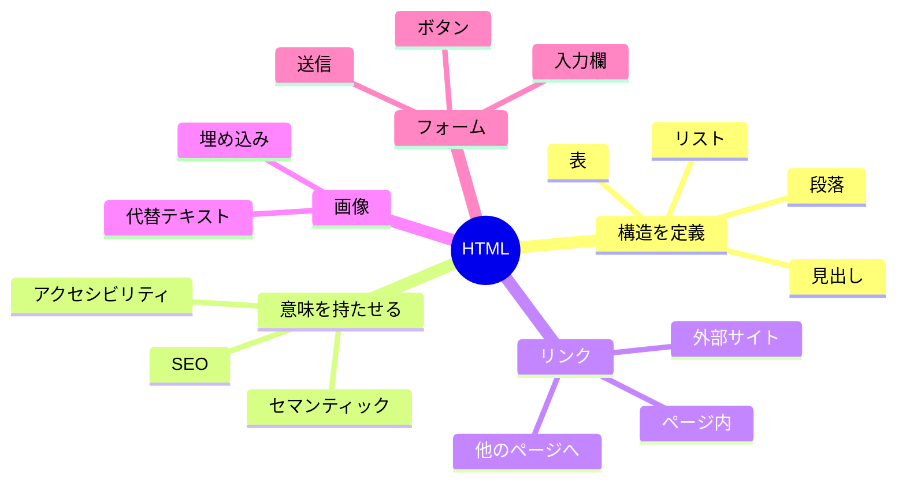

**HTMLの役割：**

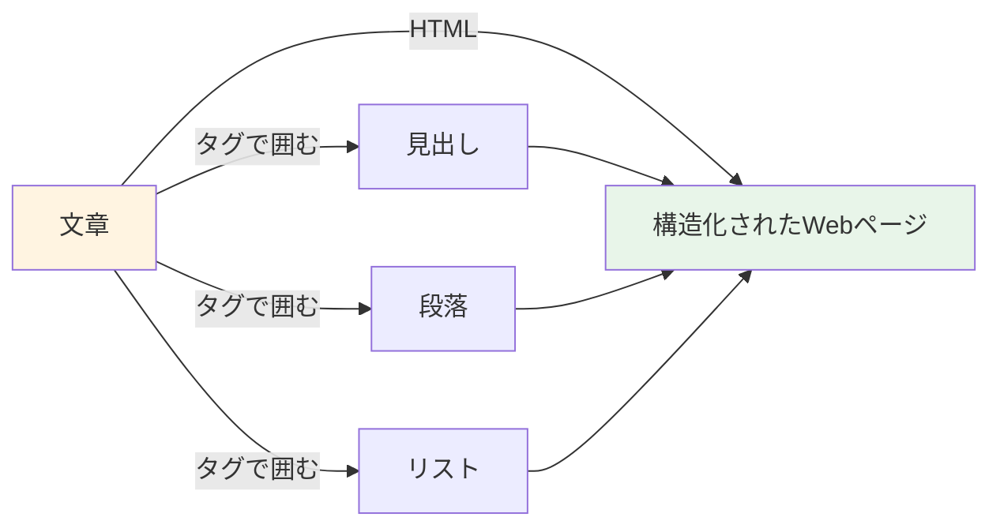

**初心者への補足：**
> 💡 HTMLは「文章の設計図」です。
> - 普通の文章：「軽音サークルの紹介です。メンバー募集中！」
> - HTML：「これは見出し、これは段落、これは強調」と指定する

---

### タグと要素

HTMLは**タグ**で囲んで書きます：

```html
<タグ名>内容</タグ名>
```

**構造の図解：**

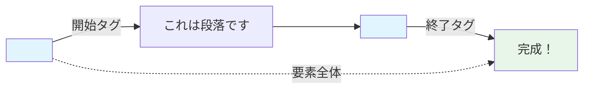

**例：**

```html
<p>これは段落です</p>
```

**各部分の名前：**
- `<p>` - **開始タグ**（ここから段落が始まる）
- `これは段落です` - **内容**（実際に表示される文字）
- `</p>` - **終了タグ**（ここで段落が終わる）
- 全体 - **要素**（タグ + 内容）

**属性を持つ要素：**

```html
<a href="https://example.com" target="_blank">リンク</a>
   │    │                      │
   │    │                      └─ 属性2: 新しいタブで開く
   │    └──────────────────────── 属性1: リンク先URL
   └───────────────────────────── タグ名
```

**属性の書き方：**
```html
<タグ名 属性名="属性値">内容</タグ名>
```

**空要素（終了タグがない）：**

```html
  <!-- 画像 -->
<br>                              <!-- 改行 -->
<hr>                              <!-- 水平線 -->
<input type="text">               <!-- 入力欄 -->
```

**初心者への補足：**
> 💡 タグは「付箋」のようなものです：
> - `<h1>` = 「これは大見出し」という付箋
> - `<p>` = 「これは段落」という付箋
> - `<strong>` = 「ここは重要」という付箋

---

### 基本的なHTMLの構造

すべてのHTMLファイルは、この構造で始まります：

```html
<!DOCTYPE html>                 <!-- ① HTML5を使いますという宣言 -->
<html lang="ja">                <!-- ② HTML文書の開始（日本語） -->
<head>                          <!-- ③ メタ情報（画面に表示されない） -->
  <meta charset="UTF-8">        <!--    文字コード -->
  <meta name="viewport" content="width=device-width, initial-scale=1.0">
  <!--    スマホ対応 -->
  <title>ページタイトル</title> <!--    ブラウザのタブに表示 -->
</head>
<body>                          <!-- ④ 実際に表示される内容 -->
  <h1>こんにちは</h1>
  <p>これはWebページです</p>
</body>
</html>                         <!-- ⑤ HTML文書の終了 -->
```

**構造の図解：**

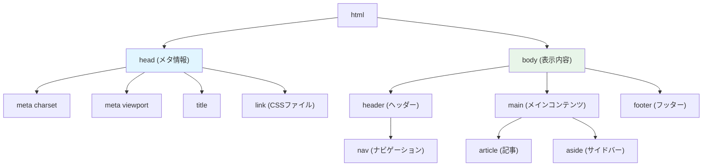

**各部分の役割：**

1. **DOCTYPE宣言**
   ```html
   <!DOCTYPE html>
   ```
   - 「HTML5を使います」という宣言
   - 必ず最初に書く
   - 大文字でも小文字でもOK

2. **html要素**
   ```html
   <html lang="ja">
   ```
   - HTML文書全体を囲む
   - `lang="ja"` = 日本語のページ
   - `lang="en"` = 英語のページ

3. **head要素**（メタ情報）
   ```html
   <head>
     <meta charset="UTF-8">
     <meta name="viewport" content="width=device-width, initial-scale=1.0">
     <meta name="description" content="ページの説明">
     <title>ページタイトル</title>
     <link rel="stylesheet" href="style.css">
   </head>
   ```
   
   - `charset` = 文字エンコーディング（UTF-8推奨）
   - `viewport` = スマホ対応の設定
   - `description` = 検索結果に表示される説明
   - `title` = ブラウザのタブに表示されるタイトル
   - `link` = CSSファイルの読み込み

4. **body要素**（表示内容）
   ```html
   <body>
     <!-- ここに実際に表示される内容を書く -->
   </body>
   ```

**最小限のHTMLファイル：**

```html
<!DOCTYPE html>
<html lang="ja">
<head>
  <meta charset="UTF-8">
  <title>マイページ</title>
</head>
<body>
  <h1>こんにちは！</h1>
</body>
</html>
```

**初心者への補足：**
> 💡 HTMLファイルは「本」の構造に似ています：
> - `<!DOCTYPE html>` = 表紙の「これは本です」という表示
> - `<head>` = 目次（読者には見えない情報）
> - `<body>` = 本文（実際に読む内容）

---

### よく使うHTMLタグ

#### 1. 見出し（h1-h6）

```html
<h1>最も重要な見出し</h1>
<h2>2番目に重要な見出し</h2>
<h3>3番目に重要な見出し</h3>
<h4>4番目に重要な見出し</h4>
<h5>5番目に重要な見出し</h5>
<h6>最も重要度が低い見出し</h6>
```

**階層構造：**

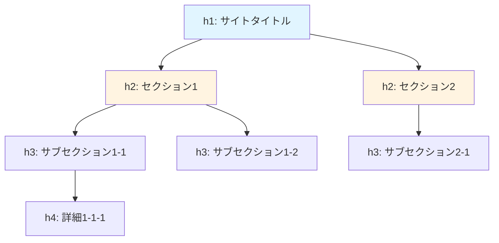

**使い方のルール：**
- `h1` はページに1つだけ（最も重要）
- 順番に使う（h1 → h2 → h3）
- 飛ばさない（h1の次にh3は NG）

**実例：**

```html
<h1>軽音サークル BOLD</h1>
  <h2>活動報告</h2>
    <h3>12月の練習</h3>
    <h3>1月のライブ</h3>
  <h2>メンバー紹介</h2>
    <h3>ギター担当</h3>
    <h3>ベース担当</h3>
```

#### 2. 段落と改行

```html
<p>これは段落です。段落は自動で改行されます。</p>
<p>次の段落です。前の段落との間に余白が入ります。</p>

<p>
  段落内で<br>
  改行したいときは<br>
  brタグを使います
</p>
```

**表示結果イメージ：**
```
これは段落です。段落は自動で改行されます。

次の段落です。前の段落との間に余白が入ります。

段落内で
改行したいときは
brタグを使います
```

#### 3. リスト

**番号なしリスト（ul）：**

```html
<ul>
  <li>ギター</li>
  <li>ベース</li>
  <li>ドラム</li>
</ul>
```

表示：
```
• ギター
• ベース
• ドラム
```

**番号付きリスト（ol）：**

```html
<ol>
  <li>チューニング</li>
  <li>ウォーミングアップ</li>
  <li>練習開始</li>
</ol>
```

表示：
```
1. チューニング
2. ウォーミングアップ
3. 練習開始
```

**入れ子構造：**

```html
<ul>
  <li>楽器
    <ul>
      <li>ギター</li>
      <li>ベース</li>
    </ul>
  </li>
  <li>ボーカル</li>
</ul>
```

表示：
```
• 楽器
  • ギター
  • ベース
• ボーカル
```

#### 4. リンク（a）

```html
<a href="https://example.com">外部サイトへ</a>
<a href="/about">サイト内のページへ</a>
<a href="#section2">ページ内の特定位置へ</a>
<a href="mailto:info@example.com">メール送信</a>
```

**属性：**
- `href` = リンク先のURL
- `target="_blank"` = 新しいタブで開く
- `rel="noopener"` = セキュリティ対策（target="_blank"と一緒に使う）

```html
<a href="https://example.com" target="_blank" rel="noopener">
  外部サイト（新しいタブで開く）
</a>
```

#### 5. 画像（img）

```html

```

**属性：**
- `src` = 画像ファイルのパス（必須）
- `alt` = 代替テキスト（画像が表示されないとき、必須）
- `width` = 幅（ピクセル）
- `height` = 高さ（ピクセル）

```html

```

**パスの指定方法：**

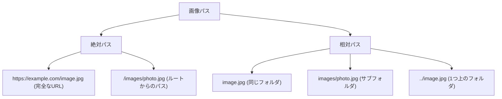

#### 6. 強調

```html
<strong>重要なテキスト</strong>  <!-- 太字、重要 -->
<em>強調したいテキスト</em>      <!-- 斜体、強調 -->
<mark>ハイライト</mark>          <!-- 黄色マーカー -->
```

表示：
- **重要なテキスト**
- *強調したいテキスト*
- <mark>ハイライト</mark>

#### 7. コンテナ要素

```html
<div>ブロックレベルのコンテナ</div>
<span>インラインのコンテナ</span>
```

**違い：**

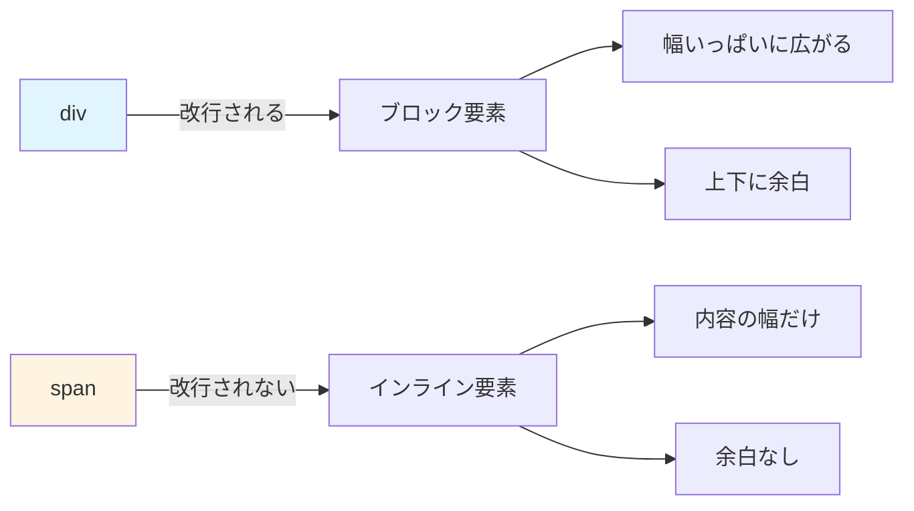

**例：**

```html
<div>これはdivです</div>
<div>これも別のdivです</div>

<span>これはspan</span><span>です</span>
```

表示：
```
これはdivです
これも別のdivです
これはspanです
```

**初心者への補足：**
> 💡 タグの使い分け：
> - **div/span** = 意味なし（デザイン用）
> - **p** = 段落
> - **h1-h6** = 見出し
> - **ul/ol** = リスト
> - **strong/em** = 強調

正しい意味のタグを使うことを「セマンティックHTML」と言います！

---
<html lang="ja">                <!-- HTML文書の始まり。日本語です -->
  <head>                        <!-- ページの情報（表示されない） -->
    <meta charset="UTF-8">      <!-- 文字コードはUTF-8 -->
    <title>ページのタイトル</title>  <!-- ブラウザのタブに表示される -->
  </head>
  <body>                        <!-- ページの本体（表示される） -->
    <h1>見出し</h1>
    <p>本文</p>
  </body>
</html>
```

> 💡 **補足**: `<!-- -->` はコメントです。実行されず、メモとして使います。

### 基本的なタグ一覧

#### 見出し

```html
<h1>一番大きな見出し</h1>
<h2>2番目に大きな見出し</h2>
<h3>3番目に大きな見出し</h3>
<h4>4番目の見出し</h4>
<h5>5番目の見出し</h5>
<h6>一番小さな見出し</h6>
```

表示イメージ：
```
一番大きな見出し          ← h1（最も重要）
  2番目に大きな見出し     ← h2
    3番目に大きな見出し   ← h3
```

#### 段落とテキスト

```html
<p>これは段落です。</p>
<br>                           <!-- 改行 -->
<strong>太字のテキスト</strong>
<em>斜体のテキスト</em>
<u>下線付きテキスト</u>
```

#### リンク

```html
<a href="https://example.com">リンクのテキスト</a>
<a href="https://example.com" target="_blank">新しいタブで開く</a>
```

- `href` - リンク先のURL
- `target="_blank"` - 新しいタブで開く

#### 画像

```html

```

- `src` - 画像のパス
- `alt` - 画像が表示されないときの代替テキスト

#### リスト

**箇条書きリスト（順序なし）：**
```html
<ul>
  <li>項目1</li>
  <li>項目2</li>
  <li>項目3</li>
</ul>
```

**このコードの詳しい説明：**

1. **`<ul>`（Unordered List）**
   - 「順序のないリスト」という意味です
   - リスト全体を囲むタグです
   - ブラウザは各項目の前に「•」（黒丸）を自動で表示します

2. **`<li>`（List Item）**
   - 「リストの項目」という意味です
   - `<ul>` の中に書きます
   - 1つの `<li>` が1つの項目になります

3. **なぜ `<ul>` を使うのか？**
   - 順序が重要でないリストに使います
   - 例：買い物リスト、特徴の一覧、メニュー項目
   - 箇条書きで情報を整理できます

**ブラウザでの表示：**
```
• 項目1
• 項目2
• 項目3
```

**CSSでカスタマイズ例：**
```css
ul {
  list-style-type: square;  /* 四角い記号に変更 */
}
```

表示が以下のように変わります：
```
■ 項目1
■ 項目2
■ 項目3
```

**番号付きリスト（順序あり）：**
```html
<ol>
  <li>最初のステップ</li>
  <li>次のステップ</li>
  <li>最後のステップ</li>
</ol>
```

**このコードの詳しい説明：**

1. **`<ol>`（Ordered List）**
   - 「順序のあるリスト」という意味です
   - ブラウザが自動的に番号（1, 2, 3...）を付けます
   - リスト全体を囲むタグです

2. **`<li>` を使う（`<ul>` と同じ）**
   - `<ol>` の中でも `<li>` タグを使います
   - 書く順番が番号になります

3. **なぜ `<ol>` を使うのか？**
   - **手順や順序が重要**なリストに使います
   - 例：料理のレシピ、説明書、ランキング
   - 番号を自分で書かなくても自動で付きます

**ブラウザでの表示：**
```
1. 最初のステップ
2. 次のステップ
3. 最後のステップ
```

**番号のカスタマイズ例：**
```html
<!-- 10から始める -->
<ol start="10">
  <li>項目A</li>
  <li>項目B</li>
</ol>
```

表示：
```
10. 項目A
11. 項目B
```

**ローマ数字にする：**
```html
<ol type="I">
  <li>第一章</li>
  <li>第二章</li>
</ol>
```

表示：
```
I. 第一章
II. 第二章
```

**初心者への補足：**
> 💡 **`<ul>` と `<ol>` の使い分け：**
> - **順序が重要** → `<ol>` を使う（手順、ランキング）
> - **順序は関係ない** → `<ul>` を使う（特徴、リンク集）
> 
> リストは自動でインデント（字下げ）されるので、見やすくなります！

**ネストされたリスト（入れ子）：**
```html
<ul>
  <li>果物
    <ul>
      <li>りんご</li>
      <li>バナナ</li>
    </ul>
  </li>
  <li>野菜
    <ul>
      <li>にんじん</li>
      <li>トマト</li>
    </ul>
  </li>
</ul>
```

**このコードの詳しい説明：**

1. **ネスト（入れ子）構造**
   - `<li>` の中にさらに `<ul>` を書けます
   - 階層的な情報を表現できます

2. **ブラウザでの表示：**
```
• 果物
  ◦ りんご
  ◦ バナナ
• 野菜
  ◦ にんじん
  ◦ トマト
```

3. **自動インデント**
   - 内側のリストは自動的に右にずれます
   - 記号も変わります（• → ◦ → ▪）

**よくある間違い：**
```html
<!-- ❌ 間違い：</ul> の前に直接 <ul> を書く -->
<ul>
  <ul>
    <li>項目</li>
  </ul>
</ul>

<!-- ✅ 正しい：<li> の中に <ul> を書く -->
<ul>
  <li>親項目
    <ul>
      <li>子項目</li>
    </ul>
  </li>
</ul>
```

#### テーブル（表）

```html
<table>
  <thead>                      <!-- ヘッダー行 -->
    <tr>                       <!-- 行 -->
      <th>名前</th>            <!-- ヘッダーセル -->
      <th>年齢</th>
    </tr>
  </thead>
  <tbody>                      <!-- 本体 -->
    <tr>
      <td>田中</td>            <!-- データセル -->
      <td>25</td>
    </tr>
    <tr>
      <td>佐藤</td>
      <td>30</td>
    </tr>
  </tbody>
</table>
```

**このコードの詳しい説明：**

1. **`<table>`**
   - 表全体を囲むタグです
   - この中に行とセルを書いていきます

2. **`<thead>`（Table Head）**
   - 表のヘッダー部分（見出し行）を表します
   - スクロールしても固定表示するなど、特別な扱いができます

3. **`<tr>`（Table Row）**
   - 表の「行」を表します
   - 1つの `<tr>` が1行になります
   - この中に `<th>` や `<td>` を書きます

4. **`<th>`（Table Header）**
   - 表のヘッダーセル（見出しセル）です
   - ブラウザは自動的に**太字**で**中央揃え**にします
   - 「この列は何のデータか」を示します

5. **`<tbody>`（Table Body）**
   - 表の本体（データ部分）を表します
   - 複数の `<tr>` を含みます

6. **`<td>`（Table Data）**
   - 表のデータセルです
   - 実際のデータを入れます
   - 通常は左揃えで表示されます

**ブラウザでの表示イメージ：**
```
┌──────┬──────┐
│ 名前 │ 年齢 │  ← <th> は太字で中央揃え
├──────┼──────┤
│ 田中 │  25  │  ← <td> は通常フォントで左揃え
│ 佐藤 │  30  │
└──────┴──────┘
```

**なぜこの構造が必要なのか？**

- **`<thead>` と `<tbody>` を分ける理由：**
  - ヘッダーを固定してスクロール可能にできます
  - CSSで見た目を変えやすくなります
  - 印刷時にヘッダーを各ページに表示できます
  - スクリーンリーダー（視覚障害者向け）が理解しやすくなります

**CSSなしの場合：**
```
名前  年齢
田中  25
佐藤  30
```
↑ 線がないので見づらい！

**CSSを追加すると：**
```css
table {
  border-collapse: collapse;  /* 線を重ねて表示 */
}
th, td {
  border: 1px solid #ddd;     /* 1pxの線を追加 */
  padding: 8px;                /* セル内の余白 */
}
th {
  background-color: #f2f2f2;  /* ヘッダーの背景色 */
}
```

表示：
```
┏━━━━━━┳━━━━━━┓
┃ 名前 ┃ 年齢 ┃  ← 背景色がグレー
┣━━━━━━╋━━━━━━┫
┃ 田中 ┃  25  ┃
┃ 佐藤 ┃  30  ┃
┗━━━━━━┻━━━━━━┛
```

**セルの結合（colspan, rowspan）：**
```html
<table>
  <tr>
    <th colspan="2">名前</th>  <!-- 2列分を結合 -->
  </tr>
  <tr>
    <td>姓</td>
    <td>名</td>
  </tr>
</table>
```

表示：
```
┌──────────────┐
│    名前      │  ← 2列分の幅
├──────┬───────┤
│  姓  │  名   │
└──────┴───────┘
```

**初心者への補足：**
> 💡 **表を使うタイミング：**
> - データを比較したい時（価格表、成績表など）
> - 行と列で情報を整理したい時
> - ⚠️ **レイアウト目的では使わない**（昔はよく使われましたが、今はCSSで配置します）

#### フォーム

```html
<form action="/submit" method="POST">
  <!-- テキスト入力 -->
  <input type="text" name="username" placeholder="ユーザー名">
  
  <!-- パスワード入力 -->
  <input type="password" name="password" placeholder="パスワード">
  
  <!-- メール入力 -->
  <input type="email" name="email" placeholder="メールアドレス">
  
  <!-- テキストエリア -->
  <textarea name="message" rows="5"></textarea>
  
  <!-- チェックボックス -->
  <input type="checkbox" name="agree" id="agree">
  <label for="agree">利用規約に同意する</label>
  
  <!-- ラジオボタン -->
  <input type="radio" name="gender" value="male" id="male">
  <label for="male">男性</label>
  <input type="radio" name="gender" value="female" id="female">
  <label for="female">女性</label>
  
  <!-- セレクトボックス -->
  <select name="city">
    <option value="">選択してください</option>
    <option value="tokyo">東京</option>
    <option value="osaka">大阪</option>
  </select>
  
  <!-- 送信ボタン -->
  <button type="submit">送信</button>
</form>
```

**このコードの詳しい説明：**

### 1. `<form>` タグ

```html
<form action="/submit" method="POST">
```

- **`action="/submit"`**
  - 送信ボタンを押したときに、データを送る先のURLです
  - 例：`action="/submit"` → `/submit` というAPIにデータを送信
  
- **`method="POST"`**
  - データの送信方法を指定します
  - **POST**：データを隠して送る（パスワードなど）
  - **GET**：データをURLに含めて送る（検索など）
  
**例：GETの場合**
```
/submit?username=taro&email=taro@example.com
```
↑ URLにデータが表示される（パスワードには不適切！）

**例：POSTの場合**
```
/submit
```
↑ URLにはデータが表示されない（見えない場所で送信される）

### 2. `<input>` タグ - テキスト入力

```html
<input type="text" name="username" placeholder="ユーザー名">
```

- **`type="text"`**
  - 普通の1行テキスト入力欄です
  - 何でも入力できます

- **`name="username"`**
  - このデータの名前です
  - サーバーに送られるときに「username=入力された値」になります
  
- **`placeholder="ユーザー名"`**
  - 入力欄が空のときに表示されるヒントです
  - 入力を始めると消えます

**ブラウザでの表示：**
```
┌─────────────────┐
│ ユーザー名      │  ← グレーの文字（placeholder）
└─────────────────┘
```

入力すると：
```
┌─────────────────┐
│ taro            │  ← 黒い文字（入力された値）
└─────────────────┘
```

### 3. `<input type="password">` - パスワード入力

```html
<input type="password" name="password" placeholder="パスワード">
```

- **`type="password"`**
  - 入力された文字が「●」で隠されます
  - セキュリティのため

**表示：**
```
入力：abc123
表示：●●●●●●
```

### 4. `<input type="email">` - メール入力

```html
<input type="email" name="email" placeholder="メールアドレス">
```

- **`type="email"`**
  - メールアドレス専用の入力欄です
  - スマホでは「@」キーが出やすいキーボードになります
  - 送信時にメール形式をチェックしてくれます

**バリデーション（検証）：**
```html
<!-- ❌ 送信できない -->
<input type="email" value="abc">

<!-- ✅ 送信できる -->
<input type="email" value="abc@example.com">
```

### 5. `<textarea>` - 複数行テキスト

```html
<textarea name="message" rows="5"></textarea>
```

- **`rows="5"`**
  - 5行分の高さにします
  - ユーザーは自由にリサイズできます

**表示：**
```
┌───────────────┐
│               │
│               │
│               │  ← 5行分の高さ
│               │
│               │
└───────────────┘
```

### 6. `<input type="checkbox">` - チェックボックス

```html
<input type="checkbox" name="agree" id="agree">
<label for="agree">利用規約に同意する</label>
```

- **`type="checkbox"`**
  - ☑ チェックボックスを作ります
  - 複数選択可能です

- **`id="agree"` と `<label for="agree">`**
  - `id` と `for` を同じ値にすると、ラベルをクリックしてもチェックできます
  - ユーザーが操作しやすくなります！

**表示：**
```
□ 利用規約に同意する  ← クリックするとチェック
☑ 利用規約に同意する  ← チェック済み
```

**送信されるデータ：**
```
チェックなし → データが送られない
チェックあり → agree=on
```

### 7. `<input type="radio">` - ラジオボタン

```html
<input type="radio" name="gender" value="male" id="male">
<label for="male">男性</label>
<input type="radio" name="gender" value="female" id="female">
<label for="female">女性</label>
```

- **`type="radio"`**
  - ◯ ラジオボタンを作ります
  - **同じ `name` のものは1つしか選べません**

- **`name="gender"`**
  - 同じグループにするために必要です
  - 異なる `name` だと、複数選択できてしまいます

- **`value="male"`**
  - サーバーに送られる値です
  - 選択されたら `gender=male` が送られます

**表示：**
```
◉ 男性  ← 選択中
◯ 女性
```

**よくある間違い：**
```html
<!-- ❌ 間違い：name が違うので両方選べてしまう -->
<input type="radio" name="gender1" value="male">
<input type="radio" name="gender2" value="female">

<!-- ✅ 正しい：name が同じなので1つだけ選べる -->
<input type="radio" name="gender" value="male">
<input type="radio" name="gender" value="female">
```

### 8. `<select>` - セレクトボックス（ドロップダウン）

```html
<select name="city">
  <option value="">選択してください</option>
  <option value="tokyo">東京</option>
  <option value="osaka">大阪</option>
</select>
```

- **`<select>`**
  - ドロップダウンメニューを作ります
  - クリックすると選択肢が開きます

- **`<option value="tokyo">`**
  - 選択肢の1つです
  - `value` がサーバーに送られる値
  - タグの中身（東京）が画面に表示される値

**表示：**
```
┌─────────────────┐
│ 選択してください ▼│  ← クリック前
└─────────────────┘

クリックすると：
┌─────────────────┐
│ 選択してください  │
├─────────────────┤
│ 東京             │  ← 選択肢が開く
│ 大阪             │
└─────────────────┘
```

**送信されるデータ：**
```
「東京」を選択 → city=tokyo
```

### 9. `<button type="submit">` - 送信ボタン

```html
<button type="submit">送信</button>
```

- **`type="submit"`**
  - フォームを送信するボタンです
  - クリックすると `action` で指定したURLにデータが送られます

- **他のtype：**
  - `type="button"` → 送信しない普通のボタン
  - `type="reset"` → フォームの内容をクリア

**送信の流れ：**
```
1. ユーザーが入力する
2. 送信ボタンをクリック
3. ブラウザがデータを集める
   → username=taro
   → password=●●●●
   → email=taro@example.com
4. action="/submit" にPOSTで送信
5. サーバーが処理する
```

**初心者への補足：**
> 💡 **フォームのポイント：**
> - **`name` 属性は必須**：サーバーがデータを識別するために必要
> - **`id` と `for` でラベルと紐付け**：クリックしやすくなる
> - **`type` でバリデーション**：`email` や `url` で自動チェック
> - **`placeholder` でヒント**：何を入力すべきか示す
> 
> フォームは**ユーザーとサーバーをつなぐ重要な要素**です！

#### コンテナ（グループ化）

```html
<!-- div: 汎用的なブロック要素 -->
<div>
  <h2>セクション1</h2>
  <p>内容</p>
</div>

<!-- span: 汎用的なインライン要素 -->
<p>これは<span style="color: red">赤い文字</span>です</p>
```

### セマンティックHTML

**セマンティック**（意味のある）HTMLタグを使うと、文書の構造がより明確になります：

```html
<header>                       <!-- ヘッダー（サイトの上部） -->
  <nav>                        <!-- ナビゲーション（メニュー） -->
    <a href="/">ホーム</a>
    <a href="/about">概要</a>
  </nav>
</header>

<main>                         <!-- メインコンテンツ -->
  <article>                    <!-- 記事 -->
    <h1>記事のタイトル</h1>
    <section>                  <!-- セクション -->
      <h2>セクション1</h2>
      <p>内容...</p>
    </section>
  </article>
  
  <aside>                      <!-- サイドバー -->
    <h3>関連記事</h3>
  </aside>
</main>

<footer>                       <!-- フッター（サイトの下部） -->
  <p>&copy; 2025 サイト名</p>
</footer>
```

**このコードの詳しい説明：**

### 1. `<header>` - ヘッダー

```html
<header>
  <nav>
    <a href="/">ホーム</a>
    <a href="/about">概要</a>
  </nav>
</header>
```

- **役割：サイトやセクションの導入部**
  - サイト全体のヘッダー（ロゴ、ナビゲーション）
  - 記事のヘッダー（タイトル、著者、日付）
  
**視覚的なイメージ：**
```
┌─────────────────────────────┐
│ 🏠 サイト名  [ホーム] [概要] │ ← <header>
├─────────────────────────────┤
│                             │
│   メインコンテンツ           │
│                             │
└─────────────────────────────┘
```

### 2. `<nav>` - ナビゲーション

```html
<nav>
  <a href="/">ホーム</a>
  <a href="/about">概要</a>
  <a href="/contact">お問い合わせ</a>
</nav>
```

- **役割：サイト内のナビゲーションリンク**
  - メインメニュー
  - パンくずリスト
  - 目次

**なぜ `<nav>` を使うのか？**
- スクリーンリーダーが「これはナビゲーションだ」と認識できる
- SEOで検索エンジンがサイト構造を理解しやすくなる
- CSSで簡単にスタイルを当てられる

**`<div>` との違い：**
```html
<!-- ❌ 意味がわからない -->
<div>
  <a href="/">ホーム</a>
  <a href="/about">概要</a>
</div>

<!-- ✅ 「これはナビゲーションだ」とわかる -->
<nav>
  <a href="/">ホーム</a>
  <a href="/about">概要</a>
</nav>
```

### 3. `<main>` - メインコンテンツ

```html
<main>
  <h1>ページのタイトル</h1>
  <p>ページの内容...</p>
</main>
```

- **役割：ページのメインコンテンツ**
  - **1ページに1つだけ**使います
  - ヘッダーやフッター、サイドバーを除いた中心的な内容

**視覚的なイメージ：**
```
┌─────────────────────┐
│ <header> ヘッダー   │
├─────────────────────┤
│ <main>              │ ← ここが主役
│   ページの中心内容  │
│                     │
├─────────────────────┤
│ <footer> フッター   │
└─────────────────────┘
```

**なぜ重要？**
- スクリーンリーダーの「メインコンテンツに飛ぶ」機能が使える
- 検索エンジンが「ここが重要な内容だ」と理解する

### 4. `<article>` - 記事

```html
<article>
  <h1>ブログのタイトル</h1>
  <p>投稿日: 2025年1月1日</p>
  <p>記事の内容...</p>
</article>
```

- **役割：独立したコンテンツ**
  - ブログ記事
  - ニュース記事
  - フォーラムの投稿
  - 商品カード

**「独立した」とは？**
→ **そのまま他の場所に貼り付けても意味が通じるコンテンツ**

**例：ブログ記事一覧**
```html
<main>
  <article>
    <h2>記事1</h2>
    <p>内容1...</p>
  </article>
  
  <article>
    <h2>記事2</h2>
    <p>内容2...</p>
  </article>
</main>
```

↑ 各 `<article>` が独立していて、RSSフィードやシェアが可能

### 5. `<section>` - セクション

```html
<article>
  <h1>完全ガイド</h1>
  
  <section>
    <h2>第1章：基礎知識</h2>
    <p>内容...</p>
  </section>
  
  <section>
    <h2>第2章：応用編</h2>
    <p>内容...</p>
  </section>
</article>
```

- **役割：テーマごとのまとまり**
  - 長い文書を章で分ける
  - ページを意味のある区画に分割

**`<div>` との違い：**
```html
<!-- ❌ 意味がない：ただのグループ化 -->
<div>
  <h2>第1章</h2>
  <p>内容...</p>
</div>

<!-- ✅ 意味がある：「これは1つの章だ」とわかる -->
<section>
  <h2>第1章</h2>
  <p>内容...</p>
</section>
```

**ルール：**
- **`<section>` には見出し（h2, h3など）を入れるべき**
- 見出しがない場合は `<div>` を使う

### 6. `<aside>` - サイドバー・補足情報

```html
<main>
  <article>
    <h1>メイン記事</h1>
    <p>内容...</p>
  </article>
  
  <aside>
    <h3>関連記事</h3>
    <ul>
      <li><a href="/related1">関連記事1</a></li>
      <li><a href="/related2">関連記事2</a></li>
    </ul>
  </aside>
</main>
```

- **役割：メインコンテンツと関連するが、独立した情報**
  - サイドバー
  - 広告
  - 関連リンク
  - 補足説明

**視覚的なイメージ：**
```
┌──────────────┬──────────┐
│              │          │
│   <article>  │ <aside>  │
│   メイン記事 │ サイド   │
│              │ バー     │
│              │          │
└──────────────┴──────────┘
```

### 7. `<footer>` - フッター

```html
<footer>
  <p>&copy; 2025 サイト名</p>
  <nav>
    <a href="/privacy">プライバシーポリシー</a>
    <a href="/terms">利用規約</a>
  </nav>
</footer>
```

- **役割：サイトやセクションの末尾情報**
  - 著作権表示
  - フッターナビゲーション
  - 連絡先
  - ソーシャルメディアリンク

**視覚的なイメージ：**
```
┌─────────────────────────────┐
│                             │
│   メインコンテンツ           │
│                             │
├─────────────────────────────┤
│ © 2025 サイト名             │ ← <footer>
│ [プライバシー] [利用規約]   │
└─────────────────────────────┘
```

---

### セマンティックHTMLの3つの大きな利点

#### 利点1：コードが読みやすい

**セマンティックなし（`<div>` だけ）：**
```html
<div class="header">
  <div class="nav">...</div>
</div>
<div class="main">
  <div class="article">...</div>
  <div class="sidebar">...</div>
</div>
<div class="footer">...</div>
```
↑ 何が何だかわからない...

**セマンティックあり：**
```html
<header>
  <nav>...</nav>
</header>
<main>
  <article>...</article>
  <aside>...</aside>
</main>
<footer>...</footer>
```
↑ 一目でページ構造がわかる！

#### 利点2：SEO（検索エンジン最適化）に有利

検索エンジン（Google など）は、セマンティックタグを理解します：

```html
<!-- Googleがこう理解する -->
<article>      ← 「これは記事だ」
  <h1>タイトル</h1>  ← 「これが一番重要な見出しだ」
  <time>2025-01-01</time>  ← 「この日付に投稿された」
</article>
```

結果：
- 検索結果で上位に表示されやすくなる
- リッチスニペット（日付、評価など）が表示される

#### 利点3：アクセシビリティの向上

**スクリーンリーダー**（視覚障害者向けの読み上げソフト）が、ページ構造を理解できます：

```html
<nav>...</nav>     ← 「ナビゲーション領域です」と読み上げる
<main>...</main>   ← 「メインコンテンツに移動」ショートカットキーが使える
<article>...</article>  ← 「記事です」と伝える
```

**操作例：**
1. ユーザー：「メインコンテンツに飛びたい」
2. スクリーンリーダー：`<main>` を見つけて移動
3. ユーザー：「ナビゲーションを聞きたい」
4. スクリーンリーダー：`<nav>` 内のリンクを読み上げる

---

### セマンティックHTML vs `<div>`

| セマンティックタグ | `<div>` | 使い分け |
|---|---|---|
| 意味がある | 意味がない | 意味のある部分はセマンティックタグ |
| SEOに有利 | SEO効果なし | 重要なコンテンツはセマンティックタグ |
| 読みやすい | classを読まないとわからない | 可読性が重要ならセマンティックタグ |
| アクセシビリティ◎ | 伝わらない | ユーザー配慮ならセマンティックタグ |

**まとめ：**
- **意味のある部分**（ヘッダー、記事など） → セマンティックタグ
- **単なるスタイリング用のグループ化** → `<div>`

**実践例：**
```html
<!-- ✅ 良い例 -->
<article class="card">  ← 「記事」という意味 + スタイル用class
  <h2>タイトル</h2>
  <div class="card-footer">  ← 単なるスタイリング用なのでdivでOK
    <button>読む</button>
  </div>
</article>
```

**初心者への補足：**
> 💡 **セマンティックHTMLの覚え方：**
> - `<header>` - 「ヘッド（頭）」→ 上部
> - `<footer>` - 「フット（足）」→ 下部
> - `<nav>` - 「ナビゲーション」→ メニュー
> - `<main>` - 「メイン」→ 主役
> - `<article>` - 「アーティクル（記事）」→ 独立したコンテンツ
> - `<aside>` - 「アサイド（脇）」→ サイドバー
> - `<section>` - 「セクション（区画）」→ 章やセクション
> 
> 最初は難しいですが、**「これは何の役割か？」を意識**すると自然に使えるようになります！

---

## 2.3 CSS入門

### CSSとは

**CSS**（Cascading Style Sheets）は、Webページの**見た目**（デザイン）を作る言語です。

HTMLが「構造」、CSSが「装飾」を担当します。

```
HTML（構造）        CSS（装飾）           結果
<h1>見出し</h1>  +  色: 青            =  青い大きな見出し
                   サイズ: 大きく
                   太字
```

**例で理解する：**

```html
<!-- HTMLだけ -->
<h1>ようこそ</h1>
```
表示：
```
ようこそ  ← ただの大きな黒文字
```

```html
<!-- HTML + CSS -->
<h1 style="color: blue; font-size: 48px;">ようこそ</h1>
```
表示：
```
ようこそ  ← 青い、さらに大きい文字
```

**CSSでできること：**
- 文字の色・サイズ・フォントを変更
- 背景色や背景画像を設定
- 要素の配置やレイアウト
- アニメーション効果
- レスポンシブデザイン（スマホ・PC対応）

### CSSの書き方

CSSは以下の形式で書きます：

```css
セレクタ {
  プロパティ: 値;
  プロパティ: 値;
}
```

**各部分の説明：**

```css
h1 {              ← セレクタ（どの要素にスタイルを当てるか）
  color: blue;    ← プロパティ（何を変えるか）: 値（どう変えるか）;
  font-size: 32px;
}                 ← 中括弧で囲む
```

**このコードの詳しい説明：**

1. **`h1`（セレクタ）**
   - 「すべての `<h1>` タグ」を選択します
   - このスタイルは、ページ内のすべての `<h1>` に適用されます

2. **`color: blue;`（プロパティと値）**
   - `color` = プロパティ（文字色を変える）
   - `blue` = 値（青色にする）
   - `;` = セミコロンで終わる（必須！）

3. **`font-size: 32px;`**
   - `font-size` = プロパティ（文字サイズを変える）
   - `32px` = 値（32ピクセルにする）

**実際の適用例：**

```html
<h1>これは見出しです</h1>
<p>これは段落です</p>
<h1>もう1つの見出し</h1>
```

CSSを適用：
```css
h1 {
  color: blue;
  font-size: 32px;
  font-weight: bold;
}
```

結果：
```
これは見出しです        ← 青い、32px、太字
これは段落です          ← スタイルなし（黒、普通サイズ）
もう1つの見出し        ← 青い、32px、太字
```

**コメントの書き方：**
```css
/* これはコメントです。実行されません */
h1 {
  color: blue;  /* この行だけのコメント */
}
```

### CSSの適用方法

#### 1. インラインスタイル（直接書く）

```html
<p style="color: red; font-size: 20px;">赤い文字</p>
```

**このコードの詳しい説明：**

- **`style` 属性**
  - HTMLタグに直接CSSを書きます
  - `style="プロパティ: 値; プロパティ: 値;"`

- **デメリット：**
  - 同じスタイルを何度も書かないといけない
  - 管理が大変（変更したいときに全部書き換え）
  - HTMLとCSSが混ざって読みづらい

**例：同じスタイルを何度も書く必要がある**
```html
<p style="color: red; font-size: 20px;">段落1</p>
<p style="color: red; font-size: 20px;">段落2</p>
<p style="color: red; font-size: 20px;">段落3</p>
```
↑ 非効率！

> ⚠️ **注意**: 管理が大変なので、**あまり使わないほうが良いです**。

**使うべきタイミング：**
- メールHTMLを書くとき（メールクライアントは外部CSSを読めないことがある）
- JavaScriptで動的にスタイルを変更するとき

#### 2. 内部スタイルシート（`<style>`タグ）

```html
<head>
  <style>
    p {
      color: red;
      font-size: 20px;
    }
  </style>
</head>
<body>
  <p>赤い文字</p>
  <p>これも赤い文字</p>
</body>
```

**このコードの詳しい説明：**

1. **`<head>` の中に `<style>` タグ**
   - HTMLファイルの `<head>` セクションに書きます
   - `<body>` の前に書くことで、ページ読み込み時にスタイルが適用されます

2. **`p { ... }`**
   - ページ内のすべての `<p>` タグに適用されます
   - 1回書くだけで、すべての段落に同じスタイルが当たります

**メリット：**
- HTMLとCSSが同じファイルにある（小さいプロジェクトで便利）
- インラインより管理しやすい

**デメリット：**
- 複数のHTMLファイルでスタイルを共有できない
- ファイルが大きくなると読みづらい

**使うべきタイミング：**
- 1ページだけの小さなサイト
- そのページだけの特別なスタイル

#### 3. 外部スタイルシート（**推奨**）

**style.css:**
```css
p {
  color: red;
  font-size: 20px;
}

h1 {
  color: blue;
  font-size: 32px;
}
```

**index.html:**
```html
<head>
  <link rel="stylesheet" href="style.css">
</head>
<body>
  <h1>見出し</h1>
  <p>赤い文字</p>
</body>
```

**このコードの詳しい説明：**

1. **別ファイルにCSSを書く**
   - `style.css` という別ファイルにすべてのCSSを書きます
   - `.css` という拡張子を使います

2. **`<link>` タグで読み込む**
   ```html
   <link rel="stylesheet" href="style.css">
   ```
   - `rel="stylesheet"` → 「これはスタイルシートです」と宣言
   - `href="style.css"` → CSSファイルのパス

3. **複数ページで共有できる**
   ```
   index.html     ← style.cssを読み込む
   about.html     ← style.cssを読み込む
   contact.html   ← style.cssを読み込む
   style.css      ← すべてのページに適用される
   ```

**メリット：**
- **複数のHTMLファイルで共有できる**（1回変更すれば全ページに反映）
- HTMLとCSSが分離される（読みやすい、管理しやすい）
- ブラウザがCSSをキャッシュする（2回目以降の読み込みが速い）

**実際のプロジェクト構造：**
```
my-website/
├── index.html
├── about.html
├── css/
│   ├── style.css     ← メインのCSS
│   └── reset.css     ← ブラウザのデフォルトスタイルをリセット
└── images/
    └── logo.png
```

**index.html:**
```html
<head>
  <link rel="stylesheet" href="css/reset.css">
  <link rel="stylesheet" href="css/style.css">
</head>
```

> 💡 **ベストプラクティス**: **外部スタイルシート（方法3）を使いましょう**。チーム開発や大きなプロジェクトでは必須です。

**3つの方法の比較表：**

| 方法 | メリット | デメリット | 使うべきタイミング |
|---|---|---|---|
| **インライン** | 簡単 | 管理大変、再利用不可 | メールHTML、動的変更 |
| **内部** | HTMLと同じファイル | ファイル間で共有不可 | 1ページのみのサイト |
| **外部（推奨）** | 再利用可能、管理楽 | ファイルが増える | ほぼすべての場合 |

### セレクタ

セレクタは「どの要素にスタイルを適用するか」を指定します。

#### 要素セレクタ

```css
p {
  color: blue;
}
/* すべての<p>タグに適用 */
```

**このコードの詳しい説明：**

- **要素名をそのまま書く**
  - `p` → すべての `<p>` タグ
  - `h1` → すべての `<h1>` タグ
  - `div` → すべての `<div>` タグ

**HTMLとの対応：**
```html
<p>これは青くなる</p>
<div>これは青くならない</div>
<p>これも青くなる</p>
```

結果：
```
これは青くなる     ← 青
これは青くならない ← 黒（divなので対象外）
これも青くなる     ← 青
```

**複数の要素に同じスタイル：**
```css
h1, h2, h3 {
  color: blue;
}
/* h1, h2, h3すべてに適用 */
```

#### クラスセレクタ

```css
.button {
  background-color: blue;
  color: white;
  padding: 10px 20px;
  border-radius: 5px;
}
/* class="button" の要素に適用 */
```

```html
<button class="button">クリック</button>
<a class="button">リンク</a>
<div class="button">ボックス</div>
```

**このコードの詳しい説明：**

1. **`.` (ドット) で始める**
   - CSSでは `.button` と書きます
   - HTMLでは `class="button"` と書きます

2. **どの要素にも使える**
   - `<button>`, `<a>`, `<div>` など、どんなタグでもOK
   - 同じクラス名を何度でも使えます

3. **複数のクラスを指定**
   ```html
   <button class="button primary">送信</button>
   ```
   ↑ `button` と `primary` の両方のスタイルが適用される

   ```css
   .button {
     padding: 10px 20px;
   }
   .primary {
     background-color: blue;
   }
   ```

**クラス名の命名規則：**
```css
/* ✅ 良い名前：意味が分かる */
.button { }
.card { }
.header { }
.nav-menu { }

/* ❌ 悪い名前：意味不明 */
.a { }
.box1 { }
.red-text { }  ← 色を変えたくなったとき困る
```

> 💡 **補足**: クラスは**何度でも使えます**。複数の要素に同じスタイルを適用したいときに便利！

#### IDセレクタ

```css
#header {
  background-color: gray;
  height: 60px;
}
/* id="header" の要素に適用 */
```

```html
<header id="header">ヘッダー</header>
```

**このコードの詳しい説明：**

1. **`#` (ハッシュ) で始める**
   - CSSでは `#header` と書きます
   - HTMLでは `id="header"` と書きます

2. **1ページに1つだけ**
   - 同じIDを複数の要素に使ってはいけません
   - ユニーク（一意）な要素に使います

**IDとクラスの使い分け：**

```html
<!-- ✅ 正しい使い方 -->
<header id="header">...</header>  <!-- ページに1つだけ -->
<footer id="footer">...</footer>  <!-- ページに1つだけ -->

<div class="card">...</div>       <!-- 何度でもOK -->
<div class="card">...</div>
<div class="card">...</div>

<!-- ❌ 間違い：IDを2回使っている -->
<div id="main">...</div>
<div id="main">...</div>  ← エラー！
```

**クラスとIDの比較表：**

| | クラス `.class` | ID `#id` |
|---|---|---|
| HTML | `class="button"` | `id="header"` |
| CSS | `.button { }` | `#header { }` |
| 使用回数 | 何度でもOK | 1ページに1つだけ |
| 優先度 | 低い | 高い |
| 使うとき | 繰り返し使うスタイル | ページ内リンク、一意の要素 |

> 💡 **ベストプラクティス**: **基本的にはクラスを使う**。IDはJavaScriptで要素を取得するときや、ページ内リンク（`#section1`）に使うのが一般的です。

#### 子孫セレクタ

```css
.container p {
  color: red;
}
/* .containerの中の<p>に適用 */
```

```html
<div class="container">
  <p>赤くなる</p>
  <div>
    <p>これも赤くなる（入れ子でもOK）</p>
  </div>
</div>
<p>赤くならない（.containerの外）</p>
```

**このコードの詳しい説明：**

1. **スペースで区切る**
   - `.container p` → `.container` の中にある `<p>`
   - 直接の子でなくてもOK（孫、ひ孫も含む）

2. **特定の場所だけにスタイルを当てる**
   - サイドバー内の段落だけ小さくする
   - ヘッダー内のリンクだけ白くする

**実用例：**
```css
/* ナビゲーション内のリンクだけスタイルを変える */
.nav a {
  color: white;
  text-decoration: none;
}

/* サイドバー内の見出しだけ小さくする */
.sidebar h3 {
  font-size: 18px;
  color: gray;
}
```

#### 子セレクタ（直接の子のみ）

```css
.container > p {
  color: red;
}
/* .containerの直接の子の<p>だけに適用 */
```

```html
<div class="container">
  <p>赤くなる（直接の子）</p>
  <div>
    <p>赤くならない（孫なので対象外）</p>
  </div>
</div>
```

**子孫セレクタとの違い：**
```css
/* 子孫セレクタ（すべて） */
.container p { }  ← 子、孫、ひ孫すべて

/* 子セレクタ（直接の子のみ） */
.container > p { }  ← 直接の子だけ
```

#### 隣接セレクタ

```css
h2 + p {
  font-weight: bold;
}
/* h2の直後の<p>だけに適用 */
```

```html
<h2>見出し</h2>
<p>太字になる（h2の直後）</p>
<p>太字にならない（2番目なので対象外）</p>
```

**使用例：**
- 見出しの直後の段落を大きくする
- 最初の段落だけドロップキャップ（大きな頭文字）にする

#### 擬似クラス

```css
a:hover {
  color: red;
}
/* リンクにマウスを乗せたとき */

button:active {
  background-color: gray;
}
/* ボタンをクリックしたとき */

input:focus {
  border-color: blue;
}
/* 入力欄にフォーカスしたとき */
```

**このコードの詳しい説明：**

1. **`:hover` - マウスが乗ったとき**
   ```css
   a:hover {
     color: red;
     text-decoration: underline;
   }
   ```
   - ユーザーがマウスをリンクに乗せたときだけ適用
   - インタラクティブな体験を提供

2. **`:active` - クリックしたとき**
   ```css
   button:active {
     background-color: darkblue;
     transform: scale(0.95);  /* 少し小さくする */
   }
   ```
   - マウスボタンを押している間だけ適用
   - 「押している」感を出せる

3. **`:focus` - フォーカスされたとき**
   ```css
   input:focus {
     border-color: blue;
     outline: 2px solid lightblue;
   }
   ```
   - 入力欄をクリックしたときやTabキーで選択されたとき
   - 「今ここに入力できる」と視覚的に示す

**その他の便利な擬似クラス：**

```css
/* 最初の子要素 */
li:first-child {
  font-weight: bold;
}

/* 最後の子要素 */
li:last-child {
  border-bottom: none;
}

/* n番目の子要素 */
li:nth-child(2) {
  color: red;  /* 2番目だけ */
}

/* 偶数番目 */
tr:nth-child(even) {
  background-color: #f0f0f0;  /* ゼブラストライプ */
}

/* 奇数番目 */
tr:nth-child(odd) {
  background-color: white;
}
```

**実用例：リストのスタイリング**
```css
ul li {
  padding: 10px;
  border-bottom: 1px solid #ddd;
}

ul li:last-child {
  border-bottom: none;  /* 最後の項目は線なし */
}

ul li:hover {
  background-color: #f5f5f5;  /* マウスを乗せたらハイライト */
}
```

結果：
```
項目1            ← マウスを乗せると背景色変化
──────────────
項目2
──────────────
項目3            ← 線なし
```

#### 属性セレクタ

```css
/* type属性がtextのinput */
input[type="text"] {
  border: 1px solid blue;
}

/* href属性が.pdfで終わるリンク */
a[href$=".pdf"] {
  color: red;
}

/* title属性を持つ要素 */
[title] {
  cursor: help;
}
```

**初心者への補足：**
> 💡 **セレクタの使い分け：**
> - **要素セレクタ** → すべての要素に共通のスタイル（`p { }`, `h1 { }`）
> - **クラスセレクタ** → 繰り返し使うスタイル（`.button { }`）
> - **IDセレクタ** → 1つだけの特別な要素（`#header { }`）
> - **子孫セレクタ** → 特定の場所だけ（`.nav a { }`）
> - **擬似クラス** → 状態に応じたスタイル（`:hover`, `:focus`）
> 
> 基本は「クラス」を中心に使い、必要に応じて他を組み合わせます！

### プロパティと値

#### 色

```css
.element {
  color: red;                    /* 文字色 */
  background-color: blue;        /* 背景色 */
}
```

**色の指定方法：**

```css
/* 色名 */
color: red;
color: blue;
color: white;

/* 16進数 */
color: #FF0000;    /* 赤 */
color: #0000FF;    /* 青 */
color: #FFFFFF;    /* 白 */

/* RGB */
color: rgb(255, 0, 0);     /* 赤 */
color: rgba(255, 0, 0, 0.5); /* 半透明の赤 */
```

#### テキスト

```css
.text {
  font-size: 16px;              /* 文字サイズ */
  font-weight: bold;            /* 太字 */
  font-family: Arial, sans-serif; /* フォント */
  text-align: center;           /* 中央揃え */
  text-decoration: underline;   /* 下線 */
  line-height: 1.5;            /* 行の高さ */
  letter-spacing: 2px;         /* 文字間隔 */
}
```

#### サイズ

```css
.box {
  width: 200px;                 /* 幅 */
  height: 100px;                /* 高さ */
  max-width: 500px;             /* 最大幅 */
  min-height: 50px;             /* 最小高さ */
}
```

**単位：**
- `px` - ピクセル（固定サイズ）
- `%` - パーセント（親要素に対する割合）
- `em` - 親要素のフォントサイズに対する倍率
- `rem` - ルート要素のフォントサイズに対する倍率
- `vh` - ビューポート（画面）の高さに対する割合
- `vw` - ビューポートの幅に対する割合

### ボックスモデル

すべてのHTML要素は「箱」として扱われます：

```
┌─────────────────────────────────┐
│         margin（外側の余白）       │
│  ┌───────────────────────────┐  │
│  │   border（枠線）            │  │
│  │  ┌─────────────────────┐  │  │
│  │  │ padding（内側の余白） │  │  │
│  │  │  ┌───────────────┐  │  │  │
│  │  │  │   content    │  │  │  │
│  │  │  │  （内容）     │  │  │  │
│  │  │  └───────────────┘  │  │  │
│  │  └─────────────────────┘  │  │
│  └───────────────────────────┘  │
└─────────────────────────────────┘
```

```css
.box {
  /* 内容のサイズ */
  width: 200px;
  height: 100px;
  
  /* 内側の余白 */
  padding: 20px;                 /* 全方向 */
  padding-top: 10px;            /* 上だけ */
  padding-right: 15px;          /* 右だけ */
  padding-bottom: 10px;         /* 下だけ */
  padding-left: 15px;           /* 左だけ */
  padding: 10px 20px;           /* 上下 左右 */
  padding: 10px 15px 20px 15px; /* 上 右 下 左 */
  
  /* 枠線 */
  border: 2px solid black;      /* 太さ スタイル 色 */
  border-radius: 10px;          /* 角を丸く */
  
  /* 外側の余白 */
  margin: 20px;                 /* paddingと同じ指定方法 */
  margin: 0 auto;               /* 左右中央揃え */
}
```

### レイアウト

#### Display

```css
.element {
  display: block;        /* ブロック要素（縦に並ぶ） */
  display: inline;       /* インライン要素（横に並ぶ） */
  display: inline-block; /* 両方の特徴を持つ */
  display: none;         /* 非表示 */
}
```

#### Position

```css
.element {
  position: static;      /* デフォルト（通常配置） */
  position: relative;    /* 相対位置 */
  position: absolute;    /* 絶対位置 */
  position: fixed;       /* 固定位置（スクロールしても動かない） */
  position: sticky;      /* スクロール時に固定 */
  
  /* 位置の指定 */
  top: 10px;
  right: 20px;
  bottom: 10px;
  left: 20px;
}
```

#### Flexbox（重要！）

Flexboxは要素を柔軟に配置するための仕組みです：

```css
.container {
  display: flex;                  /* Flexboxを有効化 */
  
  /* 主軸の方向 */
  flex-direction: row;            /* 横並び（デフォルト） */
  flex-direction: column;         /* 縦並び */
  
  /* 主軸の配置 */
  justify-content: flex-start;    /* 左揃え */
  justify-content: center;        /* 中央揃え */
  justify-content: flex-end;      /* 右揃え */
  justify-content: space-between; /* 両端揃え */
  justify-content: space-around;  /* 均等配置 */
  
  /* 交差軸の配置 */
  align-items: flex-start;        /* 上揃え */
  align-items: center;            /* 中央揃え */
  align-items: flex-end;          /* 下揃え */
  align-items: stretch;           /* 伸ばす */
  
  /* 折り返し */
  flex-wrap: nowrap;              /* 折り返さない */
  flex-wrap: wrap;                /* 折り返す */
  
  /* 間隔 */
  gap: 10px;                      /* アイテム間の間隔 */
}

.item {
  flex: 1;                        /* 均等に伸縮 */
  flex-shrink: 0;                 /* 縮小しない */
}
```

**Flexboxの例：**

```html
<div class="container">
  <div class="item">アイテム1</div>
  <div class="item">アイテム2</div>
  <div class="item">アイテム3</div>
</div>
```

```css
.container {
  display: flex;
  justify-content: space-between;
  align-items: center;
  gap: 20px;
}
```

表示イメージ：
```
┌────────────────────────────────────┐
│ [アイテム1]  [アイテム2]  [アイテム3] │
└────────────────────────────────────┘
```

#### Grid

Gridは2次元のレイアウトを作るための仕組みです：

```css
.container {
  display: grid;
  
  /* 列の定義 */
  grid-template-columns: 1fr 1fr 1fr;  /* 3列（均等） */
  grid-template-columns: 200px 1fr;    /* 固定幅と可変幅 */
  grid-template-columns: repeat(3, 1fr); /* 3列を繰り返し */
  
  /* 行の定義 */
  grid-template-rows: 100px 200px;
  
  /* 間隔 */
  gap: 20px;                           /* 行と列の間隔 */
  row-gap: 10px;                       /* 行の間隔 */
  column-gap: 20px;                    /* 列の間隔 */
}

.item {
  /* アイテムの配置 */
  grid-column: 1 / 3;                  /* 1列目から3列目まで */
  grid-row: 1 / 2;                     /* 1行目から2行目まで */
}
```

**Gridの例：**

```css
.grid {
  display: grid;
  grid-template-columns: repeat(3, 1fr);
  gap: 10px;
}
```

表示イメージ：
```
┌─────┬─────┬─────┐
│  1  │  2  │  3  │
├─────┼─────┼─────┤
│  4  │  5  │  6  │
└─────┴─────┴─────┘
```

### レスポンシブデザイン

画面サイズに応じてスタイルを変更します：

```css
/* スマートフォン（デフォルト） */
.container {
  width: 100%;
  padding: 10px;
}

/* タブレット以上 */
@media (min-width: 768px) {
  .container {
    width: 750px;
    padding: 20px;
  }
}

/* デスクトップ以上 */
@media (min-width: 1024px) {
  .container {
    width: 1000px;
    padding: 30px;
  }
}
```

---

## 2.4 JavaScript入門

### JavaScriptとは

**JavaScript**は、Webページに**動き**や**インタラクション**（ユーザーとのやり取り）を付ける言語です。

```
HTML（構造） + CSS（装飾） + JavaScript（動き） = 動的なWebページ
```

**JavaScriptでできること：**
- ボタンをクリックしたときの処理
- フォームの入力チェック
- アニメーション
- サーバーとのデータのやり取り
- ページの内容を動的に変更

### JavaScriptの書き方

#### 1. インラインスクリプト

```html
<button onclick="alert('クリックされました！')">クリック</button>
```

#### 2. 内部スクリプト

```html
<script>
  console.log('Hello, JavaScript!');
</script>
```

#### 3. 外部スクリプト（推奨）

**script.js:**
```javascript
console.log('Hello, JavaScript!');
```

**index.html:**
```html
<script src="script.js"></script>
```

### 変数と定数

変数はデータを入れる「箱」です。

#### let（変数）

```javascript
let name = '田中';        // 文字列
let age = 25;             // 数値
let isStudent = true;     // 真偽値

// 後から変更できる
name = '佐藤';
age = 26;
```

#### const（定数）

```javascript
const PI = 3.14;          // 定数（変更できない）
const siteName = 'BOLD軽音';

// エラー！変更できない
// PI = 3.15;
```

#### var（古い書き方）

```javascript
var oldWay = 'これは古い書き方';
// 今はletとconstを使います
```

> 💡 **使い分け**: 基本的に`const`を使い、変更が必要なときだけ`let`を使います。

### データ型

#### 文字列（String）

```javascript
const str1 = 'シングルクォート';
const str2 = "ダブルクォート";
const str3 = `バッククォート（テンプレートリテラル）`;

// 文字列の結合
const firstName = '太郎';
const lastName = '山田';
const fullName = lastName + firstName;  // '山田太郎'

// テンプレートリテラル（便利！）
const greeting = `こんにちは、${fullName}さん`;  // 'こんにちは、山田太郎さん'
```

#### 数値（Number）

```javascript
const integer = 10;        // 整数
const float = 3.14;        // 小数
const negative = -5;       // 負の数

// 計算
const sum = 10 + 5;        // 15（足し算）
const diff = 10 - 5;       // 5（引き算）
const product = 10 * 5;    // 50（掛け算）
const quotient = 10 / 5;   // 2（割り算）
const remainder = 10 % 3;  // 1（余り）
```

#### 真偽値（Boolean）

```javascript
const isTrue = true;
const isFalse = false;

// 比較演算子
const isEqual = 10 === 10;        // true（等しい）
const isNotEqual = 10 !== 5;      // true（等しくない）
const isGreater = 10 > 5;         // true（より大きい）
const isLess = 10 < 5;            // false（より小さい）
const isGreaterOrEqual = 10 >= 10; // true（以上）
const isLessOrEqual = 10 <= 5;    // false（以下）
```

> ⚠️ **注意**: `===`（厳密等価）を使い、`==`（等価）は避けましょう。

#### null と undefined

```javascript
let empty = null;          // 明示的に「空」
let notDefined;            // undefined（未定義）

console.log(notDefined);   // undefined
```

### 演算子

#### 算術演算子

```javascript
const a = 10;
const b = 3;

console.log(a + b);   // 13（加算）
console.log(a - b);   // 7（減算）
console.log(a * b);   // 30（乗算）
console.log(a / b);   // 3.333...（除算）
console.log(a % b);   // 1（剰余）
console.log(a ** b);  // 1000（べき乗）

// インクリメント・デクリメント
let count = 0;
count++;              // count = count + 1
count--;              // count = count - 1
```

#### 代入演算子

```javascript
let x = 10;

x += 5;   // x = x + 5  → 15
x -= 3;   // x = x - 3  → 12
x *= 2;   // x = x * 2  → 24
x /= 4;   // x = x / 4  → 6
```

#### 論理演算子

```javascript
const a = true;
const b = false;

console.log(a && b);  // false（AND：両方true）
console.log(a || b);  // true（OR：どちらかtrue）
console.log(!a);      // false（NOT：反転）
```

### 条件分岐

#### if文

```javascript
const age = 20;

if (age >= 20) {
  console.log('成人です');
} else if (age >= 13) {
  console.log('未成年です');
} else {
  console.log('子供です');
}
```

#### 三項演算子

```javascript
const age = 20;
const message = age >= 20 ? '成人' : '未成年';
console.log(message);  // '成人'
```

#### switch文

```javascript
const day = '月曜日';

switch (day) {
  case '月曜日':
    console.log('週の始まり');
    break;
  case '金曜日':
    console.log('週末が近い！');
    break;
  case '土曜日':
  case '日曜日':
    console.log('週末です');
    break;
  default:
    console.log('平日です');
}
```

### ループ

#### for文

```javascript
// 0から4まで繰り返し
for (let i = 0; i < 5; i++) {
  console.log(i);  // 0, 1, 2, 3, 4
}
```

#### while文

```javascript
let count = 0;

while (count < 5) {
  console.log(count);
  count++;
}
```

#### do...while文

```javascript
let count = 0;

do {
  console.log(count);
  count++;
} while (count < 5);
// 少なくとも1回は実行される
```

#### break と continue

```javascript
// break: ループを抜ける
for (let i = 0; i < 10; i++) {
  if (i === 5) break;
  console.log(i);  // 0, 1, 2, 3, 4
}

// continue: 次のループへ
for (let i = 0; i < 5; i++) {
  if (i === 2) continue;
  console.log(i);  // 0, 1, 3, 4（2をスキップ）
}
```

### 関数

関数は処理をまとめたものです。

#### 関数宣言

```javascript
function greet(name) {
  return `こんにちは、${name}さん`;
}

const message = greet('田中');
console.log(message);  // 'こんにちは、田中さん'
```

#### アロー関数（モダンな書き方）

```javascript
const greet = (name) => {
  return `こんにちは、${name}さん`;
};

// 1行なら{}とreturnを省略できる
const greet2 = (name) => `こんにちは、${name}さん`;

// 引数が1つなら()も省略できる
const greet3 = name => `こんにちは、${name}さん`;
```

#### デフォルト引数

```javascript
function greet(name = 'ゲスト') {
  return `こんにちは、${name}さん`;
}

console.log(greet());        // 'こんにちは、ゲストさん'
console.log(greet('田中'));  // 'こんにちは、田中さん'
```

### オブジェクトと配列

#### オブジェクト

```javascript
const user = {
  name: '田中太郎',
  age: 25,
  email: 'tanaka@example.com',
  isStudent: true
};

// プロパティへのアクセス
console.log(user.name);       // '田中太郎'
console.log(user['age']);     // 25

// プロパティの追加
user.city = '東京';

// プロパティの削除
delete user.isStudent;

// メソッド（オブジェクトの中の関数）
const user2 = {
  name: '田中',
  greet: function() {
    return `こんにちは、${this.name}です`;
  }
};

console.log(user2.greet());  // 'こんにちは、田中です'
```

#### 配列

```javascript
const fruits = ['りんご', 'バナナ', 'オレンジ'];

// インデックスでアクセス（0から始まる）
console.log(fruits[0]);      // 'りんご'
console.log(fruits[1]);      // 'バナナ'

// 長さ
console.log(fruits.length);  // 3

// 要素の追加
fruits.push('ぶどう');       // 末尾に追加
fruits.unshift('いちご');    // 先頭に追加

// 要素の削除
fruits.pop();                // 末尾から削除
fruits.shift();              // 先頭から削除

// 要素の検索
console.log(fruits.includes('りんご'));  // true
console.log(fruits.indexOf('バナナ'));   // 1
```

#### 配列の便利なメソッド

```javascript
const numbers = [1, 2, 3, 4, 5];

// map: 各要素を変換
const doubled = numbers.map(n => n * 2);
console.log(doubled);  // [2, 4, 6, 8, 10]

// filter: 条件に合う要素を抽出
const evens = numbers.filter(n => n % 2 === 0);
console.log(evens);    // [2, 4]

// reduce: 累積計算
const sum = numbers.reduce((acc, n) => acc + n, 0);
console.log(sum);      // 15

// find: 条件に合う最初の要素
const found = numbers.find(n => n > 3);
console.log(found);    // 4

// forEach: 各要素に対して処理
numbers.forEach(n => console.log(n));
```

### DOM操作

**DOM**（Document Object Model）は、HTMLをJavaScriptで操作するための仕組みです。

#### 要素の取得

```javascript
// IDで取得
const element = document.getElementById('myId');

// クラスで取得（最初の1つ）
const element2 = document.querySelector('.myClass');

// クラスで取得（すべて）
const elements = document.querySelectorAll('.myClass');

// タグで取得
const paragraphs = document.getElementsByTagName('p');
```

#### 要素の操作

```javascript
// テキストの変更
element.textContent = '新しいテキスト';

// HTMLの変更
element.innerHTML = '<strong>太字のテキスト</strong>';

// 属性の取得・設定
const href = element.getAttribute('href');
element.setAttribute('href', 'https://example.com');

// スタイルの変更
element.style.color = 'red';
element.style.fontSize = '20px';

// クラスの操作
element.classList.add('active');
element.classList.remove('hidden');
element.classList.toggle('selected');
element.classList.contains('active');  // true/false
```

#### 要素の作成・削除

```javascript
// 要素の作成
const newDiv = document.createElement('div');
newDiv.textContent = '新しい要素';
newDiv.className = 'box';

// 要素の追加
document.body.appendChild(newDiv);

// 要素の削除
element.remove();

// 子要素の削除
parent.removeChild(child);
```

#### イベントリスナー

```javascript
const button = document.querySelector('#myButton');

// クリックイベント
button.addEventListener('click', () => {
  console.log('ボタンがクリックされました！');
});

// フォーム送信イベント
const form = document.querySelector('#myForm');
form.addEventListener('submit', (event) => {
  event.preventDefault();  // デフォルトの動作を防ぐ
  console.log('フォームが送信されました');
});

// 入力イベント
const input = document.querySelector('#myInput');
input.addEventListener('input', (event) => {
  console.log('入力値:', event.target.value);
});
```

**よく使うイベント：**
- `click` - クリック
- `dblclick` - ダブルクリック
- `mouseover` - マウスオーバー
- `mouseout` - マウスアウト
- `keydown` - キーボードを押したとき
- `keyup` - キーボードを離したとき
- `submit` - フォーム送信
- `change` - 値の変更
- `input` - 入力
- `focus` - フォーカス
- `blur` - フォーカスが外れる

---

## 実践練習

ここまでの知識を使って、簡単なWebページを作ってみましょう！

### 練習1: カウンターアプリ

**HTML:**
```html
<!DOCTYPE html>
<html lang="ja">
<head>
  <meta charset="UTF-8">
  <title>カウンター</title>
  <style>
    body {
      display: flex;
      justify-content: center;
      align-items: center;
      min-height: 100vh;
      font-family: sans-serif;
    }
    .container {
      text-align: center;
    }
    .count {
      font-size: 72px;
      margin: 20px 0;
    }
    button {
      font-size: 20px;
      padding: 10px 20px;
      margin: 0 10px;
      cursor: pointer;
    }
  </style>
</head>
<body>
  <div class="container">
    <h1>カウンター</h1>
    <div class="count" id="count">0</div>
    <button id="decrease">-</button>
    <button id="reset">リセット</button>
    <button id="increase">+</button>
  </div>

  <script>
    let count = 0;
    const countElement = document.getElementById('count');
    const decreaseButton = document.getElementById('decrease');
    const resetButton = document.getElementById('reset');
    const increaseButton = document.getElementById('increase');

    function updateDisplay() {
      countElement.textContent = count;
      countElement.style.color = count > 0 ? 'green' : count < 0 ? 'red' : 'black';
    }

    increaseButton.addEventListener('click', () => {
      count++;
      updateDisplay();
    });

    decreaseButton.addEventListener('click', () => {
      count--;
      updateDisplay();
    });

    resetButton.addEventListener('click', () => {
      count = 0;
      updateDisplay();
    });
  </script>
</body>
</html>
```

> 🎯 **実践**: このコードを試してみて、以下を追加してみましょう：
> - カウントが10になったらアラートを表示
> - +5、-5ボタンを追加
> - カウントの履歴を表示

---

## まとめ

この章では、Web開発の基礎となる**HTML**、**CSS**、**JavaScript**を学びました：

### HTML
- ✅ Webページの**構造**を作る
- ✅ タグと要素
- ✅ セマンティックHTML

### CSS
- ✅ Webページの**見た目**を作る
- ✅ セレクタとプロパティ
- ✅ ボックスモデル
- ✅ FlexboxとGrid

### JavaScript
- ✅ Webページに**動き**をつける
- ✅ 変数、関数、オブジェクト、配列
- ✅ DOM操作
- ✅ イベント処理

次の章では、**モダンJavaScript**（ES6以降の新機能）について学びます。これらはReactやNext.jsでよく使う重要な機能です。

---

[← 前の章：第1章 はじめに](01-はじめに.md) | [目次に戻る](00-目次.md) | [次の章へ：第3章 モダンJavaScriptの基礎 →](03-モダンJavaScriptの基礎.md)
