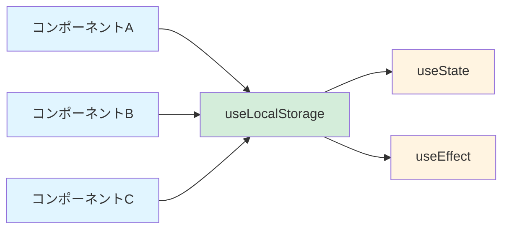
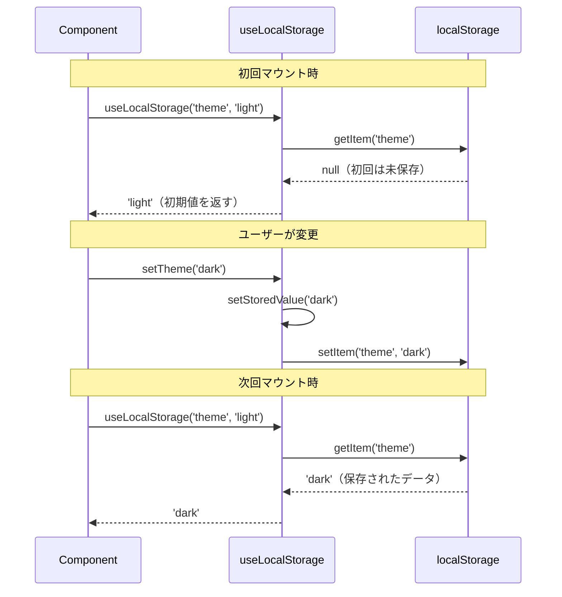
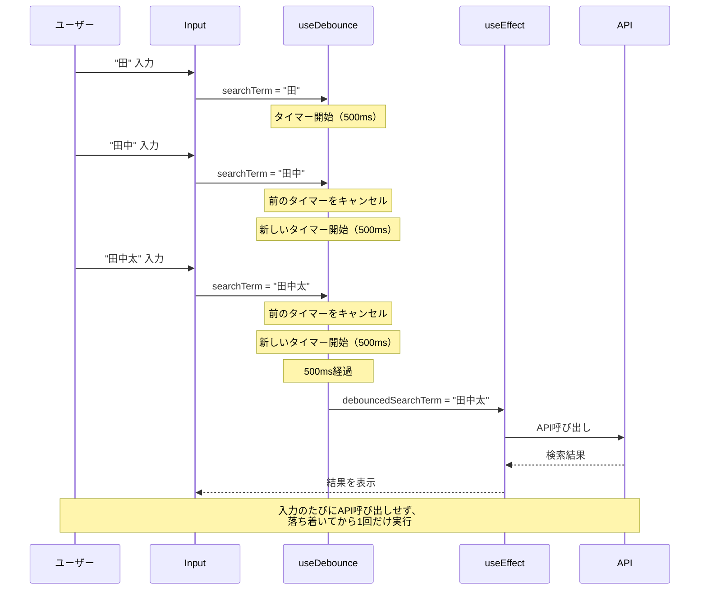
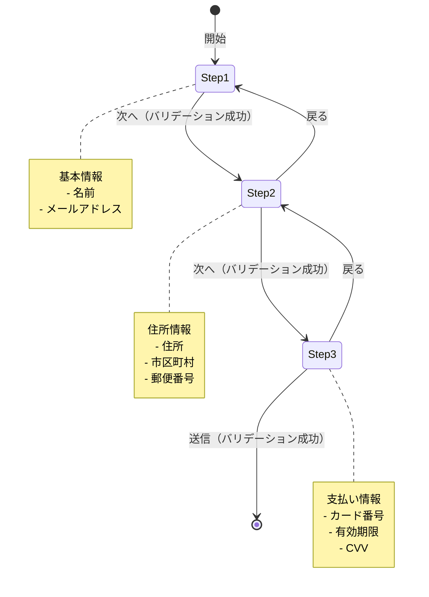

# 第4章：React入門

この章では、**React**の基本を学びます。Reactは、UIを構築するためのJavaScriptライブラリで、Facebook（現Meta）が開発しました。

**この章で学ぶこと：**
- Reactとは何か、なぜ使うのか
- JSXの書き方と基本ルール
- コンポーネントの作り方
- State（状態）の管理
- イベント処理の方法
- Hooksの使い方（useState, useEffect, etc.）
- 実践的なTODOアプリの作成

## 4.1 Reactとは（完全ガイド）

### Reactの特徴

**React**は、Webアプリケーションのユーザーインターフェース（UI）を構築するためのJavaScriptライブラリです。2013年にFacebook（現Meta）が開発し、現在では世界中で最も人気のあるUIライブラリの1つです。

**主な特徴：**

1. **コンポーネントベース**: UIを再利用可能な部品（コンポーネント）に分割
2. **宣言的**: 「どう見えるべきか」を記述する（命令的な「どう変更するか」ではない）
3. **仮想DOM**: 効率的な画面更新
4. **単方向データフロー**: データの流れが予測しやすい

### なぜReactを使うのか？

**従来のJavaScript（命令的プログラミング）の問題点**

```javascript
// ❌ 従来の方法：命令的（どう変更するか）
const button = document.getElementById('myButton');
const counter = document.getElementById('counter');
let count = 0;

button.addEventListener('click', () => {
  count++;
  counter.textContent = count;
  
  // カウントが10を超えたら色を変える
  if (count > 10) {
    counter.style.color = 'red';
  } else {
    counter.style.color = 'black';
  }
  
  // カウントが5の倍数ならメッセージ表示
  if (count % 5 === 0) {
    const message = document.getElementById('message');
    message.textContent = '5の倍数です！';
    message.style.display = 'block';
  }
});
```

**問題点：**
- DOM操作が散らばって複雑
- 状態（count）とUIの同期が大変
- 機能が増えると管理が困難
- バグが発生しやすい

**Reactでの書き方（宣言的プログラミング）**

```jsx
// ✅ Reactの方法：宣言的（どう見えるべきか）
function Counter() {
  const [count, setCount] = useState(0);
  
  return (
    <div>
      <button onClick={() => setCount(count + 1)}>
        クリック
      </button>
      
      <p style={{ color: count > 10 ? 'red' : 'black' }}>
        カウント: {count}
      </p>
      
      {count % 5 === 0 && count > 0 && (
        <p>5の倍数です！</p>
      )}
    </div>
  );
}
```

**メリット：**
- UIの状態が一目でわかる
- 状態（count）が変わると自動で再描画
- コードが読みやすく保守しやすい
- バグが減る

**図解：命令的 vs 宣言的**

```
命令的プログラミング（従来のJavaScript）
┌────────────────────────────────┐
│ 1. 要素を取得                  │
│ 2. イベントを設定              │
│ 3. 状態を更新                  │
│ 4. DOMを手動で更新             │
│ 5. スタイルを手動で変更        │
│ 6. 条件分岐でDOM操作           │
└────────────────────────────────┘
↑ 手順を細かく指示（How）

宣言的プログラミング（React）
┌────────────────────────────────┐
│ 「この状態のときは、           │
│  こう表示する」を記述          │
│                                │
│ あとはReactが自動で            │
│ 効率的に更新してくれる         │
└────────────────────────────────┘
↑ 結果を記述（What）
```

### Reactの4つの主要概念

#### 1. コンポーネントベース

UIを小さな部品（コンポーネント）に分割します。

```
Webページ全体
┌─────────────────────────────┐
│ Header                      │← Headerコンポーネント
├─────────────────────────────┤
│ ┌─────────┐ ┌─────────┐   │
│ │ Card    │ │ Card    │   │← Cardコンポーネント（再利用）
│ └─────────┘ └─────────┘   │
│ ┌─────────┐ ┌─────────┐   │
│ │ Card    │ │ Card    │   │
│ └─────────┘ └─────────┘   │
├─────────────────────────────┤
│ Footer                      │← Footerコンポーネント
└─────────────────────────────┘
```

**コンポーネントの例：**

```jsx
// Cardコンポーネント（再利用可能）
function Card({ title, content }) {
  return (
    <div className="card">
      <h2>{title}</h2>
      <p>{content}</p>
    </div>
  );
}

// 使用
function App() {
  return (
    <div>
      <Card title="タイトル1" content="内容1" />
      <Card title="タイトル2" content="内容2" />
      <Card title="タイトル3" content="内容3" />
    </div>
  );
}
```

**メリット：**
- コードの再利用
- 保守性の向上
- テストしやすい
- チーム開発がしやすい

#### 2. 仮想DOM（Virtual DOM）

Reactは「仮想DOM」という仕組みで効率的にUIを更新します。

**従来の方法（直接DOM操作）：**

```javascript
// ❌ 遅い：DOMを直接操作
document.getElementById('name').textContent = '田中';
document.getElementById('age').textContent = '25';
document.getElementById('email').textContent = 'tanaka@example.com';
// 3回の再描画が発生
```

**Reactの方法（仮想DOM）：**

```jsx
// ✅ 速い：変更を仮想DOMで計算してから一度に反映
function User({ user }) {
  return (
    <div>
      <p>{user.name}</p>
      <p>{user.age}</p>
      <p>{user.email}</p>
    </div>
  );
}
```

**図解：仮想DOMの仕組み**

```
ステップ1: 状態が変更される
┌─────────────┐
│ State変更   │ count: 0 → 1
└─────────────┘
       ↓
ステップ2: 仮想DOMを作成
┌─────────────┐
│ 新しい      │ <p>カウント: 1</p>
│ 仮想DOM     │
└─────────────┘
       ↓
ステップ3: 差分を計算（Diffing）
┌─────────────┐
│ 旧: count 0 │
│ 新: count 1 │← ここだけ変わった
└─────────────┘
       ↓
ステップ4: 最小限の変更だけ実DOM に適用
┌─────────────┐
│ テキストだけ│ "0" → "1"
│ 更新        │
└─────────────┘
```

**なぜ速いのか？**

1. **DOM操作は遅い**：ブラウザのDOM操作はコストが高い
2. **仮想DOMは速い**：JavaScriptオブジェクトなので高速
3. **差分だけ更新**：変更があった部分だけを実DOMに反映
4. **バッチ更新**：複数の変更をまとめて一度に反映

#### 3. 単方向データフロー

Reactでは、データは親から子へ一方向に流れます。

```
親コンポーネント（App）
    ↓ props
子コンポーネント（UserCard）
    ↓ props
孫コンポーネント（Avatar）
```

**例：**

```jsx
// 親コンポーネント
function App() {
  const user = { name: '田中', age: 25 };
  
  // データを子に渡す
  return <UserCard user={user} />;
}

// 子コンポーネント
function UserCard({ user }) {
  // 親からデータを受け取る
  return (
    <div>
      <h2>{user.name}</h2>
      <p>{user.age}歳</p>
    </div>
  );
}
```

**図解：データの流れ**

```
┌─────────────────────┐
│ App（親）           │
│ const user = {...}  │
└─────────────────────┘
         ↓ props
┌─────────────────────┐
│ UserCard（子）      │
│ { user }を受け取る  │
└─────────────────────┘
         ↓ props
┌─────────────────────┐
│ Avatar（孫）        │
│ { user.name }       │
└─────────────────────┘
```

**メリット：**
- データの流れが予測しやすい
- デバッグがしやすい
- バグが減る

#### 4. JSX（JavaScript XML）

JavaScriptの中にHTMLのような構文を書けます。

```jsx
// JSX
const element = <h1>こんにちは、{name}さん！</h1>;

// ↓ Babelで変換される

// JavaScript
const element = React.createElement(
  'h1',
  null,
  'こんにちは、',
  name,
  'さん！'
);
```

### Reactを使っているサービス

- **Facebook / Instagram**: React開発元
- **Netflix**: ストリーミングUI
- **Airbnb**: 宿泊予約サイト
- **Uber**: 配車アプリ
- **Discord**: チャットアプリ
- **Dropbox**: ファイル共有
- **Yahoo! Japan**: 一部のサービス

### ReactとNext.jsの関係

```
┌─────────────────────────────┐
│ Next.js                     │← フレームワーク
│ ┌─────────────────────────┐ │
│ │ React                   │ │← ライブラリ
│ │ ┌─────────────────────┐ │ │
│ │ │ JavaScript          │ │ │← 言語
│ │ └─────────────────────┘ │ │
│ └─────────────────────────┘ │
└─────────────────────────────┘
```

- **React**: UIを作るライブラリ
- **Next.js**: Reactを使いやすくするフレームワーク
  - ルーティング自動化
  - サーバーサイドレンダリング
  - API Routes
  - 画像最適化
  - など

**初心者への補足：**
> 💡 **Reactのまとめ：**
> 
> **Reactとは：**
> - UIを作るJavaScriptライブラリ
> - Facebook（Meta）が開発
> - 世界で最も人気のあるUIライブラリ
> 
> **なぜ使う？：**
> - コードが読みやすい（宣言的）
> - 再利用可能なコンポーネント
> - 高速な画面更新（仮想DOM）
> - データの流れが予測しやすい
> 
> **基本概念：**
> - **コンポーネント**: UIの部品
> - **JSX**: HTMLみたいな構文
> - **Props**: 親から子へのデータ
> - **State**: コンポーネントの状態
> 
> **よく使われている場所：**
> - Facebook, Instagram, Netflix, Airbnb など
> 
> **Next.jsとの関係：**
> - Next.jsはReactを使いやすくするフレームワーク
> - このコースではNext.jsを使ってReactを学ぶ

---

## 4.2 JSXとは（完全ガイド）

### JSXの基本

**JSX（JavaScript XML）**は、JavaScriptの中にHTMLのような構文を書ける拡張構文です。React開発に欠かせない機能です。

**基本的な書き方：**

```jsx
// JSX
const element = <h1>こんにちは、世界！</h1>;
```

**このコードの詳しい説明：**

```jsx
// JSXは、Babelというツールで通常のJavaScriptに変換される

// JSXで書くと：
const element = <h1>こんにちは、世界！</h1>;

// ↓ Babelで変換

// 実際のJavaScript：
const element = React.createElement(
  'h1',              // タグ名
  null,              // 属性（今回はなし）
  'こんにちは、世界！'  // 子要素
);
```

**図解：JSXの変換**

```
JSXコード
┌────────────────────────────┐
│ <h1>Hello</h1>             │
└────────────────────────────┘
         ↓ Babel変換
┌────────────────────────────┐
│ React.createElement(       │
│   'h1',                    │
│   null,                    │
│   'Hello'                  │
│ )                          │
└────────────────────────────┘
         ↓ 実行
┌────────────────────────────┐
│ 仮想DOMオブジェクト        │
│ { type: 'h1',              │
│   props: { children: ... } │
└────────────────────────────┘
         ↓
┌────────────────────────────┐
│ 実際のHTML                 │
│ <h1>Hello</h1>             │
└────────────────────────────┘
```

**変数を埋め込む：**

```jsx
const name = '田中太郎';
const age = 25;

// {}の中に変数を書ける
const element = (
  <div>
    <h1>こんにちは、{name}さん！</h1>
    <p>年齢: {age}歳</p>
  </div>
);
```

**このコードの詳しい説明：**

```jsx
// {}の中には、JavaScriptの式が書ける

const name = '田中太郎';
const age = 25;

const element = (
  <div>
    {/* 変数 */}
    <p>{name}</p>
    
    {/* 計算 */}
    <p>{age + 1}</p>
    
    {/* 関数呼び出し */}
    <p>{name.toUpperCase()}</p>
    
    {/* 三項演算子 */}
    <p>{age >= 20 ? '成人' : '未成年'}</p>
    
    {/* テンプレートリテラル */}
    <p>{`${name}さんは${age}歳です`}</p>
  </div>
);
```

### JSXの5つの重要なルール

#### ルール1: 単一のルート要素が必須

**❌ エラー：複数のルート要素**

```jsx
function App() {
  return (
    <h1>タイトル</h1>
    <p>本文</p>
  );
}

// エラー: Adjacent JSX elements must be wrapped in an enclosing tag
```

**なぜエラーになる？**

```javascript
// JSXは以下のように変換される：
return (
  React.createElement('h1', null, 'タイトル')
  React.createElement('p', null, '本文')
);

// ❌ return文は1つの値しか返せない！
```

**✅ 解決法1: divで囲む**

```jsx
function App() {
  return (
    <div>
      <h1>タイトル</h1>
      <p>本文</p>
    </div>
  );
}
```

**✅ 解決法2: Fragmentを使う（推奨）**

```jsx
// 余計なdivが不要な場合
function App() {
  return (
    <>
      <h1>タイトル</h1>
      <p>本文</p>
    </>
  );
}

// または明示的に
import { Fragment } from 'react';

function App() {
  return (
    <Fragment>
      <h1>タイトル</h1>
      <p>本文</p>
    </Fragment>
  );
}
```

**このコードの詳しい説明：**

```jsx
// Fragment (<>...</>) は、DOMに余計な要素を追加しない

// divで囲むと：
<div>              ← 余計なdiv
  <h1>タイトル</h1>
  <p>本文</p>
</div>

// Fragmentを使うと：
<>                 ← DOMには出力されない
  <h1>タイトル</h1>
  <p>本文</p>
</>

// 実際のHTML出力：
<h1>タイトル</h1>
<p>本文</p>
```

**図解：divとFragmentの違い**

```
divで囲む
┌─────────────────────┐
│ <div>               │← 余計な要素
│   <h1>Title</h1>    │
│   <p>Text</p>       │
│ </div>              │
└─────────────────────┘

Fragment
┌─────────────────────┐
│ <h1>Title</h1>      │← 直接出力
│ <p>Text</p>         │
└─────────────────────┘
```

#### ルール2: 式の埋め込みは{}を使う

**変数、計算、関数呼び出しなど**

```jsx
function UserCard() {
  const name = '田中太郎';
  const age = 25;
  const email = 'tanaka@example.com';
  
  return (
    <div>
      {/* 変数 */}
      <h2>{name}</h2>
      
      {/* 計算 */}
      <p>来年は{age + 1}歳</p>
      
      {/* 関数呼び出し */}
      <p>{email.toLowerCase()}</p>
      
      {/* 三項演算子 */}
      <p>{age >= 20 ? '成人' : '未成年'}</p>
      
      {/* 論理演算子 */}
      {age >= 18 && <p>選挙権があります</p>}
      
      {/* 配列のmap */}
      <ul>
        {['りんご', 'バナナ', 'オレンジ'].map(fruit => (
          <li key={fruit}>{fruit}</li>
        ))}
      </ul>
    </div>
  );
}
```

**このコードの詳しい説明：**

```jsx
// {}の中に書けるもの・書けないもの

// ✅ OK：式（Expressions）
{name}                    // 変数
{1 + 2}                   // 計算
{name.toUpperCase()}      // 関数呼び出し
{age >= 20 ? 'A' : 'B'}  // 三項演算子
{age >= 18 && <p>OK</p>}  // 論理演算子

// ❌ NG：文（Statements）
{if (age >= 20) { ... }}  // if文はダメ
{for (let i = 0; ...) {}} // for文はダメ
{const x = 10;}           // 変数宣言はダメ

// 文を使いたい場合は、外で処理する
function Component() {
  // ここで処理
  let message;
  if (age >= 20) {
    message = '成人';
  } else {
    message = '未成年';
  }
  
  // JSXでは結果だけ表示
  return <p>{message}</p>;
}
```

**条件付きレンダリングのパターン**

```jsx
function Greeting({ isLoggedIn, username }) {
  return (
    <div>
      {/* パターン1: 三項演算子 */}
      {isLoggedIn ? (
        <h1>ようこそ、{username}さん！</h1>
      ) : (
        <h1>ログインしてください</h1>
      )}
      
      {/* パターン2: && 演算子（trueの時だけ表示） */}
      {isLoggedIn && <p>ダッシュボードへ</p>}
      
      {/* パターン3: 変数に入れる */}
      {(() => {
        if (isLoggedIn) {
          return <h1>ようこそ、{username}さん！</h1>;
        }
        return <h1>ログインしてください</h1>;
      })()}
    </div>
  );
}
```

#### ルール3: 属性はキャメルケース

HTMLとJSXで属性名が異なります。

```jsx
// ❌ HTML
<div class="container" onclick="handleClick()">
  <label for="input">名前</label>
  <input type="text" tabindex="1">
</div>

// ✅ JSX
<div className="container" onClick={handleClick}>
  <label htmlFor="input">名前</label>
  <input type="text" tabIndex={1} />
</div>
```

**よく使う属性の対応表：**

| HTML | JSX | 説明 |
|------|-----|------|
| `class` | `className` | CSSクラス |
| `for` | `htmlFor` | labelのfor属性 |
| `onclick` | `onClick` | クリックイベント |
| `onchange` | `onChange` | 変更イベント |
| `tabindex` | `tabIndex` | タブ順序 |
| `maxlength` | `maxLength` | 最大文字数 |
| `readonly` | `readOnly` | 読み取り専用 |

**このコードの詳しい説明：**

```jsx
// なぜキャメルケース？
// → JavaScriptの規則に合わせるため

// classはJavaScriptの予約語なので使えない
const class = 'test';  // ❌ エラー
const className = 'test';  // ✅ OK

// イベントハンドラもキャメルケース
<button onClick={handleClick}>  // ✅ OK
<button onclick={handleClick}>  // ❌ 動かない
```

**スタイルの書き方（特殊）：**

```jsx
// ❌ HTML
<div style="color: red; font-size: 16px;">

// ✅ JSX：オブジェクトで指定
<div style={{ color: 'red', fontSize: '16px' }}>

// 変数に入れることもできる
const styles = {
  color: 'red',
  fontSize: '16px',
  backgroundColor: 'yellow'  // background-color → backgroundColor
};

<div style={styles}>
```

**このコードの詳しい説明：**

```jsx
// styleは二重の{}になる理由

<div style={{ color: 'red' }}>
     ↑      ↑
     │      └─ オブジェクトリテラル
     └─ JSXの式の埋め込み

// つまり、これと同じ
const styleObj = { color: 'red' };
<div style={styleObj}>

// CSS プロパティ名はキャメルケースに
'background-color'  → backgroundColor
'font-size'         → fontSize
'margin-top'        → marginTop
'z-index'           → zIndex
```

#### ルール4: すべてのタグを閉じる

HTMLでは省略できるタグの閉じも、JSXでは必須です。

```jsx
// ❌ HTML（閉じなくてもOK）
<input type="text">

<br>
<hr>

// ✅ JSX（必ず閉じる）
<input type="text" />

<br />
<hr />

// または
<input type="text"></input>
```

**このコードの詳しい説明：**

```jsx
// 自己閉じタグ（Self-closing tags）

// 子要素がない場合は、/> で閉じる
<input type="text" />

<br />
<hr />
<Component />

// 子要素がある場合は、通常の閉じタグ
<div>
  <p>テキスト</p>
</div>

<Button>
  クリック
</Button>
```

#### ルール5: コメントの書き方

JSX内でコメントを書く特殊な方法があります。

```jsx
function App() {
  return (
    <div>
      {/* これはJSX内のコメント */}
      <h1>タイトル</h1>
      
      {/* 
        複数行の
        コメントも
        書ける
      */}
      <p>本文</p>
      
      {/* <p>この行はコメントアウトされる</p> */}
      
      {
        // 単一行コメント
        // ただし{}が必要
      }
    </div>
  );
}

// コンポーネントの外では通常のコメント
// これは普通のJavaScriptコメント
/* これも普通のコメント */
```

**このコードの詳しい説明：**

```jsx
// JSX内でコメントを書く方法

function Component() {
  // ここは普通のJavaScriptコメント（JSXの外）
  
  return (
    <div>
      {/* JSX内では{/* */}の形式 */}
      
      {/* ❌ これは動かない
      // 通常のコメントはダメ
      */}
      
      {
        // ✅ これはOK
        // {}の中なら通常のコメントも使える
      }
    </div>
  );
}
```

### JSXの実践例

**例1: ユーザーカード**

```jsx
function UserCard({ user }) {
  const { name, age, email, isActive } = user;
  
  return (
    <div className="user-card">
      {/* ヘッダー */}
      <div className="header">
        <h2>{name}</h2>
        {isActive && <span className="badge">アクティブ</span>}
      </div>
      
      {/* 本文 */}
      <div className="body">
        <p>年齢: {age}歳</p>
        <p>メール: {email}</p>
        
        {/* 条件付き表示 */}
        {age >= 20 ? (
          <p className="adult">成人</p>
        ) : (
          <p className="minor">未成年</p>
        )}
      </div>
      
      {/* フッター */}
      <div className="footer">
        <button onClick={() => console.log('編集')}>
          編集
        </button>
      </div>
    </div>
  );
}
```

**例2: リスト表示**

```jsx
function TodoList({ todos }) {
  return (
    <div className="todo-list">
      <h2>TODOリスト（{todos.length}件）</h2>
      
      {/* リストが空の場合 */}
      {todos.length === 0 ? (
        <p>TODOはありません</p>
      ) : (
        <ul>
          {/* 配列をmapで展開 */}
          {todos.map(todo => (
            <li
              key={todo.id}
              className={todo.done ? 'done' : 'pending'}
            >
              {todo.done && '✓ '}
              {todo.text}
            </li>
          ))}
        </ul>
      )}
    </div>
  );
}
```

**初心者への補足：**
> 💡 **JSXのまとめ：**
> 
> **JSXとは：**
> - JavaScriptの中にHTMLを書ける構文
> - Reactで必須の機能
> - Babelで通常のJavaScriptに変換される
> 
> **5つの重要ルール：**
> 1. **単一のルート要素**: `<></>` で囲む
> 2. **式の埋め込み**: `{変数}` `{計算}` `{関数()}`
> 3. **属性はキャメルケース**: `className`, `onClick`
> 4. **すべてのタグを閉じる**: `<input />`, `<br />`
> 5. **コメント**: `{/* コメント */}`
> 
> **よく使うパターン：**
> ```jsx
> // 条件分岐
> {condition ? <A /> : <B />}
> {condition && <C />}
> 
> // リスト表示
> {array.map(item => <Li key={item.id}>{item.name}</Li>)}
> 
> // スタイル
> <div style={{ color: 'red', fontSize: '16px' }}>
> ```
> 
> **HTMLとの違い：**
> - `class` → `className`
> - `for` → `htmlFor`
> - `onclick` → `onClick`
> - `style="..."` → `style={{ ... }}`
> - タグは必ず閉じる

---

## 4.3 コンポーネント

### コンポーネントとは何か

Reactでは、UIを**コンポーネント**という小さな部品に分割して構築します。

**身近な例で考えると：**
```
Webページ
├── ヘッダー（コンポーネント）
│   ├── ロゴ（コンポーネント）
│   └── ナビゲーション（コンポーネント）
├── メインコンテンツ
│   ├── カード（コンポーネント）← 再利用可能
│   ├── カード（コンポーネント）
│   └── カード（コンポーネント）
└── フッター（コンポーネント）
```

コンポーネントの**メリット**：
- 🔄 **再利用できる**：同じコンポーネントを何度でも使える
- 🧩 **管理しやすい**：小さな部品に分けると理解しやすい
- 🐛 **テストしやすい**：個別にテストできる
- 👥 **協業しやすい**：別々のコンポーネントを同時開発できる

---

### 関数コンポーネント（現在の標準）

Reactの現代的な書き方では、**関数コンポーネント**を使います。

**最もシンプルなコンポーネント：**

```jsx
// 1. 通常の関数で定義
function Welcome() {
  return <h1>こんにちは！</h1>;
}

// 2. アロー関数でも書ける（どちらでもOK）
const Welcome = () => {
  return <h1>こんにちは！</h1>;
};

// 3. 1行なら{}とreturnを省略できる
const Welcome = () => <h1>こんにちは！</h1>;
```

**このコードの詳しい説明：**

```jsx
function Welcome() {  // ① コンポーネント名は必ず大文字で始める
  return <h1>こんにちは！</h1>;  // ② JSXを返す
}
```

**ポイント：**
- ① **コンポーネント名は大文字で始める**（Welcome, Button, UserCard など）
  - 小文字だとHTMLタグと間違える：`<button>` はHTMLタグ、`<Button>` はReactコンポーネント
- ② **JSX（HTML風の構文）を返す**
  - コンポーネントは「見た目（UI）」を返す関数

**コンポーネントの使用：**

```jsx
function App() {
  return (
    <div>
      <Welcome />  {/* ① コンポーネントをタグのように使う */}
      <Welcome />  {/* ② 何度でも使える */}
      <Welcome />
    </div>
  );
}

// 表示結果：
// こんにちは！
// こんにちは！
// こんにちは！
```

**イメージ図：**
```
Appコンポーネント
┌─────────────────┐
│ <Welcome />     │ → こんにちは！
│ <Welcome />     │ → こんにちは！
│ <Welcome />     │ → こんにちは！
└─────────────────┘
```

---

### Props（プロパティ）：データの受け渡し

**Props**は、親コンポーネントから子コンポーネントにデータを渡す仕組みです。

**なぜPropsが必要？**
```jsx
// ❌ これだと同じメッセージしか表示できない
function Welcome() {
  return <h1>こんにちは、田中さん！</h1>;
}

// ✅ Propsを使えば、名前を外から渡せる
function Welcome(props) {
  return <h1>こんにちは、{props.name}さん！</h1>;
}
```

**Propsの基本的な使い方：**

```jsx
// ① propsオブジェクトで受け取る
function Welcome(props) {  // propsは { name: '田中' } のようなオブジェクト
  return <h1>こんにちは、{props.name}さん！</h1>;
}

// ② 分割代入を使うのが一般的（推奨）
function Welcome({ name }) {  // { name } で直接取り出す
  return <h1>こんにちは、{name}さん！</h1>;
}

// ③ 親コンポーネントから値を渡す
function App() {
  return (
    <div>
      <Welcome name="田中" />  {/* name="田中" がPropsとして渡される */}
      <Welcome name="佐藤" />
      <Welcome name="鈴木" />
    </div>
  );
}
```

**Propsの流れ（データフロー）：**
```
親コンポーネント (App)
    ↓ name="田中" （Propsとして渡す）
子コンポーネント (Welcome)
    ↓ {name} を表示
画面に「こんにちは、田中さん！」
```

**初心者への補足：**
> - **Props = Properties（属性）の略**
> - **親 → 子へのデータの流れ**（一方通行）
> - **子コンポーネント側ではPropsを変更できない**（読み取り専用）

---

### 複数のPropsを使う

実際のアプリでは、複数のデータを渡すことが多いです。

```jsx
// ユーザーカードコンポーネント
function UserCard({ name, age, email, avatarUrl }) {
  return (
    <div className="card">
      {/* アバター画像 */}
      
      
      {/* 名前 */}
      <h2>{name}</h2>
      
      {/* 年齢とメール */}
      <p>年齢: {age}歳</p>
      <p>メール: {email}</p>
    </div>
  );
}

// 親コンポーネントから使用
function App() {
  return (
    <div>
      <UserCard
        name="田中太郎"
        age={25}
        email="tanaka@example.com"
        avatarUrl="/images/tanaka.jpg"
      />
      
      <UserCard
        name="佐藤花子"
        age={30}
        email="sato@example.com"
        avatarUrl="/images/sato.jpg"
      />
    </div>
  );
}
```

**このコードの詳しい説明：**

1. **分割代入でPropsを受け取る**：
   ```jsx
   function UserCard({ name, age, email, avatarUrl }) {
   ```
   - `{ }` の中に受け取りたいプロパティ名を書く
   - 複数のプロパティをカンマで区切る

2. **Propsを表示に使う**：
   ```jsx
   <h2>{name}</h2>
   <p>年齢: {age}歳</p>
   ```
   - 受け取ったPropsを `{}` で埋め込む

3. **Propsの型に注意**：
   ```jsx
   age={25}           // ← 数値は{}で囲む
   name="田中太郎"    // ← 文字列は""で書く
   ```

**Props受け渡しの可視化：**
```
App
├── UserCard (name="田中太郎", age={25}, ...)
│   └── 表示: 田中太郎、25歳、...
│
└── UserCard (name="佐藤花子", age={30}, ...)
    └── 表示: 佐藤花子、30歳、...
```

---

### デフォルトProps（初期値）

Propsが渡されなかったときの**デフォルト値**を設定できます。

```jsx
// パラメータのデフォルト値構文を使う
function Button({ text = 'クリック', color = 'blue', size = 'medium' }) {
  return (
    <button 
      style={{ 
        backgroundColor: color,
        fontSize: size === 'large' ? '18px' : '14px'
      }}
    >
      {text}
    </button>
  );
}

// 使用例
function App() {
  return (
    <div>
      {/* すべてデフォルト値 */}
      <Button />
      {/* 結果: 青色の「クリック」ボタン */}
      
      {/* 一部だけカスタマイズ */}
      <Button text="送信" />
      {/* 結果: 青色の「送信」ボタン */}
      
      {/* すべてカスタマイズ */}
      <Button text="削除" color="red" size="large" />
      {/* 結果: 赤色で大きい「削除」ボタン */}
    </div>
  );
}
```

**このコードの詳しい説明：**

```jsx
function Button({ text = 'クリック', color = 'blue' }) {
//              ↑ Propsが渡されなければ 'クリック' を使う
//                              ↑ Propsが渡されなければ 'blue' を使う
```

**デフォルト値の動作：**
```
<Button />
  → text は 'クリック'、color は 'blue' （デフォルト値）

<Button text="送信" />
  → text は '送信'、color は 'blue' （color だけデフォルト）

<Button text="送信" color="green" />
  → text は '送信'、color は 'green' （両方カスタム）
```

---

### children（子要素）

**children**は特別なPropsで、コンポーネントのタグの間に書いた内容を受け取ります。

```jsx
// Cardコンポーネント（枠組みを提供）
function Card({ children, title }) {
  return (
    <div className="card">
      {/* タイトル */}
      <h2>{title}</h2>
      
      {/* children: タグの間に書いた内容がここに入る */}
      <div className="card-body">
        {children}
      </div>
    </div>
  );
}

// 使用例
function App() {
  return (
    <div>
      {/* Cardタグの間に書いた内容が children として渡される */}
      <Card title="プロフィール">
        <p>名前: 田中太郎</p>
        <p>年齢: 25歳</p>
        <p>趣味: プログラミング</p>
      </Card>
      
      <Card title="スキル">
        <ul>
          <li>JavaScript</li>
          <li>React</li>
          <li>TypeScript</li>
        </ul>
      </Card>
    </div>
  );
}
```

**このコードの詳しい説明：**

```jsx
<Card title="プロフィール">
  {/* ↓ この部分が children として Card コンポーネントに渡される */}
  <p>名前: 田中太郎</p>
  <p>年齢: 25歳</p>
  {/* ↑ */}
</Card>
```

**childrenの仕組み：**
```
<Card>
  <p>内容</p>  ← この部分
</Card>
      ↓
Card内で {children} として表示
      ↓
<div className="card">
  <div className="card-body">
    <p>内容</p>  ← ここに挿入される
  </div>
</div>
```

**childrenの利点：**
- 🎨 **レイアウトの再利用**：枠組みだけ用意して、中身は自由に変更
- 📦 **柔軟な構成**：どんな内容でも受け入れられる
- 🔧 **カスタマイズ可能**：使う側で中身を決められる

---

### Propsのベストプラクティス

**1. 必要なプロパティだけ渡す**

```jsx
// ❌ 悪い例：オブジェクト全体を渡す
function UserProfile({ user }) {
  return <div>{user.name}</div>;  // user.xxx とアクセスが必要
}
<UserProfile user={user} />

// ✅ 良い例：必要なプロパティだけ渡す
function UserProfile({ name, age }) {
  return <div>{name}</div>;  // 直接アクセスできる
}
<UserProfile name={user.name} age={user.age} />

// ✅ スプレッド構文で全部渡すのもOK（user のすべてのプロパティを渡す）
<UserProfile {...user} />
// これは <UserProfile name={user.name} age={user.age} ... /> と同じ
```

**2. Propsの命名規則**

```jsx
// ✅ わかりやすい名前
<Button onClick={handleClick} isDisabled={false} />

// ❌ わかりにくい名前
<Button func={handleClick} flag={false} />
```

**3. オブジェクトや配列はmemo化を検討**

```jsx
// ❌ 毎回新しいオブジェクトが作られる（再レンダリングの原因）
<UserCard style={{ margin: 10 }} />

// ✅ 外部で定義（同じオブジェクトを再利用）
const cardStyle = { margin: 10 };
<UserCard style={cardStyle} />
```

**4. boolean型のPropsの省略記法**

```jsx
// この2つは同じ意味
<Button isDisabled={true} />
<Button isDisabled />  // ← 短く書ける

// falseの場合は省略できない
<Button isDisabled={false} />
```

---

### コンポーネント設計の例

実践的なコンポーネント設計を見てみましょう。

```jsx
// ① 小さなコンポーネント：アバター
function Avatar({ src, alt, size = 'medium' }) {
  const sizeClass = {
    small: 'w-8 h-8',
    medium: 'w-12 h-12',
    large: 'w-16 h-16'
  }[size];
  
  return (
    
  );
}

// ② 中規模コンポーネント：ユーザー情報
function UserInfo({ name, email, avatarUrl }) {
  return (
    <div className="flex items-center gap-3">
      {/* Avatar コンポーネントを再利用 */}
      <Avatar src={avatarUrl} alt={name} />
      
      <div>
        <p className="font-bold">{name}</p>
        <p className="text-gray-600">{email}</p>
      </div>
    </div>
  );
}

// ③ 大規模コンポーネント：ユーザーカード
function UserCard({ user, onEdit, onDelete }) {
  return (
    <div className="card">
      {/* UserInfo コンポーネントを再利用 */}
      <UserInfo 
        name={user.name}
        email={user.email}
        avatarUrl={user.avatarUrl}
      />
      
      {/* アクションボタン */}
      <div className="flex gap-2 mt-4">
        <button onClick={() => onEdit(user.id)}>編集</button>
        <button onClick={() => onDelete(user.id)}>削除</button>
      </div>
    </div>
  );
}

// ④ 最上位コンポーネント：アプリ
function App() {
  const users = [
    { id: 1, name: '田中', email: 'tanaka@example.com', avatarUrl: '/avatar1.jpg' },
    { id: 2, name: '佐藤', email: 'sato@example.com', avatarUrl: '/avatar2.jpg' }
  ];
  
  const handleEdit = (userId) => {
    console.log('編集:', userId);
  };
  
  const handleDelete = (userId) => {
    console.log('削除:', userId);
  };
  
  return (
    <div>
      {users.map(user => (
        <UserCard
          key={user.id}
          user={user}
          onEdit={handleEdit}
          onDelete={handleDelete}
        />
      ))}
    </div>
  );
}
```

**コンポーネントの階層構造：**
```
App
└── UserCard (複数)
    ├── UserInfo
    │   ├── Avatar
    │   └── div (名前とメール)
    └── div (ボタン)
```

**初心者への補足：**
> 💡 **コンポーネント設計のコツ：**
> 
> **コンポーネントの粒度：**
> - 🔹 **小**：Avatar, Button, Input（再利用性高い）
> - 🔸 **中**：UserInfo, ProductCard（特定の用途）
> - 🔶 **大**：Header, Sidebar, Page（画面の構成要素）
> 
> **分割の目安：**
> - 同じUIを複数箇所で使う → コンポーネント化
> - 100行以上のコンポーネント → 分割を検討
> - 役割が明確 → 分割しやすい
> 
> **Propsの流れ：**
> ```
> 親コンポーネント
>   ↓ Props（データ）を渡す
> 子コンポーネント
>   ↓ Props を表示・使用
> 画面に反映
> ```
> 
> **重要なルール：**
> - Propsは**読み取り専用**（子で変更してはいけない）
> - データは**親から子へ**の一方通行
> - 子から親へデータを送りたいときは**関数を渡す**（onEdit, onDelete など）

---

## 4.4 State（状態）

### Stateとは何か

**State（状態）**は、コンポーネントが持つ「変化するデータ」です。

**Props と State の違い：**
```
Props:
- 親から子へ渡されるデータ
- 子コンポーネント側で変更できない（読み取り専用）
- 例: ユーザー名、設定値など

State:
- コンポーネント自身が持つデータ
- コンポーネント内で変更できる
- 例: カウンター、入力フォームの値、表示/非表示の切り替えなど
```

**なぜStateが必要？**

```jsx
// ❌ 通常の変数では画面が更新されない
function Counter() {
  let count = 0;  // 普通の変数
  
  const increment = () => {
    count = count + 1;  // 値は変わるが...
    console.log(count);  // コンソールには表示される
    // でも画面は更新されない！
  };
  
  return (
    <div>
      <p>カウント: {count}</p>  {/* 常に0のまま */}
      <button onClick={increment}>+1</button>
    </div>
  );
}

// ✅ Stateを使えば画面が更新される
function Counter() {
  const [count, setCount] = useState(0);  // State
  
  const increment = () => {
    setCount(count + 1);  // Stateを更新
    // 画面が自動的に再レンダリングされる！
  };
  
  return (
    <div>
      <p>カウント: {count}</p>  {/* 更新される！ */}
      <button onClick={increment}>+1</button>
    </div>
  );
}
```

**Stateの仕組み：**
```
① ボタンクリック
    ↓
② setCount() でState更新
    ↓
③ Reactが変更を検知
    ↓
④ コンポーネントを再レンダリング
    ↓
⑤ 新しい値が画面に表示される
```

---

### useStateフックの基本

**useState**は、Stateを使うためのReact Hookです。

```jsx
import { useState } from 'react';  // ① useStateをインポート

function Counter() {
  // ② useStateでStateを作成
  const [count, setCount] = useState(0);
  //     ↑       ↑          ↑
  //   現在の値  更新関数   初期値
  
  return (
    <div>
      <p>カウント: {count}</p>
      <button onClick={() => setCount(count + 1)}>
        +1
      </button>
    </div>
  );
}
```

**このコードの詳しい説明：**

```jsx
const [count, setCount] = useState(0);
//     ①      ②            ③
```

- ① **count**：現在のStateの値（読み取り用）
- ② **setCount**：Stateを更新する関数（更新用）
- ③ **useState(0)**：初期値を0に設定

**命名規則：**
```jsx
const [name, setName] = useState('田中');
//     ↑     ↑
//   値の名前  set + 値の名前（キャメルケース）

const [isOpen, setIsOpen] = useState(false);
const [count, setCount] = useState(0);
const [users, setUsers] = useState([]);
```

---

### いろいろな型のState

**1. 数値（Number）**

```jsx
function Counter() {
  const [count, setCount] = useState(0);  // 初期値: 0
  
  return (
    <div>
      <p>カウント: {count}</p>
      
      {/* +1 */}
      <button onClick={() => setCount(count + 1)}>
        +1
      </button>
      
      {/* -1 */}
      <button onClick={() => setCount(count - 1)}>
        -1
      </button>
      
      {/* リセット */}
      <button onClick={() => setCount(0)}>
        リセット
      </button>
    </div>
  );
}
```

**2. 文字列（String）**

```jsx
function NameInput() {
  const [name, setName] = useState('');  // 初期値: 空文字
  
  return (
    <div>
      {/* 入力フォーム */}
      <input 
        value={name}
        onChange={(e) => setName(e.target.value)}
        placeholder="名前を入力"
      />
      
      {/* 入力内容を表示 */}
      <p>こんにちは、{name}さん！</p>
    </div>
  );
}
```

**このコードの詳しい説明：**

```jsx
<input 
  value={name}  // ① Stateの値をinputに表示
  onChange={(e) => setName(e.target.value)}  // ② 入力時にStateを更新
/>
```

- ① **value={name}**：inputの値をStateと同期
- ② **onChange**：入力内容が変わるたびに呼ばれる
  - `e.target.value`：入力された文字列
  - `setName(...)`：Stateを更新

**データの流れ：**
```
ユーザーが「太郎」と入力
    ↓
onChange イベント発火
    ↓
e.target.value = "太郎"
    ↓
setName("太郎")
    ↓
name State が "太郎" に更新
    ↓
画面が再レンダリング
    ↓
「こんにちは、太郎さん！」と表示
```

**3. 真偽値（Boolean）**

```jsx
function ToggleButton() {
  const [isOpen, setIsOpen] = useState(false);  // 初期値: false（閉じている）
  
  return (
    <div>
      {/* トグルボタン */}
      <button onClick={() => setIsOpen(!isOpen)}>
        {isOpen ? '閉じる' : '開く'}
      </button>
      
      {/* 条件付き表示 */}
      {isOpen && (
        <div className="content">
          <p>ここが表示/非表示される内容です</p>
        </div>
      )}
    </div>
  );
}
```

**このコードの詳しい説明：**

```jsx
setIsOpen(!isOpen)
//        ↑
// 現在の値の逆にする（true → false、false → true）
```

**トグルの仕組み：**
```
初期状態: isOpen = false
    ↓
ボタンクリック
    ↓
setIsOpen(!false) → setIsOpen(true)
    ↓
isOpen = true （開く）
    ↓
再度ボタンクリック
    ↓
setIsOpen(!true) → setIsOpen(false)
    ↓
isOpen = false （閉じる）
```

**4. 配列（Array）**

```jsx
function TodoList() {
  const [todos, setTodos] = useState([]);  // 初期値: 空配列
  const [input, setInput] = useState('');   // 入力欄用
  
  // TODO追加
  const addTodo = () => {
    if (input.trim() === '') return;  // 空なら何もしない
    
    // 新しい配列を作成
    const newTodo = {
      id: Date.now(),  // 簡易的なID
      text: input,
      done: false
    };
    
    setTodos([...todos, newTodo]);  // 既存の配列 + 新しいTODO
    setInput('');  // 入力欄をクリア
  };
  
  // TODO削除
  const deleteTodo = (id) => {
    setTodos(todos.filter(todo => todo.id !== id));
  };
  
  return (
    <div>
      {/* 入力フォーム */}
      <div>
        <input 
          value={input}
          onChange={(e) => setInput(e.target.value)}
          placeholder="TODOを入力"
        />
        <button onClick={addTodo}>追加</button>
      </div>
      
      {/* TODOリスト */}
      <ul>
        {todos.map(todo => (
          <li key={todo.id}>
            {todo.text}
            <button onClick={() => deleteTodo(todo.id)}>
              削除
            </button>
          </li>
        ))}
      </ul>
    </div>
  );
}
```

**このコードの詳しい説明：**

**配列への追加：**
```jsx
setTodos([...todos, newTodo]);
//       ↑        ↑
//     既存の配列  新しい要素
```
- `...todos`：既存の配列を展開（スプレッド構文）
- 新しい配列 = `[既存の要素1, 既存の要素2, ..., 新しい要素]`

**配列からの削除：**
```jsx
setTodos(todos.filter(todo => todo.id !== id));
//             ↑
// 指定されたid以外の要素だけを残す
```

**配列操作の可視化：**
```
初期状態: todos = []

「買い物」を追加
    ↓
todos = [{ id: 1, text: '買い物', done: false }]

「勉強」を追加
    ↓
todos = [
  { id: 1, text: '買い物', done: false },
  { id: 2, text: '勉強', done: false }
]

id=1 を削除
    ↓
todos = [{ id: 2, text: '勉強', done: false }]
```

**5. オブジェクト（Object）**

```jsx
function UserForm() {
  const [user, setUser] = useState({
    name: '',
    email: '',
    age: 0
  });
  
  // 特定のプロパティだけ更新
  const updateName = (name) => {
    setUser({
      ...user,     // 既存のプロパティをコピー
      name: name   // name だけ上書き
    });
  };
  
  // より汎用的な更新関数
  const handleChange = (e) => {
    const { name, value } = e.target;  // name属性とvalue属性を取得
    
    setUser({
      ...user,         // 既存のプロパティをコピー
      [name]: value    // 動的にプロパティを指定して更新
    });
  };
  
  return (
    <form>
      <input
        name="name"
        value={user.name}
        onChange={handleChange}
        placeholder="名前"
      />
      
      <input
        name="email"
        value={user.email}
        onChange={handleChange}
        placeholder="メール"
      />
      
      <input
        name="age"
        type="number"
        value={user.age}
        onChange={handleChange}
        placeholder="年齢"
      />
      
      <div>
        <p>名前: {user.name}</p>
        <p>メール: {user.email}</p>
        <p>年齢: {user.age}歳</p>
      </div>
    </form>
  );
}
```

**このコードの詳しい説明：**

**オブジェクトの更新：**
```jsx
setUser({
  ...user,     // ① 既存のプロパティをすべてコピー
  name: '田中'  // ② name だけ新しい値で上書き
});
```

**実行の流れ：**
```
元のuser:
{ name: '', email: '', age: 0 }
    ↓
...user を展開:
name: '', email: '', age: 0
    ↓
name を上書き:
name: '田中', email: '', age: 0
    ↓
新しいオブジェクト:
{ name: '田中', email: '', age: 0 }
```

**動的なプロパティ名：**
```jsx
const { name, value } = e.target;  // name="email", value="test@example.com"

setUser({
  ...user,
  [name]: value  // ← [] で囲むと変数の値をキーにできる
});

// 結果: { ...user, email: "test@example.com" }
```

---

### Stateの更新パターン

**1. 直接値を設定**

```jsx
const [count, setCount] = useState(0);

// 新しい値を直接指定
setCount(10);  // count は 10 になる
setCount(count + 1);  // 現在の count + 1
```

**2. 関数形式で更新（推奨）**

```jsx
const [count, setCount] = useState(0);

// 前の値を使って更新
setCount(prevCount => prevCount + 1);
//       ↑           ↑
//     最新の値     新しい値を返す
```

**なぜ関数形式が推奨？**

```jsx
// ❌ 直接値を使うと問題が起きる場合がある
function Counter() {
  const [count, setCount] = useState(0);
  
  const incrementTwice = () => {
    setCount(count + 1);  // count = 0 → 1
    setCount(count + 1);  // count = 0 → 1 （まだ0のまま！）
    // 結果: +2 ではなく +1 になる
  };
}

// ✅ 関数形式なら正しく動く
function Counter() {
  const [count, setCount] = useState(0);
  
  const incrementTwice = () => {
    setCount(prev => prev + 1);  // 0 → 1
    setCount(prev => prev + 1);  // 1 → 2
    // 結果: 正しく +2 される
  };
}
```

**関数形式の仕組み：**
```
初期状態: count = 0

setCount(prev => prev + 1) を実行
    ↓
prev = 0 （最新のState）
    ↓
0 + 1 = 1 を返す
    ↓
count = 1 に更新

setCount(prev => prev + 1) を再度実行
    ↓
prev = 1 （最新のState）
    ↓
1 + 1 = 2 を返す
    ↓
count = 2 に更新
```

---

### Stateの更新で絶対にやってはいけないこと

**❌ Stateを直接変更しない**

```jsx
// ❌ 悪い例
const [user, setUser] = useState({ name: '田中' });
user.name = '佐藤';  // 直接変更はダメ！画面が更新されない

const [todos, setTodos] = useState([]);
todos.push(newTodo);  // 直接pushもダメ！

// ✅ 良い例：新しいオブジェクト/配列を作る
setUser({ ...user, name: '佐藤' });
setTodos([...todos, newTodo]);
```

**理由：**
- Reactは「新しいオブジェクトかどうか」で変更を検知する
- 直接変更すると、同じオブジェクトのままなので変更が検知されない
- 結果、画面が更新されない

**配列の正しい操作方法：**

```jsx
const [items, setItems] = useState([1, 2, 3]);

// ❌ 悪い例
items.push(4);           // 直接変更
items[0] = 10;           // 直接変更
items.sort();            // 直接変更

// ✅ 良い例：新しい配列を作成
setItems([...items, 4]);                    // 追加
setItems(items.map((item, i) => i === 0 ? 10 : item));  // 変更
setItems([...items].sort());                // ソート
setItems(items.filter((item, i) => i !== 0));  // 削除
```

**オブジェクトの正しい操作方法：**

```jsx
const [user, setUser] = useState({ name: '田中', age: 25 });

// ❌ 悪い例
user.age = 26;           // 直接変更

// ✅ 良い例：新しいオブジェクトを作成
setUser({ ...user, age: 26 });
```

---

### 複数のStateを使う

1つのコンポーネントで複数のStateを使えます。

```jsx
function LoginForm() {
  // ① メールアドレス
  const [email, setEmail] = useState('');
  
  // ② パスワード
  const [password, setPassword] = useState('');
  
  // ③ ローディング状態
  const [isLoading, setIsLoading] = useState(false);
  
  // ④ エラーメッセージ
  const [error, setError] = useState('');
  
  const handleSubmit = async (e) => {
    e.preventDefault();
    
    // ローディング開始
    setIsLoading(true);
    setError('');
    
    try {
      // ログイン処理（仮）
      await login(email, password);
    } catch (err) {
      setError('ログインに失敗しました');
    } finally {
      setIsLoading(false);
    }
  };
  
  return (
    <form onSubmit={handleSubmit}>
      <input
        type="email"
        value={email}
        onChange={(e) => setEmail(e.target.value)}
        placeholder="メールアドレス"
      />
      
      <input
        type="password"
        value={password}
        onChange={(e) => setPassword(e.target.value)}
        placeholder="パスワード"
      />
      
      {error && <p className="error">{error}</p>}
      
      <button type="submit" disabled={isLoading}>
        {isLoading ? 'ログイン中...' : 'ログイン'}
      </button>
    </form>
  );
}
```

**State管理のポイント：**
- 関連するStateは1つのオブジェクトにまとめることもできる
- ただし、独立した値は別々のStateにする方がシンプル

**まとめるか分けるか：**
```jsx
// パターン1: 別々のState（シンプル）
const [email, setEmail] = useState('');
const [password, setPassword] = useState('');

// パターン2: 1つのオブジェクトにまとめる（関連が強い場合）
const [form, setForm] = useState({
  email: '',
  password: ''
});
```

---

### 実践例：カウンターアプリ

複数の機能を持つカウンターを作ってみましょう。

```jsx
function Counter() {
  // ① カウントのState
  const [count, setCount] = useState(0);
  
  // ② ステップ数のState
  const [step, setStep] = useState(1);
  
  // ③ 履歴のState
  const [history, setHistory] = useState([0]);
  
  // カウントを増やす
  const increment = () => {
    const newCount = count + step;
    setCount(newCount);
    setHistory([...history, newCount]);  // 履歴に追加
  };
  
  // カウントを減らす
  const decrement = () => {
    const newCount = count - step;
    setCount(newCount);
    setHistory([...history, newCount]);  // 履歴に追加
  };
  
  // リセット
  const reset = () => {
    setCount(0);
    setHistory([0]);
  };
  
  // 履歴から戻る
  const undo = () => {
    if (history.length > 1) {
      const newHistory = history.slice(0, -1);  // 最後の要素を削除
      setHistory(newHistory);
      setCount(newHistory[newHistory.length - 1]);  // 1つ前の値に戻す
    }
  };
  
  return (
    <div>
      {/* カウント表示 */}
      <h1>カウント: {count}</h1>
      
      {/* ステップ数設定 */}
      <div>
        <label>
          ステップ数:
          <input
            type="number"
            value={step}
            onChange={(e) => setStep(Number(e.target.value))}
            min="1"
          />
        </label>
      </div>
      
      {/* ボタン */}
      <div>
        <button onClick={decrement}>-{step}</button>
        <button onClick={increment}>+{step}</button>
        <button onClick={reset}>リセット</button>
        <button onClick={undo} disabled={history.length <= 1}>
          元に戻す
        </button>
      </div>
      
      {/* 履歴表示 */}
      <div>
        <h3>履歴:</h3>
        <p>{history.join(' → ')}</p>
      </div>
    </div>
  );
}
```

**このコードの詳しい説明：**

**履歴の管理：**
```jsx
setHistory([...history, newCount]);
//         ↑          ↑
//      既存の履歴   新しいカウント
```

**元に戻す処理：**
```jsx
const newHistory = history.slice(0, -1);  // 最後の要素を削除
//                        ↑    ↑
//                     最初    最後から1つ前まで
```

**動作の流れ：**
```
初期状態:
count = 0, history = [0]

+3 ボタンクリック:
count = 3, history = [0, 3]

+3 ボタンクリック:
count = 6, history = [0, 3, 6]

元に戻す:
count = 3, history = [0, 3]

リセット:
count = 0, history = [0]
```

---

### 初心者への補足

> 💡 **Stateのまとめ：**
> 
> **Stateとは：**
> - コンポーネントが持つ「変化するデータ」
> - Stateが変わると画面が自動更新される
> - `useState` フックで作成
> 
> **基本的な使い方：**
> ```jsx
> const [値, 更新関数] = useState(初期値);
> ```
> 
> **Stateの更新方法：**
> ```jsx
> // 直接値を設定
> setValue(10);
> 
> // 前の値を使って更新（推奨）
> setValue(prev => prev + 1);
> ```
> 
> **重要なルール：**
> - ❌ Stateを直接変更しない
> - ✅ 常に新しいオブジェクト/配列を作る
> - ✅ スプレッド構文を活用: `[...array]`, `{...object}`
> 
> **配列の操作：**
> ```jsx
> // 追加
> setItems([...items, newItem]);
> 
> // 削除
> setItems(items.filter(item => item.id !== id));
> 
> // 更新
> setItems(items.map(item => 
>   item.id === id ? { ...item, done: true } : item
> ));
> ```
> 
> **オブジェクトの操作：**
> ```jsx
> // 特定のプロパティを更新
> setUser({ ...user, name: '新しい名前' });
> 
> // 複数のプロパティを更新
> setUser({ ...user, name: '田中', age: 26 });
> ```
> 
> **Props vs State：**
> | 比較項目 | Props | State |
> |---------|-------|-------|
> | 変更 | 子で変更できない | 自身で変更できる |
> | データの流れ | 親 → 子 | コンポーネント内 |
> | 用途 | データ受け渡し | 状態管理 |

---

## 4.5 イベント処理

### イベント処理とは

Reactでは、ユーザーの操作（クリック、入力、送信など）に反応する**イベント処理**を簡単に実装できます。

**主なイベントの種類：**
```
クリック系：
- onClick: クリックされたとき
- onDoubleClick: ダブルクリックされたとき

入力系：
- onChange: 入力内容が変更されたとき
- onInput: 入力されたとき
- onFocus: フォーカスされたとき
- onBlur: フォーカスが外れたとき

フォーム系：
- onSubmit: フォームが送信されたとき

キーボード系：
- onKeyDown: キーが押されたとき
- onKeyUp: キーが離されたとき
- onKeyPress: キーが押されたとき（非推奨）

マウス系：
- onMouseEnter: マウスが要素に入ったとき
- onMouseLeave: マウスが要素から出たとき
- onMouseMove: マウスが動いたとき
```

---

### 基本的なイベント処理

**1. onClick（クリックイベント）**

```jsx
function ClickExample() {
  const [count, setCount] = useState(0);
  
  // ① イベントハンドラー関数を定義（推奨）
  const handleClick = () => {
    console.log('ボタンがクリックされました');
    setCount(count + 1);
  };
  
  return (
    <div>
      <p>クリック回数: {count}</p>
      
      {/* ② 関数名だけを渡す（()を付けない！） */}
      <button onClick={handleClick}>
        クリック
      </button>
    </div>
  );
}
```

**このコードの詳しい説明：**

```jsx
<button onClick={handleClick}>
//              ↑
// 関数名だけ。() を付けてはいけない！
```

**よくある間違い：**
```jsx
// ❌ 間違い：() を付けるとすぐに実行される
<button onClick={handleClick()}>
  クリック
</button>
// 結果: ボタンを押さなくても実行されてしまう

// ✅ 正しい：関数を渡す（実行しない）
<button onClick={handleClick}>
  クリック
</button>
// 結果: ボタンをクリックしたときだけ実行される
```

**イベント処理の流れ：**
```
ユーザーがボタンをクリック
    ↓
onClick イベント発火
    ↓
handleClick 関数が実行される
    ↓
State が更新される
    ↓
コンポーネントが再レンダリングされる
    ↓
画面が更新される
```

---

### インラインでイベント処理を書く

簡単な処理なら、直接書くこともできます。

```jsx
function InlineExample() {
  const [count, setCount] = useState(0);
  
  return (
    <div>
      <p>カウント: {count}</p>
      
      {/* ① アロー関数で直接書く */}
      <button onClick={() => setCount(count + 1)}>
        +1
      </button>
      
      {/* ② 複数行の処理 */}
      <button onClick={() => {
        console.log('リセット');
        setCount(0);
      }}>
        リセット
      </button>
      
      {/* ③ 複雑な処理は関数として定義する方が読みやすい */}
      <button onClick={() => {
        const newCount = count + 10;
        console.log(`10増やしました: ${newCount}`);
        setCount(newCount);
      }}>
        +10
      </button>
    </div>
  );
}
```

**インライン vs 関数定義：**
```jsx
// ✅ インラインが適している場合（1行程度）
<button onClick={() => setIsOpen(true)}>開く</button>

// ✅ 関数定義が適している場合（複数行、再利用）
const handleOpen = () => {
  console.log('開きます');
  setIsOpen(true);
  analytics.track('modal_opened');
};
<button onClick={handleOpen}>開く</button>
```

---

### 引数を渡すイベント処理

イベントハンドラーに引数を渡したいときは、アロー関数で囲みます。

```jsx
function ArgumentExample() {
  const [message, setMessage] = useState('');
  
  // イベントハンドラー（引数を受け取る）
  const handleClick = (name) => {
    setMessage(`${name}がクリックされました`);
  };
  
  return (
    <div>
      <p>{message}</p>
      
      {/* ① アロー関数で囲んで引数を渡す */}
      <button onClick={() => handleClick('ボタンA')}>
        ボタンA
      </button>
      
      <button onClick={() => handleClick('ボタンB')}>
        ボタンB
      </button>
      
      <button onClick={() => handleClick('ボタンC')}>
        ボタンC
      </button>
    </div>
  );
}
```

**このコードの詳しい説明：**

```jsx
<button onClick={() => handleClick('ボタンA')}>
//              ↑                    ↑
//        アロー関数で囲む         引数を渡す
```

**なぜアロー関数で囲む？**
```jsx
// ❌ これだとすぐに実行されてしまう
<button onClick={handleClick('ボタンA')}>

// ✅ アロー関数で囲むと、クリック時に実行される
<button onClick={() => handleClick('ボタンA')}>
```

**実際の使用例：リスト項目の削除**

```jsx
function TodoList() {
  const [todos, setTodos] = useState([
    { id: 1, text: '買い物' },
    { id: 2, text: '勉強' },
    { id: 3, text: '運動' }
  ]);
  
  // TODO削除（IDを受け取る）
  const deleteTodo = (id) => {
    setTodos(todos.filter(todo => todo.id !== id));
  };
  
  return (
    <ul>
      {todos.map(todo => (
        <li key={todo.id}>
          {todo.text}
          {/* アロー関数でIDを渡す */}
          <button onClick={() => deleteTodo(todo.id)}>
            削除
          </button>
        </li>
      ))}
    </ul>
  );
}
```

---

### イベントオブジェクト（event）

イベントハンドラーには、自動的に**イベントオブジェクト（e）**が渡されます。

```jsx
function EventObjectExample() {
  const [info, setInfo] = useState('');
  
  // イベントオブジェクトを受け取る
  const handleClick = (e) => {
    console.log('イベントオブジェクト:', e);
    console.log('クリックされた要素:', e.target);
    console.log('要素のテキスト:', e.target.textContent);
    
    setInfo(`${e.target.textContent}がクリックされました`);
  };
  
  return (
    <div>
      <p>{info}</p>
      
      <button onClick={handleClick}>ボタン1</button>
      <button onClick={handleClick}>ボタン2</button>
      <button onClick={handleClick}>ボタン3</button>
    </div>
  );
}
```

**イベントオブジェクトの主なプロパティ：**
```jsx
const handleEvent = (e) => {
  e.target       // イベントが発生した要素
  e.currentTarget // イベントハンドラーが付いている要素
  e.type         // イベントの種類（'click', 'change' など）
  e.preventDefault()  // デフォルトの動作を防ぐ
  e.stopPropagation() // イベントの伝播を止める
};
```

---

### onChange（入力イベント）

フォームの入力を扱うときは `onChange` を使います。

```jsx
function InputExample() {
  const [name, setName] = useState('');
  const [message, setMessage] = useState('');
  
  // 入力が変わったときに呼ばれる
  const handleNameChange = (e) => {
    const value = e.target.value;  // 入力された値
    setName(value);
    
    console.log('入力内容:', value);
    console.log('文字数:', value.length);
  };
  
  return (
    <div>
      {/* テキスト入力 */}
      <input
        type="text"
        value={name}
        onChange={handleNameChange}
        placeholder="名前を入力"
      />
      
      {/* テキストエリア */}
      <textarea
        value={message}
        onChange={(e) => setMessage(e.target.value)}
        placeholder="メッセージを入力"
        rows="4"
      />
      
      {/* 入力内容を表示 */}
      <div>
        <p>名前: {name}</p>
        <p>メッセージ: {message}</p>
        <p>文字数: {message.length}</p>
      </div>
    </div>
  );
}
```

**このコードの詳しい説明：**

```jsx
<input
  value={name}  // ① State の値を表示
  onChange={handleNameChange}  // ② 入力時に State を更新
/>
```

**制御されたコンポーネント（Controlled Component）：**
```
① input の value を State にバインド
    ↓
② ユーザーが入力
    ↓
③ onChange イベント発火
    ↓
④ State を更新
    ↓
⑤ 画面が再レンダリング
    ↓
⑥ input の value が新しい State の値になる
```

このパターンにより、**React が入力を完全に制御**できます。

---

### onSubmit（フォーム送信）

フォームの送信を処理するときは `onSubmit` を使います。

```jsx
function FormExample() {
  const [email, setEmail] = useState('');
  const [password, setPassword] = useState('');
  const [error, setError] = useState('');
  
  // フォーム送信時に呼ばれる
  const handleSubmit = (e) => {
    e.preventDefault();  // ① デフォルトの送信動作を防ぐ（ページリロードを防ぐ）
    
    // ② バリデーション
    if (!email || !password) {
      setError('すべての項目を入力してください');
      return;
    }
    
    if (password.length < 8) {
      setError('パスワードは8文字以上にしてください');
      return;
    }
    
    // ③ 送信処理
    console.log('送信データ:', { email, password });
    setError('');
    alert('ログインしました！');
    
    // ④ フォームをリセット
    setEmail('');
    setPassword('');
  };
  
  return (
    <form onSubmit={handleSubmit}>
      {/* エラーメッセージ */}
      {error && <p style={{ color: 'red' }}>{error}</p>}
      
      {/* メールアドレス */}
      <div>
        <label>
          メールアドレス:
          <input
            type="email"
            value={email}
            onChange={(e) => setEmail(e.target.value)}
            required
          />
        </label>
      </div>
      
      {/* パスワード */}
      <div>
        <label>
          パスワード:
          <input
            type="password"
            value={password}
            onChange={(e) => setPassword(e.target.value)}
            required
          />
        </label>
      </div>
      
      {/* 送信ボタン */}
      <button type="submit">ログイン</button>
    </form>
  );
}
```

**このコードの詳しい説明：**

**① e.preventDefault() が重要：**
```jsx
const handleSubmit = (e) => {
  e.preventDefault();  // これがないとページがリロードされる
  // ...
};
```

**preventDefault() の効果：**
```
❌ preventDefault() なし:
フォーム送信 → ページリロード → State がリセット → データ消失

✅ preventDefault() あり:
フォーム送信 → JavaScript で処理 → ページはそのまま
```

**フォーム送信の流れ：**
```
ユーザーが「ログイン」ボタンをクリック
    ↓
onSubmit イベント発火
    ↓
e.preventDefault() でデフォルト動作を防ぐ
    ↓
バリデーションチェック
    ↓
問題なければ送信処理
    ↓
フォームをリセット
```

---

### その他のイベント

**1. onKeyDown / onKeyUp（キーボードイベント）**

```jsx
function KeyboardExample() {
  const [keys, setKeys] = useState([]);
  
  const handleKeyDown = (e) => {
    console.log('押されたキー:', e.key);
    console.log('キーコード:', e.code);
    
    // Enterキーで送信
    if (e.key === 'Enter') {
      console.log('Enter キーが押されました');
    }
    
    // Ctrl + S で保存
    if (e.ctrlKey && e.key === 's') {
      e.preventDefault();  // ブラウザの保存ダイアログを防ぐ
      console.log('保存しました');
    }
    
    setKeys([...keys, e.key]);
  };
  
  return (
    <div>
      <input
        type="text"
        onKeyDown={handleKeyDown}
        placeholder="キーを押してみてください"
      />
      <p>押されたキー: {keys.join(', ')}</p>
    </div>
  );
}
```

**キーボードイベントのプロパティ：**
```jsx
const handleKeyDown = (e) => {
  e.key          // 押されたキー（'a', 'Enter', 'ArrowUp' など）
  e.code         // キーの物理的な位置（'KeyA', 'Enter', 'ArrowUp' など）
  e.ctrlKey      // Ctrl キーが押されているか（true/false）
  e.shiftKey     // Shift キーが押されているか
  e.altKey       // Alt キーが押されているか
  e.metaKey      // Command (Mac) / Windows キーが押されているか
};
```

**2. onFocus / onBlur（フォーカスイベント）**

```jsx
function FocusExample() {
  const [isFocused, setIsFocused] = useState(false);
  const [value, setValue] = useState('');
  
  const handleFocus = () => {
    console.log('フォーカスされました');
    setIsFocused(true);
  };
  
  const handleBlur = () => {
    console.log('フォーカスが外れました');
    setIsFocused(false);
    
    // フォーカスが外れたときにバリデーション
    if (value.length < 3) {
      alert('3文字以上入力してください');
    }
  };
  
  return (
    <div>
      <input
        type="text"
        value={value}
        onChange={(e) => setValue(e.target.value)}
        onFocus={handleFocus}
        onBlur={handleBlur}
        placeholder="入力してください"
        style={{
          borderColor: isFocused ? 'blue' : 'gray',
          borderWidth: 2
        }}
      />
      <p>{isFocused ? '入力中...' : '入力待ち'}</p>
    </div>
  );
}
```

**3. onMouseEnter / onMouseLeave（マウスイベント）**

```jsx
function HoverExample() {
  const [isHovered, setIsHovered] = useState(false);
  
  return (
    <div
      onMouseEnter={() => setIsHovered(true)}
      onMouseLeave={() => setIsHovered(false)}
      style={{
        padding: '20px',
        backgroundColor: isHovered ? 'lightblue' : 'white',
        border: '1px solid black',
        transition: 'background-color 0.3s'
      }}
    >
      {isHovered ? 'マウスが乗っています' : 'マウスを乗せてください'}
    </div>
  );
}
```

**4. onChange（チェックボックス・ラジオボタン）**

```jsx
function CheckboxExample() {
  const [isChecked, setIsChecked] = useState(false);
  const [selectedOption, setSelectedOption] = useState('option1');
  const [selectedItems, setSelectedItems] = useState([]);
  
  // チェックボックス
  const handleCheckboxChange = (e) => {
    setIsChecked(e.target.checked);  // checked プロパティを使う
  };
  
  // ラジオボタン
  const handleRadioChange = (e) => {
    setSelectedOption(e.target.value);
  };
  
  // 複数チェックボックス
  const handleMultiCheckbox = (item) => {
    if (selectedItems.includes(item)) {
      // 既に選択されていたら削除
      setSelectedItems(selectedItems.filter(i => i !== item));
    } else {
      // 選択されていなかったら追加
      setSelectedItems([...selectedItems, item]);
    }
  };
  
  return (
    <div>
      {/* 単一チェックボックス */}
      <label>
        <input
          type="checkbox"
          checked={isChecked}
          onChange={handleCheckboxChange}
        />
        利用規約に同意する
      </label>
      
      {/* ラジオボタン */}
      <div>
        <label>
          <input
            type="radio"
            value="option1"
            checked={selectedOption === 'option1'}
            onChange={handleRadioChange}
          />
          オプション1
        </label>
        
        <label>
          <input
            type="radio"
            value="option2"
            checked={selectedOption === 'option2'}
            onChange={handleRadioChange}
          />
          オプション2
        </label>
      </div>
      
      {/* 複数チェックボックス */}
      <div>
        {['Apple', 'Banana', 'Orange'].map(item => (
          <label key={item}>
            <input
              type="checkbox"
              checked={selectedItems.includes(item)}
              onChange={() => handleMultiCheckbox(item)}
            />
            {item}
          </label>
        ))}
      </div>
      
      {/* 選択状態を表示 */}
      <div>
        <p>同意: {isChecked ? 'はい' : 'いいえ'}</p>
        <p>選択: {selectedOption}</p>
        <p>選択された項目: {selectedItems.join(', ')}</p>
      </div>
    </div>
  );
}
```

---

### イベント処理のベストプラクティス

**1. イベントハンドラーの命名規則**

```jsx
// ✅ 推奨: handle + イベント名 + 対象
const handleSubmit = () => { ... };
const handleButtonClick = () => { ... };
const handleNameChange = () => { ... };

// または on + イベント名 + 対象
const onSubmit = () => { ... };
const onClick = () => { ... };
```

**2. 複雑な処理は関数に分離**

```jsx
// ❌ インラインに複雑な処理を書かない
<button onClick={() => {
  // 20行の複雑な処理...
}}>

// ✅ 関数に分離
const handleComplexLogic = () => {
  // 20行の複雑な処理...
};
<button onClick={handleComplexLogic}>
```

**3. e.preventDefault() を忘れずに**

```jsx
// フォーム送信時は必須
const handleSubmit = (e) => {
  e.preventDefault();  // ページリロードを防ぐ
  // ...
};

// リンククリック時
const handleLinkClick = (e) => {
  e.preventDefault();  // ページ遷移を防ぐ
  // カスタム処理
};
```

**4. パフォーマンスを考慮**

```jsx
// ❌ 毎回新しい関数が作られる（再レンダリングの原因）
{items.map(item => (
  <Item key={item.id} onClick={() => handleClick(item.id)} />
))}

// ✅ useCallback を使う（後述）
const handleClick = useCallback((id) => {
  // ...
}, []);

// または
{items.map(item => (
  <Item key={item.id} onClick={handleClick} itemId={item.id} />
))}
```

---

### 実践例：完全なフォーム

複数のイベント処理を組み合わせた実践的なフォームです。

```jsx
function CompleteForm() {
  // State
  const [formData, setFormData] = useState({
    name: '',
    email: '',
    age: '',
    gender: '',
    interests: [],
    newsletter: false,
    message: ''
  });
  
  const [errors, setErrors] = useState({});
  const [isSubmitting, setIsSubmitting] = useState(false);
  
  // 汎用的な入力ハンドラー
  const handleChange = (e) => {
    const { name, value, type, checked } = e.target;
    
    setFormData(prev => ({
      ...prev,
      [name]: type === 'checkbox' ? checked : value
    }));
    
    // エラーをクリア
    if (errors[name]) {
      setErrors(prev => ({ ...prev, [name]: '' }));
    }
  };
  
  // 興味（複数選択）
  const handleInterestChange = (interest) => {
    setFormData(prev => ({
      ...prev,
      interests: prev.interests.includes(interest)
        ? prev.interests.filter(i => i !== interest)
        : [...prev.interests, interest]
    }));
  };
  
  // バリデーション
  const validate = () => {
    const newErrors = {};
    
    if (!formData.name.trim()) {
      newErrors.name = '名前を入力してください';
    }
    
    if (!formData.email.includes('@')) {
      newErrors.email = '正しいメールアドレスを入力してください';
    }
    
    if (formData.age && (formData.age < 0 || formData.age > 120)) {
      newErrors.age = '正しい年齢を入力してください';
    }
    
    if (!formData.gender) {
      newErrors.gender = '性別を選択してください';
    }
    
    setErrors(newErrors);
    return Object.keys(newErrors).length === 0;
  };
  
  // 送信
  const handleSubmit = async (e) => {
    e.preventDefault();
    
    if (!validate()) {
      return;
    }
    
    setIsSubmitting(true);
    
    try {
      // API送信（仮）
      await new Promise(resolve => setTimeout(resolve, 2000));
      console.log('送信データ:', formData);
      alert('送信しました！');
      
      // フォームをリセット
      setFormData({
        name: '',
        email: '',
        age: '',
        gender: '',
        interests: [],
        newsletter: false,
        message: ''
      });
    } catch (error) {
      alert('送信に失敗しました');
    } finally {
      setIsSubmitting(false);
    }
  };
  
  return (
    <form onSubmit={handleSubmit}>
      <h2>登録フォーム</h2>
      
      {/* 名前 */}
      <div>
        <label>
          名前 *:
          <input
            type="text"
            name="name"
            value={formData.name}
            onChange={handleChange}
            onFocus={() => console.log('名前入力中')}
          />
        </label>
        {errors.name && <p style={{ color: 'red' }}>{errors.name}</p>}
      </div>
      
      {/* メールアドレス */}
      <div>
        <label>
          メールアドレス *:
          <input
            type="email"
            name="email"
            value={formData.email}
            onChange={handleChange}
          />
        </label>
        {errors.email && <p style={{ color: 'red' }}>{errors.email}</p>}
      </div>
      
      {/* 年齢 */}
      <div>
        <label>
          年齢:
          <input
            type="number"
            name="age"
            value={formData.age}
            onChange={handleChange}
            min="0"
            max="120"
          />
        </label>
        {errors.age && <p style={{ color: 'red' }}>{errors.age}</p>}
      </div>
      
      {/* 性別 */}
      <div>
        <p>性別 *:</p>
        <label>
          <input
            type="radio"
            name="gender"
            value="male"
            checked={formData.gender === 'male'}
            onChange={handleChange}
          />
          男性
        </label>
        <label>
          <input
            type="radio"
            name="gender"
            value="female"
            checked={formData.gender === 'female'}
            onChange={handleChange}
          />
          女性
        </label>
        <label>
          <input
            type="radio"
            name="gender"
            value="other"
            checked={formData.gender === 'other'}
            onChange={handleChange}
          />
          その他
        </label>
        {errors.gender && <p style={{ color: 'red' }}>{errors.gender}</p>}
      </div>
      
      {/* 興味（複数選択） */}
      <div>
        <p>興味のある分野:</p>
        {['プログラミング', 'デザイン', 'マーケティング', 'ビジネス'].map(interest => (
          <label key={interest}>
            <input
              type="checkbox"
              checked={formData.interests.includes(interest)}
              onChange={() => handleInterestChange(interest)}
            />
            {interest}
          </label>
        ))}
      </div>
      
      {/* ニュースレター */}
      <div>
        <label>
          <input
            type="checkbox"
            name="newsletter"
            checked={formData.newsletter}
            onChange={handleChange}
          />
          ニュースレターを受け取る
        </label>
      </div>
      
      {/* メッセージ */}
      <div>
        <label>
          メッセージ:
          <textarea
            name="message"
            value={formData.message}
            onChange={handleChange}
            rows="4"
            placeholder="ご意見・ご要望をお聞かせください"
          />
        </label>
        <p>文字数: {formData.message.length}</p>
      </div>
      
      {/* 送信ボタン */}
      <button type="submit" disabled={isSubmitting}>
        {isSubmitting ? '送信中...' : '送信'}
      </button>
    </form>
  );
}
```

---

### 初心者への補足

> 💡 **イベント処理のまとめ：**
> 
> **基本的なイベント：**
> ```jsx
> onClick={handleClick}        // クリック
> onChange={handleChange}      // 入力変更
> onSubmit={handleSubmit}      // フォーム送信
> onKeyDown={handleKeyDown}    // キー押下
> onFocus={handleFocus}        // フォーカス
> onBlur={handleBlur}          // フォーカスアウト
> ```
> 
> **イベントハンドラーの書き方：**
> ```jsx
> // ① 関数名だけを渡す
> <button onClick={handleClick}>
> 
> // ② インラインで書く（簡単な処理）
> <button onClick={() => setCount(count + 1)}>
> 
> // ③ 引数を渡す
> <button onClick={() => handleClick('引数')}>
> ```
> 
> **重要なポイント：**
> - `onClick={handleClick}` ← () を付けない！
> - `onClick={() => handleClick()}` ← アロー関数で囲む
> - `e.preventDefault()` でデフォルト動作を防ぐ
> - `e.target.value` で入力値を取得
> - `e.target.checked` でチェック状態を取得
> 
> **HTML vs React：**
> | HTML | React |
> |------|-------|
> | `onclick="..."` | `onClick={...}` |
> | `onchange="..."` | `onChange={...}` |
> | `onsubmit="..."` | `onSubmit={...}` |
> 
> **制御されたコンポーネント：**
> ```jsx
> <input
>   value={state}           // State を value に設定
>   onChange={(e) => setState(e.target.value)}  // 入力で State を更新
> />
> ```
> 
> このパターンで、React が入力を完全に制御します。

---

## 4.6 useEffectフック

### useEffectとは何か

**useEffect**は、Reactコンポーネントで**副作用（side effect）**を扱うためのフックです。

**副作用とは？**
コンポーネントのレンダリング以外の処理のことです：
```
副作用の例：
- 📡 データの取得（API呼び出し）
- 🌐 DOM操作（document.titleの変更など）
- ⏰ タイマーの設定（setInterval, setTimeout）
- 👂 イベントリスナーの登録
- 💾 LocalStorageへの保存
- 📊 ログ送信、アナリティクス
```

**なぜuseEffectが必要？**
```jsx
// ❌ これは動作しない（無限ループになる）
function BadExample() {
  const [count, setCount] = useState(0);
  
  // レンダリング中にStateを更新すると...
  setCount(count + 1);  // 再レンダリング → また実行 → 再レンダリング → ...
  
  return <p>{count}</p>;
}

// ✅ useEffectを使うと正しく動く
function GoodExample() {
  const [count, setCount] = useState(0);
  
  // レンダリング後に実行される（無限ループにならない）
  useEffect(() => {
    console.log('レンダリング後に実行');
  });
  
  return <p>{count}</p>;
}
```

**コンポーネントのライフサイクル：**
```
① 初回レンダリング（マウント）
    ↓
② useEffect 実行
    ↓
③ State更新などで再レンダリング
    ↓
④ useEffect 実行
    ↓
⑤ コンポーネント削除（アンマウント）
    ↓
⑥ クリーンアップ実行
```

---

### useEffectの基本的な使い方

```jsx
import { useState, useEffect } from 'react';

function TitleChanger() {
  const [count, setCount] = useState(0);
  
  // ① useEffectの基本形
  useEffect(() => {
    // ② この中に副作用を書く
    document.title = `カウント: ${count}`;
    console.log('タイトルを更新しました');
  });
  
  return (
    <div>
      <p>カウント: {count}</p>
      <button onClick={() => setCount(count + 1)}>
        +1
      </button>
    </div>
  );
}
```

**このコードの詳しい説明：**

```jsx
useEffect(() => {
  // ここに副作用を書く
  document.title = `カウント: ${count}`;
});
```

**実行タイミング：**
```
初回レンダリング
    ↓
useEffect 実行（document.title = "カウント: 0"）
    ↓
ボタンクリック → count = 1
    ↓
再レンダリング
    ↓
useEffect 実行（document.title = "カウント: 1"）
    ↓
ボタンクリック → count = 2
    ↓
再レンダリング
    ↓
useEffect 実行（document.title = "カウント: 2"）
```

---

### 依存配列（Dependency Array）

**依存配列**で、useEffectの実行タイミングを制御できます。これは初心者が最も混乱する部分です！

**3つのパターン：**

**1. 依存配列なし：毎回実行**

```jsx
useEffect(() => {
  console.log('毎回実行される');
  // レンダリングのたびに実行
});
```

**実行タイミング：**
```
初回レンダリング → 実行
再レンダリング → 実行
再レンダリング → 実行
再レンダリング → 実行
...
```

**2. 空の依存配列：初回のみ実行**

```jsx
useEffect(() => {
  console.log('最初の1回だけ実行される');
  // マウント時（初回レンダリング時）のみ実行
}, []);  // ← 空の配列
```

**実行タイミング：**
```
初回レンダリング → 実行 ✅
再レンダリング → 実行しない ❌
再レンダリング → 実行しない ❌
再レンダリング → 実行しない ❌
```

**3. 依存配列あり：依存する値が変わったときだけ実行**

```jsx
useEffect(() => {
  console.log('countが変わったときだけ実行される');
}, [count]);  // ← count を監視
```

**実行タイミング：**
```
初回レンダリング（count = 0）→ 実行 ✅
count = 1 に変更 → 実行 ✅
count = 1 のまま（他のStateが変更）→ 実行しない ❌
count = 2 に変更 → 実行 ✅
```

**実践例で理解する：**

```jsx
function DependencyExample() {
  const [count, setCount] = useState(0);
  const [name, setName] = useState('');
  
  // パターン1: 依存配列なし（毎回実行）
  useEffect(() => {
    console.log('1. 毎回実行:', { count, name });
  });
  
  // パターン2: 空の依存配列（初回のみ）
  useEffect(() => {
    console.log('2. 初回のみ実行');
    // APIの初期データ取得などに使う
  }, []);
  
  // パターン3: count だけ監視
  useEffect(() => {
    console.log('3. countが変わったとき:', count);
    document.title = `カウント: ${count}`;
  }, [count]);
  
  // パターン4: name だけ監視
  useEffect(() => {
    console.log('4. nameが変わったとき:', name);
    localStorage.setItem('userName', name);
  }, [name]);
  
  // パターン5: 複数を監視
  useEffect(() => {
    console.log('5. count または name が変わったとき:', { count, name });
  }, [count, name]);
  
  return (
    <div>
      <div>
        <p>カウント: {count}</p>
        <button onClick={() => setCount(count + 1)}>カウント+1</button>
      </div>
      
      <div>
        <input
          value={name}
          onChange={(e) => setName(e.target.value)}
          placeholder="名前を入力"
        />
      </div>
    </div>
  );
}
```

**実行の流れを可視化：**
```
初回レンダリング:
- useEffect 1 実行 ✅
- useEffect 2 実行 ✅
- useEffect 3 実行 ✅
- useEffect 4 実行 ✅
- useEffect 5 実行 ✅

カウント+1 ボタンクリック（count: 0 → 1）:
- useEffect 1 実行 ✅（毎回）
- useEffect 2 実行しない ❌（初回のみ）
- useEffect 3 実行 ✅（count変更）
- useEffect 4 実行しない ❌（name変更なし）
- useEffect 5 実行 ✅（count変更）

名前入力（name: "" → "田中"）:
- useEffect 1 実行 ✅（毎回）
- useEffect 2 実行しない ❌（初回のみ）
- useEffect 3 実行しない ❌（count変更なし）
- useEffect 4 実行 ✅（name変更）
- useEffect 5 実行 ✅（name変更）
```

---

### クリーンアップ関数

useEffectから**関数を返す**と、それが**クリーンアップ関数**になります。

**なぜクリーンアップが必要？**
```
問題例：
タイマーを設定したのに止め忘れる
  ↓
コンポーネントが削除されてもタイマーは動き続ける
  ↓
メモリリーク！

解決策：
クリーンアップ関数でタイマーを止める
```

**基本的なクリーンアップ：**

```jsx
function Timer() {
  const [count, setCount] = useState(0);
  
  useEffect(() => {
    console.log('タイマーを設定');
    
    // ① タイマーを開始
    const timer = setInterval(() => {
      setCount(c => c + 1);
    }, 1000);
    
    // ② クリーンアップ関数を返す
    return () => {
      console.log('タイマーをクリア');
      clearInterval(timer);
    };
  }, []);  // 空配列なので初回のみ設定
  
  return <p>経過時間: {count}秒</p>;
}
```

**このコードの詳しい説明：**

```jsx
useEffect(() => {
  // セットアップ
  const timer = setInterval(() => { ... }, 1000);
  
  // クリーンアップ
  return () => {
    clearInterval(timer);
  };
}, []);
```

**クリーンアップの実行タイミング：**
```
① コンポーネントがマウント
    ↓
② useEffect実行（タイマー開始）
    ↓
③ （コンポーネントが画面に表示されている）
    ↓
④ コンポーネントがアンマウント（削除）
    ↓
⑤ クリーンアップ関数実行（タイマー停止）
```

**クリーンアップが必要な例：**

**1. タイマー（setInterval, setTimeout）**

```jsx
function Clock() {
  const [time, setTime] = useState(new Date());
  
  useEffect(() => {
    // 1秒ごとに時刻を更新
    const timer = setInterval(() => {
      setTime(new Date());
    }, 1000);
    
    // クリーンアップ：タイマーを停止
    return () => clearInterval(timer);
  }, []);
  
  return <p>{time.toLocaleTimeString()}</p>;
}
```

**2. イベントリスナー**

```jsx
function WindowSize() {
  const [size, setSize] = useState({
    width: window.innerWidth,
    height: window.innerHeight
  });
  
  useEffect(() => {
    // ウィンドウリサイズのリスナーを登録
    const handleResize = () => {
      setSize({
        width: window.innerWidth,
        height: window.innerHeight
      });
    };
    
    window.addEventListener('resize', handleResize);
    
    // クリーンアップ：リスナーを削除
    return () => {
      window.removeEventListener('resize', handleResize);
    };
  }, []);
  
  return (
    <div>
      <p>幅: {size.width}px</p>
      <p>高さ: {size.height}px</p>
    </div>
  );
}
```

**3. WebSocket接続**

```jsx
function Chat() {
  const [messages, setMessages] = useState([]);
  
  useEffect(() => {
    // WebSocket接続を開始
    const socket = new WebSocket('ws://localhost:3000');
    
    socket.onmessage = (event) => {
      setMessages(prev => [...prev, event.data]);
    };
    
    // クリーンアップ：接続を閉じる
    return () => {
      socket.close();
    };
  }, []);
  
  return (
    <ul>
      {messages.map((msg, i) => (
        <li key={i}>{msg}</li>
      ))}
    </ul>
  );
}
```

**依存配列がある場合のクリーンアップ：**

```jsx
function UserSubscription({ userId }) {
  const [status, setStatus] = useState('offline');
  
  useEffect(() => {
    console.log(`ユーザー${userId}の購読を開始`);
    
    // 購読を開始
    const subscription = subscribeToUser(userId, (newStatus) => {
      setStatus(newStatus);
    });
    
    // クリーンアップ
    return () => {
      console.log(`ユーザー${userId}の購読を解除`);
      subscription.unsubscribe();
    };
  }, [userId]);  // userId が変わるたびに実行
  
  return <p>ユーザー{userId}のステータス: {status}</p>;
}
```

**実行の流れ：**
```
userId = 1 でマウント:
  → useEffect実行（ユーザー1を購読）

userId が 1 → 2 に変更:
  → クリーンアップ実行（ユーザー1の購読を解除）
  → useEffect実行（ユーザー2を購読）

userId が 2 → 3 に変更:
  → クリーンアップ実行（ユーザー2の購読を解除）
  → useEffect実行（ユーザー3を購読）

コンポーネント削除:
  → クリーンアップ実行（ユーザー3の購読を解除）
```

---

### データ取得（API呼び出し）

useEffectの最も一般的な使用例がデータ取得です。

**基本的なデータ取得：**

```jsx
function UserProfile({ userId }) {
  // ① State を用意
  const [user, setUser] = useState(null);      // ユーザーデータ
  const [loading, setLoading] = useState(true); // ローディング状態
  const [error, setError] = useState(null);     // エラー状態
  
  useEffect(() => {
    // ② ローディング開始
    setLoading(true);
    setError(null);
    
    // ③ データ取得
    fetch(`https://api.example.com/users/${userId}`)
      .then(response => {
        // エラーチェック
        if (!response.ok) {
          throw new Error('データの取得に失敗しました');
        }
        return response.json();
      })
      .then(data => {
        // ④ 成功：データをStateに設定
        setUser(data);
        setLoading(false);
      })
      .catch(err => {
        // ⑤ 失敗：エラーをStateに設定
        setError(err.message);
        setLoading(false);
      });
  }, [userId]);  // ⑥ userIdが変わったら再取得
  
  // ⑦ 状態に応じて表示を変える
  if (loading) return <p>読み込み中...</p>;
  if (error) return <p>エラー: {error}</p>;
  if (!user) return <p>ユーザーが見つかりません</p>;
  
  return (
    <div>
      <h1>{user.name}</h1>
      <p>メール: {user.email}</p>
      <p>年齢: {user.age}歳</p>
    </div>
  );
}
```

**このコードの詳しい説明：**

**データ取得の流れ：**
```
① コンポーネントがマウント（userId = 1）
    ↓
② useEffect実行
    ↓
③ loading = true, error = null に設定
    ↓
④ fetch でAPI呼び出し開始
    ↓
⑤ ローディング表示：「読み込み中...」
    ↓
⑥ API レスポンス到着
    ↓
⑦ user に データを設定, loading = false
    ↓
⑧ 再レンダリング → ユーザー情報を表示
```

**userIdが変わったときの流れ：**
```
userId が 1 → 2 に変更
    ↓
useEffect再実行
    ↓
loading = true に戻る
    ↓
fetch でユーザー2のデータ取得
    ↓
ローディング表示
    ↓
レスポンス到着
    ↓
ユーザー2の情報を表示
```

---

### async/await を使ったデータ取得

より読みやすい書き方として async/await を使えます。

```jsx
function UserProfile({ userId }) {
  const [user, setUser] = useState(null);
  const [loading, setLoading] = useState(true);
  const [error, setError] = useState(null);
  
  useEffect(() => {
    // ❌ 直接 async は書けない
    // useEffect(async () => { ... })  // これはダメ！
    
    // ✅ 内部で async 関数を定義して実行
    const fetchUser = async () => {
      try {
        setLoading(true);
        setError(null);
        
        // データ取得
        const response = await fetch(`https://api.example.com/users/${userId}`);
        
        if (!response.ok) {
          throw new Error('データの取得に失敗しました');
        }
        
        const data = await response.json();
        setUser(data);
      } catch (err) {
        setError(err.message);
      } finally {
        // 成功でも失敗でも必ず実行
        setLoading(false);
      }
    };
    
    fetchUser();  // 関数を実行
  }, [userId]);
  
  if (loading) return <p>読み込み中...</p>;
  if (error) return <p>エラー: {error}</p>;
  if (!user) return <p>ユーザーが見つかりません</p>;
  
  return (
    <div>
      <h1>{user.name}</h1>
      <p>{user.email}</p>
    </div>
  );
}
```

**なぜ useEffect に直接 async を書けない？**

```jsx
// ❌ これは動かない
useEffect(async () => {
  const data = await fetch(...);
  // ...
}, []);

// なぜ？
// useEffect はクリーンアップ関数を返すことを期待している
// async 関数は Promise を返すので、期待と異なる
```

**解決策：内部で async 関数を定義**

```jsx
// ✅ 正しい書き方
useEffect(() => {
  const fetchData = async () => {
    // async/await を使える
    const data = await fetch(...);
  };
  
  fetchData();  // 実行
}, []);
```

---

### リクエストのキャンセル（重要！）

ユーザーが素早く操作すると、古いリクエストが残る問題があります。

**問題の例：**
```
① ユーザー1のデータを取得開始（3秒かかる）
    ↓
② すぐにユーザー2に切り替え
    ↓
③ ユーザー2のデータを取得開始（1秒で完了）
    ↓
④ ユーザー2のデータ表示
    ↓
⑤ 古いユーザー1のリクエストが完了
    ↓
⑥ ユーザー1のデータで上書き ← バグ！
```

**解決策：AbortController を使う**

```jsx
function UserProfile({ userId }) {
  const [user, setUser] = useState(null);
  const [loading, setLoading] = useState(true);
  
  useEffect(() => {
    // AbortController を作成
    const controller = new AbortController();
    const signal = controller.signal;
    
    const fetchUser = async () => {
      try {
        setLoading(true);
        
        // signal を渡す
        const response = await fetch(
          `https://api.example.com/users/${userId}`,
          { signal }  // ← これでキャンセル可能になる
        );
        
        const data = await response.json();
        setUser(data);
      } catch (err) {
        // キャンセルされた場合は無視
        if (err.name === 'AbortError') {
          console.log('リクエストがキャンセルされました');
          return;
        }
        console.error('エラー:', err);
      } finally {
        setLoading(false);
      }
    };
    
    fetchUser();
    
    // クリーンアップ：リクエストをキャンセル
    return () => {
      controller.abort();
    };
  }, [userId]);
  
  if (loading) return <p>読み込み中...</p>;
  if (!user) return <p>ユーザーが見つかりません</p>;
  
  return <div><h1>{user.name}</h1></div>;
}
```

**AbortController の仕組み：**
```
userId = 1 でマウント:
  → リクエスト1開始（controller1作成）

userId が 1 → 2 に変更:
  → クリーンアップ実行（controller1.abort()）
  → リクエスト1がキャンセルされる
  → リクエスト2開始（controller2作成）
  
userId が 2 → 3 に変更:
  → クリーンアップ実行（controller2.abort()）
  → リクエスト2がキャンセルされる
  → リクエスト3開始（controller3作成）
```

---

### useEffectのよくある間違い

**1. 無限ループ**

```jsx
// ❌ 無限ループになる
function BadExample() {
  const [count, setCount] = useState(0);
  
  useEffect(() => {
    setCount(count + 1);  // State更新
    // → 再レンダリング
    // → useEffect実行
    // → State更新
    // → 無限ループ！
  });
  
  return <p>{count}</p>;
}

// ✅ 依存配列を指定する
function GoodExample() {
  const [count, setCount] = useState(0);
  
  useEffect(() => {
    setCount(count + 1);
  }, []);  // 空配列 → 初回のみ実行
  
  return <p>{count}</p>;
}
```

**2. 依存配列の指定漏れ**

```jsx
// ❌ ESLintが警告を出す
function BadExample({ userId }) {
  const [user, setUser] = useState(null);
  
  useEffect(() => {
    fetchUser(userId);  // userId を使っているのに...
  }, []);  // 依存配列に userId がない！
  
  // 問題：userId が変わっても再取得されない
}

// ✅ 使っている値はすべて依存配列に入れる
function GoodExample({ userId }) {
  const [user, setUser] = useState(null);
  
  useEffect(() => {
    fetchUser(userId);
  }, [userId]);  // userId を依存配列に追加
}
```

**3. クリーンアップ忘れ**

```jsx
// ❌ タイマーが止まらない
function BadExample() {
  useEffect(() => {
    setInterval(() => {
      console.log('実行');
    }, 1000);
    // クリーンアップがない！
    // → コンポーネントが削除されてもタイマーは動き続ける
  }, []);
}

// ✅ クリーンアップする
function GoodExample() {
  useEffect(() => {
    const timer = setInterval(() => {
      console.log('実行');
    }, 1000);
    
    return () => clearInterval(timer);  // クリーンアップ
  }, []);
}
```

---

### 実践例：複数のuseEffectを使い分ける

1つのコンポーネントで複数のuseEffectを使うのは良いプラクティスです。

```jsx
function Dashboard({ userId }) {
  const [user, setUser] = useState(null);
  const [posts, setPosts] = useState([]);
  const [online, setOnline] = useState(false);
  
  // ① ユーザー情報の取得（初回のみ）
  useEffect(() => {
    const fetchUser = async () => {
      const response = await fetch(`/api/users/${userId}`);
      const data = await response.json();
      setUser(data);
    };
    
    fetchUser();
  }, [userId]);
  
  // ② 投稿一覧の取得（userIdが変わったら）
  useEffect(() => {
    const fetchPosts = async () => {
      const response = await fetch(`/api/users/${userId}/posts`);
      const data = await response.json();
      setPosts(data);
    };
    
    fetchPosts();
  }, [userId]);
  
  // ③ オンライン状態の購読（初回のみ）
  useEffect(() => {
    const subscription = subscribeToOnlineStatus(userId, (status) => {
      setOnline(status);
    });
    
    // クリーンアップ
    return () => subscription.unsubscribe();
  }, [userId]);
  
  // ④ ページタイトルの更新（user が変わったら）
  useEffect(() => {
    if (user) {
      document.title = `${user.name}のダッシュボード`;
    }
  }, [user]);
  
  // ⑤ ログ送信（投稿が変わったら）
  useEffect(() => {
    if (posts.length > 0) {
      analytics.track('posts_loaded', { count: posts.length });
    }
  }, [posts]);
  
  if (!user) return <p>読み込み中...</p>;
  
  return (
    <div>
      <h1>{user.name} {online && '🟢'}</h1>
      <h2>投稿一覧（{posts.length}件）</h2>
      <ul>
        {posts.map(post => (
          <li key={post.id}>{post.title}</li>
        ))}
      </ul>
    </div>
  );
}
```

**useEffectを分ける利点：**
- 📦 関心事の分離（各useEffectが1つの責任を持つ）
- 🔍 可読性が高い
- 🐛 デバッグしやすい
- ♻️ 依存配列の管理が簡単

---

### 初心者への補足

> 💡 **useEffectのまとめ：**
> 
> **基本構文：**
> ```jsx
> useEffect(() => {
>   // 副作用を書く
>   
>   return () => {
>     // クリーンアップ（オプション）
>   };
> }, [依存配列]);
> ```
> 
> **依存配列の3パターン：**
> ```jsx
> useEffect(() => { ... });           // 毎回実行
> useEffect(() => { ... }, []);       // 初回のみ
> useEffect(() => { ... }, [count]);  // count変更時
> ```
> 
> **実行タイミング：**
> ```
> レンダリング → useEffect実行
> ```
> 
> **クリーンアップが必要なもの：**
> - ⏰ タイマー（setInterval, setTimeout）
> - 👂 イベントリスナー
> - 🔌 WebSocket接続
> - 📡 サブスクリプション
> 
> **データ取得のパターン：**
> ```jsx
> useEffect(() => {
>   const fetchData = async () => {
>     try {
>       const response = await fetch(url);
>       const data = await response.json();
>       setData(data);
>     } catch (error) {
>       setError(error);
>     } finally {
>       setLoading(false);
>     }
>   };
>   fetchData();
> }, [url]);
> ```
> 
> **よくある間違い：**
> - ❌ 無限ループ（依存配列なしでState更新）
> - ❌ 依存配列の指定漏れ
> - ❌ クリーンアップ忘れ
> - ❌ useEffect に直接 async を使う
> 
> **ベストプラクティス：**
> - ✅ 1つのuseEffectに1つの責任
> - ✅ 依存配列は正確に指定
> - ✅ クリーンアップを忘れない
> - ✅ ESLintの警告に従う
```

---

## 4.7 その他の重要なフック

### useRef（参照の保持）

**useRef**は、以下の2つの用途で使います：
1. **DOM要素への参照**を保持
2. **再レンダリングを引き起こさない値**を保持

**useRef vs useState：**
```
useState:
- 値が変わると再レンダリングされる
- UIに表示する値に使う

useRef:
- 値が変わっても再レンダリングされない
- DOM参照や、内部的な値の保持に使う
```

---

#### useRefの用途1：DOM要素へのアクセス

```jsx
import { useRef, useEffect } from 'react';

function InputFocus() {
  // ① useRefでrefオブジェクトを作成
  const inputRef = useRef(null);
  //                       ↑ 初期値（nullが一般的）
  
  useEffect(() => {
    // ② .current でDOM要素にアクセス
    inputRef.current.focus();
    //       ↑ DOM要素（<input>）が入っている
  }, []);
  
  return (
    <div>
      {/* ③ ref属性でDOM要素を関連付け */}
      <input ref={inputRef} type="text" placeholder="自動フォーカス" />
    </div>
  );
}
```

**このコードの詳しい説明：**

```jsx
const inputRef = useRef(null);
//    ↑          ↑
//  ref変数    useRef()で作成
```

**refオブジェクトの構造：**
```jsx
// useRef(null) は以下のようなオブジェクトを返す
{
  current: null  // 最初はnull、refを設定すると DOM要素 が入る
}
```

**実行の流れ：**
```
① useRef(null) でrefオブジェクト作成
   → inputRef = { current: null }

② JSX をレンダリング
   → <input ref={inputRef} /> が DOM に追加
   → inputRef.current に <input> 要素が設定される

③ useEffect 実行
   → inputRef.current.focus() で入力欄にフォーカス
```

**実用例：スクロール制御**

```jsx
function ScrollToElement() {
  const sectionRef = useRef(null);
  
  const scrollToSection = () => {
    // 特定の要素までスクロール
    sectionRef.current.scrollIntoView({
      behavior: 'smooth',  // スムーズにスクロール
      block: 'start'
    });
  };
  
  return (
    <div>
      <button onClick={scrollToSection}>セクションへ移動</button>
      
      <div style={{ height: '1000px' }}>スクロールしてください</div>
      
      <div ref={sectionRef} style={{ padding: '20px', backgroundColor: 'yellow' }}>
        ここにスクロール
      </div>
    </div>
  );
}
```

**実用例：動画の制御**

```jsx
function VideoPlayer() {
  const videoRef = useRef(null);
  
  const play = () => {
    videoRef.current.play();  // 動画を再生
  };
  
  const pause = () => {
    videoRef.current.pause();  // 動画を一時停止
  };
  
  return (
    <div>
      <video ref={videoRef} width="400">
        <source src="movie.mp4" type="video/mp4" />
      </video>
      
      <div>
        <button onClick={play}>再生</button>
        <button onClick={pause}>一時停止</button>
      </div>
    </div>
  );
}
```

---

#### useRefの用途2：値の保持（再レンダリングなし）

**Stateとの違い：**
```jsx
function Comparison() {
  // State: 値が変わると再レンダリング
  const [count, setCount] = useState(0);
  
  // Ref: 値が変わっても再レンダリングしない
  const countRef = useRef(0);
  
  const incrementState = () => {
    setCount(count + 1);  // 再レンダリングされる
  };
  
  const incrementRef = () => {
    countRef.current++;  // 再レンダリングされない
    console.log('Ref:', countRef.current);  // コンソールには表示される
  };
  
  return (
    <div>
      <p>State: {count}</p>  {/* 画面に反映される */}
      <p>Ref: {countRef.current}</p>  {/* 画面に反映されない */}
      
      <button onClick={incrementState}>State +1</button>
      <button onClick={incrementRef}>Ref +1</button>
    </div>
  );
}
```

**前の値を保持する例：**

```jsx
function PreviousValue({ value }) {
  const prevValueRef = useRef();
  
  useEffect(() => {
    // 現在の値を「前の値」として保存
    prevValueRef.current = value;
  }, [value]);  // value が変わるたびに実行
  
  return (
    <div>
      <p>現在の値: {value}</p>
      <p>前の値: {prevValueRef.current}</p>
    </div>
  );
}

// 使用例
function App() {
  const [count, setCount] = useState(0);
  
  return (
    <div>
      <PreviousValue value={count} />
      <button onClick={() => setCount(count + 1)}>+1</button>
    </div>
  );
}
```

**実行の流れ：**
```
初回レンダリング（count = 0）:
  → value = 0
  → prevValueRef.current = undefined（まだ設定されていない）
  → useEffect実行 → prevValueRef.current = 0

ボタンクリック（count = 1）:
  → value = 1
  → prevValueRef.current = 0（前の値）
  → useEffect実行 → prevValueRef.current = 1

ボタンクリック（count = 2）:
  → value = 2
  → prevValueRef.current = 1（前の値）
  → useEffect実行 → prevValueRef.current = 2
```

**タイマーIDの保持：**

```jsx
function Timer() {
  const [count, setCount] = useState(0);
  const [isRunning, setIsRunning] = useState(false);
  const timerIdRef = useRef(null);  // タイマーIDを保持
  
  const start = () => {
    if (isRunning) return;
    
    setIsRunning(true);
    timerIdRef.current = setInterval(() => {
      setCount(c => c + 1);
    }, 1000);
  };
  
  const stop = () => {
    setIsRunning(false);
    clearInterval(timerIdRef.current);
  };
  
  return (
    <div>
      <p>カウント: {count}</p>
      <button onClick={start} disabled={isRunning}>開始</button>
      <button onClick={stop} disabled={!isRunning}>停止</button>
    </div>
  );
}
```

---

### useMemo（計算結果のメモ化）

**useMemo**は、**重い計算の結果をキャッシュ**して、不要な再計算を防ぎます。

**問題：毎回重い計算が実行される**

```jsx
function SlowComponent({ items }) {
  const [count, setCount] = useState(0);
  
  // ❌ countが変わるだけでも、この重い計算が実行される
  const expensiveResult = calculateExpensiveValue(items);
  
  return (
    <div>
      <p>結果: {expensiveResult}</p>
      <p>カウント: {count}</p>
      <button onClick={() => setCount(count + 1)}>+1</button>
    </div>
  );
}

function calculateExpensiveValue(items) {
  console.log('重い計算実行...');
  // 仮に1秒かかる処理
  let result = 0;
  for (let i = 0; i < 1000000000; i++) {
    result += i;
  }
  return result;
}
```

**解決策：useMemoでキャッシュ**

```jsx
import { useState, useMemo } from 'react';

function OptimizedComponent({ items }) {
  const [count, setCount] = useState(0);
  
  // ✅ items が変わったときだけ再計算
  const expensiveResult = useMemo(() => {
    return calculateExpensiveValue(items);
  }, [items]);  // items が変わらない限り、前回の結果を返す
  
  return (
    <div>
      <p>結果: {expensiveResult}</p>
      <p>カウント: {count}</p>
      <button onClick={() => setCount(count + 1)}>+1</button>
      {/* countが変わっても、expensiveResultは再計算されない！ */}
    </div>
  );
}
```

**このコードの詳しい説明：**

```jsx
const expensiveResult = useMemo(() => {
  return calculateExpensiveValue(items);
}, [items]);
//  ↑ items が変わったときだけ実行
```

**実行タイミング：**
```
初回レンダリング:
  → useMemo実行（計算）
  → 結果をキャッシュ

countが変更（itemsは変わらず）:
  → useMemo実行しない
  → キャッシュされた結果を返す ← 高速！

itemsが変更:
  → useMemo実行（再計算）
  → 新しい結果をキャッシュ
```

**実用例：フィルタリング**

```jsx
function SearchList({ items }) {
  const [searchTerm, setSearchTerm] = useState('');
  const [sortOrder, setSortOrder] = useState('asc');
  
  // フィルタリング結果をメモ化
  const filteredAndSortedItems = useMemo(() => {
    console.log('フィルタリング実行');
    
    // フィルタリング
    let result = items.filter(item =>
      item.name.toLowerCase().includes(searchTerm.toLowerCase())
    );
    
    // ソート
    result.sort((a, b) => {
      if (sortOrder === 'asc') {
        return a.name.localeCompare(b.name);
      } else {
        return b.name.localeCompare(a.name);
      }
    });
    
    return result;
  }, [items, searchTerm, sortOrder]);
  // ↑ これらのいずれかが変わったときだけ再計算
  
  return (
    <div>
      <input
        value={searchTerm}
        onChange={(e) => setSearchTerm(e.target.value)}
        placeholder="検索"
      />
      
      <button onClick={() => setSortOrder(sortOrder === 'asc' ? 'desc' : 'asc')}>
        ソート: {sortOrder === 'asc' ? '昇順' : '降順'}
      </button>
      
      <ul>
        {filteredAndSortedItems.map(item => (
          <li key={item.id}>{item.name}</li>
        ))}
      </ul>
    </div>
  );
}
```

---

### useCallback（関数のメモ化）

**useCallback**は、**関数をキャッシュ**して、不要な再作成を防ぎます。

**問題：毎回新しい関数が作られる**

```jsx
function Parent() {
  const [count, setCount] = useState(0);
  const [name, setName] = useState('');
  
  // ❌ 毎回新しい関数が作られる
  const handleClick = () => {
    console.log('クリック');
  };
  
  return (
    <div>
      <p>カウント: {count}</p>
      <button onClick={() => setCount(count + 1)}>+1</button>
      
      <input value={name} onChange={(e) => setName(e.target.value)} />
      
      <Child onClick={handleClick} />
      {/* nameが変わるだけでも、新しいhandleClickが渡される */}
    </div>
  );
}

function Child({ onClick }) {
  console.log('Child再レンダリング');  // 毎回実行される
  return <button onClick={onClick}>クリック</button>;
}
```

**解決策：useCallbackで関数をキャッシュ**

```jsx
import { useState, useCallback } from 'react';

function Parent() {
  const [count, setCount] = useState(0);
  const [name, setName] = useState('');
  
  // ✅ 関数をメモ化（依存配列が変わらない限り同じ関数）
  const handleClick = useCallback(() => {
    console.log('クリック');
  }, []);  // 空配列 → 初回に作成した関数をずっと使う
  
  return (
    <div>
      <p>カウント: {count}</p>
      <button onClick={() => setCount(count + 1)}>+1</button>
      
      <input value={name} onChange={(e) => setName(e.target.value)} />
      
      <Child onClick={handleClick} />
      {/* 同じ関数が渡されるので、Childは再レンダリングされない */}
    </div>
  );
}

// React.memo でメモ化（Propsが変わらなければ再レンダリングしない）
const Child = React.memo(function Child({ onClick }) {
  console.log('Child再レンダリング');  // onClick が変わったときだけ
  return <button onClick={onClick}>クリック</button>;
});
```

**useCallback vs useMemo：**
```jsx
// useCallback: 関数をメモ化
const handleClick = useCallback(() => {
  console.log('クリック');
}, []);

// useMemo: 値をメモ化
const value = useMemo(() => {
  return calculateValue();
}, []);

// 実は useCallback はこれと同じ
const handleClick = useMemo(() => {
  return () => {
    console.log('クリック');
  };
}, []);
```

**依存配列に値を含める例：**

```jsx
function SearchComponent() {
  const [searchTerm, setSearchTerm] = useState('');
  
  // searchTerm を使うので、依存配列に含める
  const handleSearch = useCallback(() => {
    console.log('検索:', searchTerm);
    // API呼び出しなど
  }, [searchTerm]);  // searchTerm が変わったら新しい関数を作る
  
  return (
    <div>
      <input
        value={searchTerm}
        onChange={(e) => setSearchTerm(e.target.value)}
      />
      <button onClick={handleSearch}>検索</button>
    </div>
  );
}
```

---

### 初心者への補足

> 💡 **その他のフックのまとめ：**
> 
> **useRef：**
> ```jsx
> const ref = useRef(初期値);
> ref.current  // 値にアクセス
> ```
> - DOM要素への参照
> - 再レンダリングを引き起こさない値の保持
> - 値が変わっても画面は更新されない
> 
> **useMemo：**
> ```jsx
> const 結果 = useMemo(() => {
>   return 重い計算();
> }, [依存配列]);
> ```
> - 計算結果をキャッシュ
> - 依存配列の値が変わったときだけ再計算
> - パフォーマンス最適化
> 
> **useCallback：**
> ```jsx
> const 関数 = useCallback(() => {
>   // 処理
> }, [依存配列]);
> ```
> - 関数をキャッシュ
> - 依存配列の値が変わったときだけ新しい関数を作る
> - 子コンポーネントへの関数渡しで有効
> 
> **いつ使う？**
> - **useRef**: DOM操作、タイマーID保持、前の値の記録
> - **useMemo**: 重い計算、大量データのフィルタリング/ソート
> - **useCallback**: 子コンポーネントに関数を渡すとき
> 
> **注意：**
> - 最初から最適化しない（必要になってから）
> - 過度な最適化は逆に複雑になる
> - パフォーマンス問題が出たら使う
```

---

## 4.8 実践例：TODOアプリを1から作る

ここまで学んだ知識を使って、完全なTODOアプリを**段階的に**作っていきましょう。

### ステップ1：最小限のTODOアプリ

まずは、TODOを追加・表示するだけのシンプルなアプリから始めます。

```jsx
import { useState } from 'react';

function TodoApp() {
  // ① TODOのリストを管理するState
  const [todos, setTodos] = useState([]);
  
  // ② 入力欄の値を管理するState
  const [inputValue, setInputValue] = useState('');
  
  // ③ TODOを追加する関数
  const addTodo = () => {
    // 空の入力は無視
    if (inputValue.trim() === '') return;
    
    // 新しいTODOオブジェクトを作成
    const newTodo = {
      id: Date.now(),        // 一意なID（簡易的にタイムスタンプを使用）
      text: inputValue,      // 入力されたテキスト
      completed: false       // 完了状態（最初は未完了）
    };
    
    // 既存のTODOリストに新しいTODOを追加
    setTodos([...todos, newTodo]);
    
    // 入力欄をクリア
    setInputValue('');
  };
  
  return (
    <div>
      <h1>TODOアプリ</h1>
      
      {/* 入力欄 */}
      <div>
        <input
          type="text"
          value={inputValue}
          onChange={(e) => setInputValue(e.target.value)}
          placeholder="TODOを入力..."
        />
        <button onClick={addTodo}>追加</button>
      </div>
      
      {/* TODOリスト */}
      <ul>
        {todos.map(todo => (
          <li key={todo.id}>{todo.text}</li>
        ))}
      </ul>
    </div>
  );
}

export default TodoApp;
```

**このコードの詳しい説明：**

**① Stateの設計：**
```jsx
const [todos, setTodos] = useState([]);
// todos の構造：
// [
//   { id: 1234567890, text: '買い物', completed: false },
//   { id: 1234567891, text: '勉強', completed: false }
// ]
```

**② TODO追加の流れ：**
```
ユーザーが「買い物」と入力
    ↓
「追加」ボタンをクリック
    ↓
addTodo() 実行
    ↓
新しいTODOオブジェクト作成
{ id: 1234567890, text: '買い物', completed: false }
    ↓
setTodos([...todos, newTodo])
    ↓
todos 配列に追加される
    ↓
再レンダリング
    ↓
画面にTODOが表示される
```

---

### ステップ2：削除機能を追加

TODOを削除できるようにします。

```jsx
function TodoApp() {
  const [todos, setTodos] = useState([]);
  const [inputValue, setInputValue] = useState('');
  
  const addTodo = () => {
    if (inputValue.trim() === '') return;
    
    const newTodo = {
      id: Date.now(),
      text: inputValue,
      completed: false
    };
    
    setTodos([...todos, newTodo]);
    setInputValue('');
  };
  
  // ④ TODOを削除する関数（新規追加）
  const removeTodo = (id) => {
    // 指定されたID以外のTODOだけを残す
    setTodos(todos.filter(todo => todo.id !== id));
  };
  
  return (
    <div>
      <h1>TODOアプリ</h1>
      
      <div>
        <input
          type="text"
          value={inputValue}
          onChange={(e) => setInputValue(e.target.value)}
          placeholder="TODOを入力..."
        />
        <button onClick={addTodo}>追加</button>
      </div>
      
      <ul>
        {todos.map(todo => (
          <li key={todo.id}>
            {todo.text}
            {/* 削除ボタンを追加 */}
            <button onClick={() => removeTodo(todo.id)}>削除</button>
          </li>
        ))}
      </ul>
    </div>
  );
}
```

**削除機能の詳しい説明：**

```jsx
const removeTodo = (id) => {
  setTodos(todos.filter(todo => todo.id !== id));
};
```

**削除の仕組み：**
```
todos = [
  { id: 1, text: '買い物', completed: false },
  { id: 2, text: '勉強', completed: false },
  { id: 3, text: '運動', completed: false }
]

id=2 を削除
    ↓
todos.filter(todo => todo.id !== 2)
    ↓
id が 2 じゃないものだけを残す
    ↓
[
  { id: 1, text: '買い物', completed: false },
  { id: 3, text: '運動', completed: false }
]
```

---

### ステップ3：完了機能を追加

チェックボックスで完了状態を切り替えられるようにします。

```jsx
function TodoApp() {
  const [todos, setTodos] = useState([]);
  const [inputValue, setInputValue] = useState('');
  
  const addTodo = () => {
    if (inputValue.trim() === '') return;
    const newTodo = {
      id: Date.now(),
      text: inputValue,
      completed: false
    };
    setTodos([...todos, newTodo]);
    setInputValue('');
  };
  
  const removeTodo = (id) => {
    setTodos(todos.filter(todo => todo.id !== id));
  };
  
  // ⑤ 完了状態を切り替える関数（新規追加）
  const toggleTodo = (id) => {
    setTodos(todos.map(todo =>
      todo.id === id
        ? { ...todo, completed: !todo.completed }  // 該当するTODOの completed を反転
        : todo                                       // 他のTODOはそのまま
    ));
  };
  
  return (
    <div>
      <h1>TODOアプリ</h1>
      
      <div>
        <input
          type="text"
          value={inputValue}
          onChange={(e) => setInputValue(e.target.value)}
          placeholder="TODOを入力..."
        />
        <button onClick={addTodo}>追加</button>
      </div>
      
      <ul>
        {todos.map(todo => (
          <li key={todo.id}>
            {/* チェックボックスを追加 */}
            <input
              type="checkbox"
              checked={todo.completed}
              onChange={() => toggleTodo(todo.id)}
            />
            
            {/* 完了したら打ち消し線 */}
            <span style={{
              textDecoration: todo.completed ? 'line-through' : 'none',
              color: todo.completed ? '#888' : '#000'
            }}>
              {todo.text}
            </span>
            
            <button onClick={() => removeTodo(todo.id)}>削除</button>
          </li>
        ))}
      </ul>
    </div>
  );
}
```

**完了機能の詳しい説明：**

```jsx
const toggleTodo = (id) => {
  setTodos(todos.map(todo =>
    todo.id === id
      ? { ...todo, completed: !todo.completed }
      : todo
  ));
};
```

**動作の流れ：**
```
todos = [
  { id: 1, text: '買い物', completed: false },
  { id: 2, text: '勉強', completed: false }
]

id=1 のチェックボックスをクリック
    ↓
toggleTodo(1) 実行
    ↓
todos.map で各TODOをチェック
    ↓
id === 1 のTODOを見つけた
    ↓
{ ...todo, completed: !todo.completed }
→ { id: 1, text: '買い物', completed: true }  // false → true
    ↓
結果:
[
  { id: 1, text: '買い物', completed: true },   // ✅ 完了
  { id: 2, text: '勉強', completed: false }
]
```

---

### ステップ4：フィルター機能を追加

「すべて」「未完了」「完了済み」でTODOを絞り込めるようにします。

```jsx
function TodoApp() {
  const [todos, setTodos] = useState([]);
  const [inputValue, setInputValue] = useState('');
  
  // ⑥ フィルターのStateを追加
  const [filter, setFilter] = useState('all');  // 'all' | 'active' | 'completed'
  
  const addTodo = () => {
    if (inputValue.trim() === '') return;
    const newTodo = {
      id: Date.now(),
      text: inputValue,
      completed: false
    };
    setTodos([...todos, newTodo]);
    setInputValue('');
  };
  
  const removeTodo = (id) => {
    setTodos(todos.filter(todo => todo.id !== id));
  };
  
  const toggleTodo = (id) => {
    setTodos(todos.map(todo =>
      todo.id === id
        ? { ...todo, completed: !todo.completed }
        : todo
    ));
  };
  
  // ⑦ フィルタリングされたTODOリストを計算
  const filteredTodos = todos.filter(todo => {
    if (filter === 'active') return !todo.completed;      // 未完了のみ
    if (filter === 'completed') return todo.completed;    // 完了済みのみ
    return true;                                          // すべて
  });
  
  return (
    <div>
      <h1>TODOアプリ</h1>
      
      <div>
        <input
          type="text"
          value={inputValue}
          onChange={(e) => setInputValue(e.target.value)}
          placeholder="TODOを入力..."
        />
        <button onClick={addTodo}>追加</button>
      </div>
      
      {/* フィルターボタンを追加 */}
      <div>
        <button onClick={() => setFilter('all')}>
          すべて
        </button>
        <button onClick={() => setFilter('active')}>
          未完了
        </button>
        <button onClick={() => setFilter('completed')}>
          完了済み
        </button>
      </div>
      
      {/* filteredTodos を表示（todos ではなく） */}
      <ul>
        {filteredTodos.map(todo => (
          <li key={todo.id}>
            <input
              type="checkbox"
              checked={todo.completed}
              onChange={() => toggleTodo(todo.id)}
            />
            <span style={{
              textDecoration: todo.completed ? 'line-through' : 'none',
              color: todo.completed ? '#888' : '#000'
            }}>
              {todo.text}
            </span>
            <button onClick={() => removeTodo(todo.id)}>削除</button>
          </li>
        ))}
      </ul>
    </div>
  );
}
```

**フィルター機能の詳しい説明：**

```jsx
const filteredTodos = todos.filter(todo => {
  if (filter === 'active') return !todo.completed;
  if (filter === 'completed') return todo.completed;
  return true;
});
```

**フィルタリングの流れ：**
```
todos = [
  { id: 1, text: '買い物', completed: true },
  { id: 2, text: '勉強', completed: false },
  { id: 3, text: '運動', completed: false }
]

filter = 'all'
→ filteredTodos = すべて（3件）

filter = 'active'（未完了）
→ filteredTodos = [
    { id: 2, text: '勉強', completed: false },
    { id: 3, text: '運動', completed: false }
  ]（2件）

filter = 'completed'（完了済み）
→ filteredTodos = [
    { id: 1, text: '買い物', completed: true }
  ]（1件）
```

---

### ステップ5：統計情報とEnterキー対応を追加

最後の仕上げとして、統計情報の表示とEnterキーでの追加機能を実装します。

```jsx
function TodoApp() {
  const [todos, setTodos] = useState([]);
  const [inputValue, setInputValue] = useState('');
  const [filter, setFilter] = useState('all');
  
  const addTodo = () => {
    if (inputValue.trim() === '') return;
    const newTodo = {
      id: Date.now(),
      text: inputValue,
      completed: false
    };
    setTodos([...todos, newTodo]);
    setInputValue('');
  };
  
  const removeTodo = (id) => {
    setTodos(todos.filter(todo => todo.id !== id));
  };
  
  const toggleTodo = (id) => {
    setTodos(todos.map(todo =>
      todo.id === id
        ? { ...todo, completed: !todo.completed }
        : todo
    ));
  };
  
  // ⑧ 完了済みTODOをすべて削除
  const clearCompleted = () => {
    setTodos(todos.filter(todo => !todo.completed));
  };
  
  const filteredTodos = todos.filter(todo => {
    if (filter === 'active') return !todo.completed;
    if (filter === 'completed') return todo.completed;
    return true;
  });
  
  // ⑨ 統計情報を計算
  const activeCount = todos.filter(todo => !todo.completed).length;
  const completedCount = todos.filter(todo => todo.completed).length;
  
  return (
    <div style={{ maxWidth: '600px', margin: '0 auto', padding: '20px' }}>
      <h1>TODOアプリ</h1>
      
      <div style={{ display: 'flex', gap: '10px', marginBottom: '20px' }}>
        <input
          type="text"
          value={inputValue}
          onChange={(e) => setInputValue(e.target.value)}
          // ⑩ Enterキーで追加
          onKeyPress={(e) => e.key === 'Enter' && addTodo()}
          placeholder="TODOを入力..."
          style={{
            flex: 1,
            padding: '10px',
            fontSize: '16px',
            border: '1px solid #ddd',
            borderRadius: '4px'
          }}
        />
        <button
          onClick={addTodo}
          style={{
            padding: '10px 20px',
            fontSize: '16px',
            backgroundColor: '#007bff',
            color: 'white',
            border: 'none',
            borderRadius: '4px',
            cursor: 'pointer'
          }}
        >
          追加
        </button>
      </div>
      
      <div style={{ display: 'flex', gap: '10px', marginBottom: '20px' }}>
        <button
          onClick={() => setFilter('all')}
          style={{
            padding: '8px 16px',
            border: '1px solid #ddd',
            backgroundColor: filter === 'all' ? '#007bff' : 'white',
            color: filter === 'all' ? 'white' : '#000',
            cursor: 'pointer',
            borderRadius: '4px'
          }}
        >
          すべて ({todos.length})
        </button>
        <button
          onClick={() => setFilter('active')}
          style={{
            padding: '8px 16px',
            border: '1px solid #ddd',
            backgroundColor: filter === 'active' ? '#007bff' : 'white',
            color: filter === 'active' ? 'white' : '#000',
            cursor: 'pointer',
            borderRadius: '4px'
          }}
        >
          未完了 ({activeCount})
        </button>
        <button
          onClick={() => setFilter('completed')}
          style={{
            padding: '8px 16px',
            border: '1px solid #ddd',
            backgroundColor: filter === 'completed' ? '#007bff' : 'white',
            color: filter === 'completed' ? 'white' : '#000',
            cursor: 'pointer',
            borderRadius: '4px'
          }}
        >
          完了済み ({completedCount})
        </button>
      </div>
      
      {/* TODOがない場合のメッセージ */}
      {filteredTodos.length === 0 ? (
        <p style={{ textAlign: 'center', color: '#888', padding: '40px 0' }}>
          {filter === 'all' && 'TODOがありません'}
          {filter === 'active' && '未完了のTODOがありません'}
          {filter === 'completed' && '完了済みのTODOがありません'}
        </p>
      ) : (
        <ul style={{ listStyle: 'none', padding: 0 }}>
          {filteredTodos.map(todo => (
            <li
              key={todo.id}
              style={{
                display: 'flex',
                alignItems: 'center',
                gap: '10px',
                padding: '10px',
                border: '1px solid #ddd',
                borderRadius: '4px',
                marginBottom: '8px',
                backgroundColor: todo.completed ? '#f8f9fa' : 'white'
              }}
            >
              <input
                type="checkbox"
                checked={todo.completed}
                onChange={() => toggleTodo(todo.id)}
                style={{ cursor: 'pointer' }}
              />
              <span
                style={{
                  flex: 1,
                  textDecoration: todo.completed ? 'line-through' : 'none',
                  color: todo.completed ? '#888' : '#000'
                }}
              >
                {todo.text}
              </span>
              <button
                onClick={() => removeTodo(todo.id)}
                style={{
                  padding: '5px 10px',
                  backgroundColor: '#dc3545',
                  color: 'white',
                  border: 'none',
                  borderRadius: '4px',
                  cursor: 'pointer'
                }}
              >
                削除
              </button>
            </li>
          ))}
        </ul>
      )}
      
      {/* 統計情報 */}
      <div style={{
        marginTop: '20px',
        padding: '15px',
        backgroundColor: '#f5f5f5',
        borderRadius: '4px'
      }}>
        <p style={{ margin: '5px 0' }}>
          📊 未完了: {activeCount}件 / 完了済み: {completedCount}件 / 合計: {todos.length}件
        </p>
        {completedCount > 0 && (
          <button
            onClick={clearCompleted}
            style={{
              marginTop: '10px',
              padding: '8px 16px',
              backgroundColor: '#6c757d',
              color: 'white',
              border: 'none',
              borderRadius: '4px',
              cursor: 'pointer'
            }}
          >
            完了済みをすべて削除
          </button>
        )}
      </div>
    </div>
  );
}

export default TodoApp;
```

**完成版の追加機能の説明：**

**⑧ 完了済み削除：**
```jsx
const clearCompleted = () => {
  setTodos(todos.filter(todo => !todo.completed));
};
// completed が false（未完了）のTODOだけを残す
```

**⑨ 統計情報の計算：**
```jsx
const activeCount = todos.filter(todo => !todo.completed).length;
const completedCount = todos.filter(todo => todo.completed).length;
```

**⑩ Enterキー対応：**
```jsx
onKeyPress={(e) => e.key === 'Enter' && addTodo()}
// Enter キーが押されたら addTodo() を実行
```

---

### LocalStorageに保存する（発展）

ページをリロードしてもTODOが残るように、LocalStorageに保存します。

```jsx
import { useState, useEffect } from 'react';

function TodoApp() {
  // LocalStorageから初期値を読み込む
  const [todos, setTodos] = useState(() => {
    const savedTodos = localStorage.getItem('todos');
    return savedTodos ? JSON.parse(savedTodos) : [];
  });
  
  const [inputValue, setInputValue] = useState('');
  const [filter, setFilter] = useState('all');
  
  // todos が変更されたら LocalStorage に保存
  useEffect(() => {
    localStorage.setItem('todos', JSON.stringify(todos));
  }, [todos]);
  
  // ... 以下は同じ
}
```

**このコードの詳しい説明：**

**初期値の読み込み：**
```jsx
const [todos, setTodos] = useState(() => {
  const savedTodos = localStorage.getItem('todos');
  return savedTodos ? JSON.parse(savedTodos) : [];
});
```

**流れ：**
```
① useState に関数を渡す（初回のみ実行される）
    ↓
② localStorage.getItem('todos') でデータを取得
    ↓
③ データがあれば JSON.parse() で配列に変換
    ↓
④ データがなければ空配列 [] を返す
```

**自動保存：**
```jsx
useEffect(() => {
  localStorage.setItem('todos', JSON.stringify(todos));
}, [todos]);
```

**流れ：**
```
todos State が変更される
    ↓
useEffect 実行
    ↓
JSON.stringify(todos) で JSON 文字列に変換
    ↓
localStorage.setItem() で保存
    ↓
ブラウザに永続的に保存される
```

---

### 初心者への補足

> 💡 **TODOアプリで学んだこと：**
> 
> **1. Stateの設計：**
> - 複数のStateで異なるデータを管理
> - 配列のStateの更新方法
> 
> **2. 配列操作：**
> ```jsx
> // 追加
> setTodos([...todos, newTodo]);
> 
> // 削除
> setTodos(todos.filter(todo => todo.id !== id));
> 
> // 更新
> setTodos(todos.map(todo =>
>   todo.id === id ? { ...todo, completed: !todo.completed } : todo
> ));
> ```
> 
> **3. イベント処理：**
> - onClick でボタンクリック
> - onChange で入力変更
> - onKeyPress で Enter キー
> 
> **4. 条件付きレンダリング：**
> ```jsx
> {todos.length === 0 && <p>TODOがありません</p>}
> {completedCount > 0 && <button>削除</button>}
> ```
> 
> **5. フィルタリング：**
> - filter() で配列を絞り込み
> - map() でリストを表示
> 
> **6. useEffect の活用：**
> - LocalStorage への自動保存
> - データの永続化
> 
> **拡張アイデア：**
> - 📝 TODOの編集機能
> - 🏷️ カテゴリー機能
> - 📅 期限の設定
> - 🎨 色分け機能
> - ⬆️⬇️ ドラッグ＆ドロップで並び替え

---

## 4.9 カスタムフック（Custom Hooks）

**カスタムフック**は、ロジックを再利用可能な関数として切り出す仕組みです。

### カスタムフックとは？



**メリット：**
- ロジックを複数のコンポーネントで共有
- コンポーネントをシンプルに保つ
- テストしやすい
- 読みやすいコード

**命名規則：**
- 必ず`use`で始める（例：`useLocalStorage`、`useDebounce`）
- React がカスタムフックとして認識するため

---

### useLocalStorage（データの永続化）

localStorageにデータを保存するカスタムフックを作ります。

```typescript
// src/hooks/useLocalStorage.ts
import { useState, useEffect } from 'react';

export function useLocalStorage<T>(
  key: string,
  initialValue: T
): [T, (value: T) => void] {
  // localStorageから初期値を取得
  const [storedValue, setStoredValue] = useState<T>(() => {
    try {
      const item = window.localStorage.getItem(key);
      return item ? JSON.parse(item) : initialValue;
    } catch (error) {
      console.error('localStorage取得エラー:', error);
      return initialValue;
    }
  });
  
  // 値が変更されたらlocalStorageに保存
  useEffect(() => {
    try {
      window.localStorage.setItem(key, JSON.stringify(storedValue));
    } catch (error) {
      console.error('localStorage保存エラー:', error);
    }
  }, [key, storedValue]);
  
  return [storedValue, setStoredValue];
}
```

**使用例：**

```typescript
// src/components/Settings.tsx
import { useLocalStorage } from '@/hooks/useLocalStorage';

export default function Settings() {
  // useStateの代わりにuseLocalStorageを使用
  const [theme, setTheme] = useLocalStorage('theme', 'light');
  const [language, setLanguage] = useLocalStorage('language', 'ja');
  
  return (
    <div>
      <h2>設定</h2>
      
      <div>
        <label>テーマ</label>
        <select 
          value={theme} 
          onChange={(e) => setTheme(e.target.value)}
        >
          <option value="light">ライト</option>
          <option value="dark">ダーク</option>
        </select>
      </div>
      
      <div>
        <label>言語</label>
        <select 
          value={language} 
          onChange={(e) => setLanguage(e.target.value)}
        >
          <option value="ja">日本語</option>
          <option value="en">English</option>
        </select>
      </div>
    </div>
  );
}
```

**動作の流れ：**



**このコードの詳しい説明：**

1. **ジェネリクス `<T>`**
   - 任意の型のデータを扱える
   - 型安全性を保つ

2. **useState の初期化関数**
   ```typescript
   const [value, setValue] = useState(() => {
     // 初回レンダリング時のみ実行される
     return 初期値を計算;
   });
   ```

3. **try-catch でエラーハンドリング**
   - localStorageが利用できない環境に対応
   - JSON.parseの失敗に対応

4. **useEffect で自動保存**
   - 値が変更されるたびに保存
   - 依存配列に`[key, storedValue]`

---

### useDebounce（入力の遅延処理）

ユーザーの入力が落ち着いてから処理を実行するフックです。

```typescript
// src/hooks/useDebounce.ts
import { useState, useEffect } from 'react';

export function useDebounce<T>(value: T, delay: number = 500): T {
  const [debouncedValue, setDebouncedValue] = useState<T>(value);
  
  useEffect(() => {
    // タイマーを設定
    const timer = setTimeout(() => {
      setDebouncedValue(value);
    }, delay);
    
    // クリーンアップ関数
    return () => {
      clearTimeout(timer);
    };
  }, [value, delay]);
  
  return debouncedValue;
}
```

**使用例：検索機能**

```typescript
// src/components/SearchUsers.tsx
'use client';

import { useState, useEffect } from 'react';
import { useDebounce } from '@/hooks/useDebounce';

export default function SearchUsers() {
  const [searchTerm, setSearchTerm] = useState('');
  const [results, setResults] = useState<User[]>([]);
  const [isLoading, setIsLoading] = useState(false);
  
  // 入力から500ms後に確定した値を取得
  const debouncedSearchTerm = useDebounce(searchTerm, 500);
  
  // debouncedSearchTermが変わったときだけAPI呼び出し
  useEffect(() => {
    if (!debouncedSearchTerm) {
      setResults([]);
      return;
    }
    
    // 検索を実行
    const searchUsers = async () => {
      setIsLoading(true);
      try {
        const response = await fetch(
          `/api/users/search?q=${encodeURIComponent(debouncedSearchTerm)}`
        );
        const data = await response.json();
        setResults(data);
      } catch (error) {
        console.error('検索エラー:', error);
      } finally {
        setIsLoading(false);
      }
    };
    
    searchUsers();
  }, [debouncedSearchTerm]);
  
  return (
    <div>
      <input
        type="text"
        value={searchTerm}
        onChange={(e) => setSearchTerm(e.target.value)}
        placeholder="ユーザーを検索..."
      />
      
      {isLoading && <p>検索中...</p>}
      
      <ul>
        {results.map(user => (
          <li key={user.id}>{user.name}</li>
        ))}
      </ul>
    </div>
  );
}
```

**動作の流れ：**



**メリット：**
- API呼び出しの回数を削減
- パフォーマンス向上
- ユーザー体験の向上

---

### useToggle（ON/OFF切り替え）

true/falseを簡単に切り替えるフックです。

```typescript
// src/hooks/useToggle.ts
import { useState } from 'react';

export function useToggle(
  initialValue: boolean = false
): [boolean, () => void, (value: boolean) => void] {
  const [value, setValue] = useState(initialValue);
  
  const toggle = () => setValue(prev => !prev);
  
  return [value, toggle, setValue];
}
```

**使用例：**

```typescript
// src/components/Modal.tsx
import { useToggle } from '@/hooks/useToggle';

export default function ModalExample() {
  const [isOpen, toggle, setIsOpen] = useToggle(false);
  
  return (
    <div>
      <button onClick={toggle}>モーダルを開く</button>
      
      {isOpen && (
        <div className="modal">
          <h2>モーダルの内容</h2>
          <button onClick={toggle}>閉じる</button>
          <button onClick={() => setIsOpen(false)}>
            明示的に閉じる
          </button>
        </div>
      )}
    </div>
  );
}
```

---

### useFetch（API呼び出し）

API呼び出しのロジックを共通化するフックです。

```typescript
// src/hooks/useFetch.ts
import { useState, useEffect } from 'react';

interface UseFetchResult<T> {
  data: T | null;
  isLoading: boolean;
  error: Error | null;
}

export function useFetch<T>(url: string): UseFetchResult<T> {
  const [data, setData] = useState<T | null>(null);
  const [isLoading, setIsLoading] = useState(true);
  const [error, setError] = useState<Error | null>(null);
  
  useEffect(() => {
    const fetchData = async () => {
      setIsLoading(true);
      setError(null);
      
      try {
        const response = await fetch(url);
        
        if (!response.ok) {
          throw new Error(`HTTPエラー: ${response.status}`);
        }
        
        const json = await response.json();
        setData(json);
      } catch (err) {
        setError(err instanceof Error ? err : new Error('不明なエラー'));
      } finally {
        setIsLoading(false);
      }
    };
    
    fetchData();
  }, [url]);
  
  return { data, isLoading, error };
}
```

**使用例：**

```typescript
// src/components/UserProfile.tsx
import { useFetch } from '@/hooks/useFetch';

interface User {
  id: string;
  name: string;
  email: string;
}

export default function UserProfile({ userId }: { userId: string }) {
  const { data: user, isLoading, error } = useFetch<User>(
    `/api/users/${userId}`
  );
  
  if (isLoading) return <p>読み込み中...</p>;
  if (error) return <p>エラー: {error.message}</p>;
  if (!user) return <p>ユーザーが見つかりません</p>;
  
  return (
    <div>
      <h2>{user.name}</h2>
      <p>Email: {user.email}</p>
    </div>
  );
}
```

---

### useOnClickOutside（外側クリック検知）

要素の外側をクリックしたときに処理を実行するフックです。

```typescript
// src/hooks/useOnClickOutside.ts
import { useEffect, RefObject } from 'react';

export function useOnClickOutside(
  ref: RefObject<HTMLElement>,
  handler: () => void
) {
  useEffect(() => {
    const listener = (event: MouseEvent | TouchEvent) => {
      // refの要素内をクリックした場合は何もしない
      if (!ref.current || ref.current.contains(event.target as Node)) {
        return;
      }
      
      // 外側をクリックした場合にhandlerを実行
      handler();
    };
    
    document.addEventListener('mousedown', listener);
    document.addEventListener('touchstart', listener);
    
    return () => {
      document.removeEventListener('mousedown', listener);
      document.removeEventListener('touchstart', listener);
    };
  }, [ref, handler]);
}
```

**使用例：ドロップダウンメニュー**

```typescript
// src/components/Dropdown.tsx
import { useRef } from 'react';
import { useToggle } from '@/hooks/useToggle';
import { useOnClickOutside } from '@/hooks/useOnClickOutside';

export default function Dropdown() {
  const [isOpen, toggle, setIsOpen] = useToggle(false);
  const dropdownRef = useRef<HTMLDivElement>(null);
  
  // 外側クリックで閉じる
  useOnClickOutside(dropdownRef, () => setIsOpen(false));
  
  return (
    <div ref={dropdownRef}>
      <button onClick={toggle}>メニュー ▼</button>
      
      {isOpen && (
        <ul className="dropdown-menu">
          <li>プロフィール</li>
          <li>設定</li>
          <li>ログアウト</li>
        </ul>
      )}
    </div>
  );
}
```

**初心者への補足：**
> 💡 **カスタムフックのベストプラクティス：**
> 
> | 項目 | 推奨方法 | 理由 |
> |------|---------|------|
> | **命名** | `use`で始める | Reactの規則 |
> | **ファイル配置** | `src/hooks/` ディレクトリ | 管理しやすい |
> | **再利用性** | 汎用的に設計 | 複数箇所で使える |
> | **型定義** | TypeScriptで型付け | 型安全性を保つ |
> | **依存配列** | 必要な値のみ指定 | 無限ループを防ぐ |
> 
> **カスタムフックを作るタイミング：**
> ```
> ✅ 作るべき場面：
> - 同じロジックを3回以上使う
> - useEffectが複雑になってきた
> - コンポーネントが100行を超えてきた
> - テストしやすくしたい
> 
> ❌ 作らない方が良い場面：
> - 1箇所でしか使わない
> - ロジックが単純（useState1つだけなど）
> - 過度な抽象化になる
> ```

---

## 4.9 コンポーネント設計のベストプラクティス

Reactアプリを効率的に開発するための設計原則とベストプラクティスを学びましょう。

---

### 1. 単一責任の原則（Single Responsibility Principle）

**1つのコンポーネントは1つの責任だけを持つべき**という原則です。

**❌ 悪い例：**

```jsx
function UserDashboard({ userId }) {
  // ユーザー情報の State
  const [user, setUser] = useState(null);
  const [posts, setPosts] = useState([]);
  const [comments, setComments] = useState([]);
  const [loading, setLoading] = useState(true);
  
  // データ取得
  useEffect(() => {
    fetchUser();
    fetchPosts();
    fetchComments();
  }, [userId]);
  
  // 編集機能
  const handleEditProfile = () => { /* ... */ };
  const handleDeletePost = () => { /* ... */ };
  
  // 複雑な JSX
  return (
    <div>
      {/* ユーザー情報の表示 */}
      <div>{user?.name}</div>
      {/* 投稿一覧の表示 */}
      <ul>{posts.map(post => <li>{post.title}</li>)}</ul>
      {/* コメント一覧の表示 */}
      <ul>{comments.map(comment => <li>{comment.text}</li>)}</ul>
    </div>
  );
}
```

**問題点：**
- ユーザー情報、投稿、コメントの**3つの責任**を持っている
- コードが長くなり、読みにくい
- 再利用しにくい
- テストしにくい

**✅ 良い例：**

```jsx
// ダッシュボード全体を管理（構成のみ）
function UserDashboard({ userId }) {
  return (
    <div>
      <UserProfile userId={userId} />
      <UserPosts userId={userId} />
      <UserComments userId={userId} />
    </div>
  );
}

// ユーザー情報だけを担当
function UserProfile({ userId }) {
  const [user, setUser] = useState(null);
  
  useEffect(() => {
    fetchUser(userId).then(setUser);
  }, [userId]);
  
  if (!user) return <div>読み込み中...</div>;
  
  return (
    <div>
      <h2>{user.name}</h2>
      <p>{user.email}</p>
    </div>
  );
}

// 投稿だけを担当
function UserPosts({ userId }) {
  const [posts, setPosts] = useState([]);
  
  useEffect(() => {
    fetchPosts(userId).then(setPosts);
  }, [userId]);
  
  return (
    <ul>
      {posts.map(post => (
        <li key={post.id}>{post.title}</li>
      ))}
    </ul>
  );
}
```

**メリット：**
- 各コンポーネントが1つの責任のみ
- 読みやすく、理解しやすい
- 他の場所でも再利用できる
- テストが簡単

---

### 2. コンポーネントの分割タイミング

**分割を検討すべきタイミング：**

```
✅ コンポーネントのサイズ
   → 100〜150行を超えたら分割を検討

✅ 複数の責任
   → データ取得と表示、両方やっている

✅ 再利用の可能性
   → 他の場所でも使えそうな部分

✅ 複雑なロジック
   → useState や useEffect が多い

✅ JSX のネスト
   → 3〜4階層以上の深いネスト
```

**分割の例：**

```jsx
// ❌ 分割前：長くて複雑
function ProductPage({ productId }) {
  const [product, setProduct] = useState(null);
  const [reviews, setReviews] = useState([]);
  const [cart, setCart] = useState([]);
  
  // データ取得
  useEffect(() => { /* ... */ }, [productId]);
  
  // カート操作
  const addToCart = () => { /* ... */ };
  const removeFromCart = () => { /* ... */ };
  
  // レビュー操作
  const submitReview = () => { /* ... */ };
  
  return (
    <div>
      {/* 商品情報 */}
      <div>
        <h1>{product?.name}</h1>
        
        <p>{product?.price}円</p>
        <button onClick={addToCart}>カートに追加</button>
      </div>
      
      {/* レビュー一覧 */}
      <div>
        <h2>レビュー</h2>
        {reviews.map(review => (
          <div key={review.id}>
            <p>{review.rating}★</p>
            <p>{review.comment}</p>
          </div>
        ))}
        <button onClick={submitReview}>レビューを書く</button>
      </div>
      
      {/* カート */}
      <div>
        <h2>カート</h2>
        {cart.map(item => (
          <div key={item.id}>
            <p>{item.name}</p>
            <button onClick={() => removeFromCart(item.id)}>削除</button>
          </div>
        ))}
      </div>
    </div>
  );
}
```

```jsx
// ✅ 分割後：各コンポーネントが明確な責任
function ProductPage({ productId }) {
  return (
    <div>
      <ProductInfo productId={productId} />
      <ProductReviews productId={productId} />
      <ShoppingCart />
    </div>
  );
}

function ProductInfo({ productId }) {
  const [product, setProduct] = useState(null);
  
  useEffect(() => {
    fetchProduct(productId).then(setProduct);
  }, [productId]);
  
  const addToCart = () => { /* ... */ };
  
  if (!product) return <div>読み込み中...</div>;
  
  return (
    <div>
      <h1>{product.name}</h1>
      
      <p>{product.price}円</p>
      <button onClick={addToCart}>カートに追加</button>
    </div>
  );
}

function ProductReviews({ productId }) {
  const [reviews, setReviews] = useState([]);
  
  useEffect(() => {
    fetchReviews(productId).then(setReviews);
  }, [productId]);
  
  const submitReview = (review) => { /* ... */ };
  
  return (
    <div>
      <h2>レビュー</h2>
      {reviews.map(review => (
        <ReviewItem key={review.id} review={review} />
      ))}
      <ReviewForm onSubmit={submitReview} />
    </div>
  );
}
```

---

### 3. Props の命名規則

明確でわかりやすいProps名をつけましょう。

**基本ルール：**

```jsx
// ❌ 悪い：省略しすぎ、意味が不明
<Button click={handleClick} txt="送信" clr="blue" />

// ✅ 良い：明確で理解しやすい
<Button onClick={handleClick} text="送信" color="blue" />
```

**イベントハンドラの命名：**

```jsx
// ✅ on + イベント名
<Button onClick={handleClick} />
<Input onChange={handleChange} />
<Form onSubmit={handleSubmit} />

// コンポーネント内では handle + イベント名
function MyComponent() {
  const handleClick = () => { /* ... */ };
  const handleChange = () => { /* ... */ };
  
  return <Button onClick={handleClick} />;
}
```

**Boolean Props：**

```jsx
// ✅ is/has/can で始める
<Button isDisabled />
<User hasAvatar />
<Modal canClose />

// ❌ 悪い
<Button disabled />  // これも許容されるが、is をつける方が明確
<Modal closeable />
```

**数値や配列の Props：**

```jsx
// ✅ 複数形で配列を表現
<UserList users={userArray} />
<TagList tags={tagArray} />

// ✅ 単数形で単一の値
<User user={singleUser} />
<Product product={singleProduct} />

// ✅ count/total などで数値を明示
<Cart itemCount={5} totalPrice={10000} />
```

---

### 4. ファイル構成とフォルダ構造

**推奨フォルダ構造：**

```
src/
├── components/
│   ├── common/              # 共通コンポーネント
│   │   ├── Button.jsx
│   │   ├── Input.jsx
│   │   └── Modal.jsx
│   ├── layout/              # レイアウトコンポーネント
│   │   ├── Header.jsx
│   │   ├── Footer.jsx
│   │   └── Sidebar.jsx
│   └── features/            # 機能別コンポーネント
│       ├── user/
│       │   ├── UserProfile.jsx
│       │   ├── UserList.jsx
│       │   └── UserCard.jsx
│       └── post/
│           ├── PostList.jsx
│           ├── PostItem.jsx
│           └── PostForm.jsx
├── hooks/                   # カスタムフック
│   ├── useAuth.js
│   ├── useFetch.js
│   └── useLocalStorage.js
├── utils/                   # ユーティリティ関数
│   ├── formatDate.js
│   └── validation.js
└── App.jsx
```

**ファイル命名規則：**

```
✅ PascalCase（コンポーネント）
   UserProfile.jsx
   PostList.jsx
   
✅ camelCase（フック、ユーティリティ）
   useAuth.js
   formatDate.js
```

---

### 5. Stateの配置場所

**Stateは必要な場所の最も近い親に配置する**

```jsx
// ❌ 悪い：App に全部の State を置く
function App() {
  const [userInput, setUserInput] = useState('');      // UserForm だけで使う
  const [searchQuery, setSearchQuery] = useState('');  // SearchBar だけで使う
  const [modalOpen, setModalOpen] = useState(false);   // Modal だけで使う
  
  return (
    <div>
      <UserForm input={userInput} setInput={setUserInput} />
      <SearchBar query={searchQuery} setQuery={setSearchQuery} />
      <Modal isOpen={modalOpen} setOpen={setModalOpen} />
    </div>
  );
}
```

```jsx
// ✅ 良い：各コンポーネント内に State を配置
function App() {
  return (
    <div>
      <UserForm />     {/* userInput State は内部で管理 */}
      <SearchBar />    {/* searchQuery State は内部で管理 */}
      <Modal />        {/* modalOpen State は内部で管理 */}
    </div>
  );
}

function UserForm() {
  const [userInput, setUserInput] = useState('');  // ここで管理
  // ...
}
```

**共有する必要がある場合のみ親に配置：**

```jsx
// ✅ 複数のコンポーネントで使う State は共通の親に
function App() {
  const [user, setUser] = useState(null);  // Header と Profile で使う
  
  return (
    <div>
      <Header user={user} />           {/* user を表示 */}
      <UserProfile user={user} />      {/* user の詳細を表示 */}
    </div>
  );
}
```

---

### 6. パフォーマンス最適化

**最適化は必要になってから行う**

```jsx
// ❌ 悪い：すべてを最適化しようとする
function App() {
  const [count, setCount] = useState(0);
  
  // 不要な useMemo（単純な計算）
  const double = useMemo(() => count * 2, [count]);
  
  // 不要な useCallback（子コンポーネントがない）
  const handleClick = useCallback(() => {
    setCount(count + 1);
  }, [count]);
  
  return <div>{double}</div>;
}
```

```jsx
// ✅ 良い：本当に必要な時だけ最適化
function App() {
  const [count, setCount] = useState(0);
  
  // 単純な計算は普通に書く
  const double = count * 2;
  
  // 普通の関数
  const handleClick = () => {
    setCount(count + 1);
  };
  
  return <div>{double}</div>;
}
```

**最適化が必要なケース：**

```jsx
// ✅ 重い計算がある場合
function ExpensiveComponent({ data }) {
  // 数千件のデータをフィルタリング・ソート
  const processedData = useMemo(() => {
    return data
      .filter(item => item.active)
      .sort((a, b) => b.score - a.score)
      .slice(0, 100);
  }, [data]);
  
  return <List items={processedData} />;
}

// ✅ 子コンポーネントに関数を渡す場合
function ParentComponent() {
  const [items, setItems] = useState([]);
  
  // 子コンポーネントが React.memo で最適化されている場合
  const handleItemClick = useCallback((id) => {
    console.log('Clicked:', id);
  }, []);
  
  return (
    <div>
      {items.map(item => (
        <MemoizedItem
          key={item.id}
          item={item}
          onClick={handleItemClick}
        />
      ))}
    </div>
  );
}

const MemoizedItem = React.memo(function Item({ item, onClick }) {
  return <div onClick={() => onClick(item.id)}>{item.name}</div>;
});
```

---

### 7. コンポーネントの import 順序

**推奨される import 順序：**

```jsx
// 1. React 関連
import React, { useState, useEffect } from 'react';

// 2. 外部ライブラリ
import axios from 'axios';
import { format } from 'date-fns';

// 3. 内部コンポーネント
import Header from './components/Header';
import UserProfile from './components/UserProfile';

// 4. カスタムフック
import useAuth from './hooks/useAuth';
import useFetch from './hooks/useFetch';

// 5. ユーティリティ関数
import { formatDate, validateEmail } from './utils/helpers';

// 6. スタイル
import './App.css';
```

---

### 8. コンポーネント内のコード順序

**推奨される順序：**

```jsx
function MyComponent({ userId }) {
  // 1. Propsの分割代入（必要に応じて）
  
  // 2. Stateの宣言
  const [user, setUser] = useState(null);
  const [loading, setLoading] = useState(false);
  
  // 3. useEffect
  useEffect(() => {
    fetchUser(userId);
  }, [userId]);
  
  // 4. カスタムフック
  const { isAuthenticated } = useAuth();
  
  // 5. イベントハンドラ
  const handleClick = () => {
    console.log('Clicked');
  };
  
  // 6. 計算された値
  const fullName = `${user?.firstName} ${user?.lastName}`;
  
  // 7. 条件付きレンダリング（早期リターン）
  if (loading) return <div>読み込み中...</div>;
  if (!user) return <div>ユーザーが見つかりません</div>;
  
  // 8. JSX
  return (
    <div>
      <h1>{fullName}</h1>
      <button onClick={handleClick}>クリック</button>
    </div>
  );
}
```

---

### 9. よくある間違いと対策

**間違い 1：keyにindexを使う**

```jsx
// ❌ 悪い
{items.map((item, index) => (
  <div key={index}>{item.name}</div>
))}

// ✅ 良い
{items.map(item => (
  <div key={item.id}>{item.name}</div>
))}
```

**間違い 2：Stateを直接変更する**

```jsx
// ❌ 悪い
const handleAdd = () => {
  todos.push(newTodo);  // 直接変更
  setTodos(todos);      // 再レンダリングされない
};

// ✅ 良い
const handleAdd = () => {
  setTodos([...todos, newTodo]);  // 新しい配列を作成
};
```

**間違い 3：useEffect の依存配列を省略**

```jsx
// ❌ 悪い
useEffect(() => {
  fetchData(userId);
  // eslint-disable-next-line
}, []);  // userId を依存配列に入れていない

// ✅ 良い
useEffect(() => {
  fetchData(userId);
}, [userId]);  // userId が変わったら再実行
```

**間違い 4：インライン関数を多用**

```jsx
// ❌ 悪い（毎回新しい関数が作られる）
{items.map(item => (
  <button onClick={() => handleClick(item.id)}>
    {item.name}
  </button>
))}

// ✅ 良い（関数を再利用）
{items.map(item => (
  <Item
    key={item.id}
    item={item}
    onClick={handleClick}
  />
))}

function Item({ item, onClick }) {
  return (
    <button onClick={() => onClick(item.id)}>
      {item.name}
    </button>
  );
}
```

---

### 10. デバッグのコツ

**console.log を戦略的に使う：**

```jsx
function MyComponent({ userId }) {
  const [data, setData] = useState(null);
  
  // レンダリング回数を確認
  console.log('MyComponent rendered');
  
  useEffect(() => {
    console.log('useEffect実行: userId =', userId);
    
    fetchData(userId)
      .then(result => {
        console.log('データ取得成功:', result);
        setData(result);
      })
      .catch(error => {
        console.error('エラー:', error);
      });
  }, [userId]);
  
  // State の変化を追跡
  useEffect(() => {
    console.log('data が変更されました:', data);
  }, [data]);
  
  return <div>{data?.name}</div>;
}
```

**React DevTools を活用：**
- Components タブでコンポーネントツリーを確認
- Props と State をリアルタイムで確認
- コンポーネントのレンダリング回数を可視化

---

### 初心者への補足

> 💡 **ベストプラクティスのまとめ：**
> 
> | 原則 | 内容 |
> |------|------|
> | **単一責任** | 1コンポーネント = 1つの責任 |
> | **分割** | 100行を超えたら分割を検討 |
> | **命名** | 明確でわかりやすい名前をつける |
> | **State配置** | 必要な場所の最も近い親に配置 |
> | **最適化** | 必要になってから行う |
> | **コード順序** | State → useEffect → 関数 → JSX |
> 
> **覚えておくべきルール：**
> ```jsx
> // ✅ DO（推奨）
> - コンポーネントは小さく保つ
> - Props名は明確に
> - Stateは不変に扱う
> - key は一意なIDを使う
> - useEffect の依存配列を正しく指定
> 
> // ❌ DON'T（避ける）
> - 1つのコンポーネントに複数の責任
> - 省略しすぎた Props名
> - Stateの直接変更
> - key に index を使う
> - 依存配列の省略
> ```
> 
> **学習のステップ：**
> 1. まずは動くコードを書く
> 2. コードが長くなったら分割を考える
> 3. 同じようなコードがあれば再利用を考える
> 4. パフォーマンス問題が出たら最適化する
> 
> **完璧を目指さない：**
> - 最初から完璧なコードを書く必要はありません
> - リファクタリングしながら改善していきましょう
> - 動くコードを書いてから、改善するのが基本です

---

## 4.11 実践：高度なフォーム処理

フォームは Web アプリケーションで**最も重要**な要素の一つです。ここでは実践的なフォーム処理を学びます。

### 複数入力フォームの管理

複数の入力項目を効率的に管理する方法です。

```typescript
// src/components/UserRegistrationForm.tsx
'use client';

import { useState } from 'react';

interface FormData {
  name: string;
  email: string;
  password: string;
  confirmPassword: string;
  age: string;
  gender: string;
  terms: boolean;
}

interface FormErrors {
  name?: string;
  email?: string;
  password?: string;
  confirmPassword?: string;
  age?: string;
  terms?: string;
}

export default function UserRegistrationForm() {
  // 1つのStateで全フォームデータを管理
  const [formData, setFormData] = useState<FormData>({
    name: '',
    email: '',
    password: '',
    confirmPassword: '',
    age: '',
    gender: 'male',
    terms: false,
  });
  
  const [errors, setErrors] = useState<FormErrors>({});
  const [isSubmitting, setIsSubmitting] = useState(false);
  
  // 入力変更を一つの関数で処理
  const handleChange = (
    e: React.ChangeEvent<HTMLInputElement | HTMLSelectElement>
  ) => {
    const { name, value, type } = e.target;
    
    setFormData(prev => ({
      ...prev,
      [name]: type === 'checkbox' 
        ? (e.target as HTMLInputElement).checked 
        : value
    }));
    
    // 入力時にエラーをクリア
    if (errors[name as keyof FormErrors]) {
      setErrors(prev => ({ ...prev, [name]: undefined }));
    }
  };
  
  // バリデーション
  const validate = (): boolean => {
    const newErrors: FormErrors = {};
    
    // 名前チェック
    if (!formData.name.trim()) {
      newErrors.name = '名前を入力してください';
    } else if (formData.name.length < 2) {
      newErrors.name = '名前は2文字以上で入力してください';
    }
    
    // メールアドレスチェック
    if (!formData.email) {
      newErrors.email = 'メールアドレスを入力してください';
    } else if (!/^[^\s@]+@[^\s@]+\.[^\s@]+$/.test(formData.email)) {
      newErrors.email = '有効なメールアドレスを入力してください';
    }
    
    // パスワードチェック
    if (!formData.password) {
      newErrors.password = 'パスワードを入力してください';
    } else if (formData.password.length < 8) {
      newErrors.password = 'パスワードは8文字以上で入力してください';
    } else if (!/(?=.*[a-z])(?=.*[A-Z])(?=.*\d)/.test(formData.password)) {
      newErrors.password = 'パスワードは大文字・小文字・数字を含めてください';
    }
    
    // パスワード確認チェック
    if (formData.password !== formData.confirmPassword) {
      newErrors.confirmPassword = 'パスワードが一致しません';
    }
    
    // 年齢チェック
    const age = parseInt(formData.age);
    if (!formData.age) {
      newErrors.age = '年齢を入力してください';
    } else if (isNaN(age) || age < 0 || age > 150) {
      newErrors.age = '有効な年齢を入力してください';
    }
    
    // 利用規約チェック
    if (!formData.terms) {
      newErrors.terms = '利用規約に同意してください';
    }
    
    setErrors(newErrors);
    return Object.keys(newErrors).length === 0;
  };
  
  // 送信処理
  const handleSubmit = async (e: React.FormEvent) => {
    e.preventDefault();
    
    if (!validate()) {
      return;
    }
    
    setIsSubmitting(true);
    
    try {
      const response = await fetch('/api/users/register', {
        method: 'POST',
        headers: { 'Content-Type': 'application/json' },
        body: JSON.stringify({
          name: formData.name,
          email: formData.email,
          password: formData.password,
          age: parseInt(formData.age),
          gender: formData.gender,
        }),
      });
      
      if (!response.ok) {
        throw new Error('登録に失敗しました');
      }
      
      alert('登録が完了しました！');
      
      // フォームをリセット
      setFormData({
        name: '',
        email: '',
        password: '',
        confirmPassword: '',
        age: '',
        gender: 'male',
        terms: false,
      });
    } catch (error) {
      alert(error instanceof Error ? error.message : '登録エラー');
    } finally {
      setIsSubmitting(false);
    }
  };
  
  return (
    <form onSubmit={handleSubmit} className="space-y-4">
      <h2>ユーザー登録</h2>
      
      {/* 名前 */}
      <div>
        <label className="block">
          名前 <span className="text-red-500">*</span>
        </label>
        <input
          type="text"
          name="name"
          value={formData.name}
          onChange={handleChange}
          className={`border p-2 w-full ${errors.name ? 'border-red-500' : ''}`}
        />
        {errors.name && (
          <p className="text-red-500 text-sm mt-1">{errors.name}</p>
        )}
      </div>
      
      {/* メールアドレス */}
      <div>
        <label className="block">
          メールアドレス <span className="text-red-500">*</span>
        </label>
        <input
          type="email"
          name="email"
          value={formData.email}
          onChange={handleChange}
          className={`border p-2 w-full ${errors.email ? 'border-red-500' : ''}`}
        />
        {errors.email && (
          <p className="text-red-500 text-sm mt-1">{errors.email}</p>
        )}
      </div>
      
      {/* パスワード */}
      <div>
        <label className="block">
          パスワード <span className="text-red-500">*</span>
        </label>
        <input
          type="password"
          name="password"
          value={formData.password}
          onChange={handleChange}
          className={`border p-2 w-full ${errors.password ? 'border-red-500' : ''}`}
        />
        {errors.password && (
          <p className="text-red-500 text-sm mt-1">{errors.password}</p>
        )}
      </div>
      
      {/* パスワード確認 */}
      <div>
        <label className="block">
          パスワード（確認） <span className="text-red-500">*</span>
        </label>
        <input
          type="password"
          name="confirmPassword"
          value={formData.confirmPassword}
          onChange={handleChange}
          className={`border p-2 w-full ${errors.confirmPassword ? 'border-red-500' : ''}`}
        />
        {errors.confirmPassword && (
          <p className="text-red-500 text-sm mt-1">{errors.confirmPassword}</p>
        )}
      </div>
      
      {/* 年齢 */}
      <div>
        <label className="block">
          年齢 <span className="text-red-500">*</span>
        </label>
        <input
          type="number"
          name="age"
          value={formData.age}
          onChange={handleChange}
          className={`border p-2 w-full ${errors.age ? 'border-red-500' : ''}`}
        />
        {errors.age && (
          <p className="text-red-500 text-sm mt-1">{errors.age}</p>
        )}
      </div>
      
      {/* 性別 */}
      <div>
        <label className="block">性別</label>
        <select
          name="gender"
          value={formData.gender}
          onChange={handleChange}
          className="border p-2 w-full"
        >
          <option value="male">男性</option>
          <option value="female">女性</option>
          <option value="other">その他</option>
        </select>
      </div>
      
      {/* 利用規約 */}
      <div>
        <label className="flex items-center">
          <input
            type="checkbox"
            name="terms"
            checked={formData.terms}
            onChange={handleChange}
            className="mr-2"
          />
          利用規約に同意する <span className="text-red-500 ml-1">*</span>
        </label>
        {errors.terms && (
          <p className="text-red-500 text-sm mt-1">{errors.terms}</p>
        )}
      </div>
      
      {/* 送信ボタン */}
      <button
        type="submit"
        disabled={isSubmitting}
        className="bg-blue-500 text-white px-4 py-2 rounded disabled:bg-gray-400"
      >
        {isSubmitting ? '送信中...' : '登録する'}
      </button>
    </form>
  );
}
```

**このコードの詳しい説明：**

1. **1つのStateで管理**
   ```typescript
   const [formData, setFormData] = useState<FormData>({
     name: '',
     email: '',
     // ... すべてのフィールド
   });
   ```
   - 各フィールドごとにuseStateを作らない
   - オブジェクトで一元管理

2. **動的な入力処理**
   ```typescript
   const handleChange = (e) => {
     const { name, value, type } = e.target;
     setFormData(prev => ({
       ...prev,
       [name]: type === 'checkbox' ? e.target.checked : value
     }));
   };
   ```
   - `name`属性を使って動的に更新
   - すべての入力に1つの関数で対応

3. **詳細なバリデーション**
   - 各フィールドごとに検証ルール
   - 正規表現でメール形式チェック
   - パスワードの強度チェック

---

### 複数ステップフォーム

長いフォームを複数のステップに分割します。

```typescript
// src/components/MultiStepForm.tsx
'use client';

import { useState } from 'react';

type Step = 1 | 2 | 3;

interface FormData {
  // ステップ1
  name: string;
  email: string;
  // ステップ2
  address: string;
  city: string;
  zipCode: string;
  // ステップ3
  cardNumber: string;
  expiryDate: string;
  cvv: string;
}

export default function MultiStepForm() {
  const [currentStep, setCurrentStep] = useState<Step>(1);
  const [formData, setFormData] = useState<FormData>({
    name: '',
    email: '',
    address: '',
    city: '',
    zipCode: '',
    cardNumber: '',
    expiryDate: '',
    cvv: '',
  });
  
  const handleChange = (e: React.ChangeEvent<HTMLInputElement>) => {
    setFormData(prev => ({
      ...prev,
      [e.target.name]: e.target.value
    }));
  };
  
  // ステップ1のバリデーション
  const validateStep1 = (): boolean => {
    return formData.name.trim() !== '' && 
           /^[^\s@]+@[^\s@]+\.[^\s@]+$/.test(formData.email);
  };
  
  // ステップ2のバリデーション
  const validateStep2 = (): boolean => {
    return formData.address.trim() !== '' &&
           formData.city.trim() !== '' &&
           /^\d{3}-\d{4}$/.test(formData.zipCode);
  };
  
  // ステップ3のバリデーション
  const validateStep3 = (): boolean => {
    return /^\d{16}$/.test(formData.cardNumber.replace(/\s/g, '')) &&
           /^\d{2}\/\d{2}$/.test(formData.expiryDate) &&
           /^\d{3,4}$/.test(formData.cvv);
  };
  
  // 次へ
  const handleNext = () => {
    if (currentStep === 1 && validateStep1()) {
      setCurrentStep(2);
    } else if (currentStep === 2 && validateStep2()) {
      setCurrentStep(3);
    }
  };
  
  // 戻る
  const handleBack = () => {
    if (currentStep > 1) {
      setCurrentStep((currentStep - 1) as Step);
    }
  };
  
  // 送信
  const handleSubmit = async (e: React.FormEvent) => {
    e.preventDefault();
    
    if (!validateStep3()) {
      alert('入力内容を確認してください');
      return;
    }
    
    try {
      const response = await fetch('/api/orders', {
        method: 'POST',
        headers: { 'Content-Type': 'application/json' },
        body: JSON.stringify(formData),
      });
      
      if (response.ok) {
        alert('注文が完了しました！');
      }
    } catch (error) {
      alert('エラーが発生しました');
    }
  };
  
  // プログレスバー
  const progress = (currentStep / 3) * 100;
  
  return (
    <div className="max-w-md mx-auto">
      {/* プログレスバー */}
      <div className="mb-8">
        <div className="flex justify-between mb-2">
          <span className={currentStep >= 1 ? 'font-bold' : ''}>基本情報</span>
          <span className={currentStep >= 2 ? 'font-bold' : ''}>住所</span>
          <span className={currentStep >= 3 ? 'font-bold' : ''}>支払い</span>
        </div>
        <div className="w-full bg-gray-200 h-2 rounded">
          <div 
            className="bg-blue-500 h-2 rounded transition-all"
            style={{ width: `${progress}%` }}
          />
        </div>
      </div>
      
      <form onSubmit={handleSubmit}>
        {/* ステップ1: 基本情報 */}
        {currentStep === 1 && (
          <div className="space-y-4">
            <h2 className="text-xl font-bold">基本情報</h2>
            
            <div>
              <label className="block mb-1">名前</label>
              <input
                type="text"
                name="name"
                value={formData.name}
                onChange={handleChange}
                className="border p-2 w-full"
                required
              />
            </div>
            
            <div>
              <label className="block mb-1">メールアドレス</label>
              <input
                type="email"
                name="email"
                value={formData.email}
                onChange={handleChange}
                className="border p-2 w-full"
                required
              />
            </div>
            
            <button
              type="button"
              onClick={handleNext}
              disabled={!validateStep1()}
              className="bg-blue-500 text-white px-4 py-2 rounded w-full disabled:bg-gray-400"
            >
              次へ
            </button>
          </div>
        )}
        
        {/* ステップ2: 住所 */}
        {currentStep === 2 && (
          <div className="space-y-4">
            <h2 className="text-xl font-bold">住所情報</h2>
            
            <div>
              <label className="block mb-1">住所</label>
              <input
                type="text"
                name="address"
                value={formData.address}
                onChange={handleChange}
                className="border p-2 w-full"
                required
              />
            </div>
            
            <div>
              <label className="block mb-1">市区町村</label>
              <input
                type="text"
                name="city"
                value={formData.city}
                onChange={handleChange}
                className="border p-2 w-full"
                required
              />
            </div>
            
            <div>
              <label className="block mb-1">郵便番号</label>
              <input
                type="text"
                name="zipCode"
                value={formData.zipCode}
                onChange={handleChange}
                placeholder="123-4567"
                className="border p-2 w-full"
                required
              />
            </div>
            
            <div className="flex gap-2">
              <button
                type="button"
                onClick={handleBack}
                className="border px-4 py-2 rounded flex-1"
              >
                戻る
              </button>
              <button
                type="button"
                onClick={handleNext}
                disabled={!validateStep2()}
                className="bg-blue-500 text-white px-4 py-2 rounded flex-1 disabled:bg-gray-400"
              >
                次へ
              </button>
            </div>
          </div>
        )}
        
        {/* ステップ3: 支払い */}
        {currentStep === 3 && (
          <div className="space-y-4">
            <h2 className="text-xl font-bold">支払い情報</h2>
            
            <div>
              <label className="block mb-1">カード番号</label>
              <input
                type="text"
                name="cardNumber"
                value={formData.cardNumber}
                onChange={handleChange}
                placeholder="1234 5678 9012 3456"
                className="border p-2 w-full"
                required
              />
            </div>
            
            <div className="flex gap-4">
              <div className="flex-1">
                <label className="block mb-1">有効期限</label>
                <input
                  type="text"
                  name="expiryDate"
                  value={formData.expiryDate}
                  onChange={handleChange}
                  placeholder="MM/YY"
                  className="border p-2 w-full"
                  required
                />
              </div>
              
              <div className="flex-1">
                <label className="block mb-1">CVV</label>
                <input
                  type="text"
                  name="cvv"
                  value={formData.cvv}
                  onChange={handleChange}
                  placeholder="123"
                  className="border p-2 w-full"
                  required
                />
              </div>
            </div>
            
            <div className="flex gap-2">
              <button
                type="button"
                onClick={handleBack}
                className="border px-4 py-2 rounded flex-1"
              >
                戻る
              </button>
              <button
                type="submit"
                disabled={!validateStep3()}
                className="bg-green-500 text-white px-4 py-2 rounded flex-1 disabled:bg-gray-400"
              >
                注文を確定
              </button>
            </div>
          </div>
        )}
      </form>
    </div>
  );
}
```

**動作の流れ：**



**初心者への補足：**
> 💡 **フォーム処理のベストプラクティス：**
> 
> | 項目 | 推奨方法 | 理由 |
> |------|---------|------|
> | **State管理** | 1つのオブジェクトで管理 | 管理しやすい |
> | **バリデーション** | リアルタイム + 送信時 | UX向上 |
> | **エラー表示** | フィールドごとに表示 | ユーザーが修正しやすい |
> | **送信中の状態** | ボタンを無効化 | 二重送信防止 |
> | **長いフォーム** | 複数ステップに分割 | 入力の負担軽減 |
> 
> **よくあるパターン：**
> ```typescript
> // ✅ 入力時にエラーをクリア
> const handleChange = (e) => {
>   setFormData(prev => ({ ...prev, [e.target.name]: e.target.value }));
>   if (errors[e.target.name]) {
>     setErrors(prev => ({ ...prev, [e.target.name]: undefined }));
>   }
> };
> 
> // ✅ 送信中は再送信を防ぐ
> const handleSubmit = async (e) => {
>   e.preventDefault();
>   if (isSubmitting) return;
>   setIsSubmitting(true);
>   try {
>     await submitForm();
>   } finally {
>     setIsSubmitting(false);
>   }
> };
> ```

---

## まとめ

この章では、Reactの基本を学びました：

### 主要な概念
- ✅ **JSX**: JavaScriptの中にHTMLを書く構文
- ✅ **コンポーネント**: UIを再利用可能な部品に分割
- ✅ **Props**: 親から子へデータを渡す
- ✅ **State**: コンポーネントが持つ状態

### 重要なフック
- ✅ `useState`: 状態管理
- ✅ `useEffect`: 副作用の処理
- ✅ `useRef`: DOM参照や値の保持
- ✅ `useMemo`/`useCallback`: パフォーマンス最適化

### ベストプラクティス
- ✅ 単一責任の原則
- ✅ 明確な命名
- ✅ コンポーネントの適切な分割

次の章では、**Next.js**について学びます。Next.jsは、Reactをベースにした強力なフレームワークで、サーバーサイドレンダリングやルーティングなどの機能を提供します。

---

[← 前の章：第3章 モダンJavaScriptの基礎](03-モダンJavaScriptの基礎.md) | [目次に戻る](00-目次.md) | [次の章へ：第5章 Next.js入門 →](05-Next.js入門.md)
